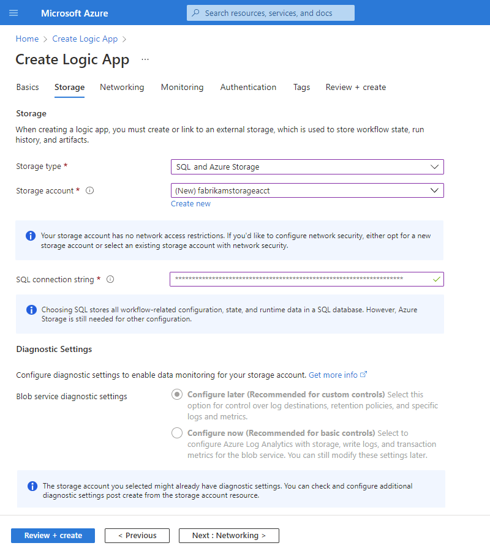

# Set up SQL database storage for Standard logic apps in single-tenant Azure Logic Apps (preview)

[!INCLUDE [logic-apps-sku-standard](../../includes/logic-apps-sku-standard.md)]

> [!IMPORTANT]
> This capability is in preview and is subject to the [Supplemental Terms of Use for Microsoft Azure Previews](https://azure.microsoft.com/support/legal/preview-supplemental-terms/).

When you choose the **Logic App (Standard)** resource type to create workflows that run in single-tenant Azure Logic Apps, App Service Environment v3, or outside Azure, you also need to create an Azure Storage account to save workflow-related artifacts, states, and runtime data. However, if you want more flexibility and control over your logic app workflows' runtime environment, throughput, scaling, performance, and management, you can use the SQL Storage Provider instead of Azure Storage for workflow-related storage transactions.

This article provides an overview for why you might want to use SQL storage as the primary storage provider for Azure Logic Apps as an alternative to Azure Storage and shows how to set up SQL for storage use either during logic app creation in the Azure portal or during logic app deployment from Visual Studio Code.

If you're new to logic apps, review the following documentation:

- [What is Azure Logic Apps](logic-apps-overview.md)
- [Single-tenant versus multi-tenant and integration service environment for Azure Logic Apps](single-tenant-overview-compare.md)

## Why use SQL

As an alternative storage option available for single-tenant Azure Logic Apps, SQL provides the following benefits:

| Benefit | Description |
|---------|-------------|
| **Portability** | SQL has many form factors, including virtual machines, Platform as a Service (PaaS), and containers. You can run SQL databases almost anywhere that you might want to run logic app workflows. |
| **Control** | SQL provides granular control over database throughput, performance, and scaling during particular periods or for specific workloads. SQL pricing is based on CPU usage and throughput, which provides more predictable pricing than Azure Storage where costs are based on each operation. |
| **Use existing assets** | If you're familiar with Microsoft tools, you can use their assets for modern integrations with SQL. You can reuse assets across traditional on-premises deployments and modern cloud implementations with Azure Hybrid Benefits. SQL also provides mature and well-supported tooling, such as SQL Server Management Studio (SSMS), command-line interfaces, and SDKs. |
| **Compliance** | SQL provides more options than Azure Storage for you to back up, restore, fail over, and build in redundancies. You can apply the same enterprise-grade mechanisms as other enterprise applications to your logic app's storage. |
|||

## When to use SQL

The following table describes some reasons why you might want to use SQL:

| Scenario | Recommend storage provider |
|----------|----------------------------|
| You want to run logic app workflows in Azure with more control over storage throughput and performance. | Use SQL as your storage provider as Azure Storage doesn't provide tools to fine-tune throughput and performance. |
| You want to run logic app workflows on premises, which you can with [Azure Arc enabled Logic Apps](azure-arc-enabled-logic-apps-overview.md). | Use SQL as your storage provider so that you can choose where to host your SQL database, for example, on premises in a virtual machine, a container, or multi-cloud. Consider running your logic app workflows close to the systems you want to integrate, or reducing your dependency on the cloud.   |
| You want predictable storage costs. | Use SQL as your storage provider when you want more control over scaling costs. SQL costs are based on each compute and input-output operations per second (IOPs). Azure Storage costs are based on numbers of operations, which might work better for small workloads that scale to zero. |
| You prefer to use SQL over Azure Storage. | SQL is a well-known and reliable ecosystem that you can use to apply the same governance and management across your logic apps behind-the-scenes operations. |
| You want to reuse existing SQL environments. | Use SQL as your storage provider if you already own SQL licenses that you want to reuse or modernize onto the cloud. You also might want to use the Azure Hybrid Benefits for your logic app integrations. |
| Everything else | Use Azure Storage as your default storage provider. |
|||

## Prerequisites

- An Azure account and active subscription. If you don't have one already, [sign up for a free account](https://azure.microsoft.com/free/?WT.mc_id=A261C142F).

- A SQL environment to use with your logic app. However, before you set up your environment, complete the following steps:

  1. Create a SQL server instance.

     Supported types include [SQL Server](https://www.microsoft.com/sql-server/sql-server-downloads), [Azure SQL database](https://azure.microsoft.com/products/azure-sql/database/), [Azure SQL Managed Instance](https://azure.microsoft.com/products/azure-sql/managed-instance/), and others.

     - If your SQL server is hosted on Azure using one of the supported types, make sure to set up the following permissions:

       1. In [Azure portal](https://portal.azure.com), go to your SQL server resource.

       1. On the resource navigation menu, under **Security**, select **Firewalls and virtual networks**.

       1. On the pane that opens, under **Allow Azure services and resources to access this server**, select **Yes**.

       1. Save your changes.

     - If your SQL server isn't hosted on Azure, make sure that any firewalls or network settings on your server allow Azure services and resources to access your server and database.

     - If you're using SQL Express for local development, connect to the default named instance `localhost\SQLExpress`.

  1. Create or use an existing database.

     You have to have a usable database before you can set up the SQL Storage Provider.

  1. Now you can follow the [steps to set up your SQL environment](#set-up-sql-environment) in this article.

- For local development, [Visual Studio Code](https://code.visualstudio.com/Download) installed on your local computer.

  > [!NOTE]
  > Make sure that you install the [latest version for the Azure Functions Core Tools](https://github.com/Azure/azure-functions-core-tools/releases) 
  > to ensure SQL support by using the Microsoft Installer (MSI) version, which is `func-cli-X.X.XXXX-x*.msi`. 
  > For more information about Visual Studio Code installation requirements, review 
  > [Create integration workflows with single-tenant Azure Logic Apps (Standard) in Visual Studio Code](create-single-tenant-workflows-visual-studio-code.md).

## Set up your SQL environment

1. Before you set up SQL Storage Provider, complete the required steps in the [Prerequisites](#prerequisites).

1. Set up permissions for your SQL server.

   Currently, the SQL Storage Provider supports SQL authentication in connection strings. You can also use Windows Authentication for local development and testing. At this time, support for Microsoft Entra ID and managed identities is not available.

   You must use an identity that has permissions to create and manage workflow-related artifacts in the target SQL database. For example, an administrator has all the required permissions to create and manage these artifacts. The following list describes the artifacts that the single-tenant Azure Logic Apps runtime tries to create using the SQL connection string that you provide. Make sure that the identity used in the SQL connection string has the necessary permissions to create the following artifacts:

   - Create and delete the following schemas: `dt`, `dc`, and `dq`.
   - Add, alter, and delete tables in these schemas.
   - Add, alter, and delete user-defined table types in these schemas.

   For more information about targeted permissions, review [SQL server permissions in the Database Engine](/sql/relational-databases/security/permissions-database-engine).

1. Connect to SQL.

   - Make sure your SQL database allows necessary access for development.

   - If you're using Azure SQL database, complete the following requirements:

     - For local development and testing, explicitly allow connections from your local computer's IP address. You can [set your IP firewall rules in Azure SQL Server](/azure/azure-sql/database/network-access-controls-overview#ip-firewall-rules).

     - In the [Azure portal](https://portal.azure.com), permit your logic app resource to access the SQL database with a provided connection string by [allowing Azure services](/azure/azure-sql/database/network-access-controls-overview#allow-azure-services).

     - Set up any other [SQL database network access controls](/azure/azure-sql/database/network-access-controls-overview) as necessary for your scenario.

   - If you're using Azure SQL Managed Instance, allow Azure services (`logicapp`) to [connect to your SQL database through secured public endpoints](/azure/azure-sql/managed-instance/public-endpoint-overview).

## Set up SQL during creation in the Azure portal

When you create your logic app using the **Logic App (Standard)** resource type in Azure, you can set up SQL as your storage provider.

1. In the [Azure portal](https://portal.azure.com), sign in with your Azure account.

1. In the Azure portal search box, enter `logic apps`, and select **Logic apps**.

   

1. On the **Logic apps** page, select **Add**.

1. On the **Create Logic App** page, on the **Basics** tab, provide the following information about your logic app resource:

   | Property | Required | Value | Description |
   |----------|----------|-------|-------------|
   | **Subscription** | Yes | <*Azure-subscription-name*> | The Azure subscription to use for your logic app. |
   | **Resource Group** | Yes | <*Azure-resource-group-name*> | The Azure resource group where you create your logic app and related resources. This resource name must be unique across regions and can contain only letters, numbers, hyphens (**-**), underscores (**_**), parentheses (**()**), and periods (**.**). 

This example creates a resource group named `Fabrikam-Workflows-RG`. |
   | **Type** | Yes | **Standard** | This logic app resource type runs in the single-tenant Azure Logic Apps environment and uses the [Standard usage, billing, and pricing model](logic-apps-pricing.md#standard-pricing). |
   | **Logic App name** | Yes | <*logic-app-name*> | The name to use for your logic app. This resource name must be unique across regions and can contain only letters, numbers, hyphens (**-**), underscores (**_**), parentheses (**()**), and periods (**.**). 

This example creates a logic app named `Fabrikam-Workflows`. 

**Note**: Your logic app's name automatically gets the suffix, `.azurewebsites.net`, because the **Logic App (Standard)** resource is powered by the single-tenant Azure Logic Apps runtime, which uses the Azure Functions extensibility model and is hosted as an extension on the Azure Functions runtime. Azure Functions uses the same app naming convention. |
   | **Publish** | Yes | <*deployment-environment*> | The deployment destination for your logic app. By default, **Workflow** is selected for deployment to single-tenant Azure Logic Apps. Azure creates an empty logic app resource where you have to add your first workflow. 

**Note**: Currently, the **Docker Container** option requires a [*custom location*](../azure-arc/kubernetes/conceptual-custom-locations.md) on an Azure Arc enabled Kubernetes cluster, which you can use with [Azure Arc enabled Logic Apps (Preview)](azure-arc-enabled-logic-apps-overview.md). The resource locations for your logic app, custom location, and cluster must all be the same. |
   | **Region** | Yes | <*Azure-region*> | The location to use for creating your resource group and resources. This example deploys the sample logic app to Azure and uses **West US**. 
- If you selected **Docker Container**, select your custom location. 
- To deploy to an [ASEv3](../app-service/environment/overview.md) resource, which must first exist, select that environment resource from the **Region** list. |
   |||||

   The following example shows the **Create Logic App** page with the **Basics** tab:

   

1. When you're ready, select **Next: Hosting**. On the **Hosting** tab, provide the following information about the storage solution and hosting plan to use for your logic app.

   | Property | Required | Value | Description |
   |----------|----------|-------|-------------|
   | **Storage type** | Yes | **SQL and Azure Storage** | The storage type that you want to use for workflow-related artifacts and data. 

- If you previously selected a custom location as your region, select **SQL**. 

- If you previously selected an Azure region or ASEv3 location, select **SQL and Azure Storage**. 

**Note**: If you're deploying to an Azure region, you still need an Azure Storage account, which is used to complete the one-time hosting of the logic app's configuration on the Azure Logic Apps platform. The workflow's definition, state, run history, and other runtime artifacts are stored in your SQL database. 

For deployments to a custom location that's hosted on an Azure Arc cluster, you only need SQL as your storage provider. |
   | **Storage account** | Yes | <*Azure-storage-account-name*> | The [Azure Storage account](../storage/common/storage-account-overview.md) to use for storage transactions. 

This resource name must be unique across regions and have 3-24 characters with only numbers and lowercase letters. Either select an existing account or create a new account. 

This example creates a storage account named `fabrikamstorageacct`. |
   | **SQL connection string** | Yes | <*sql-connection-string*> | Your SQL connection string, which currently supports only SQL authentication, not OAuth or managed identity authentication. 

**Note**: Make sure that you enter a correct connection string because Azure portal won't validate this string for you. |
   | **Plan type** | Yes | <*hosting-plan*> | The hosting plan to use for deploying your logic app. 

For more information, review [Hosting plans and pricing tiers](logic-apps-pricing.md#standard-pricing). |
   | **Windows Plan** | Yes | <*plan-name*> | The plan name to use. Either select an existing plan name or provide a name for a new plan. 

This example uses the name `Fabrikam-Service-Plan`. |
   | **SKU and size** | Yes | <*pricing-tier*> | The [pricing tier](../app-service/overview-hosting-plans.md) to use for your logic app. Your selection affects the pricing, compute, memory, and storage that your logic app and workflows use. 

To change the default pricing tier, select **Change size**. You can then select other pricing tiers, based on the workload that you need. 

For more information, review [Hosting plans and pricing tiers](logic-apps-pricing.md#standard-pricing). |
   |||||

   The following example shows the **Create Logic App** page with the **Hosting** tab:

   

1. Finish the remaining creation steps in [Create an integration workflow with single-tenant Azure Logic Apps (Standard) in the Azure portal](create-single-tenant-workflows-azure-portal.md).

When you're done, your new logic app resource and workflow is live in Azure and uses your SQL database as a storage provider.

## Set up SQL for local development in Visual Studio Code

The following steps show how to set up SQL as a storage provider for local development and testing in Visual Studio Code:

1. Set up your development environment to work with single-tenant Azure Logic Apps.

   1. Meet the [prerequisites](create-single-tenant-workflows-visual-studio-code.md#prerequisites) to work in Visual Studio Code with the Azure Logic Apps (Standard) extension.

   1. [Set up Visual Studio Code](create-single-tenant-workflows-visual-studio-code.md#set-up) to work with the Azure Logic Apps (Standard) extension.

   1. In Visual Studio Code, [connect to your Azure account](create-single-tenant-workflows-visual-studio-code.md#connect-azure-account) and [create a blank logic app project](create-single-tenant-workflows-visual-studio-code.md#create-project).

1. In Visual Studio Code, open the Explorer pane, if not already open.

1. In the Explorer pane, at your logic app project's root, move your mouse pointer over any blank area under all the project's files and folders, open the shortcut menu, and select **Use SQL storage for your Logic App project**.

   

1. When the prompt appears, enter your SQL connection string. You can opt to use a local SQL Express instance or any other SQL database that you have.

   

   After confirmation, Visual Studio Code creates the following setting in your project's **local.settings.json** file. You can update this setting at any time.  

   

## Set up SQL during deployment from Visual Studio Code

You can directly publish your logic app project from Visual Studio Code to Azure. This action deploys your logic app project using the **Logic App (Standard)** resource type.

- If you're publishing project as a new **Logic App (Standard)** resource in Azure, and you want to use SQL as a storage provider, enter your SQL connection string when you publish your app. For complete steps, follow [Set up SQL for new logic app deployment](#deploy-new-logic-app-visual-studio-code).

- If you already set up your SQL settings, you can publish your logic app project to an already deployed **Logic App (Standard)** resource in Azure. This action overwrites your existing logic app.

  > [!NOTE]
  > Local SQL Express won't work with logic apps deployed and hosted in Azure.

### Set up SQL for new Logic App (Standard) resource deployment

1. On the Visual Studio Code Activity Bar, select the Azure icon.

1. On the **Azure: Logic Apps (Standard)** pane toolbar, select **Deploy to Logic App**.

   

1. If prompted, select the Azure subscription to use for your logic app deployment.

1. From the list that Visual Studio Code opens, make sure to select the advanced option for **Create new Logic App (Standard) in Azure Advanced**. Otherwise, you're not prompted to set up SQL.

   

1. When prompted, provide a globally unique name for your new logic app, which is the name to use for the **Logic App (Standard)** resource. This example uses `Fabrikam-Workflows-App`.

   

1. Select a location for your logic app. You can also start typing to filter the list.

   - To deploy to Azure, select the Azure region where you want to deploy. If you previously created an App Service Environment v3 (ASEv3) resource and want to deploy there, select your ASEv3.

   - To deploy to Azure Arc enabled Logic Apps, select your previously configured custom location.

   The following example shows the location list filtered to **West US**.

   

1. Select the hosting plan type for your new logic app.

   1. If you selected an ASEv3 as your app's location, select **App Service Plan**, and then select your ASEv3 resource. Otherwise, select **Workflow Standard**.

      

   1. Either create a name for your plan, or select an existing plan.

      This example selects **Create new App Service Plan** as no existing plans are available.

      

1. Provide a name for your hosting plan, and then select a pricing tier for your selected plan.

   For more information, review [Hosting plans and pricing tiers](logic-apps-pricing.md#standard-pricing).

1. When you're prompted for an Azure resource group, for optimal performance, select the same Azure resource group as your project for your deployment.

   > [!NOTE]
   > Although you can create or use a different resource group, doing so might affect performance. 
   > If you create or choose a different resource group, but cancel after the confirmation prompt appears, 
   > your deployment is also canceled.

1. When you're prompted to select a storage account for your logic app, choose one of the following options:

   - If you previously selected a custom location, select the **SQL** option.

   - If you want to deploy to Azure, select the **SQL and Azure Storage** option.

     > [!NOTE]
     > This option is required only for Azure deployments. In Azure, Azure Storage is required to complete 
     > a one-time hosting of the logic app's configuration on the Azure Logic Apps platform. The ongoing 
     > workflow state, run history, and other runtime artifacts are stored in your SQL database.
     >
     > For deployments to a custom location that's hosted on an Azure Arc cluster, you only 
     > need SQL as your storage provider.  

1. When prompted, select **Create new storage account** or an existing storage account, if available.

   

1. At SQL storage confirmation prompt, select **Yes**. At the connection string prompt, enter your SQL connection string.

   > [!NOTE]
   > Make sure that you enter a correct connection string because Visual Studio Code won't validate this string for you.

   

1. Finish the remaining deployment steps in [Publish to a new Logic App (Standard) resource](create-single-tenant-workflows-visual-studio-code.md#publish-new-logic-app).

When you're done, your new logic app resource and workflow is live in Azure and uses your SQL database as a storage provider.

## Validate deployments

After you deploy your **Logic App (Standard)** resource to Azure, you can check whether your settings are correct:

1. In the [Azure portal](https://portal.azure.com), open your logic app resource.

1. On the resource navigation menu, under **Settings**, select **Configuration**.

1. On the **Configuration** pane, under **Application settings**, find the **Workflows.Sql.ConnectionString** app setting, and confirm that your SQL connection string appears and is correct.

1. In your SQL environment, confirm that the SQL tables were created with the schema name starting with 'dt' and 'dq'.

For example, the following screenshot shows the tables that the single-tenant Azure Logic Apps runtime created for a logic app resource with a single workflow:

The single-tenant Azure Logic Apps service also creates user-defined table types. For example, the following screenshot shows user-defined table types that the single-tenant Azure Logic Apps runtime created for a logic app resource with a single workflow:

## Next steps

- [Create integration workflows with single-tenant Azure Logic Apps (Standard) in Visual Studio Code](create-single-tenant-workflows-visual-studio-code.md)
- [Edit host and app settings for logic apps in single-tenant Azure Logic Apps](edit-app-settings-host-settings.md)
