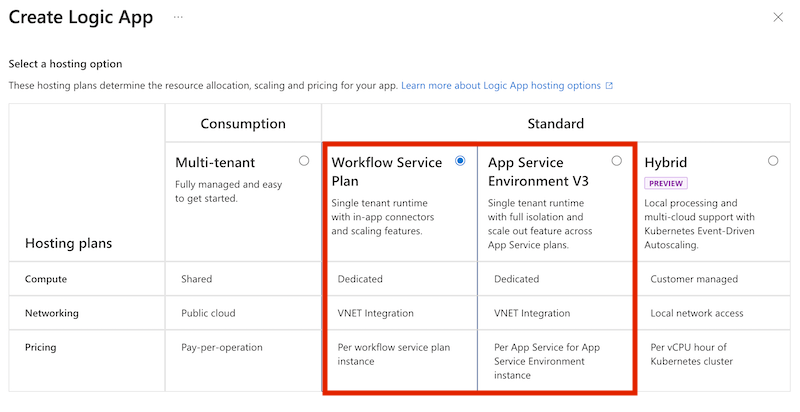
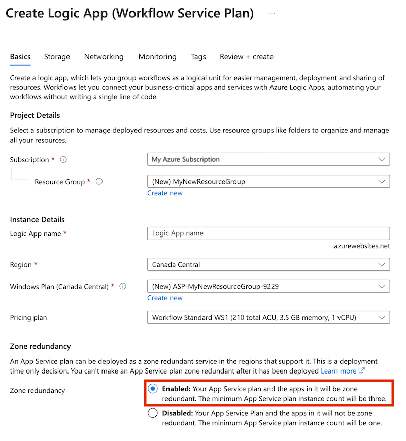

# Protect logic apps from region failures with zone redundancy and availability zones

[!INCLUDE [logic-apps-sku-consumption-standard](../../includes/logic-apps-sku-consumption-standard.md)]

In each Azure region, *availability zones* are physically separate locations that are tolerant to local failures. Such failures can range from software and hardware failures to events such as earthquakes, floods, and fires. These zones achieve tolerance through the redundancy and logical isolation of Azure services.

To provide resiliency and distributed availability, at least three separate availability zones exist in any Azure region that supports and enables zone redundancy. The Azure Logic Apps platform distributes these zones and logic app workloads across these zones. This capability is a key requirement for enabling resilient architectures and providing high availability if datacenter failures happen in a region. For more information about availability zone redundancy, review [Azure regions and availability zones](../availability-zones/az-overview.md).

This article provides a brief overview, considerations, and information about how to enable availability zone redundancy in Azure Logic Apps.

## Considerations

### [Standard](#tab/standard)

Availability zone support is available for Standard logic apps, which are powered by Azure Functions extensibility. For more information, see [What is reliability in Azure Functions?](../reliability/reliability-functions.md#availability-zone-support).

* You can enable availability zone redundancy *only when you create* Standard logic apps, either in a [supported Azure region](../azure-functions/azure-functions-az-redundancy.md#requirements) or in an [App Service Environment v3 (ASE v3) - Windows plans only](../app-service/environment/overview-zone-redundancy.md). Currently, this capability supports only built-in connector operations, not Azure (managed) connector operations.

* You can enable availability zone redundancy *only for new* Standard logic apps with workflows that run in single-tenant Azure Logic Apps. You can't enable availability zone redundancy for existing Standard logic app workflows.

* You can enable availability zone redundancy *only at creation time using Azure portal*. No programmatic tool support, such as Azure PowerShell or Azure CLI, currently exists to enable availability zone redundancy.

### [Consumption (preview)](#tab/consumption)

Availability zone redundancy is currently in *preview* for Consumption logic apps, which run in multi-tenant Azure Logic Apps. During preview, the following considerations apply:

* You can enable availability zone redundancy *only for new* Consumption logic app workflows that you create in the following Azure regions, which will expand as available:

  * Australia East
  * Brazil South
  * Canada Central
  * Central India
  * Central US
  * East Asia
  * East US
  * East US 2
  * France Central
  * Germany West Central
  * Japan East
  * Korea Central
  * Norway East
  * South Central US
  * UK South
  * West Europe
  * West US 3

  You have to create these Consumption logic apps *using the Azure portal*. No programmatic tool support, such as Azure PowerShell or Azure CLI, currently exists to enable availability zone redundancy. 

* You can't enable availability zone redundancy for existing Consumption logic app workflows. Any existing Consumption logic app workflows are unaffected until mid-May 2022.

  However, after this time, the Azure Logic Apps team will gradually start to move existing Consumption logic app workflows towards using availability zone redundancy, several Azure regions at a time. The option to enable availability zone redundancy on new Consumption logic app workflows remains available during this time.

---

## Limitations

With HTTP-based actions, certificates exported or created with AES256 encryption won't work when used for client certificate authentication. The same certificates also won't work when used for OAuth authentication.

## Prerequisites

* An Azure account and subscription. If you don't have a subscription, [sign up for a free Azure account](https://azure.microsoft.com/free/?WT.mc_id=A261C142F).

* If you have a firewall or restricted environment, you have to allow traffic through all the IP addresses required by Azure Logic Apps, managed connectors, and any custom connectors in the Azure region where you create your logic app workflows. New IP addresses that support availability zone redundancy are already published for Azure Logic Apps, managed connectors, and custom connectors. For more information, review the following documentation:

  * [Firewall configuration: IP addresses and service tags](logic-apps-limits-and-config.md#firewall-ip-configuration)

  * [Inbound IP addresses for Azure Logic Apps](logic-apps-limits-and-config.md#inbound)

  * [Outbound IP addresses for Azure Logic Apps](logic-apps-limits-and-config.md#outbound)

  * [Outbound IP addresses for managed connectors and custom connectors](/connectors/common/outbound-ip-addresses)

## Enable availability zones

### [Standard](#tab/standard)

1. In the [Azure portal](https://portal.azure.com), start creating a Standard logic app. On the **Create Logic App** page, stop after you select **Standard** as the plan type for your logic app.

   

   For a tutorial, review [Create Standard logic app workflows with single-tenant Azure Logic Apps in the Azure portal](create-single-tenant-workflows-azure-portal.md).

   After you select **Standard**, the **Zone redundancy** section and options become available.

1. Under **Zone redundancy**, select **Enabled**.

   At this point, your logic app creation experience appears similar to this example:

   

1. Finish creating your logic app workflow.

1. If you use a firewall and haven't set up access for traffic through the required IP addresses, make sure to complete that [requirement](#prerequisites).

### [Consumption (preview)](#tab/consumption)

1. In the [Azure portal](https://portal.azure.com), start creating a Consumption logic app. On the **Create Logic App** page, stop after you select **Consumption** as the plan type for your logic app.

   

   For a quick tutorial, see [Quickstart: Create an example Consumption logic app workflow in multi-tenant Azure Logic Apps using the Azure portal](quickstart-create-example-consumption-workflow.md).

   After you select **Consumption**, the **Zone redundancy** section and options become available.

1. Under **Zone redundancy**, select **Enabled**.

   At this point, your logic app creation experience appears similar to this example:

   

1. Finish creating your logic app workflow.

1. If you use a firewall and haven't set up access for traffic through the required IP addresses, make sure to complete that [requirement](#prerequisites).

---

## Next steps

* [Business continuity and disaster recovery for Azure Logic Apps](business-continuity-disaster-recovery-guidance.md)