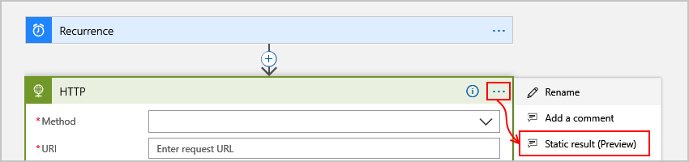
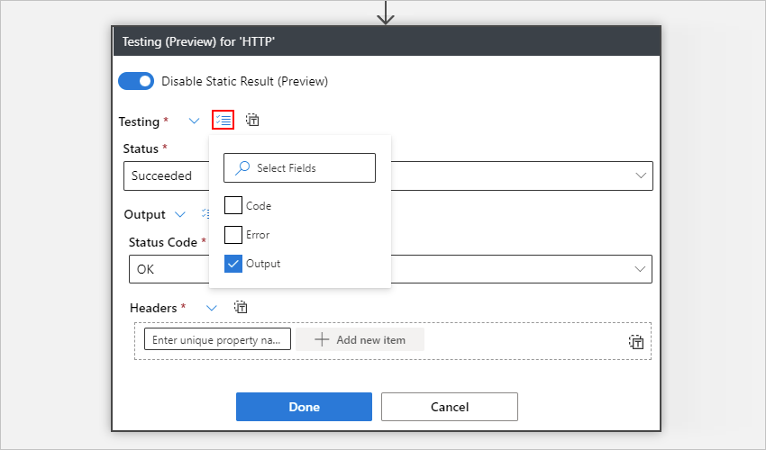
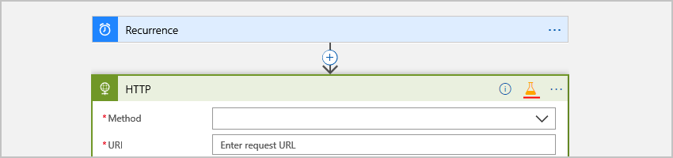
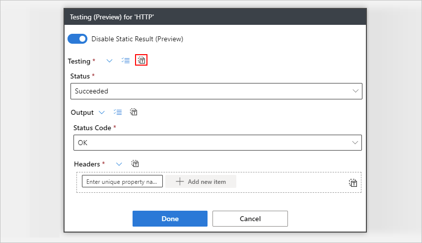
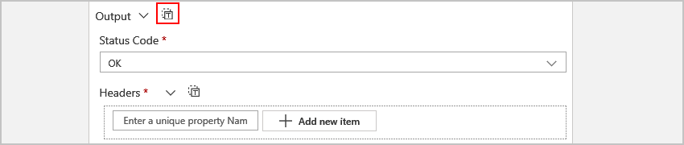
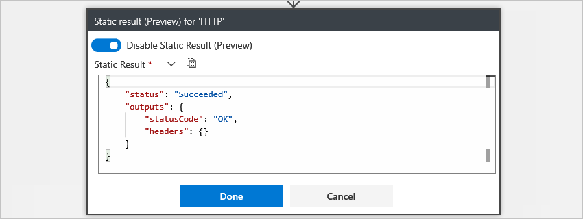
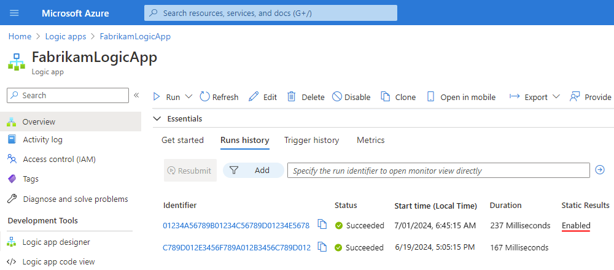
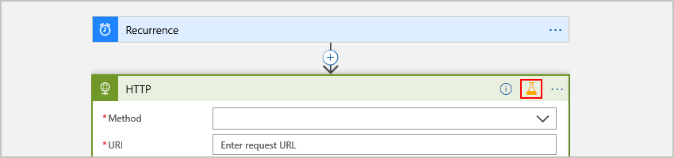

# Test logic apps with mock data by setting up static results

When testing your logic apps, you might not be ready to actually 
call or access apps, services, and systems for various reasons. 
Usually in these scenarios, you might have to run different 
condition paths, force errors, provide specific message response 
bodies, or even try skipping some steps. By setting up static 
results for an action in your logic app, you can mock output 
data from that action. Enabling static results on an action 
doesn't run the action, but returns the mock data instead.

For example, if you set up static results for the Outlook 365 send 
mail action, the Logic Apps engine just returns the mock data you 
specified as static results, rather than call Outlook and send an email.

## Prerequisites

* An Azure subscription. If you don't have an Azure subscription, 
<a href="https://azure.microsoft.com/free/" target="_blank">sign up for a free Azure account</a>.

* Basic knowledge about 
[how to create logic apps](../logic-apps/quickstart-create-first-logic-app-workflow.md)

* The logic app where you want to set up static results

## Set up static results

1. If you haven't already, in the 
[Azure portal](https://portal.azure.com), 
open your logic app in the Logic Apps Designer.

1. On the action where you want to set up 
static results, follow these steps: 

   1. In the action's upper-right corner, 
   choose the ellipses (*...*) button, 
   and select **Static result**, for example:

      

   1. Choose **Enable Static Result**. For the required (*) properties, 
   specify the mock output values you want to return for the action's response.

      For example, here are the required properties for the HTTP action:

      | Property | Description |
      |----------|-------------|
      | **Status** | The action's status to return |
      | **Status Code** | The specific status code to return |
      | **Headers** | The header content to return |
      |||

      

      To enter the mock data in JavaScript Object Notation (JSON) format, 
      choose **Switch to JSON Mode** ().

   1. For optional properties, open the **Select optional fields** list, 
   and select the properties that you want to mock.

      

1. When you're ready to save, choose **Done**.

   In the action's upper-right corner, the title bar now shows a test beaker icon 
   (), 
   which indicates that you've enabled static results.

   

   To find previous runs that use mock data, 
   see [Find runs that use static results](#find-runs-mock-data) 
   later in this topic.

## Reuse previous outputs

If your logic app has a previous run with outputs 
you can reuse as mock outputs, you can copy and 
paste the outputs from that run.

1. If you haven't already, in the [Azure portal](https://portal.azure.com), 
open your logic app in the Logic Apps Designer.

1. On your logic app's main menu, select **Overview**.

1. In the **Runs history** section, 
select the logic app run you want.

1. In your logic app's workflow, find and expand 
the action that has the outputs you want.

1. Choose the **Show raw outputs** link.

1. Copy either the complete JavaScript Object Notation 
(JSON) object or the specific subsection you want to use, 
for example, the outputs section, or even just the headers section.

1. Follow the steps for opening the **Static result** 
box for your action in [Set up static results](#set-up-static-results).

1. After the **Static result** box opens, choose either step:

   * To paste a complete JSON object, choose **Switch to JSON Mode** 
   ():

     

   * To paste just a JSON section, next to that section's label, 
   choose **Switch to JSON Mode** for that section, for example:

     

1. In the JSON editor, paste your previously copied JSON.

   

1. When you're finished, choose **Done**. Or, to return 
to the designer, choose **Switch Editor Mode** 
().

## Find runs that use static results

Your logic app's runs history identifies the runs where 
the actions use static results. To find these runs, 
follow these steps:

1. On your logic app's main menu, select **Overview**. 

1. In the right pane, under **Runs history**, 
find the **Static Results** column. 

   Any run that includes actions with results has 
   the **Static Results** column set to **Enabled**, 
   for example:

   

1. To view actions that use static results, select the run you want 
where the **Static Results** column is set to **Enabled**.

   Actions that use static results show the test beaker 
   () icon, for example:

   

## Disable static results

Turning off static results doesn't throw away the 
values from your last setup. So, when you turn on 
static results the next time, you can continue 
using your previous values.

1. Find the action where you want to disable static outputs. 
In the action's upper-right corner, choose the test beaker icon ().

   

1. Choose **Disable Static Result** > **Done**.

   

## Reference

For more information about this setting in your underlying workflow definitions, see [Static results - Schema reference for Workflow Definition Language](../logic-apps/logic-apps-workflow-definition-language.md#static-results) and [runtimeConfiguration.staticResult - Runtime configuration settings](../logic-apps/logic-apps-workflow-actions-triggers.md#runtime-configuration-settings)

## Next steps

* Learn more about [Azure Logic Apps](../logic-apps/logic-apps-overview.md)