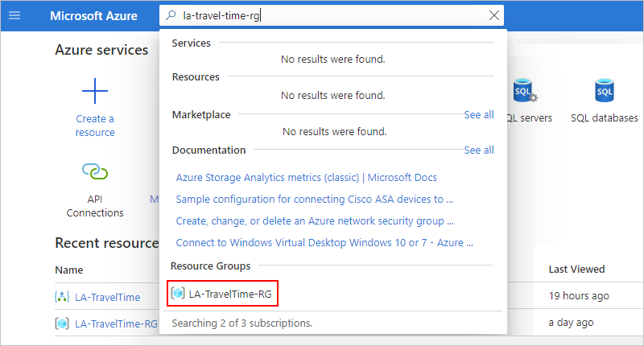

# Tutorial: Create schedule-based automated workflows using Azure Logic Apps

[!INCLUDE [logic-apps-sku-consumption](~/reusable-content/ce-skilling/azure/includes/logic-apps-sku-consumption.md)]

This tutorial shows how to build an example [logic app workflow](../logic-apps/logic-apps-overview.md) that runs on a recurring schedule. Specifically, this example workflow checks the travel time, including the traffic, between two places and runs every weekday morning. If the time exceeds a specific limit, the workflow sends you an email that includes the travel time and the extra time necessary to arrive at your destination. The workflow includes various steps, which start with a schedule-based trigger followed by a Bing Maps action, a data operations action, a control flow action, and an email notification action.

In this tutorial, you learn how to:

> [!div class="checklist"]
>
> * Create a logic app and blank workflow.
> * Add a Recurrence trigger that specifies the schedule to run your workflow.
> * Add a Bing Maps action that gets the travel time for a route.
> * Add an action that creates a variable, converts the travel time from seconds to minutes, and stores that result in the variable.
> * Add a condition that compares the travel time against a specified limit.
> * Add an action that sends an email if the travel time exceeds the limit.

When you're done, your workflow looks similar to the following high level example:

:::image type="content" source="media/tutorial-build-scheduled-recurring-logic-app-workflow/check-travel-time-overview.png" alt-text="Screenshot shows high-level overview for an example recurring workflow." lightbox="media/tutorial-build-scheduled-recurring-logic-app-workflow/check-travel-time-overview.png":::

## Prerequisites

* An Azure account and subscription. If you don't have a subscription, [sign up for a free Azure account](https://azure.microsoft.com/free/?WT.mc_id=A261C142F).

* An email account from an email provider that's supported by Azure Logic Apps, such as Office 365 Outlook, Outlook.com, or Gmail. For other providers, [review the connectors list here](/connectors/). This quickstart uses Office 365 Outlook with a work or school account. If you use a different email account, the general steps stay the same, but your UI might slightly differ.

  > [!IMPORTANT]
  >
  > If you want to use the Gmail connector, only G-Suite business accounts can use this connector without restriction in logic app workflows. 
  > If you have a Gmail consumer account, you can use this connector with only specific Google-approved services, or you can 
  > [create a Google client app to use for authentication with your Gmail connector](/connectors/gmail/#authentication-and-bring-your-own-application). 
  > For more information, see [Data security and privacy policies for Google connectors in Azure Logic Apps](../connectors/connectors-google-data-security-privacy-policy.md).

* To get the travel time for a route, you need an access key for the Bing Maps API. To get this key, follow the steps for [how to get a Bing Maps key](/bingmaps/getting-started/bing-maps-dev-center-help/getting-a-bing-maps-key).

* If your workflow needs to communicate through a firewall that limits traffic to specific IP addresses, that firewall needs to allow access for *both* the [inbound](logic-apps-limits-and-config.md#inbound) and [outbound](logic-apps-limits-and-config.md#outbound) IP addresses used by Azure Logic Apps in the Azure region where your logic app resource exists. If your workflow also uses [managed connectors](../connectors/managed.md), such as the Office 365 Outlook connector or SQL connector, or uses [custom connectors](/connectors/custom-connectors/), the firewall also needs to allow access for *all* the [managed connector outbound IP addresses](logic-apps-limits-and-config.md#outbound) in your logic app resource's Azure region.

## Create a Consumption logic app workflow

1. In the [Azure portal](https://portal.azure.com), sign in with your Azure account.

1. On the Azure home page, select **Create a resource**.

1. On the Azure Marketplace menu, select **Integration** > **Logic App**.

   :::image type="content" source="~/reusable-content/ce-skilling/azure/media/logic-apps/create-new-logic-app-resource.png" alt-text="Screenshot shows Azure Marketplace menu with selection options for Integration and Logic App." lightbox="~/reusable-content/ce-skilling/azure/media/logic-apps/create-new-logic-app-resource.png":::

1. On the **Create Logic App** pane, on the **Basics** tab, provide the following information about your logic app resource.

   :::image type="content" source="~/reusable-content/ce-skilling/azure/media/logic-apps/create-logic-app-settings.png" alt-text="Screenshot shows Azure portal, logic app creation pane, and info for new logic app resource." lightbox="~/reusable-content/ce-skilling/azure/media/logic-apps/create-logic-app-settings.png":::

   | Property | Required | Value | Description |
   |----------|----------|-------|-------------|
   | **Subscription** | Yes | <*Azure-subscription-name*> | Your Azure subscription name. This example uses **Pay-As-You-Go**. |
   | **Resource Group** | Yes | **LA-TravelTime-RG** | The [Azure resource group](../azure-resource-manager/management/overview.md) where you create your logic app resource and related resources. This name must be unique across regions and can contain only letters, numbers, hyphens (`-`), underscores (`_`), parentheses (`(`, `)`), and periods (`.`). |
   | **Name** | Yes | **LA-TravelTime** | Your logic app resource name, which must be unique across regions and can contain only letters, numbers, hyphens (`-`), underscores (`_`), parentheses (`(`, `)`), and periods (`.`). |

1. Before you continue making selections, go to the **Plan** section. For **Plan type**, select **Consumption** to show only the settings for a Consumption logic app workflow, which runs in multitenant Azure Logic Apps.

   The **Plan type** property also specifies the billing model to use.

   | Plan type | Description |
   |-----------|-------------|
   | **Standard** | This logic app type is the default selection and runs in single-tenant Azure Logic Apps and uses the [Standard pricing model](logic-apps-pricing.md#standard-pricing). |
   | **Consumption** | This logic app type runs in global, multitenant Azure Logic Apps and uses the [Consumption pricing model](logic-apps-pricing.md#consumption-pricing). |

1. Now continue with the following selections:

   | Property | Required | Value | Description |
   |----------|----------|-------|-------------|
   | **Region** | Yes | **West US** | The Azure datacenter region for storing your app's information. This example deploys the sample logic app to the **West US** region in Azure. |
   | **Enable log analytics** | Yes | **No** | This option appears and applies only when you select the **Consumption** logic app type. Change this option only when you want to enable diagnostic logging. For this tutorial, keep the default selection. |

1. When you're done, select **Review + create**. After Azure validates the information about your logic app resource, select **Create**.

1. After Azure deploys your app, select **Go to resource**.

   The Azure portal opens your Consumption logic app and the workflow designer.

Next, add the **Schedule** trigger named **Recurrence**, which runs the workflow based on a specified schedule. Every workflow must start with a trigger, which fires when a specific event happens or when new data meets a specific condition. For more information, see [Create an example Consumption logic app workflow in multitenant Azure Logic Apps](../logic-apps/quickstart-create-example-consumption-workflow.md).

## Add the Recurrence trigger

1. On the workflow designer, [follow these general steps to add the **Recurrence** trigger](create-workflow-with-trigger-or-action.md?tabs=consumption#add-trigger).

1. Rename the **Recurrence** trigger with the following title: **Check travel time every weekday morning**.

   :::image type="content" source="media/tutorial-build-scheduled-recurring-logic-app-workflow/rename-recurrence-schedule-trigger.png" alt-text="Screenshot shows workflow designer and information pane for Recurrence trigger with renamed trigger." lightbox="media/tutorial-build-scheduled-recurring-logic-app-workflow/rename-recurrence-schedule-trigger.png":::

1. In the trigger information box, provide the following information:

   | Property | Value | Description |
   |----------|-------|-------------|
   | **Interval** | 1 | The number of intervals to wait between checks |
   | **Frequency** | Week | The unit of time to use for the recurrence |
   | **On these days** | Monday, Tuesday, Wednesday, Thursday, Friday | This setting is available only when you set the **Frequency** to **Week**. |
   | **At these hours** | 7, 8, 9 | This setting is available only when you set the **Frequency** to **Week** or **Day**. For this recurrence, select the hours of the day. This example runs at the **7**, **8**, and **9**-hour marks. |
   | **At these minutes** | 0, 15, 30, 45 | This setting is available only when you set the **Frequency** to **Week** or **Day**. For this recurrence, select the minutes of the day. This example starts at the zero-hour mark and runs every 15 minutes. |

   When you're done, the trigger information box appears similar to the following example:

   :::image type="content" source="media/tutorial-build-scheduled-recurring-logic-app-workflow/recurrence-trigger-property-values.png" alt-text="Screenshot shows week-related properties set to values described in the preceding table." lightbox="media/tutorial-build-scheduled-recurring-logic-app-workflow/recurrence-trigger-property-values.png":::

   This trigger fires every weekday, every 15 minutes, starting at 7:00 AM and ending at 9:45 AM. The **Preview** box shows the recurrence schedule. For more information, see [Schedule tasks and workflows](../connectors/connectors-native-recurrence.md) and [Workflow actions and triggers](logic-apps-workflow-actions-triggers.md#recurrence-trigger).

1. Save your workflow. On the designer toolbar, select **Save**.

Your logic app resource and updated workflow are now live in the Azure portal. However, the workflow only triggers based on the specified schedule and doesn't perform other actions. So, add an action that responds when the trigger fires.

## Get the travel time for a route

Now that you have a trigger, add a **Bing Maps** action that gets the travel time between two places. Azure Logic Apps provides a connector for the Bing Maps API so that you can easily get this information. Before you start this task, make sure that you have a Bing Maps API key as described in this tutorial's prerequisites.

1. In the workflow designer, under the **Recurrence** trigger, [follow these general steps to add a **Bing Maps** action named **Get route**](create-workflow-with-trigger-or-action.md?tabs=consumption#add-action).

1. If you don't have a Bing Maps connection, you're asked to create a connection. Provide the following connection information, and select **Create**.

   | Property | Required | Value | Description |
   |----------|----------|-------|-------------|
   | **Connection Name** | Yes | <*Bing-Maps-connection-name*> | Provide a name for your connection. This example uses **BingMapsConnection**. |
   | **API Key** | Yes | <*Bing-Maps-API-key*> | Enter the Bing Maps API key that you previously received. If you don't have a Bing Maps key, learn [how to get a key](/bingmaps/getting-started/bing-maps-dev-center-help/getting-a-bing-maps-key). |

   The following example shows sample connection information:

   :::image type="content" source="media/tutorial-build-scheduled-recurring-logic-app-workflow/create-maps-connection.png" alt-text="Screenshot shows Bing Maps connection box with the example connection name and Bing Maps API key." lightbox="media/tutorial-build-scheduled-recurring-logic-app-workflow/create-maps-connection.png":::

1. Rename the **Get route** action with the following title: **Get route and travel time with traffic**.

1. In the action, open the **Advanced parameters** list, and add the following properties:

   * **Optimize**
   * **Distance Unit**
   * **Travel Mode**

1. Now enter the values for the following action's properties:

   | Property | Value | Description |
   |----------|-------|-------------|
   | **Waypoint 1** | <*start-location*> | Your route's origin. This example specifies an example starting address. |
   | **Waypoint 2** | <*end-location*> | Your route's destination. This example specifies an example destination address. |
   | **Optimize** | timeWithTraffic | A parameter to optimize your route, such as distance, travel time with current traffic, and so on. Select the parameter value, **timeWithTraffic**. |
   | **Distance Unit** | <*your-preference*> | The unit of distance for your route. This example uses **Mile** as the unit. |
   | **Travel Mode** | Driving | The travel mode for your route. Select **Driving** mode. |

   For more information about these parameters and values, see [Calculate a route](/bingmaps/rest-services/routes/calculate-a-route).

   The following example shows sample action information:

   :::image type="content" source="media/tutorial-build-scheduled-recurring-logic-app-workflow/get-route-action-settings.png" alt-text="Screenshot shows completed action named Get route." lightbox="media/tutorial-build-scheduled-recurring-logic-app-workflow/get-route-action-settings.png":::

1. On the designer toolbar, select **Save**.

Next, create a variable so that you can convert and store the current travel time as minutes, rather than seconds. That way, you can avoid repeating the conversion and use the value more easily in later steps. 

## Create a variable to store travel time

Sometimes, you might want to run operations on data in your workflow, and then use the results in later actions. To save these results so that you can easily reuse or reference them, you can create variables that store those results after processing. You can create variables only at the top level in your workflow.

By default, the **Get route** action returns the current travel time with traffic in seconds from the **Travel Duration Traffic** property. By converting and storing this value as minutes instead, you make the value easier to reuse later without converting again.

1. Under the **Get route** action, [follow these general steps to add a **Variables** action named **Initialize variable**](create-workflow-with-trigger-or-action.md?tabs=consumption#add-action).

1. Rename **Initialize variable** action with the following title: **Create variable to store travel time**.

1. Provide the following action information:

   | Property | Value | Description |
   |----------|-------|-------------|
   | **Name** | travelTime | The name for your variable. This example uses `travelTime`. |
   | **Type** | Integer | The data type for your variable |
   | **Value** | <*initial-value*> | An expression that converts the current travel time from seconds to minutes (see the steps under this table). |

   To create the expression for the **Value** property, follow these steps:

   1. Select inside the **Value** box, which shows the options for the dynamic content list (lightning icon) and expression editor (formula icon), and then select the expression editor.

      :::image type="content" source="media/tutorial-build-scheduled-recurring-logic-app-workflow/initialize-variable-value-expression-editor.png" alt-text="Screenshot shows the action named Initialize variable with cursor inside the Value property." lightbox="media/tutorial-build-scheduled-recurring-logic-app-workflow/initialize-variable-value-expression-editor.png":::

      The expression editor provides functions that you can use to perform operations in your expression. The dynamic content list provides the outputs from previous actions that you can select as inputs to use with subsequent actions in your workflow.

   1. In the expression editor, enter the following expression: **div(,60)**

      :::image type="content" source="media/tutorial-build-scheduled-recurring-logic-app-workflow/initialize-variable-value-expression.png" alt-text="Screenshot shows the expression editor with the expression entered for div(,60)." lightbox="media/tutorial-build-scheduled-recurring-logic-app-workflow/initialize-variable-value-expression.png":::

   1. Within the expression, put your cursor between the left parenthesis (**(**) and the comma (**,**), and select **Dynamic content**.

      :::image type="content" source="media/tutorial-build-scheduled-recurring-logic-app-workflow/initialize-variable-dynamic-content.png" alt-text="Screenshot shows where to put cursor in the div(,60) expression and select Dynamic content." lightbox="media/tutorial-build-scheduled-recurring-logic-app-workflow/initialize-variable-dynamic-content.png":::

   1. In the dynamic content list, under select the output value, **Travel Duration Traffic**.

      If the output doesn't appear, in the dynamic content list, next to the action name, select **See more**.

      :::image type="content" source="media/tutorial-build-scheduled-recurring-logic-app-workflow/initialize-variable-travel-duration-traffic.png" alt-text="Screenshot shows the value selected for output named Travel Duration Traffic." lightbox="media/tutorial-build-scheduled-recurring-logic-app-workflow/initialize-variable-travel-duration-traffic.png":::

   1. After the output value resolves inside the expression, select **Add**.

      :::image type="content" source="media/tutorial-build-scheduled-recurring-logic-app-workflow/initialize-variable-add.png" alt-text="Screenshot shows selected Add button." lightbox="media/tutorial-build-scheduled-recurring-logic-app-workflow/initialize-variable-add.png":::

      The following example shows how the **Value** property now appears:

      :::image type="content" source="media/tutorial-build-scheduled-recurring-logic-app-workflow/initialize-variable-complete.png" alt-text="Screenshot shows the Value property with resolved expression." lightbox="media/tutorial-build-scheduled-recurring-logic-app-workflow/initialize-variable-complete.png":::

1. Save your workflow. On the designer toolbar, select **Save**.

Next, add a condition that checks whether the current travel time is greater than a specific limit.

## Compare the travel time with limit

1. Under the **Create variable to store travel time** action, [follow these general steps to add a **Control** action named **Condition**](create-workflow-with-trigger-or-action.md?tabs=consumption#add-action).

1. Rename the condition with the following title: **If travel time exceeds limit**

1. Build a condition that checks whether the **travelTime** output value exceeds your specified limit as described and shown here:

   1. In the condition, on the condition's left side, select inside the **Choose a value** box, and then select the option for the dynamic content list (lightning icon).

   1. Under **Variables**, select the output named **travelTime**.

      :::image type="content" source="media/tutorial-build-scheduled-recurring-logic-app-workflow/build-condition-left-side.png" alt-text="Screenshot shows left box named Choose a value, opened dynamic content list, and travelTime output selected." lightbox="media/tutorial-build-scheduled-recurring-logic-app-workflow/build-condition-left-side.png":::

   1. In the middle comparison box, select the operator named **is greater than**.

   1. On the condition's right side, in the **Choose a value** box, enter the following value: **15**

      When you're done, the condition looks like the following example:

      :::image type="content" source="media/tutorial-build-scheduled-recurring-logic-app-workflow/build-condition-check-travel-time.png" alt-text="Screenshot shows finished condition for comparing the travel time to the specified limit." lightbox="media/tutorial-build-scheduled-recurring-logic-app-workflow/build-condition-check-travel-time.png":::

1. Save your workflow. On the designer toolbar, select **Save**.

Next, add the action to run when the travel time exceeds your limit.

## Send email when limit exceeded

Now, add an action that sends email when the travel time exceeds your limit. This email includes the current travel time and the extra time necessary to travel the specified route.

1. In the condition's **True** branch, select the plus sign (**+**), and then select **Add an action**.

1. [Follow these general steps to add an **Office 365 Outlook** action named **Send an email**](create-workflow-with-trigger-or-action.md?tabs=consumption#add-action).

   * For Azure work or school accounts, select the **Office 365 Outlook** version.
   * For personal Microsoft accounts, select the **Outlook.com** version.

   This example continues by selecting Office 365 Outlook.

   :::image type="content" source="media/tutorial-build-scheduled-recurring-logic-app-workflow/add-action-send-email.png" alt-text="Screenshot shows Office 365 Outlook action selected named Send email." lightbox="media/tutorial-build-scheduled-recurring-logic-app-workflow/add-action-send-email.png":::

1. If you don't already have a connection, sign in and authenticate access to your email account when prompted.

   Azure Logic Apps creates a connection to your email account.

1. Rename the action with the following title: **Send email with travel time**

1. For the **To** property, enter the recipient's email address. For testing purposes, you can use your email address.

1. For the **Subject** property, specify the email's subject, and include the **travelTime** variable by following these steps:

   1. Enter the text **Current travel time (minutes):** with a trailing space. Keep your cursor in the **Subject** box, and select the option for the dynamic content list (lightning icon).

   1. In the dynamic content list, in the **Variables** section, select the variable named **travelTime**.

      > [!NOTE]
      >
      > If the dynamic content list doesn't automatically show the **travelTime** variable, 
      > next to the **Variables** label, select **See more**. The variable might not appear 
      > because the **Subject** property expects a string value, while **travelTime** is an integer.

1. For the **Body** property, specify the content for the email body by following these steps:

   1. Enter the text **Add extra travel time (minutes):** with a trailing space. Keep your cursor in the **Body** box, and select the option for the expression editor (formula icon).

   1. In the expression editor, enter **sub(,15)** so that you can calculate the number of minutes that exceed your limit: 

      :::image type="content" source="media/tutorial-build-scheduled-recurring-logic-app-workflow/send-email-body-expression-editor.png" alt-text="Screenshot shows expression editor with the sub(,15) entered." lightbox="media/tutorial-build-scheduled-recurring-logic-app-workflow/send-email-body-expression-editor.png":::

   1. Within the expression, put your cursor between the left parenthesis (**(**) and the comma (**,**), and select **Dynamic content**. 

      :::image type="content" source="media/tutorial-build-scheduled-recurring-logic-app-workflow/send-email-body-select-dynamic-content.png" alt-text="Screenshot shows where to put cursor in the sub(,15) expression, and select Dynamic content." lightbox="media/tutorial-build-scheduled-recurring-logic-app-workflow/send-email-body-select-dynamic-content.png":::

1. Under **Variables**, select **travelTime**.

      :::image type="content" source="media/tutorial-build-scheduled-recurring-logic-app-workflow/send-email-body-select-travel-time.png" alt-text="Screenshot shows dynamic content list with travelTime variable selected." lightbox="media/tutorial-build-scheduled-recurring-logic-app-workflow/send-email-body-select-travel-time.png":::

   1. After the variable resolves inside the expression, select **Add**.

      The **Body** property now appears as shown here:

      :::image type="content" source="media/tutorial-build-scheduled-recurring-logic-app-workflow/send-email-body-complete.png" alt-text="Screenshot shows the resolved expression in the email action's Body property." lightbox="media/tutorial-build-scheduled-recurring-logic-app-workflow/send-email-body-complete.png":::

1. Save your workflow. On the designer toolbar, select **Save**.

Next, test and run your workflow, which now looks similar to the following example:

:::image type="content" source="media/tutorial-build-scheduled-recurring-logic-app-workflow/check-travel-time-finished.png" alt-text="Screenshot shows complete example logic app workflow." lightbox="media/tutorial-build-scheduled-recurring-logic-app-workflow/check-travel-time-finished.png":::

## Run your workflow

To manually start your workflow, on the designer toolbar, select **Run** > **Run**.

* If the current travel time stays under your limit, your workflow does nothing else and waits or the next interval before checking again.

* If the current travel time exceeds your limit, you get an email with the current travel time and the number of minutes above your limit. The following example shows a sample email that your workflow sends:

  :::image type="content" source="media/tutorial-build-scheduled-recurring-logic-app-workflow/received-example-email-notification.png" alt-text="Screenshot shows example email that reports current travel time and extra travel time that exceeds your specified limit." lightbox="media/tutorial-build-scheduled-recurring-logic-app-workflow/received-example-email-notification.png":::

  > [!TIP]
  >
  > If you don't get any emails, check your email's junk folder. Your email junk filter might 
  > redirect these kinds of mails. Otherwise, if you're unsure that your workflow ran correctly, 
  > see [Troubleshoot your workflow](../logic-apps/logic-apps-diagnosing-failures.md).

Congratulations, you've created and run a schedule-based recurring workflow.

## Clean up resources

Your workflow continues running until you disable or delete the logic app resource. When you no longer need the sample workflow, delete the resource group that contains your logic app resource and related resources.

1. In the Azure portal's search box, enter the name for the resource group that you created. From the results, under **Resource Groups**, select the resource group.

   This example created the resource group named **LA-TravelTime-RG**.

   

   > [!TIP]
   >
   > If the Azure home page shows the resource group under **Recent resources**,
   > you can select the group from the home page.

1. On the resource group menu, check that **Overview** is selected. On the **Overview** pane's toolbar, select **Delete resource group**.

   :::image type="content" source="media/tutorial-build-scheduled-recurring-logic-app-workflow/delete-resource-group.png" alt-text="Screenshot shows resource group's Overview pane with pane toolbar selected option for Delete resource group." lightbox="media/tutorial-build-scheduled-recurring-logic-app-workflow/delete-resource-group.png":::

1. In the confirmation pane that appears, enter the resource group name, and select **Delete**.

## Next step

In this tutorial, you created a logic app workflow that checks traffic based on a specified schedule (on weekday mornings), and takes action (sends an email) when the travel time exceeds a specified limit. Now, learn how to build a workflow that sends mailing list requests for approval by integrating Azure services, Microsoft services, and other Software-as-a-Service (SaaS) apps.

> [!div class="nextstepaction"]
> [Manage mailing list requests](../logic-apps/tutorial-process-mailing-list-subscriptions-workflow.md)
