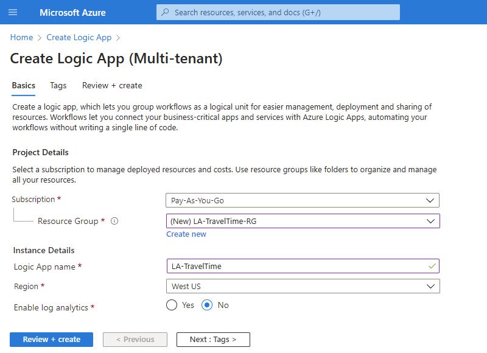

# Tutorial: Create schedule-based and recurring automation workflows with Azure Logic Apps

This tutorial shows how to build an example [logic app](../logic-apps/logic-apps-overview.md) that automates a workflow that runs on a recurring schedule. Specifically, this example logic app checks the travel time, including the traffic, between two places and runs every weekday morning. If the time exceeds a specific limit, the logic app sends you an email that includes the travel time and the extra time necessary to arrive at your destination. The workflow includes various steps, which start with a schedule-based trigger followed by a Bing Maps action, a data operations action, a control flow action, and an email notification action.

In this tutorial, you learn how to:

> [!div class="checklist"]
> * Create a blank logic app.
> * Add a Recurrence trigger that specifies the schedule for your logic app.
> * Add a Bing Maps action that gets the travel time for a route.
> * Add an action that creates a variable, converts the travel time from seconds to minutes, and stores that result in the variable.
> * Add a condition that compares the travel time against a specified limit.
> * Add an action that sends you email if the travel time exceeds the limit.

When you're done, your logic app looks like this workflow at a high level:


## Prerequisites

* An Azure account and subscription. If you don't have a subscription, [sign up for a free Azure account](https://azure.microsoft.com/free/).

* An email account from an email provider that's supported by Logic Apps, such as Office 365 Outlook, Outlook.com, or Gmail. For other providers, [review the connectors list here](/connectors/). This quickstart uses Office 365 Outlook with a work or school account. If you use a different email account, the general steps stay the same, but your UI might slightly differ.

  > [!IMPORTANT]
  > If you want to use the Gmail connector, only G-Suite business accounts can use this connector without restriction in logic apps. 
  > If you have a Gmail consumer account, you can use this connector with only specific Google-approved services, or you can 
  > [create a Google client app to use for authentication with your Gmail connector](/connectors/gmail/#authentication-and-bring-your-own-application). 
  > For more information, see [Data security and privacy policies for Google connectors in Azure Logic Apps](../connectors/connectors-google-data-security-privacy-policy.md).

* To get the travel time for a route, you need an access key for the Bing Maps API. To get this key, follow the steps for [how to get a Bing Maps key](/bingmaps/getting-started/bing-maps-dev-center-help/getting-a-bing-maps-key).

## Create your logic app

1. Sign in to the [Azure portal](https://portal.azure.com) with your Azure account credentials. On the Azure home page, select **Create a resource**.

1. On the Azure Marketplace menu, select **Integration** > **Logic App**.

   

1. On the **Logic App** pane, provide the information described here about the logic app that you want to create.

   

   | Property | Value | Description |
   |----------|-------|-------------|
   | **Subscription** | <*Azure-subscription-name*> | Your Azure subscription name. This example uses `Pay-As-You-Go`. |
   | **Resource group** | LA-TravelTime-RG | The name for the [Azure resource group](../azure-resource-manager/management/overview.md), which is used to organize related resources. This example creates a new resource group named `LA-TravelTime-RG`. |
   | **Name** | LA-TravelTime | Your logic app's name, which can contain only letters, numbers, hyphens (`-`), underscores (`_`), parentheses (`(`, `)`), and periods (`.`). This example uses `LA-TravelTime`. |
   | **Location** | West US | TThe region where to store your logic app information. This example uses `West US`. |
   | **Log Analytics** | Off | Keep the **Off** setting for diagnostic logging. |
   ||||

1. When you're done, select **Review + create**. After Azure validates the information about your logic app, select **Create**.

1. After Azure deploys your app, select **Go to resource**.

   Azure opens the Logic Apps template selection pane, which shows an introduction video, commonly used triggers, and logic app template patterns.

1. Scroll down past the video and common triggers sections to the **Templates** section, and select **Blank Logic App**.

   

Next, add the Recurrence [trigger](../logic-apps/logic-apps-overview.md#logic-app-concepts), which runs the workflow based on a specified schedule. Every logic app must start with a trigger, which fires when a specific event happens or when new data meets a specific condition. For more information, see [Create your first logic app](../logic-apps/quickstart-create-first-logic-app-workflow.md).

## Add the Recurrence trigger

1. In the Logic Apps Designer search box, enter `recurrence`, and from the **Triggers** list, select the trigger named **Recurrence**.

   

1. On the **Recurrence** shape, select the **ellipses** (**...**) button, and then select **Rename**. Rename the trigger with this description: `Check travel time every weekday morning`

   

1. Inside the trigger, change these properties as described and shown here.

   

   | Property | Required | Value | Description |
   |----------|----------|-------|-------------|
   | **Interval** | Yes | 1 | The number of intervals to wait between checks |
   | **Frequency** | Yes | Week | The unit of time to use for the recurrence |
   |||||

1. Under **Interval** and **Frequency**, open the **Add new parameter** list, and select these properties to add to the trigger.

   * **On these days**
   * **At these hours**
   * **At these minutes**

   

1. Now set the values for the additional properties as shown and described here.

   

   | Property | Value | Description |
   |----------|-------|-------------|
   | **On these days** | Monday,Tuesday,Wednesday,Thursday,Friday | This setting is available only when you set the **Frequency** to **Week**. |
   | **At these hours** | 7,8,9 | This setting is available only when you set the **Frequency** to **Week** or **Day**. For this recurrence, select the hours of the day. This example runs at the `7`, `8`, and `9`-hour marks. |
   | **At these minutes** | 0,15,30,45 | This  setting is available only when you set the **Frequency** to **Week** or **Day**. For this recurrence, select the minutes of the day. This example starts at the zero-hour mark and runs every 15 minutes. |
   ||||

   This trigger fires every weekday, every 15 minutes, starting at 7:00 AM and ending at 9:45 AM. The **Preview** box shows the recurrence schedule. For more information, see [Schedule tasks and workflows](../connectors/connectors-native-recurrence.md) and [Workflow actions and triggers](../logic-apps/logic-apps-workflow-actions-triggers.md#recurrence-trigger).

1. To hide the trigger's details for now, collapse the shape by clicking inside the shape's title bar.

   

1. Save your logic app. On the designer toolbar, select **Save**.

Your logic app is now live in the Azure portal but doesn't do anything other than trigger based on the specified schedule. So, add an action that responds when the trigger fires.

## Get the travel time for a route

Now that you have a trigger, add an [action](../logic-apps/logic-apps-overview.md#logic-app-concepts) that gets the travel time between two places. Logic Apps provides a connector for the Bing Maps API so that you can easily get this information. Before you start this task, make sure that you have a Bing Maps API key as described in this tutorial's prerequisites.

1. In the Logic App Designer, under the Recurrence trigger, select **New step**.

1. Under **Choose an operation**, select **Standard**. In the search box, enter `bing maps`, and select the action, **Get route**.

   

1. If you don't have a Bing Maps connection, you're asked to create a connection. Provide the connection details as shown and described, and then select **Create**.

   

   | Property | Required | Value | Description |
   |----------|----------|-------|-------------|
   | **Connection Name** | Yes | BingMapsConnection | Provide a name for your connection. This example uses `BingMapsConnection`. |
   | **API Key** | Yes | <*Bing-Maps-API-key*> | Enter the Bing Maps API key that you previously received. If you don't have a Bing Maps key, learn [how to get a key](/bingmaps/getting-started/bing-maps-dev-center-help/getting-a-bing-maps-key). |
   |||||

1. Rename the action with this description: `Get route and travel time with traffic`.

1. In the action, open the **Add new parameter list**, and select these properties.

   * **Optimize**
   * **Distance unit**
   * **Travel mode**

    

1. Now enter the values for the properties shown and described here.

    

   | Property | Required | Value | Description |
   |----------|----------|-------|-------------|
   | **Waypoint 1** | Yes | <*start-location*> | Your route's origin. This example specifies an example starting address. |
   | **Waypoint 2** | Yes | <*end-location*> | Your route's destination. This example specifies an example destination address. |
   | **Optimize** | No | timeWithTraffic | A parameter to optimize your route, such as distance, travel time with current traffic, and so on. Select the parameter value, **timeWithTraffic**. |
   | **Distance unit** | No | <*your-preference*> | The unit of distance for your route. This example uses **Mile** as the unit. |
   | **Travel mode** | No | Driving | The travel mode for your route. Select **Driving** mode. |
   |||||

   For more information about these parameters and values, see [Calculate a route](/bingmaps/rest-services/routes/calculate-a-route).

1. On the designer toolbar, select **Save**.

Next, create a variable so that you can convert and store the current travel time as minutes, rather than seconds. That way, you can avoid repeating the conversion and use the value more easily in later steps. 

## Create a variable to store travel time

Sometimes, you might want to run operations on data in your workflow, and then use the results in later actions. To save these results so that you can easily reuse or reference them, you can create variables that store those results after processing. You can create variables only at the top level in your logic app.

By default, the **Get route** action returns the current travel time with traffic in seconds from the **Travel Duration Traffic** property. By converting and storing this value as minutes instead, you make the value easier to reuse later without converting again.

1. On the designer, under the **Get route** action, select **New step**.

1. Under **Choose an operation**, select **Built-in**. In the search box, enter `variables`, and select the action, **Initialize variable**.

   

1. Rename this action with this description: `Create variable to store travel time`

1. Provide this information for your variable as shown in this table and in the steps below the table:

   | Property | Required | Value | Description |
   |----------|----------|-------|-------------|
   | **Name** | Yes | travelTime | The name for your variable. This example uses `travelTime`. |
   | **Type** | Yes | Integer | The data type for your variable |
   | **Value** | No | An expression that converts the current travel time from seconds to minutes (see the steps under this table). | The initial value for your variable |
   |||||

   1. To create the expression for the **Value** property, click inside the box so that the dynamic content list appears. If necessary, widen your browser until the dynamic list appears. From the dynamic content list, select **Expression**.

      

      The dynamic content list shows output values from previous actions that you can use as inputs in your workflow. The dynamic content list includes an expression editor where you can select functions to run operations in your expression. This expression editor appears only in the dynamic content list.

   1. In the expression editor, enter this expression: `div(,60)`

      

   1. Within the expression, put your cursor between the left parenthesis (**(**) and the comma (**,**), and then select **Dynamic content**.

      

   1. In the dynamic content list, select the property value, **Travel Duration Traffic**.

      

   1. After the property value resolves inside the expression, select **OK**.

      

      The **Value** property now appears as shown here:

      

1. Save your logic app.

Next, add a condition that checks whether the current travel time is greater than a specific limit.

## Compare the travel time with limit

1. Under the previous action, select **New step**.

1. Under **Choose an operation**, select **Built-in**. In the search box, enter "condition" as your filter. From the actions list, select the action, **Condition**.

   

1. Rename the condition with this description: `If travel time exceeds limit`

1. Build a condition that checks whether the **travelTime** property value exceeds your specified limit as described and shown here:

   1. In the condition, click inside the **Choose a value** box on the condition's left side.

   1. From the dynamic content list that appears, under **Variables**, select the property, **travelTime**.

      

   1. In the middle comparison box, select the operator, **is greater than**.

   1. In the **Choose a value** box on the condition's right side, enter this limit: `15`

      When you're done, the condition looks like this example:

      

1. Save your logic app.

Next, add the action to run when the travel time exceeds your limit.

## Send email when limit exceeded

Now, add an action that emails you when the travel time exceeds your limit. This email includes the current travel time and the extra time necessary to travel the specified route.

1. In the condition's **If true** branch, select **Add an action**.

1. Under **Choose an operation**, select **Standard**. In the search box, enter "send email". The list returns many results, so first select the email connector that you want, for example:

   

   * For Azure work or school accounts, select **Office 365 Outlook**.
   * For personal Microsoft accounts, select **Outlook.com**.

1. When the connector's actions appear, select "send email action" that you want to use, for example:

   

1. If you don't already have a connection, you're asked to sign in to your email account.

   Logic Apps creates a connection to your email account.

1. Rename the action with this description: `Send email with travel time`

1. In the **To** box, enter the recipient's email address. For testing purposes, use your email address.

1. In the **Subject** box, specify the email's subject, and include the **travelTime** variable.

   1. Enter the text `Current travel time (minutes):` with a trailing space. 

   1. In the dynamic content list, under **Variables**, select **See more**.

      

   1. After **travelTime** appears under **Variables**, select **travelTime**.

      

1. In the **Body** box, specify the content for the email body.

   1. Enter the text `Add extra travel time (minutes):` with a trailing space.

   1. In the dynamic content list, select **Expression**.

      

   1. In the expression editor, enter this expression so that you can calculate the number of minutes that exceed your limit: ```sub(,15)```

      

   1. Put your cursor inside the expression between the left parenthesis (**(**) and the comma (**,**). Select **Dynamic content**.

      

   1. Under **Variables**, select **travelTime**.

      

   1. After the property resolves inside the expression, select **OK**.

      

      The **Body** property now appears as shown here:

      

1. Save your logic app.

Next, test your logic app, which now looks similar to this example:


## Run your logic app

To manually start your logic app, on the designer toolbar bar, select **Run**.

* If the current travel time stays under your limit, your logic app does nothing else and waits or the next interval before checking again. 

* If the current travel time exceeds your limit, you get an email with the current travel time and the number of minutes above your limit. Here is an example email that your logic app sends:


If you don't get any emails, check your email's junk folder. Your email junk filter might redirect these kinds of mails. Otherwise, if you're unsure that your logic app ran correctly, see [Troubleshoot your logic app](../logic-apps/logic-apps-diagnosing-failures.md).

Congratulations, you've now created and run a schedule-based recurring logic app. 

To create other logic apps that use the **Recurrence** trigger, check out these templates, which available after you create a logic app:

* Get daily reminders sent to you.
* Delete older Azure blobs.
* Add a message to an Azure Storage queue.

## Clean up resources

When you no longer need the sample logic app, delete the resource group that contains your logic app and related resources. 

1. On the main Azure menu, go to **Resource groups**, and select the resource group for your logic app.

1. On the resource group menu, select **Overview** > **Delete resource group**. 

   

1. Enter the resource group name as confirmation, and select **Delete**.

## Next steps

In this tutorial, you created a logic app that checks traffic based on a specified schedule (on weekday mornings), and takes action (sends email) when the travel time exceeds a specified limit. Now, learn how to build a logic app that sends mailing list requests for approval by integrating Azure services, Microsoft services, and other SaaS apps.

> [!div class="nextstepaction"]
> [Manage mailing list requests](../logic-apps/tutorial-process-mailing-list-subscriptions-workflow.md)
