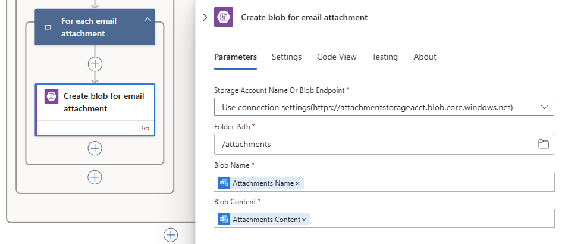

# Tutorial: Automate tasks to process emails by using Azure Logic Apps, Azure Functions, and Azure Storage

Azure Logic Apps helps you automate workflows and integrate data across Azure services, Microsoft services, other software-as-a-service (SaaS) apps, and on-premises systems. This tutorial shows how you can build a [logic app](../logic-apps/logic-apps-overview.md) that handles incoming emails and any attachments. This logic app analyzes the email content, saves the content to Azure storage, and sends notifications for reviewing that content.

In this tutorial, you learn how to:

> [!div class="checklist"]
> * Set up [Azure storage](../storage/common/storage-introduction.md) and Storage Explorer for checking saved emails and attachments.
> * Create an [Azure function](../azure-functions/functions-overview.md) that removes HTML from emails. This tutorial includes the code that you can use for this function.
> * Create a blank logic app.
> * Add a trigger that monitors emails for attachments.
> * Add a condition that checks whether emails have attachments.
> * Add an action that calls the Azure function when an email has attachments.
> * Add an action that creates storage blobs for emails and attachments.
> * Add an action that sends email notifications.

When you're done, your logic app looks like this workflow at a high level:


## Prerequisites

* An Azure account and subscription. If you don't have an Azure subscription, [sign up for a free Azure account](https://azure.microsoft.com/free/).

* An email account from an email provider supported by Logic Apps, such as Office 365 Outlook, Outlook.com, or Gmail. For other providers, [review the connectors list here](/connectors/).

  This logic app uses a work or school account. If you use a different email account, the general steps stay the same, but your UI might appear slightly different.

  > [!IMPORTANT]
  > If you want to use the Gmail connector, only G-Suite business accounts can use this connector without restriction in logic apps. 
  > If you have a Gmail consumer account, you can use this connector with only specific Google-approved services, or you can 
  > [create a Google client app to use for authentication with your Gmail connector](/connectors/gmail/#authentication-and-bring-your-own-application). 
  > For more information, see [Data security and privacy policies for Google connectors in Azure Logic Apps](../connectors/connectors-google-data-security-privacy-policy.md).

* Download and install the [free Microsoft Azure Storage Explorer](https://storageexplorer.com/). This tool helps you check that your storage container is correctly set up.

* If your logic app needs to communicate through a firewall that limits traffic to specific IP addresses, that firewall needs to allow access for *both* the [inbound](logic-apps-limits-and-config.md#inbound) and [outbound](logic-apps-limits-and-config.md#outbound) IP addresses used by the Logic Apps service or runtime in the Azure region where your logic app exists. If your logic app also uses [managed connectors](../connectors/managed.md), such as the Office 365 Outlook connector or SQL connector, or uses [custom connectors](/connectors/custom-connectors/), the firewall also needs to allow access for *all* the [managed connector outbound IP addresses](logic-apps-limits-and-config.md#outbound) in your logic app's Azure region.

## Set up storage to save attachments

You can save incoming emails and attachments as blobs in an [Azure storage container](../storage/common/storage-introduction.md).

1. Sign in to the [Azure portal](https://portal.azure.com) with your Azure account credentials.

1. Before you can create a storage container, [create a storage account](../storage/common/storage-account-create.md) with these settings on the **Basics** tab in the Azure portal:

   | Setting | Value | Description |
   |---------|-------|-------------|
   | **Subscription** | <*Azure-subscription-name*> | The name for your Azure subscription |  
   | **Resource group** | <*Azure-resource-group*> | The name for the [Azure resource group](../azure-resource-manager/management/overview.md) used to organize and manage related resources. This example uses "LA-Tutorial-RG". <p>**Note:** A resource group exists inside a specific region. Although the items in this tutorial might not be available in all regions, try to use the same region when possible. |
   | **Storage account name** | <*Azure-storage-account-name*> | Your storage account name, which must have 3-24 characters and can contain only lowercase letters and numbers. This example uses "attachmentstorageacct". |
   | **Location** | <*Azure-region*> | The region where to store information about your storage account. This example uses "West US". |
   | **Performance** | Standard | This setting specifies the data types supported and media for storing data. See [Types of storage accounts](../storage/common/storage-introduction.md#types-of-storage-accounts). |
   | **Account kind** | General purpose | The [storage account type](../storage/common/storage-introduction.md#types-of-storage-accounts) |
   | **Replication** | Locally redundant storage (LRS) | This setting specifies how your data is copied, stored, managed, and synchronized. See [Locally redundant storage (LRS): Low-cost data redundancy for Azure Storage](../storage/common/storage-redundancy.md). |
   | **Access tier (default)** | Keep the current setting. |
   ||||

   On the **Advanced** tab, select this setting:

   | Setting | Value | Description |
   |---------|-------|-------------|
   | **Secure transfer required** | Disabled | This setting specifies the security required for requests from connections. See [Require secure transfer](../storage/common/storage-require-secure-transfer.md). |
   ||||

   To create your storage account, you can also use [Azure PowerShell](../storage/common/storage-account-create.md?tabs=powershell) or [Azure CLI](../storage/common/storage-account-create.md?tabs=azure-cli).

1. When you're done, select **Review + create**.

1. After Azure deploys your storage account, find your storage account, and get the storage account's access key:

   1. On your storage account menu, under **Settings**, select **Access keys**.

   1. Copy your storage account name and **key1**, and save those values somewhere safe.

      

   To get your storage account's access key, you can also use
   [Azure PowerShell](/powershell/module/az.storage/get-azstorageaccountkey)
   or [Azure CLI](/cli/azure/storage/account/keys).

1. Create a blob storage container for your email attachments.

   1. On your storage account menu, select **Overview**. On the Overview pane, select **Containers**.

      

   1. After the **Containers** page opens, on the toolbar, select **Container**.

   1. Under **New container**, enter `attachments` as your container name. Under **Public access level**, select **Container (anonymous read access for containers and blobs)** > **OK**.

      When you're done, you can find your storage container in your storage account here in the Azure portal:

      

   To create a storage container, you can also use [Azure PowerShell](/powershell/module/az.storage/new-azstoragecontainer) or [Azure CLI](/cli/azure/storage/container#az_storage_container_create).

Next, connect Storage Explorer to your storage account.

## Set up Storage Explorer

Now, connect Storage Explorer to your storage account so you can confirm that your logic app can correctly save attachments as blobs in your storage container.

1. Launch Microsoft Azure Storage Explorer.

   Storage Explorer prompts you for a connection to your storage account.

1. In the **Connect to Azure Storage** pane, select **Use a storage account name and key** > **Next**.

   

   > [!TIP]
   > If no prompt appears, on the Storage Explorer toolbar, select **Add an account**.

1. Under **Display name**, provide a friendly name for your connection. Under **Account name**, provide your storage account name. Under **Account key**, provide the access key that you previously saved, and select **Next**.

1. Confirm your connection information, and then select **Connect**.

   Storage Explorer creates the connection, and shows your storage account in the Explorer window under **Local & Attached** > **Storage Accounts**.

1. To find your blob storage container, under **Storage Accounts**, expand your storage account, which is **attachmentstorageacct** here, and expand **Blob Containers** where you find the **attachments** container, for example:

   

Next, create an [Azure function](../azure-functions/functions-overview.md) that removes HTML from incoming email.

## Create function to clean HTML

Now, use the code snippet provided by these steps to create an Azure function that removes HTML from each incoming email. That way, the email content is cleaner and easier to process. You can then call this function from your logic app.

1. Before you can create a function, [create a function app](../azure-functions/functions-create-function-app-portal.md) with these settings:

   | Setting | Value | Description |
   | ------- | ----- | ----------- |
   | **App name** | <*function-app-name*> | Your function app's name, which is must be globally unique across Azure. This example already uses "CleanTextFunctionApp", so provide a different name, such as "MyCleanTextFunctionApp-<*your-name*>" |
   | **Subscription** | <*your-Azure-subscription-name*> | The same Azure subscription that you previously used |
   | **Resource Group** | LA-Tutorial-RG | The same Azure resource group that you previously used |
   | **OS** | <*your-operating-system*> | Select the operating system that supports your favorite function programming language. For this example, select **Windows**. |
   | **Hosting Plan** | Consumption Plan | This setting determines how to allocate and scale resources, such as computing power, for running your function app. See [hosting plans comparison](../azure-functions/functions-scale.md). |
   | **Location** | West US | The same region that you previously used |
   | **Runtime Stack** | Preferred language | Select a runtime that supports your favorite function programming language. Select **.NET** for C# and F# functions. |
   | **Storage** | cleantextfunctionstorageacct | Create a storage account for your function app. Use only lowercase letters and numbers. <p>**Note:** This storage account contains your function apps and differs from your previously created storage account for email attachments. |
   | **Application Insights** | Disable | Turns on application monitoring with [Application Insights](../azure-monitor/app/app-insights-overview.md), but for this tutorial, select **Disable** > **Apply**. |
   ||||

   If your function app doesn't automatically open after deployment, in the [Azure portal](https://portal.azure.com) search box, find and select **Function App**. Under **Function App**, select your function app.

   

   Otherwise, Azure automatically opens your function app as shown here:

   

   To create a function app, you can also use [Azure CLI](../azure-functions/create-first-function-cli-csharp.md),    or [PowerShell and Resource Manager templates](../azure-resource-manager/templates/deploy-powershell.md).

1. In the **Function Apps** list, expand your function app, if not already expanded. Under your function app, select **Functions**. On the functions toolbar, select **New function**.

   

1. Under **Choose a template below or go to the quickstart**, select the **HTTP trigger** template.

   

   Azure creates a function using a language-specific template for an HTTP triggered function.

1. In the **New Function** pane, under **Name**, enter `RemoveHTMLFunction`. Keep **Authorization level** set to **Function**, and select **Create**.

   

1. After the editor opens, replace the template code with this sample code, which removes the HTML and returns results to the caller:

   ```csharp
   #r "Newtonsoft.Json"

   using System.Net;
   using Microsoft.AspNetCore.Mvc;
   using Microsoft.Extensions.Primitives;
   using Newtonsoft.Json;
   using System.Text.RegularExpressions;

   public static async Task<IActionResult> Run(HttpRequest req, ILogger log) {

      log.LogInformation("HttpWebhook triggered");

      // Parse query parameter
      string emailBodyContent = await new StreamReader(req.Body).ReadToEndAsync();

      // Replace HTML with other characters
      string updatedBody = Regex.Replace(emailBodyContent, "<.*?>", string.Empty);
      updatedBody = updatedBody.Replace("\\r\\n", " ");
      updatedBody = updatedBody.Replace(@"&nbsp;", " ");

      // Return cleaned text
      return (ActionResult)new OkObjectResult(new { updatedBody });
   }
   ```

1. When you're done, select **Save**. To test your function, at the editor's right edge, under the arrow (**<**) icon, select **Test**.

   

1. In the **Test** pane, under **Request body**, enter this line, and select **Run**.

   `{"name": "<p><p>Testing my function</br></p></p>"}`

   

   The **Output** window shows the function's result:

   ```json
   {"updatedBody":"{\"name\": \"Testing my function\"}"}
   ```

After checking that your function works, create your logic app. Although this tutorial shows how to create a function that removes HTML from emails, Logic Apps also provides an **HTML to Text** connector.

## Create your logic app

1. In the Azure top-level search box, enter `logic apps`, and select **Logic Apps**.

   

1. On the **Logic Apps** pane, select **Add**.

   

1. On the **Logic App** pane, provide details about your logic app as shown here. After you're done, select **Review + create**.

   

   | Setting | Value | Description |
   | ------- | ----- | ----------- |
   | **Subscription** | <*your-Azure-subscription-name*> | The same Azure subscription that you previously used |
   | **Resource group** | LA-Tutorial-RG | The same Azure resource group that you previously used |
   | **Logic App name** | LA-ProcessAttachment | The name for your logic app |
   | **Select the location** | West US | The same region that you previously used |
   | **Log Analytics** | Off | For this tutorial, select the **Off** setting. |
   ||||

1. After Azure deploys your app, on the Azure toolbar, select the notifications icon, and select **Go to resource**.

   

1. After the Logic Apps Designer opens and shows a page with an introduction video and templates for common logic app patterns. Under **Templates**, select **Blank Logic App**.

   

Next, add a [trigger](../logic-apps/logic-apps-overview.md#logic-app-concepts) that listens for incoming emails that have attachments. Every logic app must start with a trigger, which fires when a specific event happens or when new data meets a specific condition. For more information, see [Create your first logic app](../logic-apps/quickstart-create-first-logic-app-workflow.md).

## Monitor incoming email

1. On the designer in the search box, enter `when new email arrives` as your filter. Select this trigger for your email provider: **When a new email arrives - <*your-email-provider*>**

   For example:

   

   * For Azure work or school accounts, select Office 365 Outlook.

   * For personal Microsoft accounts, select Outlook.com.

1. If you're asked for credentials, sign in to your email account so Logic Apps can connect to your email account.

1. Now provide the criteria the trigger uses to filter new email.

   1. Specify the settings described below for checking emails.

      

      | Setting | Value | Description |
      | ------- | ----- | ----------- |
      | **Folder** | Inbox | The email folder to check |
      | **Has Attachment** | Yes | Get only emails with attachments. <p>**Note:** The trigger doesn't remove any emails from your account, checking only new messages and processing only emails that match the subject filter. |
      | **Include Attachments** | Yes | Get the attachments as input for your workflow, rather than just check for attachments. |
      | **Interval** | 1 | The number of intervals to wait between checks |
      | **Frequency** | Minute | The unit of time for each interval between checks |
      ||||

   1. From the **Add new parameter** list, select **Subject Filter**.

   1. After the **Subject Filter** box appears in the action, specify the subject as listed here:

      | Setting | Value | Description |
      | ------- | ----- | ----------- |
      | **Subject Filter** | `Business Analyst 2 #423501` | The text to find in the email subject |
      ||||

1. To hide the trigger's details for now, click inside the trigger's title bar.

   

1. Save your logic app. On the designer toolbar, select **Save**.

   Your logic app is now live but doesn't do anything other check your emails. Next, add a condition that specifies criteria to continue workflow.

## Check for attachments

Now add a condition that selects only emails that have attachments.

1. Under the trigger, select **New step**.

   

1. Under **Choose an action**, in the search box, enter `condition`. Select this action: **Condition**

   

   1. Rename the condition with a better description. On the condition's title bar, select the ellipses (**...**) button > **Rename**.

      

   1. Rename your condition with this description: `If email has attachments and key subject phrase`

1. Create a condition that checks for emails that have attachments.

   1. On the first row under **And**, click inside the left box. From the dynamic content list that appears, select the **Has Attachment** property.

      

   1. In the middle box, keep the operator **is equal to**.

   1. In the right box, enter **true** as the value to compare with the **Has Attachment** property value from the trigger.

      

      If both values are equal, the email has at least one attachment, the condition passes, and the workflow continues.

   In your underlying logic app definition, which you can view in the code editor window, this condition looks like this example:

   ```json
   "Condition": {
      "actions": { <actions-to-run-when-condition-passes> },
      "expression": {
         "and": [ {
            "equals": [
               "@triggerBody()?['HasAttachment']",
                 "true"
            ]
         } ]
      },
      "runAfter": {},
      "type": "If"
   }
   ```

1. Save your logic app. On the designer toolbar, select **Save**.

### Test your condition

Now, test whether the condition works correctly:

1. If your logic app isn't running already, select **Run** on the designer toolbar.

   This step manually starts your logic app without having to wait until your specified interval passes. However, nothing happens until the test email arrives in your inbox.

1. Send yourself an email that meets this criteria:

   * Your email's subject has the text that you specified in the trigger's **Subject filter**: `Business Analyst 2 #423501`

   * Your email has one attachment. For now, just create one empty text file and attach that file to your email.

   When the email arrives, your logic app checks for attachments and the specified subject text. If the condition passes, the trigger fires and causes the Logic Apps engine to create a logic app instance and start the workflow.

1. To check that the trigger fired and the logic app ran successfully, on the logic app menu, select **Overview**.

   

   If your logic app didn't trigger or run despite a successful trigger, see [Troubleshoot your logic app](../logic-apps/logic-apps-diagnosing-failures.md).

Next, define the actions to take for the **If true** branch. To save the email along with any attachments, remove any HTML from the email body, then create blobs in the storage container for the email and attachments.

> [!NOTE]
> Your logic app doesn't have to do anything for the
> **If false** branch when an email doesn't have attachments.
> As a bonus exercise after you finish this tutorial,
> you can add any appropriate action that you want to take
> for the **If false** branch.

## Call RemoveHTMLFunction

This step adds your previously created Azure function to your logic app and passes the email body content from email trigger to your function.

1. On the logic app menu, select **Logic App Designer**. In the **If true** branch, select **Add an action**.

   

1. In the search box, find "Azure functions", and select this action: **Choose an Azure function - Azure Functions**

   

1. Select your previously created function app, which is `CleanTextFunctionApp` in this example:

   

1. Now select your function: **RemoveHTMLFunction**

   

1. Rename your function shape with this description: `Call RemoveHTMLFunction to clean email body`

1. Now specify the input for your function to process.

   1. Under **Request Body**, enter this text with a trailing space:

      `{ "emailBody":`

      While you work on this input in the next steps, an error about invalid JSON appears until your input is correctly formatted as JSON. When you previously tested this function, the input specified for this function used JavaScript Object Notation (JSON). So, the request body must also use the same format.

      Also, when your cursor is inside the **Request body** box, the dynamic content list appears so you can select property values available from previous actions.

   1. From the dynamic content list, under **When a new email arrives**, select the **Body** property. After this property, remember to add the closing curly brace: `}`

      

   When you're done, the input to your function looks like this example:

   

1. Save your logic app.

Next, add an action that creates a blob in your storage container so you can save the email body.

## Create blob for email body

1. In the **If true** block and under your Azure function, select **Add an action**.

1. In the search box, enter `create blob` as your filter, and select this action: **Create blob**

   

1. Create a connection to your storage account with these settings as shown and described here. When you're done, select **Create**.

   

   | Setting | Value | Description |
   | ------- | ----- | ----------- |
   | **Connection Name** | AttachmentStorageConnection | A descriptive name for the connection |
   | **Storage Account** | attachmentstorageacct | The name for the storage account that you previously created for saving attachments |
   ||||

1. Rename the **Create blob** action with this description: `Create blob for email body`

1. In the **Create blob** action, provide this information, and select these fields to create the blob as shown and described:

   

   | Setting | Value | Description |
   | ------- | ----- | ----------- |
   | **Folder path** | /attachments | The path and name for the container that you previously created. For this example, click the folder icon, and then select the "/attachments" container. |
   | **Blob name** | **From** field | For this example, use the sender's name as the blob's name. Click inside this box so that the dynamic content list appears, and then select the **From** field under the **When a new email arrives** action. |
   | **Blob content** | **Content** field | For this example, use the HTML-free email body as the blob content. Click inside this box so that the dynamic content list appears, and then select **Body** under the **Call RemoveHTMLFunction to clean email body** action. |
   ||||

   When you're done, the action looks like this example:

   

1. Save your logic app.

### Check attachment handling

Now test whether your logic app handles emails the way that you specified:

1. If your logic app isn't running already, select **Run** on the designer toolbar.

1. Send yourself an email that meets this criteria:

   * Your email's subject has the text that you specified in the trigger's **Subject filter**: `Business Analyst 2 #423501`

   * Your email has at least one attachment. For now, just create one empty text file, and attach that file to your email.

   * Your email has some test content in the body, for example: `Testing my logic app`

   If your logic app didn't trigger or run despite a successful trigger, see [Troubleshoot your logic app](../logic-apps/logic-apps-diagnosing-failures.md).

1. Check that your logic app saved the email to the correct storage container.

   1. In Storage Explorer, expand **Local & Attached** > **Storage Accounts** > **attachmentstorageacct (Key)** > **Blob Containers** > **attachments**.

   1. Check the **attachments** container for the email.

      At this point, only the email appears in the container because the logic app doesn't process the attachments yet.

      

   1. When you're done, delete the email in Storage Explorer.

1. Optionally, to test the **If false** branch, which does nothing at this time, you can send an email that doesn't meet the criteria.

Next, add a loop to process all the email attachments.

## Process attachments

To process each attachment in the email, add a **For each** loop to your logic app's workflow.

1. Under the **Create blob for email body** shape, select **Add an action**.

   

1. Under **Choose an action**, in the search box, enter `for each` as your filter, and select this action: **For each**

   

1. Rename your loop with this description: `For each email attachment`

1. Now specify the data for the loop to process. Click inside the **Select an output from previous steps** box so that the dynamic content list opens, and then select **Attachments**.

   

   The **Attachments** field passes in an array that contains all the attachments included with an email. The **For each** loop repeats actions on each item that's passed in with the array.

1. Save your logic app.

Next, add the action that saves each attachment as a blob in your **attachments** storage container.

## Create blob for each attachment

1. In the **For each email attachment** loop, select **Add an action** so you can specify the task to perform on each found attachment.

   

1. In the search box, enter `create blob` as your filter, and then select this action: **Create blob**

   

1. Rename the **Create blob 2** action with this description: `Create blob for each email attachment`

1. In the **Create blob for each email attachment** action, provide this information, and select the properties for each blob you want to create as shown and described:

   

   | Setting | Value | Description |
   | ------- | ----- | ----------- |
   | **Folder path** | /attachments | The path and name for the container that you previously created. For this example, click the folder icon, and then select the "/attachments" container. |
   | **Blob name** | **Name** field | For this example, use the attachment's name as the blob's name. Click inside this box so that the dynamic content list appears, and then select the **Name** field under the **When a new email arrives** action. |
   | **Blob content** | **Content** field | For this example, use the **Content** field as the blob content. Click inside this box so that the dynamic content list appears, and then select **Content** under the **When a new email arrives** action. |
   ||||

   When you're done, the action looks like this example:

   

1. Save your logic app.

### Check attachment handling

Next, test whether your logic app handles the attachments the way that you specified:

1. If your logic app isn't running already, select **Run** on the designer toolbar.

1. Send yourself an email that meets this criteria:

   * Your email's subject has the text that you specified in the trigger's **Subject filter** property: `Business Analyst 2 #423501`

   * Your email has at least two attachments. For now, just create two empty text files and attach those files to your email.

   If your logic app didn't trigger or run despite a successful trigger, see [Troubleshoot your logic app](../logic-apps/logic-apps-diagnosing-failures.md).

1. Check that your logic app saved the email and attachments to the correct storage container.

   1. In Storage Explorer, expand **Local & Attached** > **Storage Accounts** > **attachmentstorageacct (Key)** > **Blob Containers** > **attachments**.

   1. Check the **attachments** container for both the email and the attachments.

      

   1. When you're done, delete the email and attachments in Storage Explorer.

Next, add an action so that your logic app sends email to review the attachments.

## Send email notifications

1. In the **If true** branch, under the **For each email attachment** loop, select **Add an action**.

   

1. In the search box, enter `send email` as your filter, and then select the "send email" action for your email provider.

   To filter the actions list to a specific service, you can select the connector first.

   

   * For Azure work or school accounts, select Office 365 Outlook.

   * For personal Microsoft accounts, select Outlook.com.

1. If you're asked for credentials, sign in to your email account so that Logic Apps creates a connection to your email account.

1. Rename the **Send an email** action with this description: `Send email for review`

1. Provide the information for this action and select the fields you want to include in the email as shown and described. To add blank lines in an edit box, press Shift + Enter.

   

   If you can't find an expected field in the dynamic content list, select **See more** next to **When a new email arrives**.

   | Setting | Value | Notes |
   | ------- | ----- | ----- |
   | **To** | <*recipient-email-address*> | For testing purposes, you can use your own email address. |
   | **Subject**  | ```ASAP - Review applicant for position:``` **Subject** | The email subject that you want to include. Click inside this box, enter the example text, and from the dynamic content list, select the **Subject** field under **When a new email arrives**. |
   | **Body** | ```Please review new applicant:``` <p>```Applicant name:``` **From** <p>```Application file location:``` **Path** <p>```Application email content:``` **Body** | The email's body content. Click inside this box, enter the example text, and from the dynamic content list, select these fields: <p>- The **From** field under **When a new email arrives** </br>- The **Path** field under **Create blob for email body** </br>- The **Body** field under **Call RemoveHTMLFunction to clean email body** |
   ||||

   > [!NOTE]
   > If you select a field that contains an array,
   > such as the **Content** field, which is an array that contains attachments,
   > the designer automatically adds a "For each" loop
   > around the action that references that field.
   > That way, your logic app can perform that action on each array item.
   > To remove the loop, remove the field for the array,
   > move the referencing action to outside the loop,
   > select the ellipses (**...**) on the loop's title bar, and select **Delete**.

1. Save your logic app.

Now, test your logic app, which now looks like this example:


## Run your logic app

1. Send yourself an email that meets this criteria:

   * Your email's subject has the text that you specified in the trigger's **Subject filter** property: `Business Analyst 2 #423501`

   * Your email has one or more attachments. You can reuse an empty text file from your previous test. For a more realistic scenario, attach a resume file.

   * The email body has this text, which you can copy and paste:

     ```text

     Name: Jamal Hartnett

     Street address: 12345 Anywhere Road

     City: Any Town

     State or Country: Any State

     Postal code: 00000

     Email address: jamhartnett@outlook.com

     Phone number: 000-000-0000

     Position: Business Analyst 2 #423501

     Technical skills: Dynamics CRM, MySQL, Microsoft SQL Server, JavaScript, Perl, Power BI, Tableau, Microsoft Office: Excel, Visio, Word, PowerPoint, SharePoint, and Outlook

     Professional skills: Data, process, workflow, statistics, risk analysis, modeling; technical writing, expert communicator and presenter, logical and analytical thinker, team builder, mediator, negotiator, self-starter, self-managing  

     Certifications: Six Sigma Green Belt, Lean Project Management

     Language skills: English, Mandarin, Spanish

     Education: Master of Business Administration
     ```

1. Run your logic app. If successful, your logic app sends you an email that looks like this example:

   

   If you don't get any emails, check your email's junk folder. Your email junk filter might redirect these kinds of mails. Otherwise, if you're unsure that your logic app ran correctly, see [Troubleshoot your logic app](../logic-apps/logic-apps-diagnosing-failures.md).

Congratulations, you've now created and run a logic app that automates tasks across different Azure services and calls some custom code.

## Clean up resources

When you no longer need this sample, delete the resource group that contains your logic app and related resources.

1. In the top-level Azure search box, enter `resources groups`, and select **Resource groups**.

   

1. From the **Resource groups** list, select the resource group for this tutorial. 

   

1. On the **Overview** pane, select **Delete resource group**.

   

1. When the confirmation pane appears, enter the resource group name, and select **Delete**.

## Next steps

In this tutorial, you created a logic app that processes and stores email attachments by integrating Azure services, such as Azure Storage and Azure Functions. Now, learn more about other connectors that you can use to build logic apps.

> [!div class="nextstepaction"]
> [Learn more about connectors for Logic Apps](../connectors/apis-list.md)