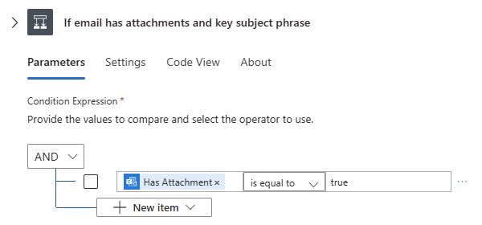
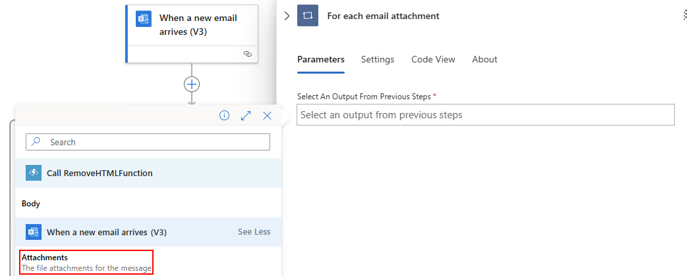
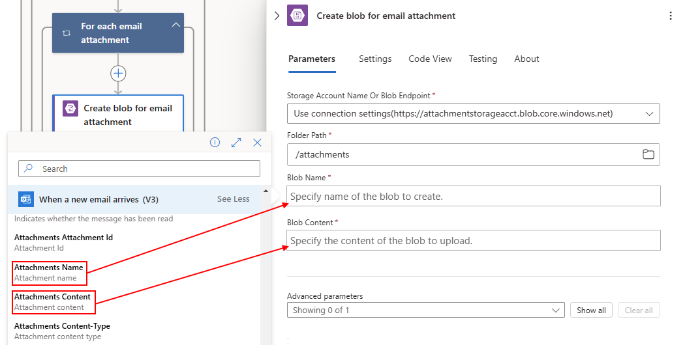

# Tutorial: Create workflows that process emails using Azure Logic Apps, Azure Functions, and Azure Storage

[!INCLUDE [logic-apps-sku-consumption](../../includes/logic-apps-sku-consumption.md)]

Azure Logic Apps helps you automate workflows and integrate data across Azure services, Microsoft services, other software-as-a-service (SaaS) apps, and on-premises systems. This tutorial shows how to build a [logic app workflow](logic-apps-overview.md) that handles incoming emails and any attachments, analyzes the email content using Azure Functions, saves the content to Azure storage, and sends email for reviewing the content.

In this tutorial, you learn how to:

> [!div class="checklist"]
> * Set up [Azure storage](../storage/common/storage-introduction.md) and Storage Explorer for checking saved emails and attachments.
> * Create an [Azure function](../azure-functions/functions-overview.md) that removes HTML from emails. This tutorial includes the code that you can use for this function.
> * Create a blank Consumption logic app workflow.
> * Add a trigger that monitors emails for attachments.
> * Add a condition that checks whether emails have attachments.
> * Add an action that calls the Azure function when an email has attachments.
> * Add an action that creates storage blobs for emails and attachments.
> * Add an action that sends email notifications.

The following screenshot shows the workflow at a high level:


## Prerequisites

* An Azure account and subscription. If you don't have a subscription, [sign up for a free Azure account](https://azure.microsoft.com/free/?WT.mc_id=A261C142F).

* An email account from an email provider supported by Azure Logic Apps, such as Office 365 Outlook, Outlook.com, or Gmail. For other providers, [review the connectors list here](/connectors/).

  This logic app workflow uses a work or school account. If you use a different email account, the general steps stay the same, but your UI might appear slightly different.

  > [!NOTE]
  >
  > If you want to use the Gmail connector, only G-Suite business accounts can use this connector without restriction in logic app workflows. 
  > If you have a Gmail consumer account, you can use this connector with only specific Google-approved services, or you can 
  > [create a Google client app to use for authentication with your Gmail connector](/connectors/gmail/#authentication-and-bring-your-own-application). 
  > For more information, see [Data security and privacy policies for Google connectors in Azure Logic Apps](../connectors/connectors-google-data-security-privacy-policy.md).

* Download and install the [free Microsoft Azure Storage Explorer](https://storageexplorer.com/). This tool helps you check that your storage container is correctly set up.

* If your workflow needs to communicate through a firewall that limits traffic to specific IP addresses, that firewall needs to allow access for *both* the [inbound](logic-apps-limits-and-config.md#inbound) and [outbound](logic-apps-limits-and-config.md#outbound) IP addresses used by Azure Logic Apps in the Azure region where your logic app resource exists. If your workflow also uses [managed connectors](../connectors/managed.md), such as the Office 365 Outlook connector or SQL connector, or uses [custom connectors](/connectors/custom-connectors/), the firewall also needs to allow access for *all* the [managed connector outbound IP addresses](logic-apps-limits-and-config.md#outbound) in your logic app's Azure region.

## Set up storage to save attachments

You can save incoming emails and attachments as blobs in an [Azure storage container](../storage/common/storage-introduction.md).

1. In the [Azure portal](https://portal.azure.com) with your Azure account credentials, [create a storage account](../storage/common/storage-account-create.md) unless you already have one, using the following information on the **Basics** tab:

   | Property | Value | Description |
   |----------|-------|-------------|
   | **Subscription** | <*Azure-subscription-name*> | The name for your Azure subscription |  
   | **Resource group** | <*Azure-resource-group*> | The name for the [Azure resource group](../azure-resource-manager/management/overview.md) used to organize and manage related resources. This example uses **LA-Tutorial-RG**. <br><br>**Note**: A resource group exists inside a specific region. Although the items in this tutorial might not be available in all regions, try to use the same region when possible. |
   | **Storage account name** | <*Azure-storage-account-name*> | Your storage account name, which must have 3-24 characters and can contain only lowercase letters and numbers. This example uses **attachmentstorageacct**. |
   | **Region** | <*Azure-region*> | The region where to store information about your storage account. This example uses **West US**. |
   | **Performance** | **Standard** | This setting specifies the data types supported and media for storing data. See [Types of storage accounts](../storage/common/storage-introduction.md#types-of-storage-accounts). |
   | **Redundancy** | **Geo-redundant storage (GRS)** | This setting enables storing multiple copies of your data as protection from planned and unplanned events. For more information, see [Azure Storage redundancy](../storage/common/storage-redundancy.md). |

   To create your storage account, you can also use [Azure PowerShell](../storage/common/storage-account-create.md?tabs=powershell) or [Azure CLI](../storage/common/storage-account-create.md?tabs=azure-cli).

1. When you're done, select **Review** >  **Create**.

1. After Azure deploys your storage account, find your storage account, and get the storage account's access key:

   1. On your storage account menu, under **Security + networking**, select **Access keys**.

   1. Copy your storage account name and **key1**, and save those values somewhere safe.

   To get your storage account's access key, you can also use
   [Azure PowerShell](/powershell/module/az.storage/get-azstorageaccountkey)
   or [Azure CLI](/cli/azure/storage/account/keys).

1. Create a blob storage container for your email attachments.

   1. On your storage account menu, under **Data storage**, select **Containers**.

   1. On the **Containers** page toolbar, select **Container**.

   1. Under **New container**, enter **attachments** as the container name. Under **Public access level**, select **Container (anonymous read access for containers and blobs)** > **OK**.

   When you're done, the containers list now shows the new storage container.

   To create a storage container, you can also use [Azure PowerShell](/powershell/module/az.storage/new-azstoragecontainer) or [Azure CLI](/cli/azure/storage/container#az-storage-container-create).

Next, connect Storage Explorer to your storage account.

## Set up Storage Explorer

Now, connect Storage Explorer to your storage account so you can confirm that your workflow can correctly save attachments as blobs in your storage container.

1. Launch Microsoft Azure Storage Explorer. Sign in with your Azure account.

   > [!NOTE]
   >
   > If no prompt appears, on the Storage Explorer activity bar, select **Account Management** (account icon).

1. In the **Select Azure Environment** window, select your Azure environment, and then select **Next**.

   This example continues by selecting global, multi-tenant **Azure**.

1. In the browser window that appears, sign in with your Azure account.

1. Return to Storage Explorer and the **Account Management** window, and check that correct Microsoft Entra tenant and subscription are selected.

1. On the Storage Explorer activity bar, select **Open Connect Dialog**. 

1. In the **Select Resource** window, select **Storage account or service**.

1. In the **Select Connection Method** window, select **Account name and key** > **Next**.

1. In the **Connect to Azure Storage** window, provide the following information, and select **Next**.

   | Property | Value |
   |----------|-------|
   | **Display name** | A friendly name for your connection |
   | **Account name** | Your storage account name |
   | **Account key** | The access key that you previously saved |

1. On the **Summary** window, confirm your connection information, and then select **Connect**.

   Storage Explorer creates the connection, and shows your storage account in the Explorer window under **Emulator & Attached** > **Storage Accounts**.

1. To find your blob storage container, under **Storage Accounts**, expand your storage account, which is **attachmentstorageacct** here, and expand **Blob Containers** where you find the **attachments** container, for example:

   :::image type="content" source="./media/tutorial-process-email-attachments-workflow/storage-explorer-check-contianer.png" alt-text="Screenshot showing Storage Explorer - find storage container.":::

Next, create an [Azure function](../azure-functions/functions-overview.md) that removes HTML from incoming email.

## Create function to remove HTML

Now, use the code snippet provided by these steps to create an Azure function that removes HTML from each incoming email. That way, the email content is cleaner and easier to process. You can then call this function from your workflow.

1. Before you can create a function, [create a function app](../azure-functions/functions-create-function-app-portal.md) following these steps:

   1. On the **Basics** tab, provide the following information, and then select **Next: Hosting**:

      | Property | Value | Description |
      |----------|-------|-------------|
      | **Subscription** | <*your-Azure-subscription-name*> | The same Azure subscription that you previously used |
      | **Resource Group** | **LA-Tutorial-RG** | The same Azure resource group that you previously used |
      | **Function App name** | <*function-app-name*> | Your function app's name, which must be globally unique across Azure. This example already uses **CleanTextFunctionApp**, so provide a different name, such as **MyCleanTextFunctionApp-<*your-name*>** |
      | **Publish** | Code | Publish code files |
      | **Runtime stack** | <*preferred-language*> | Select a runtime that supports your favorite function programming language. In-portal editing is only available for JavaScript, PowerShell, TypeScript, and C# script. C# class library, Java, and Python functions must be [developed locally](../azure-functions/functions-develop-local.md#local-development-environments). For C# and F# functions, select **.NET**. |
      |**Version**| <*version-number*> | Select the version for your installed runtime. |
      |**Region**| <*Azure-region*> | The same region that you previously used. This example uses **West US**. |
      |**Operating system**| <*your-operating-system*> | An operating system is preselected for you based on your runtime stack selection, but you can select the operating system that supports your favorite function programming language. In-portal editing is only supported on Windows. This example selects **Windows**. |
      | [**Plan type**](../azure-functions/functions-scale.md) | **Consumption (Serverless)** | Select the hosting plan that defines how resources are allocated to your function app. In the default **Consumption** plan, resources are added dynamically as required by your functions. In this [serverless](https://azure.microsoft.com/overview/serverless-computing/) hosting, you pay only for the time your functions run. When you run in an App Service plan, you must manage the [scaling of your function app](../azure-functions/functions-scale.md). |

   1. On the **Hosting** tab, provide the following information, and then select **Review + create**.

      | Property | Value | Description |
      |----------|-------|-------------|
      | [**Storage account**](../storage/common/storage-account-create.md) | **cleantextfunctionstorageacct** | Create a storage account used by your function app. Storage account names must be between 3 and 24 characters in length and can contain only lowercase letters and numbers. <br><br>**Note:** This storage account contains your function apps and differs from your previously created storage account for email attachments. You can also use an existing account, which must meet the [storage account requirements](../azure-functions/storage-considerations.md#storage-account-requirements). |

      Azure automatically opens your function app after creation and deployment.

1. If your function app doesn't automatically open after deployment, in the Azure portal search box, find and select **Function App**. From the **Function App** list, select your function app.

1. On the function app resource menu, under **Functions**, select **Functions**. On the **Functions** toolbar, select **Create**.

1. On the **Create function** pane, select the **HTTP trigger** template, provide the following information, and select **Create**.

  | Property | Value |
  |----------|-------|
  | **New Function** | **RemoveHTMLFunction** |
  | **Authorization level** | **Function** |

   Azure creates a function using a language-specific template for an HTTP triggered function and then opens the function's **Overview** page.

1. On the function menu, under **Developer**, select **Code + Test**.

1. After the editor opens, replace the template code with the following sample code, which removes the HTML and returns results to the caller:

   ```csharp
   #r "Newtonsoft.Json"

   using System.Net;
   using Microsoft.AspNetCore.Mvc;
   using Microsoft.Extensions.Primitives;
   using Newtonsoft.Json;
   using System.Text.RegularExpressions;

   public static async Task<IActionResult> Run(HttpRequest req, ILogger log) 
   {
      log.LogInformation("HttpWebhook triggered");

      // Parse query parameter
      string emailBodyContent = await new StreamReader(req.Body).ReadToEndAsync();

      // Replace HTML with other characters
      string updatedBody = Regex.Replace(emailBodyContent, "<.*?>", string.Empty);
      updatedBody = updatedBody.Replace("\\r\\n", " ");
      updatedBody = updatedBody.Replace(@"&nbsp;", " ");

      // Return cleaned text
      return (ActionResult)new OkObjectResult(new { updatedBody });
   }
   ```

1. When you're done, on the toolbar, select **Save**.

1. To test your function, on the toolbar, select **Test/Run**.

1. In the pane that opens, on the **Input** tab, in the **Body** box, enter the following line, and select **Run**.

   `{"name": "<p><p>Testing my function</br></p></p>"}`

   The **Output** tab shows the function's result:

   ```json
   {"updatedBody":"{\"name\": \"Testing my function\"}"}
   ```

After checking that your function works, create your logic app resource and workflow. Although this tutorial shows how to create a function that removes HTML from emails, Azure Logic Apps also provides an **HTML to Text** connector.

## Create your logic app workflow

1. In the Azure portal's top-level search box, enter **logic apps**, and select **Logic apps**.

1. On the **Logic apps** page, select **Add**.

1. On the **Create Logic App** page, under **Plan**, select **Consumption** as the plan type, which then shows only the options for Consumption logic app workflows. Provide the following information, and then select **Review + create**.

   | Property | Value | Description |
   |----------|-------|-------------|
   | **Subscription** | <*your-Azure-subscription-name*> | The same Azure subscription that you previously used |
   | **Resource Group** | **LA-Tutorial-RG** | The same Azure resource group that you previously used |
   | **Logic App name** | **LA-ProcessAttachment** | The name for your logic app and workflow. A Consumption logic app and workflow always have the same name. |
   | **Region** | **West US** | The same region that you previously used |
   | **Enable log analytics** | **No** | For this tutorial, keep the **Off** setting. |

1. Confirm the information that you provided, and select **Create**. After Azure deploys your app, select **Go to resource**.

   The designer opens and shows a page with an introduction video and templates for common logic app workflow patterns.

1. Under **Templates**, select **Blank Logic App**.

   

Next, add a [trigger](logic-apps-overview.md#logic-app-concepts) that listens for incoming emails that have attachments. Every workflow must start with a trigger, which fires when the trigger condition is met, for example, a specific event happens or when new data exists. For more information, see [Quickstart: Create an example Consumption logic app workflow in multi-tenant Azure Logic Apps](quickstart-create-example-consumption-workflow.md).

## Add a trigger to check incoming email

1. On the designer, under the search box, select **Standard**. In the search box, enter **office 365 when new email arrives**.

   This example uses the Office 365 Outlook connector, which requires that you sign in with a Microsoft work or school account. If you're using a personal Microsoft account, use the Outlook.com connector.

1. From the triggers list, select the trigger named **When a new email arrives** for your email provider.

   

1. If you're asked for credentials, sign in to your email account so that your workflow can connect to your email account.

1. Now provide the trigger criteria for checking new email and running your workflow.

   | Property | Value | Description |
   |----------|-------|-------------|
   | **Folder** | **Inbox** | The email folder to check |
   | **Only with Attachments** | **Yes** | Get only emails with attachments. <br><br>**Note:** The trigger doesn't remove any emails from your account, checking only new messages and processing only emails that match the subject filter. |
   | **Include Attachments** | **Yes** | Get the attachments as input for your workflow, rather than just check for attachments. |

1. From the **Add new parameter** list, select **Subject Filter**.

1. After the **Subject Filter** box appears in the action, specify the subject as described here:

   | Property | Value | Description |
   |----------|-------|-------------|
   | **Subject Filter** | **Business Analyst 2 #423501** | The text to find in the email subject |

1. To hide the trigger's details for now, collapse the action by clicking inside the trigger's title bar.

   

1. Save your workflow. On the designer toolbar, select **Save**.

   Your logic app workflow is now live but doesn't do anything other check your emails. Next, add a condition that specifies criteria to continue subsequent actions in the workflow.

## Check for attachments

Now add a condition that selects only emails that have attachments.

1. On the designer, under the trigger, select **New step**.

1. Under the **Choose an operation** search box, select **Built-in**. In the search box, enter **condition**.

1. From the actions list, select the action named **Condition**.

1. Rename the condition using a better description.

   1. On the condition's title bar, select the ellipses (**...**) button > **Rename**.

      

   1. Replace the default name with the following description: **If email has attachments and key subject phrase**

1. Create a condition that checks for emails that have attachments.

   1. On the first row under the **And** operation list, select inside the leftmost box. From the dynamic content list that appears, select the **Has Attachment** property.

      

   1. In the middle box, keep the operator **is equal to**.

   1. In the rightmost box, enter **true**, which is the value to compare with the **Has Attachment** property value that's output from the trigger. If both values are equal, the email has at least one attachment, the condition passes, and the workflow continues.

      

   In your underlying workflow definition, which you can show by selecting **Code view** on the designer, the condition looks similar to the following example:

   ```json
   "Condition": {
      "actions": { <actions-to-run-when-condition-passes> },
      "expression": {
         "and": [ {
            "equals": [
               "@triggerBody()?['HasAttachment']",
                 "true"
            ]
         } ]
      },
      "runAfter": {},
      "type": "If"
   }
   ```

1. Save your workflow.

### Test your condition

1. On the designer toolbar, select **Run Trigger** > **Run**.

   This step manually starts and runs your workflow, but nothing will happen until the test email arrives in your inbox.

1. Send yourself an email that meets the following criteria:

   * Your email's subject has the text that you specified in the trigger's **Subject filter**: `Business Analyst 2 #423501`

   * Your email has one attachment. For now, just create one empty text file and attach that file to your email.

   When the email arrives, your workflow checks for attachments and the specified subject text. If the condition passes, the trigger fires and causes Azure Logic Apps to instantiate and run a workflow instance.

1. To check that the trigger fired and the workflow successfully ran, on the logic app menu, select **Overview**.

   * To view successfully fired triggers, select **Trigger history**.

   * To view successfully run workflows, select **Runs history**.

   If the trigger didn't fire, or the workflow didn't run despite a successful trigger, see [Troubleshoot your logic app workflow](logic-apps-diagnosing-failures.md).

Next, define the actions to take for the **True** branch. To save the email along with any attachments, remove any HTML from the email body, then create blobs in the storage container for the email and attachments.

> [!NOTE]
>
> Your workflow can leave the **False** branch empty and not take any actions when an 
> email doesn't have attachments. As a bonus exercise after you finish this tutorial, 
> you can add any appropriate action that you want to take for the **False** branch.

## Call RemoveHTMLFunction

This step adds your previously created Azure function to your workflow and passes the email body content from email trigger to your function.

1. On the logic app menu, select **Logic app designer**. In the **True** branch, select **Add an action**.

1. Under the **Choose an operation** search box, select **Built-in**. In the search box, enter **azure functions**, and select the action named **Choose an Azure function**.

   

1. Select your previously created function app, which is **CleanTextFunctionApp** in this example:

1. Now select your function, which is named **RemoveHTMLFunction** in this example.

1. Rename your function shape with the following description: **Call RemoveHTMLFunction to clean email body**

1. Now specify the input for your function to process.

   1. Under **Request Body**, enter this text with a trailing space:

      `{ "emailBody":`

      While you work on this input in the next steps, an error about invalid JSON appears until your input is correctly formatted as JSON. When you previously tested this function, the input specified for this function used JavaScript Object Notation (JSON). So, the request body must also use the same format.

      Also, when your cursor is inside the **Request body** box, the dynamic content list appears so you can select property values available from previous actions.

   1. From the dynamic content list, under **When a new email arrives**, select the **Body** property. After this property, remember to add the closing curly brace (**}**).

      

   When you're done, the input to your function looks like the following example:

   

1. Save your workflow.

Next, add an action that creates a blob in your storage container so you can save the email body.

## Create blob for email body

1. On the designer, in the **True** block, under your Azure function, select **Add an action**.

1. Under the **Choose an operation** search box, select **All**. In the search box, enter **create blob**, and select the action named **Create blob**.

   

1. Provide the connection information for your storage account, and select **Create**, for example:

   | Property | Value | Description |
   |----------|-------|-------------|
   | **Connection name** | **AttachmentStorageConnection** | A descriptive name for the connection |
   | **Authentication type** | **Access Key** | The authenticate type to use for the connection |
   | **Azure Storage account name or endpoint** | <*storage-account-name*> | The name for your previously created storage account, which is **attachmentstorageacct** for this example |
   | **Azure Storage Account Access Key** | <*storage-account-access-key*> | The access key for your previously created storage account |

1. Rename the **Create blob** action with the following description: **Create blob for email body**

1. In the **Create blob** action, provide the following information:

   | Property | Value | Description |
   |----------|-------|-------------|
   | **Storage account name or blob endpoint** | **Use connection settings(<*storage-account-name*>)** | Select your storage account, which is **attachmentstorageacct** for this example. |
   | **Folder path** | <*path-and-container-name*> | The path and name for the container that you previously created. For this example, select the folder icon, and then select the **attachments** container. |
   | **Blob name** | <*sender-name*> | For this example, use the sender's name as the blob's name. Select inside this box so that the dynamic content list appears. From the **When a new email arrives** section, select the **From** field. |
   | **Blob content** | <*content-for-blob*> | For this example, use the HTML-free email body as the blob content. Select inside this box so that the dynamic content list appears. From the **Call RemoveHTMLFunction to clean email body** section, select **Body**. |

   The following image shows the fields to select for the **Create blob** action:

   

   When you're done, the action looks like the following example:

   

1. Save your workflow.

### Check attachment handling

1. On the designer toolbar, select **Run Trigger** > **Run**.

   This step manually starts and runs your workflow, but nothing will happen until the test email arrives in your inbox.

1. Send yourself an email that meets the following criteria:

   * Your email's subject has the text that you specified in the trigger's **Subject filter**: `Business Analyst 2 #423501`

   * Your email has at least one attachment. For now, just create one empty text file, and attach that file to your email.

   * Your email has some test content in the body, for example: `Testing my logic app workflow`

   If your workflow didn't trigger or run despite a successful trigger, see [Troubleshoot your logic app workflow](logic-apps-diagnosing-failures.md).

1. Check that your workflow saved the email to the correct storage container.

   1. In Storage Explorer, expand **Emulator & Attached** > **Storage Accounts** > **attachmentstorageacct (Key)** > **Blob Containers** > **attachments**.

   1. Check the **attachments** container for the email.

      At this point, only the email appears in the container because the workflow hasn't processed the attachments yet.

      

   1. When you're done, delete the email in Storage Explorer.

1. Optionally, to test the **False** branch, which does nothing at this time, you can send an email that doesn't meet the criteria.

Next, add a **For each** loop to process all the email attachments.

## Process attachments

To process each attachment in the email, add a **For each** loop to your workflow.

1. Return to the designer. Under the **Create blob for email body** action, select **Add an action**.

1. Under the **Choose an operation** search box, select **Built-in**. In the search box, enter **for each**, and select the action named **For each**.

   

1. Rename your loop with the following description: **For each email attachment**

1. Now select the data for the loop to process. In the **For each email attachment** loop, select inside the **Select an output from previous steps** box so that the dynamic content list appears. From the **When a new email arrives** section, select **Attachments**.

   

   The **Attachments** field passes in an array that contains all the attachments included with an email. The **For each** loop repeats actions on each item that's passed in with the array.

1. Save your workflow.

Next, add the action that saves each attachment as a blob in your **attachments** storage container.

## Create blob for each attachment

1. In the designer, in the **For each email attachment** loop, select **Add an action** to specify the task to perform on each found attachment.

   

1. Under the **Choose an operation** search box, select **All**. In the search box, enter **create blob**, and select the action named **Create blob**.

   

1. Rename the **Create blob 2** action with the following description: **Create blob for each email attachment**

1. In the **Create blob for each email attachment** action, provide the following information:

   | Property | Value | Description |
   |----------|-------|-------------|
   | **Storage account name or blob endpoint** | **Use connection settings(<*storage-account-name*>)** | Select your storage account, which is **attachmentstorageacct** for this example. |
   | **Folder path** | <*path-and-container-name*> | The path and name for the container that you previously created. For this example, select the folder icon, and then select the **attachments** container. |
   | **Blob name** | <*attachment-name*> | For this example, use the attachment's name as the blob's name. Select inside this box so that the dynamic content list appears. From the **When a new email arrives** section, select the **Name** field. |
   | **Blob content** | <*email-content*> | For this example, use the email content as the blob content. Select inside this box so that the dynamic content list appears. From the **When a new email arrives** section, select **Content**. |

   

   When you're done, the action looks like the following example:

   

1. Save your workflow.

### Check attachment handling

1. On the designer toolbar, select **Run Trigger** > **Run**.

   This step manually starts and runs your workflow, but nothing will happen until the test email arrives in your inbox.

1. Send yourself an email that meets the following criteria:

   * Your email's subject has the text that you specified in the trigger's **Subject filter** property: `Business Analyst 2 #423501`

   * Your email has at least two attachments. For now, just create two empty text files and attach those files to your email.

   If your workflow didn't trigger or run despite a successful trigger, see [Troubleshoot your logic app workflow](logic-apps-diagnosing-failures.md).

1. Check that your workflow saved the email and attachments to the correct storage container.

   1. In Storage Explorer, expand **Emulator & Attached** > **Storage Accounts** > **attachmentstorageacct (Key)** > **Blob Containers** > **attachments**.

   1. Check the **attachments** container for both the email and the attachments.

      

   1. When you're done, delete the email and attachments in Storage Explorer.

Next, add an action so that your workflow sends email to review the attachments.

## Send email notifications

1. Return to the designer. In the **True** branch, collapse the **For each email attachment** loop.

1. Under the loop, select **Add an action**.

   

1. Under the **Choose an operation** search box, select **Standard**. In the search box, enter **send email**.

1. From the actions list, select the send email action for your email provider. To filter the actions list based on a specific connector, you can select the connector first.

   This example continues with the Office 365 Outlook connector, which works only with an Azure work or school account. For personal Microsoft accounts, select the Outlook.com connector.

   

1. If you're asked for credentials, sign in to your email account so that Azure Logic Apps creates a connection to your email account.

1. Rename the **Send an email** action with the following description: **Send email for review**

1. Provide the following action information and select the fields to include in the email.

   * To add blank lines in an edit box, press Shift + Enter.
   * If you can't find an expected field in the dynamic content list, select **See more** next to **When a new email arrives**.

   | Property | Value | Description |
   |----------|-------|-------------|
   | **To** | <*recipient-email-address*> | For testing purposes, you can use your own email address. |
   | **Subject**  | ```ASAP - Review applicant for position:``` **Subject** | The email subject that you want to include. Click inside this box, enter the example text, and from the dynamic content list, select the **Subject** field under **When a new email arrives**. |
   | **Body** | ```Please review new applicant:``` <p>```Applicant name:``` **From** <p>```Application file location:``` **Path** <p>```Application email content:``` **Body** | The email's body content. Click inside this box, enter the example text, and from the dynamic content list, select these fields: <p>- The **From** field under **When a new email arrives** </br>- The **Path** field under **Create blob for email body** </br>- The **Body** field under **Call RemoveHTMLFunction to clean email body** |

   

   > [!NOTE]
   >
   > If you select a field that contains an array, such as the **Content** field, which is an array 
   > that contains attachments, the designer automatically adds a **For each** loop around the action 
   > that references that field. That way, your workflow can perform that action on each array item.
   > To remove the loop, remove the field for the array, move the referencing action to outside the loop,
   > select the ellipses (**...**) on the loop's title bar, and select **Delete**.

1. Save your workflow.

Now, test your workflow, which now looks like the following example:


## Run your workflow

1. Send yourself an email that meets this criteria:

   * Your email's subject has the text that you specified in the trigger's **Subject filter** property: `Business Analyst 2 #423501`

   * Your email has one or more attachments. You can reuse an empty text file from your previous test. For a more realistic scenario, attach a resume file.

   * The email body has this text, which you can copy and paste:

     ```text

     Name: Jamal Hartnett

     Street address: 12345 Anywhere Road

     City: Any Town

     State or Country: Any State

     Postal code: 00000

     Email address: jamhartnett@outlook.com

     Phone number: 000-000-0000

     Position: Business Analyst 2 #423501

     Technical skills: Dynamics CRM, MySQL, Microsoft SQL Server, JavaScript, Perl, Power BI, Tableau, Microsoft Office: Excel, Visio, Word, PowerPoint, SharePoint, and Outlook

     Professional skills: Data, process, workflow, statistics, risk analysis, modeling; technical writing, expert communicator and presenter, logical and analytical thinker, team builder, mediator, negotiator, self-starter, self-managing  

     Certifications: Six Sigma Green Belt, Lean Project Management

     Language skills: English, Mandarin, Spanish

     Education: Master of Business Administration
     ```

1. Run your workflow. If successful, your workflow sends you an email that looks like the following example:

   

   If you don't get any emails, check your email's junk folder. Your email junk filter might redirect these kinds of mails. Otherwise, if you're unsure that your workflow ran correctly, see [Troubleshoot your logic app workflow](logic-apps-diagnosing-failures.md).

Congratulations, you've now created and run a workflow that automates tasks across different Azure services and calls some custom code.

## Clean up resources

When you no longer need this sample, delete the resource group that contains your logic app workflow and related resources.

1. In the Azure portal's top-level search box, enter **resource groups**, and select **Resource groups**.

1. From the **Resource groups** list, select the resource group for this tutorial. 

1. On the resource group's **Overview** page toolbar, select **Delete resource group**.

1. When the confirmation pane appears, enter the resource group name, and select **Delete**.

## Next steps

In this tutorial, you created a logic app workflow that processes and stores email attachments by integrating Azure services, such as Azure Storage and Azure Functions. Now, learn more about other connectors that you can use to build logic app workflows.

> [!div class="nextstepaction"]
> [Learn about connectors in Azure Logic Apps](../connectors/introduction.md)
