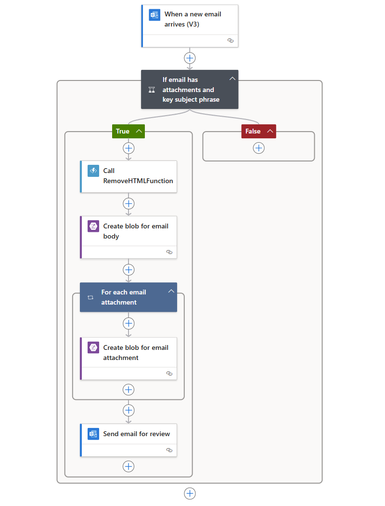

# Process emails and attachments with a logic app

Azure Logic Apps helps you automate workflows and integrate data across Azure services, 
Microsoft services, other software-as-a-service (SaaS) apps, and on-premises systems. 
This tutorial shows how you can build a [logic app](../logic-apps/logic-apps-overview.md) 
that handles incoming emails and any attachments. This logic app processes that content, 
saves the content to Azure storage, and sends notifications for reviewing that content. 

In this tutorial, you learn how to:

> [!div class="checklist"]
> * Set up [Azure storage](../storage/common/storage-introduction.md) 
> and Storage Explorer for checking saved emails and attachments.
> * Create an [Azure function](../azure-functions/functions-overview.md) 
> that removes HTML from emails. This tutorial includes the code that you 
> can use for this function.
> * Create a blank logic app.
> * Add a trigger that monitors emails for attachments.
> * Add a condition that checks whether emails have attachments.
> * Add an action that calls the Azure function when an email has attachments.
> * Add an action that creates storage blobs for emails and attachments.
> * Add an action that sends email notifications.

When you're done, your logic app looks like this workflow at a high level:


If you don't have an Azure subscription, 
<a href="https://azure.microsoft.com/free/" target="_blank">sign up for a free Azure account</a> 
before you begin. 

## Prerequisites

* An email account from an email provider supported by Logic Apps, 
such as Office 365 Outlook, Outlook.com, or Gmail. For other providers, 
[review the connectors list here](https://docs.microsoft.com/connectors/).

  This logic app uses an Office 365 Outlook account. 
  If you use a different email account, 
  the general steps stay the same, 
  but your UI might appear slightly different.

* Download and install the 
<a href="http://storageexplorer.com/" target="_blank">free Microsoft Azure Storage Explorer</a>. 
This tool helps you check that your storage container is correctly set up.

## Sign in to the Azure portal

Sign in to the <a href="https://portal.azure.com" target="_blank">Azure portal</a> 
with your Azure account credentials.

## Set up storage to save attachments

You can save incoming emails and attachments as blobs in 
an [Azure storage container](../storage/common/storage-introduction.md). 

1. Before you can create a storage container, 
[create a storage account](../storage/common/storage-create-storage-account.md#create-a-storage-account) 
with these settings:

   | Setting | Value | Description | 
   | ------- | ----- | ----------- | 
   | **Name** | attachmentstorageacct | The name for your storage account | 
   | **Deployment model** | Resource manager | The [deployment model](../azure-resource-manager/resource-manager-deployment-model.md) for managing resource deployment | 
   | **Account kind** | General purpose | The [storage account type](../storage/common/storage-introduction.md#types-of-storage-accounts) | 
   | **Performance** | Standard | This setting specifies the data types supported and media for storing data. See [Types of storage accounts](../storage/common/storage-introduction.md#types-of-storage-accounts). | 
   | **Replication** | Locally redundant storage (LRS) | This setting specifies how your data is copied, stored, managed, and synchronized. See [Replication](../storage/common/storage-introduction.md#replication). | 
   | **Secure transfer required** | Disabled | This setting specifies the security required for requests from connections. See [Require secure transfer](../storage/common/storage-require-secure-transfer.md). | 
   | **Subscription** | <*your-Azure-subscription-name*> | The name for your Azure subscription | 
   | **Resource group** | LA-Tutorial-RG | The name for the [Azure resource group](../azure-resource-manager/resource-group-overview.md) used to organize and manage related resources. <p>**Note:** A resource group exists inside a specific region. Although the items in this tutorial might not be available in all regions, try to use the same region when possible. | 
   | **Location** | East US 2 | The region where to store information about your storage account | 
   | **Configure virtual networks** | Disabled | For this tutorial, keep the **Disabled** setting. | 
   |||| 

   You can also use [Azure PowerShell](../storage/common/storage-quickstart-create-storage-account-powershell.md) 
   or [Azure CLI](../storage/common/storage-quickstart-create-storage-account-cli.md).
  
2. After Azure deploys your storage account, 
get your storage account's access key:

   1. On your storage account menu, under **Settings**, choose **Access keys**. 
   2. Find **key1** under **Default keys** and your storage account name.

      

   You can also use [Azure PowerShell](https://docs.microsoft.com/powershell/module/azurerm.storage/get-azurermstorageaccountkey) or [Azure CLI](https://docs.microsoft.com/cli/azure/storage/account/keys?view=azure-cli-latest.md#az_storage_account_keys_list). 

3. Create a storage container for your email attachments.
   
   1. On your storage account menu, on the **Overview** pane, 
   choose **Blobs** under **Services**, then choose **+ Container**.

   2. Enter "attachments" as your container name. Under **Public access level**, 
   select **Container (anonymous read access for containers and blobs)**, 
   and choose **OK**.

   You can also use [Azure PowerShell](https://docs.microsoft.com/powershell/module/azure.storage/new-azurestoragecontainer), 
   or [Azure CLI](https://docs.microsoft.com/cli/azure/storage/container?view=azure-cli-latest#az_storage_container_create). 
   When you're done, you can find your storage container 
   in your storage account here in the Azure portal:

   

Next, connect Storage Explorer to your storage account.

## Set up Storage Explorer

Now, connect Storage Explorer to your storage account 
so that you can confirm that your logic app correctly 
saves attachments as blobs in your storage container.

1. Open Microsoft Azure Storage Explorer. 
When Storage Explorer prompts you for a connection to Azure storage, 
choose **Use a storage account name and key** > **Next**.
If no prompt appears, choose **Add account** on the explorer toolbar.

2. Under **Attach using Name and Key**, enter your storage account name 
and the access key that you previously saved. Choose **Next** > **Connect**.

3. Check that your storage account and container 
appear correctly in Storage Explorer:

   1. Under **Explorer**, expand **(Local and Attached)** > 
   **Storage Accounts** > **attachmentstorageaccount** > 
   **Blob Containers**.

   2. Confirm that the "attachments" container now appears. 
   For example:

      

Next, create an [Azure function](../azure-functions/functions-overview.md) 
that removes HTML from incoming email.

## Create a function to clean HTML

Now, use the code snippet provided by these steps to create 
an Azure function that removes HTML from each incoming email. 
That way, the email content is cleaner and easier to process. 
You can then call this function from your logic app.

1. Before you can create a function, 
[create a function app](../azure-functions/functions-create-function-app-portal.md) 
with these settings:

   | Setting | Value | Description | 
   | ------- | ----- | ----------- | 
   | **App name** | CleanTextFunctionApp | A globally unique and descriptive name for your function app | 
   | **Subscription** | <*your-Azure-subscription-name*> | The same Azure subscription that you previously used | 
   | **Resource Group** | LA-Tutorial-RG | The same Azure resource group that you previously used | 
   | **Hosting Plan** | Consumption Plan | This setting determines how to allocate and scale resources, such as computing power, for running your function app. See [hosting plans comparison](../azure-functions/functions-scale.md). | 
   | **Location** | East US 2 | The same region that you previously used | 
   | **Storage** | cleantextfunctionstorageacct | Create a storage account for your function app. Use only lowercase letters and numbers. <p>**Note:** This storage account contains your function apps, and differs from your previously created storage account for email attachments. | 
   | **Application Insights** | Off | Turns on application monitoring with [Application Insights](../application-insights/app-insights-overview.md), but for this tutorial, keep the **Off** setting. | 
   |||| 

   If your function app doesn't automatically open after deployment, 
   find your app in the <a href="https://portal.azure.com" target="_blank">Azure portal</a>. On the main Azure menu, choose **App Services**, and select your function app.

   

   If **App Services** doesn't appear on the Azure menu, 
   go to **More services** instead. In the search box, 
   find and select **Function Apps**. For more information, see 
   [Create your function](../azure-functions/functions-create-first-azure-function.md).

   You can also use [Azure CLI](../azure-functions/functions-create-first-azure-function-azure-cli.md), 
   or [PowerShell and Resource Manager templates](../azure-resource-manager/resource-group-template-deploy.md).

2. Under **Function Apps**, expand **CleanTextFunctionApp**, 
and select **Functions**. On the functions toolbar, 
choose **+ New function**.

   

3. Under **Choose a template below or go to the quickstart**, 
select the **HttpTrigger - C#** function template.

   

4. Under **Name your function**, enter ```RemoveHTMLFunction```. 
Under **HTTP trigger** > **Authorization level**, 
keep the default **Function** value, and choose **Create**.

   

5. After the editor opens, replace the template code with this code, 
which removes the HTML and returns results to the caller:

   ``` CSharp
   using System.Net;
   using System.Text.RegularExpressions;

   public static async Task<HttpResponseMessage> Run(HttpRequestMessage req, TraceWriter log)
   {
      log.Info($"HttpWebhook triggered");

      // Parse query parameter
      string emailBodyContent = await req.Content.ReadAsStringAsync();

      // Replace HTML with other characters
      string updatedBody = Regex.Replace(emailBodyContent, "<.*?>", string.Empty);
      updatedBody = updatedBody.Replace("\\r\\n", " ");
      updatedBody = updatedBody.Replace(@"&nbsp;", " ");

      // Return cleaned text
      return req.CreateResponse(HttpStatusCode.OK, new { updatedBody });

   }
   ```

6. When you're done, choose **Save**. To test your function, 
choose **Test** under the arrow (**<**) icon at the editor's right edge. 

   

7. In the **Test** pane, under **Request Body**, 
enter this line, and choose **Run**.

   ```json
   {"name": "<p><p>Testing my function</br></p></p>"}
   ```

   

   The **Output** window shows this result from the function:

   ```json
   {"updatedBody":"{\"name\": \"Testing my function\"}"}
   ```

After checking that your function works, create your logic app. 
Although this tutorial shows how to create a function that removes HTML from emails, 
Logic Apps also has an **HTML to Text** connector.

## Create your logic app

1. On the main Azure menu, choose **Create a resource** > **Enterprise Integration** > **Logic App**.

   

2. Under **Create logic app**, provide this information 
about your logic app as shown and described. 
When you're done, choose **Pin to dashboard** > **Create**.

   

   | Setting | Value | Description | 
   | ------- | ----- | ----------- | 
   | **Name** | LA-ProcessAttachment | The name for your logic app | 
   | **Subscription** | <*your-Azure-subscription-name*> | The same Azure subscription that you previously used | 
   | **Resource group** | LA-Tutorial-RG | The same Azure resource group that you previously used |
   | **Location** | East US 2 | The same region that you previously used | 
   | **Log Analytics** | Off | For this tutorial, keep the **Off** setting. | 
   |||| 

3. After Azure deploys your app, the Logic Apps Designer opens and shows a page 
with an introduction video and templates for common logic app patterns. 
Under **Templates**, choose **Blank Logic App**.

   

Next, add a [trigger](../logic-apps/logic-apps-overview.md#logic-app-concepts) 
that listens for incoming emails that have attachments. 
Every logic app must start with a trigger, 
which fires when a specific event happens or when new data meets a specific condition. 
For more information, see [Create your first logic app](../logic-apps/quickstart-create-first-logic-app-workflow.md).

## Monitor incoming email

1. On the designer, enter "when email arrives" in the search box. 
Select this trigger for your email provider: 
**<*your-email-provider*> - When a new email arrives**, for example:

   

   * For Azure work or school accounts, 
   select Office 365 Outlook. 
   * For personal Microsoft accounts, 
   select Outlook.com. 

2. If you're asked for credentials, sign in to your email account 
so that Logic Apps can connect to your email account.

3. Now provide the criteria that the trigger uses to filter new email.

   1. Specify the folder, interval, and frequency for checking emails.

      

      | Setting | Value | Description | 
      | ------- | ----- | ----------- | 
      | **Folder** | Inbox | The email folder to check | 
      | **Interval** | 1 | The number of intervals to wait between checks | 
      | **Frequency** | Minute | The unit of time for each interval between checks | 
      |  |  |  | 
  
   2. Choose **Show advanced options** and specify these settings:

      | Setting | Value | Description | 
      | ------- | ----- | ----------- | 
      | **Has Attachment** | Yes | Get only emails with attachments. <p>**Note:** The trigger doesn't remove any emails from your account, checking only new messages and processing only emails that match the subject filter. | 
      | **Include Attachments** | Yes | Get the attachments as input for your workflow, rather than just check for attachments. | 
      | **Subject Filter** | ```Business Analyst 2 #423501``` | The text to find in the email subject | 
      |  |  |  | 

4. To hide the trigger's details for now, 
click inside the trigger's title bar.

   

5. Save your logic app. On the designer toolbar, choose **Save**.

   Your logic app is now live but doesn't do anything other check your emails. 
   Next, add a condition that specifies criteria to continue workflow.

## Check for attachments

1. Under the trigger, choose **+ New step** > **Add a condition**.

   When the condition shape appears, by default, 
   either the parameters list or the dynamic content 
   list appears and shows any parameters from the previous step 
   that you can include as workflow inputs. 
   Your browser width determines which list appears.

2. Rename the condition with a better description.

   1. On the condition's title bar, 
   choose **ellipses** (**...**) button > **Rename**.

      For example, if your browser is in narrow view:

      

      If your browser is in wide view, 
      and the dynamic content list blocks access to the ellipses button, 
      close the list by choosing **Add dynamic content** inside the condition. 
      
      

   2. Rename your condition with this description: 
   ```If email has attachments and key subject phrase```

3. Describe the condition by providing an expression. 

   1. Inside the condition shape, choose **Edit in advanced mode**.

      

   2. In the text box, enter this expression:

      ```@equals(triggerBody()?['HasAttachment'], bool('true'))```

      This expression compares the **HasAttachment** property value from the trigger body, 
      which is the email in this tutorial, with the Boolean object ```True```. 
      If both values are equal, the email has at least one attachment, 
      the condition passes, and the workflow continues.

      Your condition now looks like this example:

      

   3. Choose **Edit in basic mode**. Your expression now resolves as shown here:

      

      > [!NOTE]
      > To manually build an expression, 
      > you must work in basic mode and have the dynamic list open 
      > so that you can work with the expression builder. 
      > Under **Expression**, you can select functions. 
      > Under **Dynamic content**, you can select parameter 
      > fields to use in those functions.
      > This tutorial later shows how to manually build expressions.

4. Save your logic app.

### Test your condition

Now, test whether the condition works correctly:

1. If your logic app isn't running already, 
choose **Run** on the designer toolbar.

   This step manually starts your logic app without having 
   to wait until your specified interval passes. 
   However, nothing happens until the test email arrives in your inbox. 

2. Send yourself an email that meets this criteria:

   * Your email's subject has the text that you 
   specified in the trigger's **Subject filter**: 
   ```Business Analyst 2 #423501```

   * Your email has one attachment. 
   For now, just create one empty text file 
   and attach that file to your email.

   When the email arrives, your logic app checks for 
   attachments and the specified subject text.
   If the condition passes, the trigger fires 
   and causes the Logic Apps engine to create a 
   logic app instance and start the workflow. 

3. To check that the trigger fired and the logic app ran successfully, 
on the logic app menu, choose **Overview**.

   

   If your logic app didn't trigger or run despite a successful trigger, 
   see [Troubleshoot your logic app](../logic-apps/logic-apps-diagnosing-failures.md).

Next, define the actions to take for the **If true** branch. 
To save the email along with any attachments, 
remove any HTML from the email body, 
then create blobs in the storage container 
for the email and attachments.

> [!NOTE]
> Your logic app doesn't have to do anything for the 
> **If false** branch when an email doesn't have attachments. 
> As a bonus exercise after you finish this tutorial, 
> you can add any appropriate action that you want to take 
> for the **If false** branch.

## Call the RemoveHTMLFunction

1. On the logic app menu, choose **Logic App Designer**. 
In the **If true** branch, choose **Add an action**.

2. Search for "azure functions", 
and select this action: **Azure Functions – Choose an Azure function**

   

3. Select your previously created function app: **CleanTextFunctionApp**

   

4. Now select your function: **RemoveHTMLFunction**

   

5. Rename your function shape with this description: 
```Call RemoveHTMLFunction to clean email body``` 

6. In the function shape, enter the input for your function to process. 
Specify the email body as shown and described here:

   

   1. Under **Request Body**, enter this text: 
   
      ```{ "emailBody": ``` 

      Until you finish this entry in the next steps, 
      an error about invalid JSON appears.
      When you previously tested this function, 
      the input specified for this function used JavaScript Object Notation (JSON). 
      So, the request body must use the same format too. 

   2. From either the parameter list or the dynamic content list, 
   select the **Body** field under **When a new email arrives**.
   After the **Body** field, add the closing curly brace: ```}```

      

      In the logic app definition, this entry appears in this format:

      ```{ "emailBody": "@triggerBody()?['Body']" }```

7. Save your logic app.

Next, add an action that creates a blob in your 
storage container for saving the email body.

## Create blob for email body

1. Under the Azure function shape, choose **Add an action**. 

2. Under **Choose an action**, search for "blob", 
and select this action: **Azure Blob Storage – Create blob**

   

3. If you don't have a connection to an Azure storage account, 
create a connection to your storage account with these 
settings as shown and described here. 
When you're done, choose **Create**.

   

   | Setting | Value | Description | 
   | ------- | ----- | ----------- | 
   | **Connection Name** | AttachmentStorageConnection | A descriptive name for the connection | 
   | **Storage Account** | attachmentstorageacct | The name for the storage account that you previously created for saving attachments | 
   |||| 

4. Rename the **Create blob** action with this description: 
```Create blob for email body```

5. In the **Create blob** action, provide this 
information, and select these parameters to create 
the blob as shown and described:

   

   | Setting | Value | Description | 
   | ------- | ----- | ----------- | 
   | **Folder path** | /attachments | The path and name for the container that you previously created. You can also browse and select a container. | 
   | **Blob name** | **From** field | Pass in the email sender name as the blob name. From either the parameter list or dynamic content list, select **From** under **When a new email arrives**. | 
   | **Blob content** | **Content** field | Pass in the HTML-free email body as the blob content. From either the parameter list or dynamic content list, select **Body** under **Call RemoveHTMLFunction to clean email body**. |
   |||| 

6. Save your logic app. 

### Check attachment handling

Now test whether your logic app handles emails the way that you specified:

1. If your logic app isn't running already, 
choose **Run** on the designer toolbar.

2. Send yourself an email that meets this criteria:

   * Your email's subject has the text that you 
   specified in the trigger's **Subject filter**: 
   ```Business Analyst 2 #423501```

   * Your email has at least one attachment. 
   For now, just create one empty text file 
   and attach that file to your email.

   * Your email has some test content in the body, 
   for example: 

     ```
     Testing my logic app
     ```

   If your logic app didn't trigger or run despite a successful trigger, 
   see [Troubleshoot your logic app](../logic-apps/logic-apps-diagnosing-failures.md).

3. Check that your logic app saved the email 
to the correct storage container. 

   1. In Storage Explorer, expand **(Local and Attached)** > 
   **Storage Accounts** > **attachmentstorageacct (External)** > 
   **Blob Containers** > **attachments**.

   2. Check the **attachments** container for the email. 

      At this point, only the email appears in the container 
      because the logic app doesn't process the attachments yet.

      

   3. When you're done, delete the email in Storage Explorer.

4. Optionally, to test the **If false** branch, which does nothing at this time, 
you can send an email that doesn't meet the criteria.

Next, add a loop to process all the email attachments.

## Process attachments

This logic app uses a **for each** loop to 
process each attachment in the email.

1. Under the **Create blob for email body** shape, 
choose **… More**, and select this command: **Add a for each**

   

2. Rename your loop with this description: 
```For each email attachment```

3. Now specify the data for the loop to process. 
Click inside the **Select an output from previous steps** box. 
From either the parameter list or the dynamic content list, 
select **Attachments**. 

   

   The **Attachments** field passes an array that 
   contains all the attachments included with an email. 
   The **For each** loop repeats actions on each item 
   that's passed in with the array.

4. Save your logic app.

Next, add the action that saves each attachment 
as a blob in your **attachments** storage container.

## Create blobs for attachments

1. In the **For each** loop, 
choose **Add an action** so you can specify 
the task to perform on each found attachment.

   

2. Under **Choose an action**, search for "blob", then select this action: 
**Azure Blob Storage – Create blob**

   

3. Rename the **Create blob 2** action with this description: 
```Create blob for each email attachment```

4. In the **Create blob for each email attachment** action, 
provide this information, and select the parameters to 
create each blob as shown and described:

   

   | Setting | Value | Description | 
   | ------- | ----- | ----------- | 
   | **Folder path** | /attachments | The path and name for the container you previously created. You can also browse to and select a container. | 
   | **Blob name** | **Name** field | From either the parameter list or dynamic content list, select **Name** to pass in the attachment name for the blob name. | 
   | **Blob content** | **Content** field | From either the parameter list or dynamic content list, select **Content** to pass in the attachment content for the blob content. |
   |||| 

5. Save your logic app. 

### Check attachment handling

Next, test whether your logic app handles the attachments the way that you specified:

1. If your logic app isn't running already, 
choose **Run** on the designer toolbar.

2. Send yourself an email that meets this criteria:

   * Your email's subject has the text that you 
   specified in the trigger's **Subject filter**: 
   ```Business Analyst 2 #423501```

   * Your email has at least two attachments. 
   For now, just create two empty text files 
   and attach those files to your email.

   If your logic app didn't trigger or run despite a successful trigger, 
   see [Troubleshoot your logic app](../logic-apps/logic-apps-diagnosing-failures.md).

3. Check that your logic app saved the email and 
attachments to the correct storage container. 

   1. In Storage Explorer, expand **(Local and Attached)** > 
   **Storage Accounts** > **attachmentstorageacct (External)** > 
   **Blob Containers** > **attachments**.

   2. Check the **attachments** container 
   for both the email and the attachments.

      

   3. When you're done, delete the email and attachments in Storage Explorer.

Next, add an action so that your logic app 
sends email to review the attachments.

## Send email notifications

1. In the **if true** branch, under the **For each email attachment** loop, 
choose **Add an action**. 

   

2. Under **Choose an action**, search for "send email", 
then select the "send email" action for the email provider that you want. 
To filter the actions list to a specific service, 
you can select the connector first under **Connectors**.

   

   * For Azure work or school accounts, 
   select Office 365 Outlook. 
   * For personal Microsoft accounts, 
   select Outlook.com. 

3. If you're asked for credentials, sign in to your email account 
so that Logic Apps creates a connection to your email account.

4. Rename the **Send an email** action with this description: 
```Send email for review```

5. Provide the information for this action and select the fields 
that you want to include in the email as shown and described. 
To add blank lines in an edit box, press Shift + Enter.  

   For example, if you're working with the dynamic content list:

   

   If you can't find an expected field in the list, 
   select **See more** next to **When a new email arrives** 
   in the dynamic content list or at the end of the parameters list.

   | Setting | Value | Notes | 
   | ------- | ----- | ----- | 
   | **To** | <*recipient-email-address*> | For testing purposes, you can use your own email address. | 
   | **Subject**  | ```ASAP - Review applicant for position: ``` **Subject** | The email subject that you want to include. From either the parameter list or dynamic content list, select the **Subject** field under **When a new email arrives**. | 
   | **Body** | ```Please review new applicant:``` <p>```Applicant name: ``` **From** <p>```Application file location: ``` **Path** <p>```Application email content: ``` **Body** | The content for the email body. From either the parameter list or dynamic content list, select these fields: <p>- The **From** field under **When a new email arrives** </br>- The **Path** field under **Create blob for email body** </br>- The **Body** field under **Call RemoveHTMLFunction to clean email body** | 
   |||| 

   If you happen to select a field that contains an array, 
   such as **Content**, which is an array that contains attachments, 
   the designer automatically adds a "For each" loop 
   around the action that references that field. 
   That way, your logic app can perform that action on each array item. 
   To remove the loop, remove the field for the array, 
   move the referencing action to outside the loop, 
   choose the ellipses (**...**) on the loop's title bar, and choose **Delete**.
     
6. Save your logic app. 

Next, test your logic app, which now looks like this example:



## Run your logic app

1. Send yourself an email that meets this criteria:

   * Your email's subject has the text that you 
   specified in the trigger's **Subject filter**: 
   ```Business Analyst 2 #423501```

   * Your email has at one or more attachments. 
   You can reuse an empty text file from your previous test. 
   For a more realistic scenario, attach a resume file.

   * The email body has this text, which you can copy and paste:

     ```
     Name: Jamal Hartnett   
     
     Street address: 12345 Anywhere Road   
     
     City: Any Town   
     
     State or Country: Any State   
     
     Postal code: 00000   
     
     Email address: jamhartnett@outlook.com   
     
     Phone number: 000-000-0000   
     
     Position: Business Analyst 2 #423501   

     Technical skills: Dynamics CRM, MySQL, Microsoft SQL Server, JavaScript, Perl, Power BI, Tableau, Microsoft Office: Excel, Visio, Word, PowerPoint, SharePoint, and Outlook   

     Professional skills: Data, process, workflow, statistics, risk analysis, modeling; technical writing, expert communicator and presenter, logical and analytical thinker, team builder, mediator, negotiator, self-starter, self-managing  
     
     Certifications: Six Sigma Green Belt, Lean Project Management   
     
     Language skills: English, Mandarin, Spanish   
     
     Education: Master of Business Administration   
     ```

2. Run your logic app. If successful, your logic app sends you an email that looks like this example:

   

   If you don't get any emails, check your email's junk folder. 
   Your email junk filter might redirect these kinds of mails. 
   Otherwise, if you're unsure that your logic app ran correctly, 
   see [Troubleshoot your logic app](../logic-apps/logic-apps-diagnosing-failures.md).

Congratulations, you've now created and run a logic app that automates 
tasks across different Azure services and calls some custom code.

## Clean up resources

When no longer needed, delete the resource group that contains your logic app and related resources. 
On the main Azure menu, go to **Resource groups**, and select the resource group for your logic app. 
Choose **Delete resource group**. Enter the resource group name as confirmation, and choose **Delete**.


## Get support

* For questions, visit the [Azure Logic Apps forum](https://social.msdn.microsoft.com/Forums/en-US/home?forum=azurelogicapps).
* To submit or vote on feature ideas, visit the [Logic Apps user feedback site](http://aka.ms/logicapps-wish).

## Next steps

In this tutorial, you created a logic app that processes and stores email attachments by 
integrating Azure services, such as Azure Storage and Azure Functions. Now, learn more 
about other connectors that you can use to build logic apps.

> [!div class="nextstepaction"]
> [Learn more about connectors for Logic Apps](../connectors/apis-list.md)
