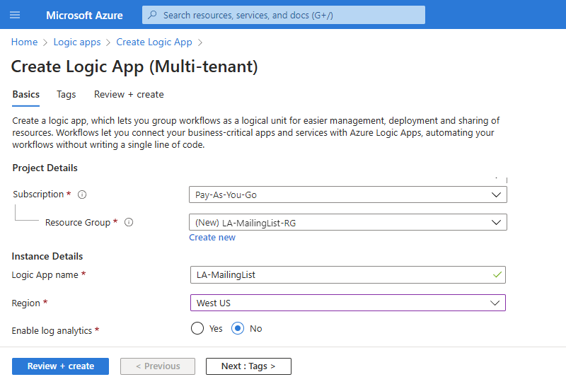

# Tutorial: Create automated approval-based workflows by using Azure Logic Apps

This tutorial shows how to build a [logic app](../logic-apps/logic-apps-overview.md) that automates an approval-based workflow. Specifically, this logic app processes subscription requests for a mailing list that's managed by the [MailChimp](https://mailchimp.com/) service. This logic app monitors an email account for these requests, sends these requests for approval, and adds approved members to the mailing list.

In this tutorial, you learn how to:

> [!div class="checklist"]
> * Create a blank logic app.
> * Add a trigger that monitors emails for subscription requests.
> * Add an action that sends emails for approving or rejecting these requests.
> * Add a condition that checks the approval response.
> * Add an action that adds approved members to the mailing list.
> * Add a condition that checks whether these members successfully joined the list.
> * Add an action that sends emails confirming whether these members successfully joined the list.

When you're done, your logic app looks like this workflow at a high level:

## Prerequisites

* An Azure subscription. If you don't have a subscription, [sign up for a free Azure account](https://azure.microsoft.com/free/) before you begin.

* A MailChimp account that contains a list named "test-members-ML" where your logic app can add email addresses for approved members. If you don't have an account, [sign up for a free account](https://login.mailchimp.com/signup/), and then learn [how to create a MailChimp list](https://us17.admin.mailchimp.com/lists/#).

* An email account in Office 365 Outlook or Outlook.com, which supports approval workflows. This article uses Office 365 Outlook. If you use a different email account, the general steps stay the same, but your UI might appear slightly different.

## Sign in to the Azure portal

Sign in to the [Azure portal](https://portal.azure.com) with your Azure account credentials.

## Create your logic app

1. From the main Azure menu, select **Create a resource** > **Integration** > **Logic App**.

   

1. Under **Create logic app**, provide this information about your logic app as shown and described. When you're done, select **Create**.

   

   | Property | Value | Description |
   |----------|-------|-------------|
   | **Name** | LA-MailingList | Your logic app's name, which can contain only letters, numbers, hyphens (`-`), underscores (`_`), parentheses (`(`, `)`), and periods (`.`). This example uses "LA-MailingList". |
   | **Subscription** | <*your-Azure-subscription-name*> | Your Azure subscription name |
   | **Resource group** | LA-MailingList-RG | The name for the [Azure resource group](../azure-resource-manager/management/overview.md), which is used to organize related resources. This example uses "LA-MailingList-RG". |
   | **Location** | West US | TThe region where to store your logic app information. This example uses "West US". |
   | **Log Analytics** | Off | Keep the **Off** setting for diagnostic logging. |
   ||||

1. After Azure deploys your app, on the Azure toolbar, select **Notifications** > **Go to resource** for your deployed logic app.

   

   Or, you can find and select your logic app by typing the name in the search box.

   The Logic Apps Designer opens and shows a page with an introduction video and commonly used triggers and logic app patterns. Under **Templates**, select **Blank Logic App**.

   

Next, add a [trigger](../logic-apps/logic-apps-overview.md#logic-app-concepts) that listens for incoming emails with subscription requests. Each logic app has to start with a trigger, which fires when a specific event happens or when new data meets a specific condition. For more information, see [Create your first logic app](../logic-apps/quickstart-create-first-logic-app-workflow.md).

## Add trigger to monitor emails

1. On the Logic App Designer, in the search box, enter `when email arrives` as your filter. From the **Triggers** list, select the **When a new email arrives** trigger for your email provider.

   This example uses the Office 365 Outlook trigger:

   

   * For Azure work or school accounts, select Office 365 Outlook.
   * For personal Microsoft accounts, select Outlook.com.

1. If prompted, sign in to your email account with your credentials so that Logic Apps can create a connection to your email account.

1. In the trigger, provide the criteria for checking all new email.

   1. Specify the folder, interval, and frequency for checking emails.

      

      | Property | Value | Description |
      |----------|-------|-------------|
      | **Folder** | `Inbox` | The email folder to monitor |
      | **Interval** | `1` | The number of intervals to wait between checks |
      | **Frequency** | `Hour` | The unit of time to use for the recurrence |
      ||||

   1. Now add another property to the trigger so that you can filter on email subject line. Open the **Add new parameter list**, and select the **Subject Filter** property.

      

      For more information about this trigger's properties, see the [Office 365 Outlook connector reference](https://docs.microsoft.com/connectors/office365/) or the [Outlook.com connector reference](https://docs.microsoft.com/connectors/outlook/).

   1. After the property appears in the trigger, enter this text: `subscribe-test-members-ML`

      

1. To hide the trigger's details for now, click the trigger's title bar.

   

1. Save your logic app. On the designer toolbar, select **Save**.

Your logic app is now live but doesn't do anything other than check your incoming email. So, add an action that responds when the trigger fires.

## Send approval email

Now that you have a trigger, add an [action](../logic-apps/logic-apps-overview.md#logic-app-concepts) that sends an email to approve or reject the request.

1. Under the trigger, select **New step**. 

1. Under **Choose an action**, in the search box, enter `approval` as your filter. From the actions list, select the **Send approval email** action for your email provider. 

   This example uses the Office 365 Outlook action:

   

1. Provide the information about this action as described: 

   

   | Property | Value | Description |
   |----------|-------|-------------|
   | **To** | <*your-email-address*> | The approver's email address. For testing purposes, you can use your own address. This example uses the fictional "sophia.owen@fabrikam.com" email address. |
   | **Subject** | `Approve member request for test-members-ML` | A descriptive email subject |
   | **User Options** | `Approve, Reject` | The response options that the approver can select. By default, the approver can select either "Approve" or "Reject" as their response. |
   ||||

   For now, ignore the dynamic content list that appears when you click inside specific edit boxes. This list lets you select available output from previous actions that you can use as inputs in your workflow.

   For more information about this action's properties, see the [Office 365 Outlook connector reference](https://docs.microsoft.com/connectors/office365/) or the [Outlook.com connector reference](https://docs.microsoft.com/connectors/outlook/).
 
1. Save your logic app.

Next, add a condition to check the approver's selected response.

## Check approval response

1. Under the **Send approval email** action, select **New step**".

1. Under **Choose an action**, select **Built-in**. In the search box, enter `condition` as your filter. From the actions list, select the **Condition** action.

   

1. Rename the condition with a better description.

   1. On the condition's title bar, select the **ellipses** (**...**) button > **Rename**.

      

   1. Rename your condition with this description: `If request approved`

1. Build a condition that checks whether the approver selected **Approve**.

   1. In the condition, click inside the **Choose a value** box on the condition's left side.

   1. From the dynamic content list that appears, under **Send approval email**, select the **SelectedOption** property.

      

   1. In the middle comparison box, select the **is equal to** operator.

   1. In the **Choose a value** box on the condition's right side, enter this text: `Approve`

      When you're done, the condition looks like this example:

      

1. Save your logic app.

Next, specify the action that your logic app performs when the reviewer approves the request. 

## Add member to MailChimp list

Now add an action that adds the approved member to your mailing list.

1. In the condition's **If true** branch, select **Add an action**.

1. Under **Choose an action**, enter `mailchimp` as your filter, and select the **Add member to list** action.

   

1. If you're prompted for access to your MailChimp account, sign in with your MailChimp credentials.

1. Provide information about this action as shown and described here:

   

   | Property | Required | Value | Description |
   |----------|----------|-------|-------------|
   | **List Id** | Yes | `test-members-ML` | The name for your MailChimp mailing list. This example uses "test-members-ML". |
   | **Status** | Yes | `subscribed` | Select the subscription status for the new member. This example uses "subscribed". 
For more information, see [Manage subscribers with the MailChimp API](https://developer.mailchimp.com/documentation/mailchimp/guides/manage-subscribers-with-the-mailchimp-api/). |
   | **Email Address** | Yes | <*new-member-email-address*> | From the dynamic content list, select **From** under **When a new mail arrives**, which passes in the email address for the new member. |
   ||||

   For more information about this action's properties, see the [MailChimp connector reference](https://docs.microsoft.com/connectors/mailchimp/).

1. Save your logic app.

Next, add a condition so that you can check whether the new member successfully joined your mailing list. That way, your logic app notifies you whether this operation succeeds or fails.

## Check for success or failure

1. In the **If true** branch, under the **Add member to list** action, select **Add an action**.

1. Under **Choose an action**, select **Built-in**. In the search box, enter `condition` as your filter. From the actions list, select **Condition**.

1. Rename the condition with this description: `If add member succeeded`

1. Build a condition that checks whether the approved member succeeds or fails in joining your mailing list:

   1. In the condition, click inside the **Choose a value** box, which is on the condition's left side. From the dynamic content list, under **Add member to list**, select the **Status** property.

      For example, your condition looks like this example:

      

   1. In the middle comparison box, select the **is equal to** operator.

   1. In the **Choose a value** box on the condition's right side, enter this text: `subscribed`

      When you're done, the condition looks like this example:

      

Next, set up the emails to send when the approved member succeeds or fails in joining your mailing list.

## Send email if member added

1. Under the **If add member succeeded** condition, in the **If true** branch, select **Add an action**.

   

1. Under **Choose an action**, in the search box, enter `outlook send email` as your filter, and select the **Send an email** action.

   

1. Rename the action with this description: `Send email on success`

1. Provide information for this action as shown and described:

   

   | Property | Required | Value | Description |
   |----------|----------|-------|-------------|
   | **To** | Yes | <*your-email-address*> | The email address for where to send the success email. For testing purposes, you can use your own email address. |
   | **Subject** | Yes | <*subject-for-success-email*> | The subject for the success email. For this tutorial, enter this text: 
`Success! Member added to "test-members-ML": ` 
From the dynamic content list, under **Add member to list**, select the **Email Address** property. |
   | **Body** | Yes | <*body-for-success-email*> | The body content for the success email. For this tutorial, enter this text: 
`New member has joined "test-members-ML":` 
From the dynamic content list, select the **Email Address** property. 
On the next row, enter this text: `Member opt-in status: ` 
 From the dynamic content list, under **Add member to list**, select the **Status** property. |
   |||||

1. Save your logic app.

## Send email if member not added

1. Under the **If add member succeeded** condition, in the **If false** branch, select **Add an action**.

   

1. Under **Choose an action**, in the search box, enter `outlook send email` as your filter, and select the **Send an email** action.

   

1. Rename the action with this description: `Send email on failure`

1. Provide information about this action as shown and described here:

   

   | Property | Required | Value | Description |
   |----------|----------|-------|-------------|
   | **To** | Yes | <*your-email-address*> | The email address for where to send the failure email. For testing purposes, you can use your own email address. |
   | **Subject** | Yes | <*subject-for-failure-email*> | The subject for the failure email. For this tutorial, enter this text: 
`Failed, member not added to "test-members-ML": ` 
From the dynamic content list, under **Add member to list**, select the **Email Address** property. |
   | **Body** | Yes | <*body-for-failure-email*> | The body content for the failure email. For this tutorial, enter this text: 
`Member might already exist. Check your MailChimp account.` |
   |||||

1. Save your logic app. 

Next, test your logic app, which now looks similar to this example:

## Run your logic app

1. Send yourself an email request to join your mailing list. Wait for the request to appear in your inbox.

1. To manually start your logic app, on the designer toolbar bar, select **Run**. 

   If your email has a subject that matches the trigger's subject filter, your logic app sends you email to approve the subscription request.

1. In the approval email, select **Approve**.

1. If the subscriber's email address doesn't exist on your mailing list, your logic app adds that person's email address and sends you an email like this example:

   

   If your logic app can't add the subscriber, you get an email like this example:

   

   If you don't get any emails, check your email's junk folder. Your email junk filter might redirect these kinds of mails. Otherwise, if you're unsure that your logic app ran correctly, 
   see [Troubleshoot your logic app](../logic-apps/logic-apps-diagnosing-failures.md).

Congratulations, you've now created and run a logic app that integrates information across Azure, Microsoft services, and other SaaS apps.

## Clean up resources

When you no longer need the sample logic app, delete the resource group that contains your logic app and related resources. 

1. On the main Azure menu, go to **Resource groups**, and select the resource group for your logic app.

1. On the resource group menu, select **Overview** > **Delete resource group**. 

   

1. Enter the resource group name as confirmation, and select **Delete**.

## Next steps

In this tutorial, you created a logic app that manages approvals for mailing list requests. Now, learn how to build a logic app that processes and stores email attachments by integrating Azure services, such as Azure Storage and Azure Functions.

> [!div class="nextstepaction"]
> [Process email attachments](../logic-apps/tutorial-process-email-attachments-workflow.md)
