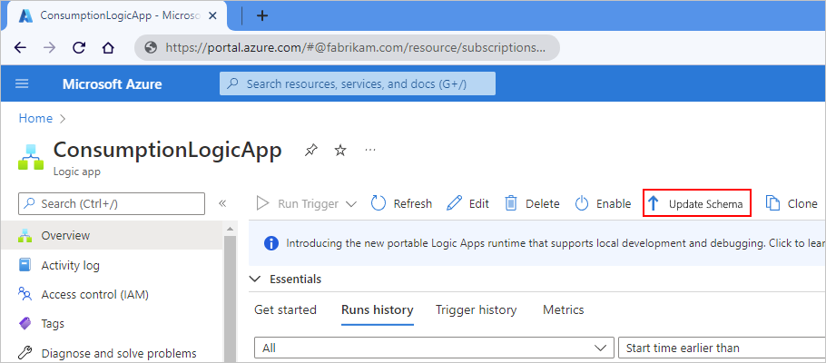

# Update Consumption logic app workflows to latest Workflow Definition Language schema version in Azure Logic Apps

[!INCLUDE [logic-apps-sku-consumption](../../includes/logic-apps-sku-consumption.md)]

If you have a Consumption logic app workflow that uses an older Workflow Definition Language schema, you can update your workflow to use the newest schema. This capability applies only to Consumption logic app workflows.

## Best practices

The following list includes some best practices for updating your logic app workflows to the latest schema:

* Don't overwrite your original workflow until after you finish your testing and confirm that your updated workflow works as expected.

* Copy the updated script to a new logic app workflow.

* Test your workflow *before* you deploy to production.

* After you finish and confirm a successful migration, update your logic app workflows to use the latest [managed connectors for Azure Logic Apps](/connectors/connector-reference/connector-reference-logicapps-connectors) where possible. For example, replace older versions of the Dropbox connector with the latest version.

## Update workflow schema

When you select the option to update the schema, Azure Logic Apps automatically runs the migration steps and provides the code output for you. You can use this output to update your workflow definition. However, before you update your workflow definition using this output, make sure that you review and follow the best practices as described in the [Best practices](#best-practices) section.

1. In the [Azure portal](https://portal.azure.com), open your logic app resource.

1. On your logic app's navigation menu, select **Overview**. On the toolbar, select **Update Schema**.

   > [!NOTE]
   >
   > If the **Update Schema** command is unavailable, your workflow already uses the current schema.

   

   The **Update Schema** pane opens to show a link to a document that describes the improvements in the new schema.

## Next steps

* [Review Workflow Definition Language schema updates - June 1, 2016](../logic-apps/logic-apps-schema-2016-04-01.md)
