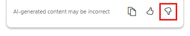

# Get AI-assisted help for Standard workflows in Azure Logic Apps (preview)

[!INCLUDE [logic-apps-sku-standard](../../includes/logic-apps-sku-standard.md)]

> [!IMPORTANT]
> This capability is in preview and is subject to the 
> [Supplemental Terms of Use for Microsoft Azure Previews](https://azure.microsoft.com/support/legal/preview-supplemental-terms/).

If you're new to building Standard workflows in Azure Logic Apps, or you're updating a workflow built by other developers, you might have questions about your workflow, connectors, their operations, and other tasks that you're trying to complete in Azure Logic Apps. For example, Azure Logic Apps provides 1,000+ connectors for you to use. How do you choose which to use?

In the Azure portal, within the Standard workflow designer, the workflow assistant offers a chat box so that you can ask questions about the currently open workflow or about Azure Logic Apps in general. The assistant generates answers and provides access to Azure Logic Apps documentation and best practices. When you use the assitant, you don't have to switch context to search or browse for documentation online.

:::image type="content" source="media/workflow-assistant-standard/overview.png" alt-text="Screenshot shows Azure portal, Standard logic app with workflow designer opened, and workflow assistant with example question and generated response." lightbox="media/workflow-assistant-standard/overview.png":::

The workflow assistant uses reputable knowledge sources such as the Azure Logic Apps documentation on Microsoft Learn, connector schemas, tech community blogs to deliver curated information using the [Azure Open AI Service](../ai-services/openai/overview.md) and [ChatGPT](https://openai.com/blog/chatgpt). The assistant also builds responses based on your opened workflow in the designer. That way, you can learn how to complete tasks within your workflow's specific context. For example, you can ask how to configure a specific action in the workflow, get recommendations about the action's parameter values or ouptuts, how to test that data, and so on.

> [!IMPORTANT]
>
> The workflow assistant doesn't collect, save, store, or share any information and personal or customer data 
> from your Standard logic app workflows or from your chat history. The assistant is available only when you 
> use the designer for Standard logic app workflows in Azure portal, not in Visual Studio Code. You can use 
> the assistant in all Azure regions where Standard workflows and single-tenant Azure Logic Apps are available. 
> However, the assistant currently supports only English for queries, prompts, and responses.
>
> The workflow assistant follows responsible practices in accordance with the 
> [Azure Privacy policy](https://portal.azure.com/explore/trusted-cloud/privacy). 
> For more information, see [Azure customer data protection](../security/fundamentals/protection-customer-data.md) 
> and [Microsoft data protection and privacy](https://www.microsoft.com/trust-center/privacy). 
> The assistant follows responsible and ethical AI practices in accordance with the 
> [Microsoft responsible AI principles and approach](https://www.microsoft.com/ai/principles-and-approach).

## Prerequisites

- An Azure account and subscription. If you don't have a subscription, [sign up for a free Azure account](https://azure.microsoft.com/free/?WT.mc_id=A261C142F).

- A [new or existing Standard logic app workflow](create-single-tenant-workflows-azure-portal.md).

## Open the workflow assistant

1. In the [Azure portal](https://portal.azure.com), open your Standard logic app resource and workflow in the designer.

1. On the workflow toolbar, select **Assistant**.

   :::image type="content" source="media/workflow-assistant-standard/open-workflow-assistant.png" alt-text="Screenshot shows Azure portal, Standard logic app with workflow designer opened, and workflow toolbar with Assistant selected." lightbox="media/workflow-assistant-standard/open-workflow-assistant.png":::

   The **Workflow assistant** pane opens on the designer's left side:

   :::image type="content" source="media/workflow-assistant-standard/chat-open-first-time.png" alt-text="Screenshot shows Azure portal, Standard workflow designer, and open workflow assistant pane." lightbox="media/workflow-assistant-standard/chat-open-first-time.png":::

## Ask your question

1. In the chat box, enter your question about the current workflow or about Azure Logic Apps.

   The following example asks the question, **"What is a trigger?"**

   :::image type="content" source="media/workflow-assistant-standard/ask-question.png" alt-text="Screenshot shows Azure portal, Standard workflow designer, open workflow assistant pane, and chat box with a question entered." lightbox="media/workflow-assistant-standard/ask-question.png":::

   The workflow assistant researches your question and generates an answer, for example:

   :::image type="content" source="media/workflow-assistant-standard/question-response.png" alt-text="Screenshot shows open workflow assistant pane, and chat box with a generated answer to the previously entered question." lightbox="media/workflow-assistant-standard/question-response.png":::

1. [Provide optional feedback about your experience with the workflow assistant](#provide-feedback).

1. At any time, you can close the workflow assistant, which doesn't save or store your chat history.

## Example ways to use the assistant

The following table includes only some example use cases, so please share your feedback with the Azure Logic Apps team about how you use the workflow assistant to improve your productivity.

| Use case | Example question | Description |
|----------|------------------|-------------|
| Describe the currently open workflow. | **"What does this workflow do?"** | Useful when you use or update a workflow built by other developers or when collaborating with other developers on shared workflows. |
| Get help with connectors. | - **"Which connectors can send email?"**  - **"What does the Request trigger do?"** | Useful when you're not sure which connector to use, what connectors are available, or need specific information about a connector.   The workflow assistant can provide recommendations on connectors or operations, provide best practices about how to use a connector, provide comparisons between connectors, and so on. |
| Suggest guidance based on your specific scenario. | **"How do I create a workflow that checks an RSS feed and sends me the feed items?"** | Recommend step-by-step information about how to build a workflow based on your scenario, including which connectors to use, how to configure them, and how to process the data. |
| Recommend patterns. | **"What's a best practice for error handling in my workflow?"** | Provide guidance and best practices for error handling, testing, and other optimizations. |

## Provide feedback

The Azure Logic Apps team values your feedback and encourages you to share your experiences, especially if you encounter unexpected responses or have any concerns about the workflow assistant.

In the chat pane, under the workflow assistant's response, choose an option:

- Share constructive feedback about the workflow assistant or its responses.

  1. Select the thumbs-down icon:

     

  1. Provide the following information:

     | Item | Description |
     |------|-------------|
     | Difficulty | Rate the difficultly level for using the assistant. |
     | Value | Rate the value that the assistant provided in helping you with your workflow or Azure Logic Apps. |
     | Comments | Include the following information:   - The question you asked  - Relevant information about your workflow  - The assistant's response |
     | **It's OK to contact me about my feedback** | Select whether you want Microsoft or the Azure Logic Apps team to contact you. |

  1. When you're done, select **Submit**.

- Report problems with the workflow assistant.

  1. Select **Report a bug**:

     

     The link opens a GitHub page for the Azure Logic Apps customer feedback bug report template.

  1. Follow the template's prompts to provide the required information and other details about the problem.

  1. When you're done, select **Submit new issue**.

## Limitations

- Inaccurate responses

  The workflow assistant can generate valid responses that might not be semantically correct or capture the intent behind your prompt. As the language model trains with more data over time, the responses will improve. Always make sure to carefully review the assistant's recommendations before you apply them to your workflows.

- Workflow size

  You might experience different performance levels in the workflow assistant, based on factors such as the number of workflow operations or complexity. The assistant is trained on workflows with different complexity levels but still has limited scope and might not be able to handle very large workflows. These limitations are primarily related to token constraints in the queries sent to Azure Open AI Service. The Azure Logic Apps team is committed to continuous improvement and enhancing these limitations through iterative updates.

## Frequently asked questions (FAQ)

**Q**: Can the workflow assistant answer questions about any topic?

**A**: The workflow assistant is trained to answer only questions about Azure Logic Apps. To make sure that responses are grounded and relevant to Azure Logic Apps, the assistant was evaluated using valid and harmful prompts from various sources. The assistant is trained to not answer any harmful questions. If you ask questions about Azure that are unrelated to Azure Logic Apps, the assistant gracefully hands off processing to Azure Copilot.

**Q**: How does the workflow assistant use my query to generate responses?

**A**: The workflow is powered by [Azure Open AI Service](../ai-services/openai/overview.md) and [ChatGPT](https://openai.com/blog/chatgpt), which use Azure Logic Apps documentation from reputable sources along with internet data that's used to train GPT 3.5-Turbo. This content is processed into a vectorized format, which is then accessible through a backend system built on Azure App Service. Queries are triggered based on interactions with the workflow designer.

When you enter your question in the assistant's chat box, the Azure Logic Apps backend performs preprocessing and forwards the results to a large language model in Azure Open AI Service. This model generates responses based on the current context in the form of the workflow definition's JSON code and your prompt. 

**Q**: What data does the workflow assistant collect?

**A**: To provide contextual responses, the workflow assistant relies on your workflow's sanitized JSON definition, which is used only to scope the responses and isn't stored anywhere. The workflow definition is sanitized to make sure that no customer data or secrets are passed as context. For troubleshooting purposes, the assistant collects some telemetry about UI interactions, but omits any customer or personal data.

**Q**: What happens to any personal or customer data entered in the workflow assistant? 

**A**: The workflow assistant doesn't collect, save, store, or share any personal or customer data, including any information in workflow assistant's chat history.

**Q**: Where can I learn about privacy and data protection for Azure?

**A**: The workflow assistant follows responsible practices in accordance with the [Azure Privacy policy](https://portal.azure.com/explore/trusted-cloud/privacy). For more information, see [Azure customer data protection](../security/fundamentals/protection-customer-data.md) and [Microsoft data protection and privacy](https://www.microsoft.com/trust-center/privacy).

**Q**: Where can I learn about responsible and ethical AI practices at Microsoft?

**A**: The workflow assistant follows responsible and ethical AI practices in accordance with the [Microsoft responsible AI principles and approach](https://www.microsoft.com/ai/principles-and-approach).

**Q**: Does Azure Logic Apps own the workflows suggested by the workflow assistant? 

**A**: The workflow assistant doesn't own the workflow suggestions that the assistant provides to you nor the workflows that you build based on these suggestions. You own and manage the workflows that you create using the workflow assistant's help.

**Q**: What's the difference between Azure OpenAI Service and ChatGPT?

**A**: [Azure Open AI Service](../ai-services/openai/overview.md) is an enterprise-ready AI technology that's powered and optimized for your business processes and your business data to meet security and privacy requirements.

[ChatGPT](https://openai.com/blog/chatgpt) is built by [Open AI](https://openai.com) and is a general-purpose large language model (LLM) trained by OpenAI on a massive dataset of text, designed to engage in human-like conversations and answer a wide range of questions on several topics.

## Next steps

[Create an example Standard workflow in single-tenant Azure Logic Apps](create-single-tenant-workflows-azure-portal.md)
