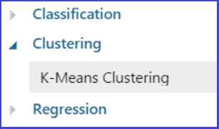
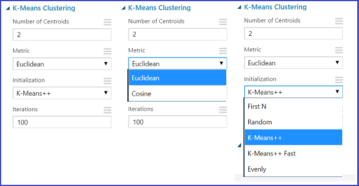
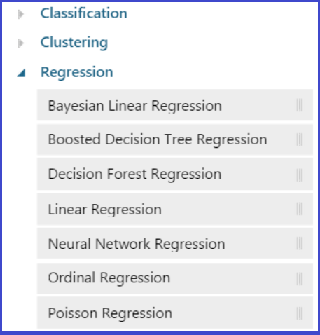

<properties 
	title="" 
	pageTitle="How to choose an algorithm in Azure Machine Learning | Azure" 
	description="Explains how to How to choose an algorithm in Azure Machine Learning." 
	services="machine-learning"
	documentationCenter="" 
	authors="garyericson" 
	manager="paulettm" 
	editor="cgronlun"/>

<tags 
	ms.service="machine-learning" 
	ms.workload="data-services" 
	ms.tgt_pltfrm="na" 
	ms.devlang="na" 
	ms.topic="article" 
	ms.date="05/05/2015" 
	ms.author="bradsev;garye" />

# How to choose an algorithm in Azure Machine Learning

This topic explains some basics aspects of the machine learning approach and outlines, in particular, how to select an appropriate algorithm to analyze a given type of data, to answer a question posed, to accomplish a specified task, or to provide criteria for making a decision. 

> [AZURE.TIP] The [Microsoft Azure Machine Learning Algorithm Cheat Sheet](machine-learning-algorithm-cheat-sheet.md) is a handy reference to accompany this article.

When using machine learning to do analytics, we are usually faced with two questions: 

* What kind of analysis do we need to accomplish our objectives with the data available? 
* What is the most appropriate algorithm or model to use to do this analysis?

Three types of analysis are discussed and their use cases are compared: 

* classification 
* regression 
* clustering

The various algorithms for each of these types of analysis and the modules that contain them that are available in Azure Machine Learning are also discussed. 

[AZURE.INCLUDE [machine-learning-free-trial](../includes/machine-learning-free-trial.md)]

##Machine Learning

Machine Learning is a discipline that studies a class of algorithms that are data-driven in the sense that they are designed to learn from the data and do not impose a specific, predetermined model to test against the data. The idea is to to acquire knowledge  more inductively by examining the patterns in a dataset instead of by using what is usually referred to as the hypothetical-deductive method where you try to guess the appropriate model for the entire dataset first and then test it empirically. This type of learning from data comes in two flavors: supervised learning and unsupervised learning. 

##Supervised Learning  

Supervised learning requires that the target variable is well defined and that a sufficient number of its values are given. 

Supervised learning is the type of learning that takes place when the correct output results (or target variables) for the training instances to be input are known. The objective of training a machine learning algorithm is to find the model (that is a rule or function) that maps the inputs into the known output values. This is akin to having a supervisor who can tell the algorithmic agent whether or not it is mapping the inputs to the outputs correctly. Once the learning process is complete and we have a workable model, it can be applied to new input data to predict the expected output where, unlike the training dataset, the target value are not known in advance.

The nature of the target variable determines the type of model.

There are two broad categories of analysis that employ supervised learning: classification and regression. Supervised learning is fairly common in *classification problems* because the goal is often to get the computer to learn a classification system that we have created. The responses usually are just a few known values(labels), such as 'true' or 'false'. Classification algorithms apply to nominal, not ordinal response values. Digit recognition is a common example of classification learning. More generally, classification learning is appropriate for any problem where deducing a classification is useful and the classification is easy to determine.

In supervised learning the variables under investigation can be split into two groups: explanatory variables (also called predictors) and dependent variables (also called response variables). The objective of the analysis is to specify a relationship between the explanatory variables and the dependent variables as it is done in *regression analysis*. The values of the dependent variable must be known for a sufficiently large part of the dataset. In regression the responses or output variable take continuous values, such as miles per gallon for a particular car, a person's age etc.

Supervised learning is also the most common technique for training neural networks and decision trees. Both of these techniques are highly dependent on the information given by the pre-determined classifications. 

* In the case of neural networks, the classification is used to determine the error of the network and then adjust the network to minimize it. 
* In the case of decision trees, the classifications are used to determine what attributes provide the most information that can be used to solve the classification puzzle.  

Both of these examples require having some "supervision" in the sense that they depend on being provided with pre-determined classifications. 

Speech recognition using hidden Markov models and Bayesian networks also rely on elements of supervision in order to adjust parameters to minimize the error on the given inputs. 

##Unsupervised Learning

In machine learning, the problem of unsupervised learning is to find patterns or hidden structure in unlabeled data. The model is not provided with the "correct results" for a dataset on which to train. Since the examples given to the learner are unlabeled, there is no error or reward signal to evaluate a potential solution. The goal is to have the computer learn how to do something that we don't explicitly tell it how to do! In unsupervised learning situations, all variables are treated in the same way. There is no distinction between explanatory and dependent variables. However, there is still some objective to achieve. This objective might be as general as data reduction or more specific like finding clusters. 

In Azure Machine Learning we can perform both Unsupervised and Supervised Learning via **Classification**, **Clustering**, **Regression**.

   

##Clustering
Clustering is an example of unsupervised learning. In this type of learning, the goal is to find similarities in the training data and to partition the dataset into subsets that are demarcated by these similarities. The expectation that the most significant clusters discovered by these data-driven procedures are consistent with our intuitive classification is often, but not always, satisfied. 

Although the algorithm won't assign appropriate names to these clusters, it can produce them and then use them to anticipate similarities expected in new examples by classifying them into the most appropriate cluster. This is a data-driven approach that can work well when there is sufficient data. For instance, social information filtering algorithms, such as those used by Amazon.com to recommend books, are based on finding similar groups of people and then assigning new users to these groups for the purpose of making recommendations.

The clustering algorithm available in Azure Machine Learning is K-means clustering.

K-means is one of the simplest unsupervised learning algorithms that solve well known clustering problem. The KMeans algorithm clusters data by trying to separate samples into N groups of equal variance, minimizing a criterion known as the inertia or within-cluster sum-of-squares. This algorithm requires the number of clusters to be specified. It scales well to large number of samples and has been used across a large range of application areas in many different fields.

The [K-Means Clustering][k-means-clustering] module that implements the K-means algorithm returns an untrained K-means clustering model that can be passed to the [Train Clustering Model][train-clustering-model] module for training.

This figure shows that are options to be configured when using K-Means Clustering. The K-means method finds a specified number of clusters for a set of D-dimensional data points. Starting with an *initial set of K centroids*, the method uses Lloyd's algorithm to iteratively refine the locations of the centroids. The algorithm terminates when the centroids stabilize or when a *specified number of iterations* are completed.
The module initializes a K-by-D array with the final centroids that define the K clusters found in the N data points. The algorithm also uses a vector of length N with the assignment of each data point to one of the K clusters.
If given a specific number of clusters (K) to find, the module assigns the first K data points in order to the K clusters.
This module also accepts or generates initial points to define its initial cluster configuration.
*Metric* defines the method used to measure the distance between a data point and the centroid.
Each data point is assigned to the cluster that has the closest centroid to the data point. By default, the method uses the *Euclidean metric*. You can specify the *cosine metric* as an alternate metric for the method.
Note that the K-means method might only find a locally optimum cluster configuration for a dataset. The method could find a different, perhaps superior, configuration given a different initial configuration.

##Classification 
In classification analysis we divide the samples into classes and use a trained set of previously labeled data. The technique is used to predict group membership for data instances. 
In Azure Machine Learning the following classification algorithms are available.

The *Two-Class algorithms* are used for binary response variables (yes or no, 0 or 1, true or false etc) whereas *Multiclass algorithms* are used for any nominal response variable that classifies instances into more than two classes

### Guidelines for selecting a classification algorithm
This long list of algorithms gives rise to a series of questions: 

* How do you know which of these many classifiers is best one to use on a particular dataset? 
* Are there cases where one of them is a "natural" choice? 
* What are the principles for choosing that one?

One approach that is recommended is to test several different classifiers, as well as different parameter sets within each algorithm, and then select the best one by using cross-validation. Here are some general guidelines that can provide a place to start this deliberation. Consider the following issues when choosing which algorithm to use:

**How large is your training data?**
If your training set is small, and you are going to train a supervised classifier, then machine learning theory says you should stick to a classifier with high bias/low variance classifiers such as Naive Bayes. These have an advantage over low bias/high variance classifiers such as kNN since the latter tends to overfit. But low bias/high variance classifiers start to win out as your training set grows (they have a smaller asymptotic error), since high bias classifiers aren’t powerful enough to provide accurate models. There are theoretical and empirical results that indicate that Naive Bayes does well in such circumstances. But note that better data typically beats better algorithms, and that designing good features provide a significant advantage. If you have a huge dataset, then the classification algorithm you use might not matter much for classification performance. So it may be best to choose your algorithm based on  good scalability, speed or ease of use instead.

**Do you need to train incrementally or in a batched mode?** 
If you need to update your classifier with new data frequently (or you have a lot of data), you probably want to use Bayesian algorithms that update well. Both neural nets and SVM need to work on the training data in batch mode.

**Is your data exclusively categorical or exclusively numeric or a mixture of both kinds?** 
Bayesian works best with categorical/binomial data. Decision trees can't predict numerical values.

**Do you or your audience need to understand how the classifier works?**  Use Bayesian or Decision Trees, since these can be easily explained to most people. Neural networks and SVM are "black boxes" in the sense that you can't really see how they are classifying data.

**How fast does your classification need to be generated?** 
SVM's are fast when it comes to classifying since they only need to determine which side of the "line" your data is on. Decision trees can be slow especially when they're complex (e.g. lots of branches).

**How much complexity does the problem present or require?** Neural nets and SVMs can handle complex non-linear classification.

### Advantages and disadvantages of classification algorithms
Each of these classification algorithms has some advantages and  some disadvantages:

**Advantages and Disadvantages of Logistic Regression:**   
Logistic regression analysis is based on calculating the odds of the outcome as the ratio of the probability of having the outcome divided by the probability of not having it. The logistic model  is parametric and so has the advantage that it provides insight into the impact of each predictor variable on the response variable. With natural probabilistic interpretations available (unlike decision trees or SVMs), we can easily update our model to take in new data. There are lots of ways to regularize our model, and you don’t have to worry as much about your features being correlated, as you do with Naive Bayes. Logistic regression is useful if we want 

* a probabilistic framework that make it easy to adjust classification thresholds to say when we’re unsure or to get confidence intervals 
* if we expect to receive more training data in the future that we want to be able to quickly incorporate into our model. 

Logistic regression works better than decision trees for high dimension data. For example, in text classification you might have over 100 thousand documents with 500 thousand distinct words (features). A simple rule like learning of a linear hyperplane is better, since Decision Trees have far too many degrees of freedom and are prone to overfitting. You could do feature selection to use a decision tree on text data, but a lot of valuable information will be lost for text classification by picking a much reduced subset of the features. When learning models are used with high dimensional data, it is very easy for variance based errors to get large and so simple models with higher bias are a better bet. 

One disadvantage of logistic regression is that it is unstable when one predictor could almost explain the response variable, because the coefficient of this variable will become extremely large.

**Advantages and Disadvantages of Decision Trees:**   
[Decision trees](http://research.microsoft.com/pubs/155552/decisionForests_MSR_TR_2011_114.pdf) are easy to interpret and explain. They easily handle feature interactions and they’re non-parametric, so you don’t have to worry about outliers or whether the data is linearly separable (e.g., decision trees easily take care of cases where you have class A at the low end of some feature x, class B in the mid-range of feature x, and A again at the high end). Decision trees will generate the output as rules along with metrics such as Support, Confidence and Lift. 

One disadvantage is that decision trees don’t support online learning, so you have to rebuild your tree when new examples come arrive. Another disadvantage is that they easily overfit, but that’s where ensemble methods like random forests (or boosted trees) can help. Also, random forests are often the winner for many problems in classification. They usually do slightly better than SVMs: they’re fast and scalable, and you don’t have to worry about tuning a bunch of parameters as you do with SVMs.

**Advantages and Disadvantages of SVMs:**   
Support Vector Machines (SVMs) are effective in high dimensional spaces. Even in cases where number of dimensions is greater than the number of samples it is still effective. However, if the number of features is much greater than the number of samples, the method is likely to perform poorly. It is also memory efficient as it uses a subset of training points in the decision function (known as support vectors).  It is very versatile: different Kernel functions can be specified for the decision function. Common kernels are provided, but it is also possible to specify custom kernels. Kernel function are used to transform low dimensional training samples to higher dimensions, which is useful for linear separability problem. 

SVMs however do not directly provide probability estimates. These are calculated using an expensive five-fold cross-validation. With high accuracy, solid theoretical guarantees regarding overfitting, and an appropriate kernel, they can work well even if the data isn’t linearly separable in the base feature space. It is especially popular in text classification problems where very high-dimensional spaces are the norm. Unlike forests, SVMs originated as two-class classifiers, although recently they have been adapted to work with multiple classes. We can use something like "one-vs-rest" training to make a multi-class classifier which may be less optimal. Since SVMs can only handle two-class outputs (i.e., a categorical output variable with variety 2), with N classes, it learns N SVM’s (SVM 1 learns “Output==1” vs “Output != 1”, SVM 2 learns  “Output==2” vs “Output != 2”, ..., SVM N learns “Output==N” vs “Output != N”). Then to predict the output for a new input, it just predicts with each SVM and finds out which one puts the prediction the furthest into the positive region.

**Advantages and Disadvantages of Naive Bayes:**   
[Naive Bayes](http://www.aaai.org/Papers/FLAIRS/2004/Flairs04-097.pdf) (NB) classifiers are a popular choice for classification problems. They assume the features are independent - this is what makes the technique 'naive'. If the NB conditional independence assumption actually holds, a Naive Bayes classifier will converge more quickly than discriminative models like logistic regression. So, in such cases, you need less training data. 

Even if the NB assumption doesn’t hold, a NB classifier still often does a great job in practice.  It turns out that Bayes is good not only when features are independent, but also when dependencies of features from each other are similar between features. So NB is good bet if want something fast and easy that performs respectively.

Its main disadvantage is that it can’t learn about interactions between features (e.g., it can’t learn that although you love movies with Brad Pitt and Tom Cruise, you hate movies where they’re together).

**One vs all:**  
One vs all is a strategy for reducing the problem of multi-class classification to a set of multiple binary classification problems. The strategy involves training a single classifier per class, with the samples of that class as positive samples and all other samples as negatives. This strategy requires the base classifiers to produce a real-valued confidence score for its decision, rather than just a class label. Discrete class labels alone can lead to ambiguities, where multiple classes are predicted for a single sample.	

##Regression
 
In regression analysis we predict new values based on the past inference. The new values for a dependent variable are computed based on the value of one or more measured attributes. The various regression algorithms available in Azure Machine Learning are:

Depending upon the use case and the data at hand we choose one algorithm/module over other. Below we will describe some regression algorithms and their principal use cases.

**Bayesian Linear Regression**                      
Bayesian linear regression is an approach to linear regression in which the statistical analysis is undertaken within the context of Bayesian inference. Explicit results are available for the posterior probability distributions of the model's parameters when the regression model has normal distributed errors and a particular form of prior distribution can be assumed.

**Boosted Decision Tree Regression**  
Regression calculates a relationship between predictor and response variables. Regression tree structure is similar to a classification tree. Terminal nodes are predicted function (model) values. Predicted values are limited to the values in the terminal nodes. Some of the advantages of using decision trees are: 

* it is easy to interpret the decision rules 
* they are nonparametric so it is easy to incorporate a range of numerical or categorical data layers and there is no need to select unimodal training data 
* they are robust with regard to outliers in training data 
* classification is fast once rules are developed 

A few drawback of using decision trees is that they tend to overfit training data which can give poor results when applied to the full data set, and it is not possible to predict beyond the minimum and maximum limits of the response variable in the training data.

**Decision Forest Regression**  
Decision Forests can be used for classification (categorical variables) or regression (continuous variables) applications. Regression forests may be used for the non-linear regression of dependent variables given independent input. Both inputs and outputs may be multi-dimensional. Regression forests are not used as much as their classification counterparts. The main difference is that the output label of the decision forests to be associated with an input data, and so the training labels, must be continuous. Consequently the objective function has to be adapted appropriately. Regression forests share many of the advantages of classification forests such as efficiency and flexibility.

**Linear Regression**  
Linear regression is widely used for modeling the relationship between a scalar dependent variable Y and one or more explanatory variables denoted X. It can be, and typically is, applied for prediction, forecasting, or reduction. It can be used to fit a predictive model to an observed dataset of Y and X values. Linear regression assumes that the underlying structure of Y is a linear combination of the X variables. If an additional value of X is then given without its accompanying y value, the fitted linear regression model can be used to predict that Y value. Linear regression models are typically fitted using the least squares approach, but other options also exist to measure which fit is best.

**Neural Network Regression**  
Neural networks are a useful statistical tool for nonparametric regression. Nonparametric regression addresses the problem of trying to fit a model for a variable Y on a set of possible explanatory variables X1; : : : ;Xp, and where the relationship between X and Y may be more complicated than a simple linear relationship.

**Ordinal Regression**   
Ordinal regression is a type of regression analysis used for modeling or predicting an ordinal dependent variable. For ordinal dependent variables, you can rank the values, but the real distance between categories is unknown. Only the relative ordering between different values is significant. Since the labels or target values have a natural ordering or ranking, any numeric column can be used as an ordinal target. The natural ordering of numbers is used for ranking them. Diseases are graded on scales from least severe to most severe. Survey respondents choose answers on scales from strongly agree to strongly disagree. Students are graded on scales from A to F. Essentially, however, ordinal regression is an extension of logistic regression which is based on the proportional odds model.

**Poisson Regression**  
Poisson regression is often used for modeling count data. Poisson regression assumes that the response variable has a Poisson distribution. Poisson distributed data is intrinsically integer-valued (discrete and positive), which makes sense for count data. Given a training dataset, Poisson regression tries to find the optimal values by maximizing the log likelihood of the parameters given the inputs. The likelihood of the parameters is the probability that the training data was sampled from a distribution with these parameters. For example, Poisson regression would be useful for: 

* Modeling the number of colds associated with airplane flights 
* Estimating the number of calls related to an event or promotion 
* Creating contingency tables

<!-- Module References -->
[k-means-clustering]: https://msdn.microsoft.com/library/azure/5049a09b-bd90-4c4e-9b46-7c87e3a36810/
[train-clustering-model]: https://msdn.microsoft.com/library/azure/bb43c744-f7fa-41d0-ae67-74ae75da3ffd/

  

