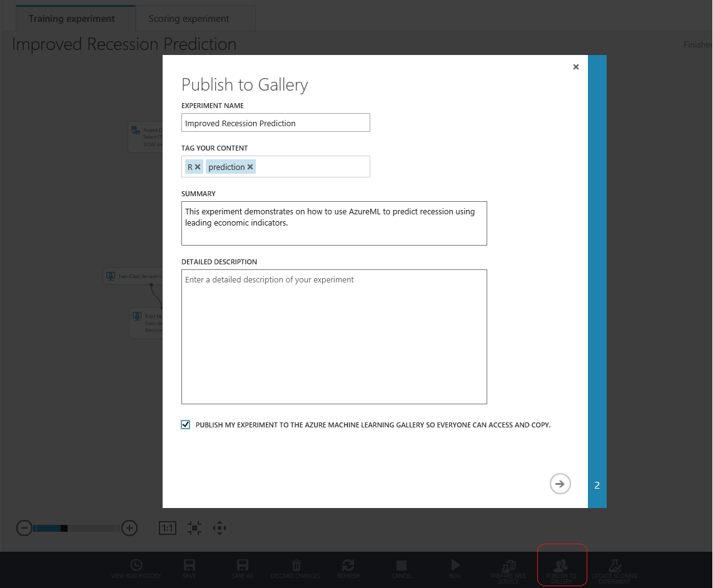

<properties 
	pageTitle="Azure Machine Learning Gallery | Microsoft Azure" 
	description="Description of the Azure Machine Learning Gallery site for community published Machine Learning experiment." 
	services="machine-learning" 
	documentationCenter="" 
	authors="cjgronlund" 
	manager="paulettm" 
	editor="cgronlun"/>

<tags 
	ms.service="machine-learning" 
	ms.workload="data-services" 
	ms.tgt_pltfrm="na" 
	ms.devlang="na" 
	ms.topic="article" 
	ms.date="02/16/2015" 
	ms.author="chhavib;garye"/>

# **Machine Learning Gallery** #
The Azure Machine Learning Gallery is a community driven site for discovering experiments that solve interesting problems. It is a destination for users looking to learn from others’ experiments, or to simply get started on Azure Machine Learning. These experiments are primarily contributed by the Azure Machine Learning user community. 

The Gallery also enables users to browse and copy experiments contributed by Microsoft Azure Machine Learning Team.

**[TAKE ME TO THE GALLERY >>](http://gallery.azureml.net)**

[AZURE.INCLUDE [machine-learning-free-trial](../includes/machine-learning-free-trial.md)]

## Benefits ##
Start using the Gallery to enjoy these benefits:

- Discover interesting experiments 
- Learn from others

Sign in using your Microsoft account to enjoy this additional benefits:

- Copy experiments to your workspace and get started with solving your own problems using Azure ML
- Contribute and showcase your work

## Discover ##
You can search and browse interesting experiments in the Gallery that help solve your machine learning needs or to simply get started on creating Azure Machine Learning experiments. 

You can start using gallery for discovering and learning more about experiments without signing in. 
Easily find recently published experiments, trending experiments in the gallery or search by experiment name, tags, algorithms and other attributes.

View experiment contributions from a particular author by clicking on the author name from within any of the experiment tiles.

If interested in a particular experiment, you can read additional information about the experiment in the experiment Details Page. 

You can also comment, provide feedback or ask questions through the comments section on each experiment page. You can further share an experiment of interest with friends or colleagues using share capabilities with LinkedIn or Twitter accounts. 
You may also email links to these experiments to invite other users to view the experiment pages.

## Download ##
Azure Machine Learning Gallery you to easily copy experiments to your workspace with a single click and immediately start using it for your purpose. 
If you are not already signed in while browsing, you will be prompted to sign-in using your Microsoft account before the experiment is copied to their studio workspace.

## Contribute ##
Are you ready to start contributing experiments to the Gallery?

Follow these steps:

- Sign-in to the studio using your Microsoft account (Please make sure your profile picture and Name in the Microsoft Account profile settings are as you want them showing up)
- Create your experiment and run it
- When you’re ready to publish your experiment to the Gallery, click on ‘Publish to Gallery’ in the Studio’s lower black bar.

Enjoy!

## We want to hear from you! ##
We want the Gallery to be driven by our users and for our users. Use the smiley on the right to tell us what you love or hate about the Gallery.  

## Frequently Asked Questions ##
**I would like to make changes to the workflow of the experiment I submitted to the Gallery. How can I do that?**

As of right now we do not support workflow updates to experiments you have already published to the Gallery. You may publish any such changes as a new experiment into the Gallery and delete your old one. We are actively working on enabling publising updates to workflow for already contributed Gallery. Stay Tuned.

**Will I need to publish a new experiment even if I have to edit only the tags or description?**
Following type of edits can be made to an experiment you have already contributed, without having to go through a publish again:

- Experiment Name
- Summary Text
- Description Text
- Tags
- Images

In order to edit these fields, click on the specific experiment you would like to edit(make sure you're signed in with your Microsoft account). This will navigate you to the experiment details page where you can see options to edit or delete. Clicking on 'Edit' allows you to edit any of the above fields.

**I just published my experiment to the Azure Machine Learning Gallery. I don’t see my profile picture showing up with my name**	

It is possible that you are using an account other than @outlook, @msn, @live or @hotmail. If that is the case, you will see a placeholder image instead of the profile picture from your Microsoft account configuration settings. Using a Microsoft account and re-submitting the experiment should help solve this issue

**I updated my profile picture in my Microsoft account configuration settings. Why are my existing experiment contributions not reflecting this new profile picture?**

If you are looking to reflect the most recent profile change (profile picture or first name or last name) for all your experiments, you should re-submit the older experiments to the Gallery. In doing so you will need to delete the older copies that reflect the old profile settings.

**What are the image requirements when submitting or editing an image for my experiment?**

The images you submit along with your experiment will be used to create an experiment tile for your contribution. It is recommended that the images be < 500Kb in size, with an aspect ratio of 3:2. A resolution of 960x640 is recommended

**What happens to the dataset I have used in the experiment? Does the data set get published to the Gallery as well?**

If your Data Set is part of your experiment and not being pulled through a reader module, it is part of your experiment and gets published to the Gallery with your experiment. For this reason ensure that the data set you are publishing with the experiment has the appropriate licensing terms that allowed sharing and downloading by anybody.

**I have an experiment that uses a Reader module to pull data from HDInsight or SQL. It uses my credentials to retrieve the data. How can I publish such an experiment and be assured that my credentials will not be shared?**

At this time we do not allow publishing of experiments that use credentials. 

**How do I de-limit tags?**

You can use tab to de-limit tags.

**I see some experiments have rich descriptions with rich rendering capabilities. However when I try to provide a description, the description is presented in plain text.** 

Rich description rendering is not available to all Gallery users widely. We are actively working on making this capability available through support for markdown rendering.

**[TAKE ME TO THE GALLERY >>](http://gallery.azureml.net)**
