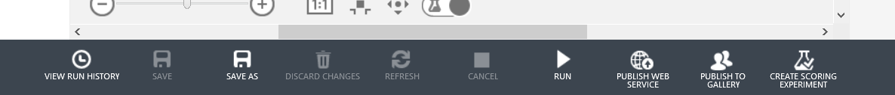
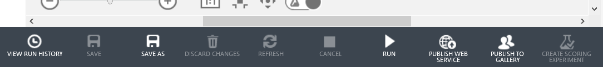
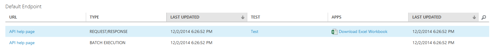
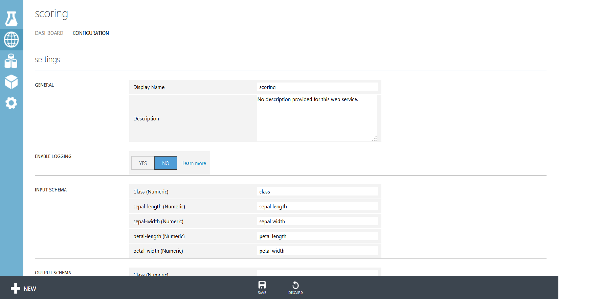

<properties 
	pageTitle="Publish a Machine Learning web service | Azure" 
	description="How to convert a training experiment to a scoring experiment, prepare it for publishing, then publish it as an Azure Machine Learning web service." 
	services="machine-learning" 
	documentationCenter="" 
	authors="garyericson" 
	manager="paulettm" 
	editor="cgronlun"/>

<tags 
	ms.service="machine-learning" 
	ms.workload="data-services" 
	ms.tgt_pltfrm="na" 
	ms.devlang="na" 
	ms.topic="article" 
	ms.date="03/04/2015" 
	ms.author="garye"/>

#Publish an Azure Machine Learning web service

Azure Machine Learning enables you to build, test, and deploy predictive analytics solutions. 

From a high-level point-of-view, this is done in three steps:

- **[Create a training experiment]** - Azure Machine Learning Studio is a collaborative visual development environment that you use to train and test a predictive analytics model using training data that you supply.
- **[Convert it to a scoring experiment]** - Once your model has been trained with existing data and you're ready to use it to score new data, you prepare and streamline your experiment for scoring.
- **[Publish it as a web service]** - With just a click, you can publish your scoring experiment as an Azure web service. Users can send data to your model and receive your model's predictions.

[AZURE.INCLUDE [machine-learning-free-trial](../includes/machine-learning-free-trial.md)]

Once you've published the web service, you can:

- **[Access]** it through the web service API
- **[Manage]** it through the Azure management portal, and
- **[Update]** it if your model changes

[Create a training experiment]: #create-a-training-experiment
[Convert it to a scoring experiment]: #convert-the-training-experiment-to-a-scoring-experiment
[Publish it as a web service]: #publish-the-scoring-experiment-as-a-web-service
[Access]: #access-the-web-service
[Manage]: #manage-the-web-service-in-the-azure-management-portal
[Update]: #update-the-web-service

##Create a training experiment

To train a predictive analytics model, you use Azure Machine Learning Studio to create a training experiment where you include various modules to load training data, prepare the data as necessary, apply machine learning algorithms, and evaluate the results. You can iterate on an experiment and try different machine learning algorithms to compare and evaluate the results. 

The process of creating and managing training experiments is covered more thoroughly elsewhere - see these articles for more information and examples:

- [Create a simple experiment in Azure Machine Learning Studio](machine-learning-create-experiment.md)
- [Develop a predictive solution with Azure Machine Learning](machine-learning-walkthrough-develop-predictive-solution.md)
- [Import your training data into Azure Machine Learning Studio](machine-learning-import-data.md)
- [Manage experiment iterations in Azure Machine Learning Studio](machine-learning-manage-experiment-iterations.md)

##Convert the training experiment to a scoring experiment

Once you've trained your model, you're ready to use it to score new data. To do this, you convert your training experiment into a scoring experiment. 
By converting to a scoring experiment, you're getting your trained model ready to be published as a scoring web service. Users of the web service will send input data to your model and your model will send back the prediction results. So as you convert to a scoring experiment you will want to keep in mind how you expect your model to be used by others.

For more details on how to do this conversion, see [Convert a Machine Learning training experiment to a scoring experiment](machine-learning-convert-training-experiment-to-scoring-experiment.md)

##Publish the scoring experiment as a web service

Now that the scoring experiment has been sufficiently prepared, you can publish it as an Azure web service. Using the web service, users can send data to your model and the model will return its predictions.

To publish your scoring experiment, click **Run** at the bottom of the experiment canvas, then click **PUBLISH WEB SERVICE**. The web service is set up and you are placed in the web service dashboard.

To test the web service, click the **Test** link in the **DASHBOARD** tab. A dialog pops up to ask you for the input data for the service. These are the columns expected by the scoring experiment. Enter a set of data and then click **OK**. The results generated by the web service are displayed at the bottom of the dashboard.

On the **CONFIGURATION** tab you can change the display name of the service and give it a description. The name and description is displayed in the Azure Management Portal where you manage your web services.
You can also enable logging to diagnose any failures that you're seeing when hitting your web service. For more information, see [Enable logging for Machine Learning web services](machine-learning-web-services-logging.md).

You can also provide a description for your input data, output data, and web service parameters by providing entering a string for each column under **INPUT SCHEMA**, **OUTPUT SCHEMA**, and **WEB SERVICE PARAMETER**. These descriptions are used in the sample code documentation provided for the web service.

##Access the web service

Once you publish your web service from Machine Learning Studio, you can send data to the service and receive responses programmatically.

The dashboard provides all the information you need to access your web service. For example, the API key is provided to allow authorized access to the service, and API help pages are provided to help you get started writing your code.

For more information about accessing a Machine Learning web service, see [How to consume a published Azure Machine Learning web service](machine-learning-consume-web-services.md).

##Manage the web service in the Azure Management Portal

In the Azure Management Portal, you can manage your web services by clicking the **Machine Learning** service, opening your Machine Learning workspace, and then opening the web service from the **WEB SERVICES** tab. From this page you can monitor the web service, update it, and delete it. You can also add a second endpoint for your web service in addition to the default endpoint that is created when you publish it.

For more information, see [Manage an Azure Machine Learning workspace](machine-learning-manage-workspace.md).
<!-- When this article gets published, fix the link and uncomment
For more information on how to manage Azure Machine Learning web service endpoints using the REST API, see **Azure machine learning web service endpoints**. 
-->

##Update the web service

You can make changes to your web service, such as updating the model with additional training data, and publish it again, overwriting the original web service.

To update the web service, open the original scoring experiment you used to publish the original web service and make an editable copy by clicking **SAVE AS**. Make your changes and then click **PUBLISH WEB SERVICE**. Because you've published this experiment before, Machine Learning Studio prompts you to ask if you want to overwrite the existing service. If you click **YES**, then the existing web service is stopped and the new scoring experiment is published in its place.

> [AZURE.NOTE] If you made configuration changes in the original web service, for example, entering a new display name or description, you will need to enter those values again.

