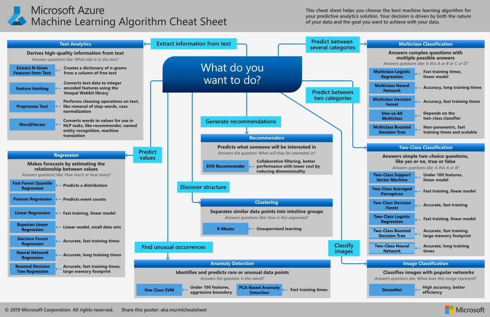

# Machine Learning Algorithm Cheat Sheet for Azure Machine Learning designer

The **Azure Machine Learning Algorithm Cheat Sheet** helps you choose the right algorithm from the designer for a predictive analytics model.

Azure Machine Learning has a large library of algorithms from the ***classification***, ***recommender systems***, ***clustering***, ***anomaly detection***, ***regression***, and ***text analytics*** families. Each is designed to address a different type of machine learning problem.

For additional guidance, see [How to select algorithms](how-to-select-algorithms.md)

## Download: Machine Learning Algorithm Cheat Sheet

**Download the cheat sheet here: [Machine Learning Algorithm Cheat Sheet (11x17 in.)](https://download.microsoft.com/download/3/5/b/35bb997f-a8c7-485d-8c56-19444dafd757/azure-machine-learning-algorithm-cheat-sheet-nov2019.pdf?WT.mc_id=docs-article-lazzeri)**

Download and print the Machine Learning Algorithm Cheat Sheet in tabloid size to keep it handy and get help choosing an algorithm.

## How to use the Machine Learning Algorithm Cheat Sheet

The suggestions offered in this algorithm cheat sheet are approximate rules-of-thumb. Some can be bent, and some can be flagrantly violated. This cheat sheet is intended to suggest a starting point. Don’t be afraid to run a head-to-head competition between several algorithms on your data. There is simply no substitute for understanding the principles of each algorithm and the system that generated your data.

Every machine learning algorithm has its own style or inductive bias. For a specific problem, several algorithms may be appropriate, and one algorithm may be a better fit than others. But it's not always possible to know beforehand which is the best fit. In cases like these, several algorithms are listed together in the cheat sheet. An appropriate strategy would be to try one algorithm, and if the results are not yet satisfactory, try the others. 

To learn more about the algorithms in Azure Machine Learning designer, go to the [Algorithm and module reference](algorithm-module-reference/module-reference.md).

## Kinds of machine learning

There are three main categories of machine learning: *supervised learning*, *unsupervised learning*, and *reinforcement learning*.

### Supervised learning

In supervised learning, each data point is labeled or associated with a category or value of interest. An example of a categorical label is assigning an image as either a ‘cat’ or a ‘dog’. An example of a value label is the sale price associated with a used car. The goal of supervised learning is to study many labeled examples like these, and then to be able to make predictions about future data points. For example, identifying new photos with the correct animal or assigning accurate sale prices to other used cars. This is a popular and useful type of machine learning.

### Unsupervised learning

In unsupervised learning, data points have no labels associated with them. Instead, the goal of an unsupervised learning algorithm is to organize the data in some way or to describe its structure. Unsupervised learning groups data into clusters, as K-means does, or finds different ways of looking at complex data so that it appears simpler.

### Reinforcement learning

In reinforcement learning, the algorithm gets to choose an action in response to each data point. It is a common approach in robotics, where the set of sensor readings at one point in time is a data point, and the algorithm must choose the robot’s next action. It's also a natural fit for Internet of Things applications. The learning algorithm also receives a reward signal a short time later, indicating how good the decision was. Based on this signal, the algorithm modifies its strategy in order to achieve the highest reward. 

## Next steps

* See additional guidance on [How to select algorithms](how-to-select-algorithms.md)

* [Learn about studio in Azure Machine Learning and the Azure portal](overview-what-is-azure-ml.md).

* [Tutorial: Build a prediction model in Azure Machine Learning designer](tutorial-designer-automobile-price-train-score.md).

* [Learn about deep learning vs. machine learning](concept-deep-learning-vs-machine-learning.md).
