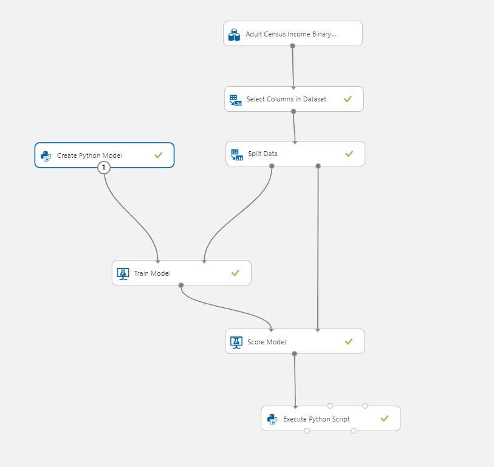

# Create Python Model

This article describes how to use the **Create Python Model** module to create an untrained model from a Python script. 

You can base the model on any learner that is included in an Python package in the Azure Machine Learning environment. 

After you create the model, you can use [Train Model](train-model.md) to train the model on a dataset, like any other learner in Azure Machine Learning. The trained model can be passed to [Score Model](score-model.md) to use the model to make predictions. The trained model can then be saved, and the scoring workflow can be published as a web service.

> [!WARNING]
> Currently it is not possible to pass the scored results of a Python model to [Evaluate Model](evaluate-model.md). If you need to evaluate a model, you can write custom Python script and run it using the [Execute Python Script](execute-python-script.md) module.  


## How to configure Create Python Model

Use of this module requires intermediate or expert knowledge of Python. The module supports use of any learner that is included in the Python packages already installed in Azure Machine Learning. See pre-installed Python package list in [Execute Python Script](execute-python-script.md).
  

This article will show how to use the **Create Python Model** with a simple experiment. Below is the graph of the experiment.



1.  Click **Create Python Model**, edit the script to implement your modelling or data management process. You can base the model on any learner that is included in a Python package in the Azure Machine Learning environment.


    Below is a sample code of two-class Naive Bayes classifier by using the popular *sklearn* package.

```Python

# The script MUST define a class named AzureMLModel.
# This class MUST at least define the following three methods:
    # __init__: in which self.model must be assigned,
    # train: which trains self.model, the two input arguments must be pandas DataFrame,
    # predict: which generates prediction result, the input argument and the prediction result MUST be pandas DataFrame.
# The signatures (method names and argument names) of all these methods MUST be exactly the same as the following example.


import pandas as pd
from sklearn.naive_bayes import GaussianNB


class AzureMLModel:
    def __init__(self):
        self.model = GaussianNB()
        self.feature_column_names = list()

    def train(self, df_train, df_label):
        self.feature_column_names = df_train.columns.tolist()
        self.model.fit(df_train, df_label)

    def predict(self, df):
        return pd.DataFrame(
            {'Scored Labels': self.model.predict(df[self.feature_column_names]), 
             'probabilities': self.model.predict_proba(df[self.feature_column_names])[:, 1]}
        )


```


2. Connect the **Create Python Model** module you just created to a **Train Model** and  **Score Model**

3. If you need to evaluate the model, add a [Execute Python Script](execute-python-script.md) and edit the Python script to implement evaluation.

Below is sample evaluation code.

```Python


# The script MUST contain a function named azureml_main
# which is the entry point for this module.

# imports up here can be used to 
import pandas as pd

# The entry point function can contain up to two input arguments:
#   Param<dataframe1>: a pandas.DataFrame
#   Param<dataframe2>: a pandas.DataFrame
def azureml_main(dataframe1 = None, dataframe2 = None):
    
    from sklearn.metrics import accuracy_score, precision_score, recall_score, roc_auc_score, roc_curve
    import pandas as pd
    import numpy as np
    
    scores = dataframe1.ix[:, ("income", "Scored Labels", "probabilities")]
    ytrue = np.array([0 if val == '<=50K' else 1 for val in scores["income"]])
    ypred = np.array([0 if val == '<=50K' else 1 for val in scores["Scored Labels"]])    
    probabilities = scores["probabilities"]
    
    accuracy, precision, recall, auc = \
    accuracy_score(ytrue, ypred),\
    precision_score(ytrue, ypred),\
    recall_score(ytrue, ypred),\
    roc_auc_score(ytrue, probabilities)
    
    metrics = pd.DataFrame();
    metrics["Metric"] = ["Accuracy", "Precision", "Recall", "AUC"];
    metrics["Value"] = [accuracy, precision, recall, auc]
    
    return metrics,

```
