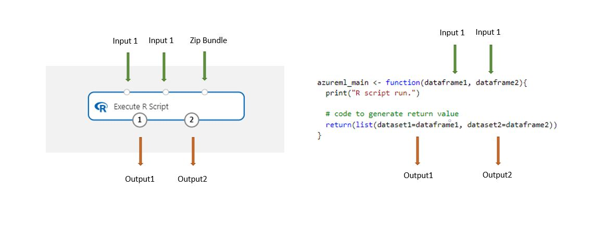

# Execute R Script

This article describes how to use the **Execute R Script** module to run R code in your Azure Machine Learning designer (preview) pipeline.

With R, you can perform tasks that aren't currently supported by existing modules such as: 
- Create custom data transformations
- Use your own metrics to evaluate predictions
- Build models using algorithms that aren't implemented as standalone modules in the designer

## R version support

Azure Machine Learning designer uses the CRAN (Comprehensive R Archive Network) distribution of R. The currently used version is CRAN 3.5.1.

## Supported R packages

The R environment is pre-installed with over 100 packages. For a complete list, see the section [Pre-installed R packages](#pre-installed-r-packages).

You can also add the following code to any **Execute R Script** module and to see the installed packages.

```R
azureml_main <- function(dataframe1, dataframe2){
  print("R script run.")
  dataframe1 <- data.frame(installed.packages())
  return(list(dataset1=dataframe1, dataset2=dataframe2))
}
```

## Installing R packages
To install additional R packages, use the `install.packages()` method. Be sure to specify the CRAN repository. Packages are installed for each **Execute R Script** module, and aren't shared across other **Execute R Script** modules.

This sample shows how to install Zoo:
```R
# R version: 3.5.1
# The script MUST contain a function named azureml_main
# which is the entry point for this module.

# The entry point function can contain up to two input arguments:
#   Param<dataframe1>: a R DataFrame
#   Param<dataframe2>: a R DataFrame
azureml_main <- function(dataframe1, dataframe2){
  print("R script run.")
  
  if(!require(zoo)) install.packages("zoo",repos = "http://cran.us.r-project.org")
  library(zoo)
  # Return datasets as a Named List
  return(list(dataset1=dataframe1, dataset2=dataframe2))
}
```
 > [!NOTE]
  > Please check if the package already exists before install it to avoid repeat installing. Like `  if(!require(zoo)) install.packages("zoo",repos = "http://cran.us.r-project.org")`  in above sample code. Repeat installing may cause web service request timeout.     

## How to configure Execute R Script

The **Execute R Script** module contains sample code that you can use as a starting point. To configure the **Execute R Script** module, provide a set of inputs and code to execute.



Datasets stored in the designer are automatically converted to an R data frame when loaded with this module.

1.  Add the **Execute R Script** module to your pipeline.

  

1. Connect any inputs needed by the script. Inputs are optional and can include data and additional R code.

    * **Dataset1**: Reference the first input as `dataframe1`. The input dataset must be formatted as a CSV, TSV, ARFF, or you can connect an Azure Machine Learning dataset.

    * **Dataset2**: Reference the second input as `dataframe2`. This dataset also must be formatted as a CSV, TSV, ARFF file, or as an Azure Machine Learning dataset.

    * **Script Bundle**: The third input accepts ZIP files. The zipped file can contain multiple files and multiple file types.

1. In the **R script** text box, type or paste valid R script.

    To help you get started, the **R Script** text box is pre-populated with sample code, which you can edit or replace.
    
```R
# R version: 3.5.1
# The script MUST contain a function named azureml_main
# which is the entry point for this module.

# The entry point function can contain up to two input arguments:
#   Param<dataframe1>: a R DataFrame
#   Param<dataframe2>: a R DataFrame
azureml_main <- function(dataframe1, dataframe2){
  print("R script run.")

  # If a zip file is connected to the third input port, it is
  # unzipped under "./Script Bundle". This directory is added
  # to sys.path.

  # Return datasets as a Named List
  return(list(dataset1=dataframe1, dataset2=dataframe2))
}
```

 * The script must contain a function named `azureml_main`, which is the entry point for this module.

 * The entry point function can contain up to two input arguments: `Param<dataframe1>` and `Param<dataframe2>`
 
   > [!NOTE]
    > The data passed to the **Execute R Script** module is referenced as `dataframe1` and `dataframe2`, which is different from Azure Machine Learning designer (the designer reference as `dataset1`, `dataset2`). Please check to make sure input data is referneced correctly in your script.  
 
    > [!NOTE]
    >  Existing R code may need minor changes to run in a designer pipeline. For example, input data that you provide in CSV format should be explicitly converted to a dataset before you can use it in your code. Data and column types used in the R language also differ in some ways from the data and column types used in the designer.

1.  **Random Seed**: Type a value to use inside the R environment as the random seed value. This parameter is equivalent to calling `set.seed(value)` in R code.  

1. Run the pipeline.  

## Results

The **Execute R Script** modules can return multiple outputs, but they must be provided as R data frames. Data frames are automatically converted to datasets in the designer for compatibility with other modules.

Standard messages and errors from R are returned to the module's log.

## Sample scripts

There are many ways that you can extend your pipeline by using custom R script.  This section provides sample code for common tasks.


### Add R script as an input

The **Execute R Script** module supports arbitrary R script files as inputs. To do so, they must be uploaded to your workspace as part of the ZIP file.

1. To upload a ZIP file containing R code to your workspace, click **New**, click **Dataset**, and then select **From local file** and the **Zip file** option.  

1. Verify that the zipped file is available in the **Saved Datasets** list.

1.  Connect the dataset to the **Script Bundle** input port.

1. All files that are contained in the ZIP file are available during pipeline run time. 

    If the script bundle file contained a directory structure, the structure is preserved. However, you must alter your code to prepend the directory **./Script Bundle** to the path.

### Process data

The following sample shows how to scale and normalize input data:

```R
# R version: 3.5.1
# The script MUST contain a function named azureml_main
# which is the entry point for this module.
# The entry point function can contain up to two input arguments:
#   Param<dataframe1>: a R DataFrame
#   Param<dataframe2>: a R DataFrame
azureml_main <- function(dataframe1, dataframe2){
  print("R script run.")
  # If a zip file is connected to the third input port, it is
  # unzipped under "./Script Bundle". This directory is added
  # to sys.path.
  series <- dataframe1$width
  # find the maximum and minimum values of width column in dataframe1
  max_v <- max(series)
  min_v <- min(series)
  # calculate the scale and bias
  scale <- max_v - min_v
  bias <- min_v / dis
  # apply min-max normalizing
  dataframe1$width <- dataframe1$width / scale - bias
  dataframe2$width <- dataframe2$width / scale - bias
  # Return datasets as a Named List
  return(list(dataset1=dataframe1, dataset2=dataframe2))
}
 ```

### Read a ZIP file as input

This sample shows how to use a dataset in a ZIP file as an input to the **Execute R Script** module.

1. Create the data file in CSV format, and name it “mydatafile.csv”.
1. Create a ZIP file and add the CSV file to the archive.
1. Upload the zipped file to your Azure Machine Learning workspace. 
1. Connect the resulting dataset to the **ScriptBundle** input of your **Execute R Script** module.
1. Using the following code to read the CSV data from the zipped file.

```R
azureml_main <- function(dataframe1, dataframe2){
  print("R script run.")
  mydataset<-read.csv("./Script Bundle/mydatafile.csv",encoding="UTF-8");  
  # Return datasets as a Named List
  return(list(dataset1=mydataset, dataset2=dataframe2))
}
```

### Replicate rows

This sample shows how to replicate positive records in a dataset to balance the sample:

```R
azureml_main <- function(dataframe1, dataframe2){
  data.set <- dataframe1[dataframe1[,1]==-1,]  
  # positions of the positive samples
  pos <- dataframe1[dataframe1[,1]==1,]
  # replicate the positive samples to balance the sample  
  for (i in 1:20) data.set <- rbind(data.set,pos)  
  row.names(data.set) <- NULL
  # Return datasets as a Named List
  return(list(dataset1=data.set, dataset2=dataframe2))
}
```

### Pass R objects between Execute R Script modules

You can pass R objects between instances of the **Execute R Script** module by using the internal serialization mechanism. This example assumes that you want to move the R object named `A` between two **Execute R Script** modules.

1. Add the first **Execute R Script** module to your pipeline, and type the following code in the **R Script** text box to create a serialized object `A` as a column in the module’s output Data Table:  
  
    ```R
    azureml_main <- function(dataframe1, dataframe2){
      print("R script run.")
      # some codes generated A
      
      serialized <- as.integer(serialize(A,NULL))  
      data.set <- data.frame(serialized,stringsAsFactors=FALSE)

      return(list(dataset1=data.set, dataset2=dataframe2))
    }
    ```

    The explicit conversion to integer type is done because the serialization function outputs data in the R `Raw` format, which isn't supported by the designer.

1. Add a second instance of the **Execute R Script** module, and connect it to the output port of the previous module.

1. Type the following code in the **R Script** text box to extract object `A` from the input Data Table. 

    ```R
    azureml_main <- function(dataframe1, dataframe2){
      print("R script run.")
      A <- unserialize(as.raw(dataframe1$serialized))  
      # Return datasets as a Named List
      return(list(dataset1=dataframe1, dataset2=dataframe2))
    }
    ```

## Pre-installed R Packages

The current list of pre-installed R Packages available to use:

|              |            | 
|--------------|------------| 
| Package      | Version    | 
| askpass      | 1.1        | 
| assertthat   | 0.2.1      | 
| backports    | 1.1.4      | 
| base         | 3.5.1      | 
| base64enc    | 0.1-3      | 
| BH           | 1.69.0-1   | 
| bindr        | 0.1.1      | 
| bindrcpp     | 0.2.2      | 
| bitops       | 1.0-6      | 
| boot         | 1.3-22     | 
| broom        | 0.5.2      | 
| callr        | 3.2.0      | 
| caret        | 6.0-84     | 
| caTools      | 1.17.1.2   | 
| cellranger   | 1.1.0      | 
| class        | 7.3-15     | 
| cli          | 1.1.0      | 
| clipr        | 0.6.0      | 
| cluster      | 2.0.7-1    | 
| codetools    | 0.2-16     | 
| colorspace   | 1.4-1      | 
| compiler     | 3.5.1      | 
| crayon       | 1.3.4      | 
| curl         | 3.3        | 
| data.table   | 1.12.2     | 
| datasets     | 3.5.1      | 
| DBI          | 1.0.0      | 
| dbplyr       | 1.4.1      | 
| digest       | 0.6.19     | 
| dplyr        | 0.7.6      | 
| e1071        | 1.7-2      | 
| evaluate     | 0.14       | 
| fansi        | 0.4.0      | 
| forcats      | 0.3.0      | 
| foreach      | 1.4.4      | 
| foreign      | 0.8-71     | 
| fs           | 1.3.1      | 
| gdata        | 2.18.0     | 
| generics     | 0.0.2      | 
| ggplot2      | 3.2.0      | 
| glmnet       | 2.0-18     | 
| glue         | 1.3.1      | 
| gower        | 0.2.1      | 
| gplots       | 3.0.1.1    | 
| graphics     | 3.5.1      | 
| grDevices    | 3.5.1      | 
| grid         | 3.5.1      | 
| gtable       | 0.3.0      | 
| gtools       | 3.8.1      | 
| haven        | 2.1.0      | 
| highr        | 0.8        | 
| hms          | 0.4.2      | 
| htmltools    | 0.3.6      | 
| httr         | 1.4.0      | 
| ipred        | 0.9-9      | 
| iterators    | 1.0.10     | 
| jsonlite     | 1.6        | 
| KernSmooth   | 2.23-15    | 
| knitr        | 1.23       | 
| labeling     | 0.3        | 
| lattice      | 0.20-38    | 
| lava         | 1.6.5      | 
| lazyeval     | 0.2.2      | 
| lubridate    | 1.7.4      | 
| magrittr     | 1.5        | 
| markdown     | 1          | 
| MASS         | 7.3-51.4   | 
| Matrix       | 1.2-17     | 
| methods      | 3.5.1      | 
| mgcv         | 1.8-28     | 
| mime         | 0.7        | 
| ModelMetrics | 1.2.2      | 
| modelr       | 0.1.4      | 
| munsell      | 0.5.0      | 
| nlme         | 3.1-140    | 
| nnet         | 7.3-12     | 
| numDeriv     | 2016.8-1.1 | 
| openssl      | 1.4        | 
| parallel     | 3.5.1      | 
| pillar       | 1.4.1      | 
| pkgconfig    | 2.0.2      | 
| plogr        | 0.2.0      | 
| plyr         | 1.8.4      | 
| prettyunits  | 1.0.2      | 
| processx     | 3.3.1      | 
| prodlim      | 2018.04.18 | 
| progress     | 1.2.2      | 
| ps           | 1.3.0      | 
| purrr        | 0.3.2      | 
| quadprog     | 1.5-7      | 
| quantmod     | 0.4-15     | 
| R6           | 2.4.0      | 
| randomForest | 4.6-14     | 
| RColorBrewer | 1.1-2      | 
| Rcpp         | 1.0.1      | 
| RcppRoll     | 0.3.0      | 
| readr        | 1.3.1      | 
| readxl       | 1.3.1      | 
| recipes      | 0.1.5      | 
| rematch      | 1.0.1      | 
| reprex       | 0.3.0      | 
| reshape2     | 1.4.3      | 
| reticulate   | 1.12       | 
| rlang        | 0.4.0      | 
| rmarkdown    | 1.13       | 
| ROCR         | 1.0-7      | 
| rpart        | 4.1-15     | 
| rstudioapi   | 0.1        | 
| rvest        | 0.3.4      | 
| scales       | 1.0.0      | 
| selectr      | 0.4-1      | 
| spatial      | 7.3-11     | 
| splines      | 3.5.1      | 
| SQUAREM      | 2017.10-1  | 
| stats        | 3.5.1      | 
| stats4       | 3.5.1      | 
| stringi      | 1.4.3      | 
| stringr      | 1.3.1      | 
| survival     | 2.44-1.1   | 
| sys          | 3.2        | 
| tcltk        | 3.5.1      | 
| tibble       | 2.1.3      | 
| tidyr        | 0.8.3      | 
| tidyselect   | 0.2.5      | 
| tidyverse    | 1.2.1      | 
| timeDate     | 3043.102   | 
| tinytex      | 0.13       | 
| tools        | 3.5.1      | 
| tseries      | 0.10-47    | 
| TTR          | 0.23-4     | 
| utf8         | 1.1.4      | 
| utils        | 3.5.1      | 
| vctrs        | 0.1.0      | 
| viridisLite  | 0.3.0      | 
| whisker      | 0.3-2      | 
| withr        | 2.1.2      | 
| xfun         | 0.8        | 
| xml2         | 1.2.0      | 
| xts          | 0.11-2     | 
| yaml         | 2.2.0      | 
| zeallot      | 0.1.0      | 
| zoo          | 1.8-6      | 

## Next steps

See the [set of modules available](module-reference.md) to Azure Machine Learning. 
