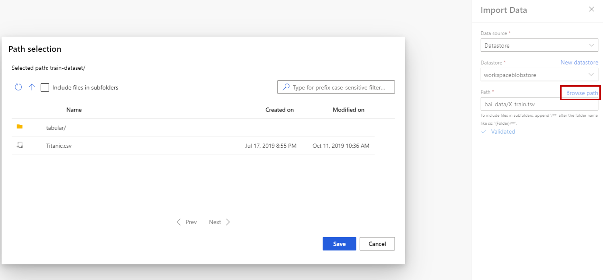
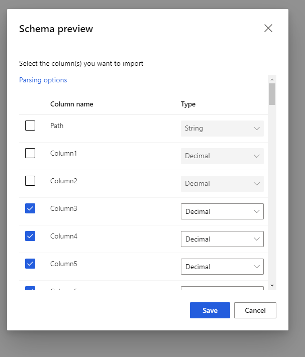

# Import Data module

This article describes a module in Azure Machine Learning designer.

Use this module to load data into a machine learning pipeline from existing cloud data services. 

> [!Note]
> All functionality provided by this module can be done by **datastore** and **datasets** in the worksapce landing page. We recommend you use **datastore** and **dataset** which includes additional features like data monitoring. To learn more, see [How to Access Data](../how-to-access-data.md) and [How to Register Datasets](../how-to-create-register-datasets.md) article.
>  After you register a dataset, you can find it in the **Datasets** -> **My Datasets** category in designer interface. This module is reserved for Studio(classic) users to for a familiar experience. 
>

The **Import Data** module support read data from following sources:

- URL via HTTP
- Azure cloud storages through [**Datastores**](../how-to-access-data.md))
    - Azure Blob Container
    - Azure File Share
    - Azure Data Lake
    - Azure Data Lake Gen2
    - Azure SQL Database
    - Azure PostgreSQL    

Before using cloud storage, you need to register a datastore in your Azure Machine Learning workspace first. For more information, see [How to Access Data](../how-to-access-data.md). 

After you define the data you want and connect to the source, **[Import Data](./import-data.md)** infers the data type of each column based on the values it contains, and loads the data into your designer pipeline. The output of **Import Data** is a dataset that can be used with any designer pipeline.

If your source data changes, you can refresh the dataset and add new data by rerunning [Import Data](./import-data.md). However, if you don't want to re-read from the source each time you run the pipeline, set the **Use cached results** option to TRUE. When this option is selected, the module checks whether the pipeline has run previously using the same source and same input options. If a previous run is found, the data in the cache is used, instead of reloading the data from the source.

## How to configure Import Data

1. Add the **Import Data** module to your pipeline. You can find this module in the **Data Input and Output** category in the designer.

1. Click **Launch Data Import Wizard** to configure the data source using a wizard.

    The wizard gets the account name and credentials, and help you configure other options. If you are editing an existing configuration, it loads the current values first.

1. Select **Data source**, and choose the data source type. It could be HTTP or datastore.

    If you choose datastore, you can select existing datastores that already registered to your Azure Machine Learning workspace or create a new datastore. Then define the path of data to import in the datastore. You can easily browse the path by click **Browse Path**
    

1. Select the preview schema to filter the columns you want to include. You can also define advanced settings like Delimiter in Parsing options.

    

1. Select the **Use cached results** option if you want to cache the dataset for reuse on successive runs.

    Assuming there have been no other changes to module parameters, the pipeline loads the data only the first time the module is run, and thereafter uses a cached version of the dataset.

    Deselect this option if you need to reload the data each time you run the pipeline.

1. Run the pipeline.

    When Import Data loads the data into the designer, it infers the data type of each column based on the values it contains, either numerical or categorical.

    If a header is present, the header is used to name the columns of the output dataset.

    If there are no existing column headers in the data, new column names are generated using the format col1, col2,… , coln*.

## Results

When import completes, click the output dataset and select **Visualize** to see if the data was imported successfully.

If you want to save the data for reuse, rather than importing a new set of data each time the pipeline is run, select the **Register dataset** icon under the **Outputs** tab in the right panel of the module. Choose a name for the dataset. The saved dataset preserves the data at the time of saving, the dataset is not updated when the pipeline is rerun, even if the dataset in the pipeline changes. This can be useful for taking snapshots of data.

After importing the data, it might need some additional preparations for modeling and analysis:

- Use [Edit Metadata](./edit-metadata.md) to change column names, to handle a column as a different data type, or to indicate that some columns are labels or features.

- Use [Select Columns in Dataset](./select-columns-in-dataset.md) to select a subset of columns to transform or use in modeling. The transformed or removed columns can easily be rejoined to the original dataset by using the [Add Columns](./add-columns.md) module.  

- Use [Partition and Sample](./partition-and-sample.md) to divide the dataset, perform sampling, or get the top n rows.

## Next steps

See the [set of modules available](module-reference.md) to Azure Machine Learning. 
