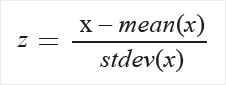
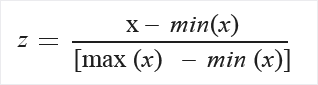

# Normalize Data module

This article describes a module in Azure Machine Learning designer (preview).

Use this module to transform a dataset through *normalization*.

Normalization is a technique often applied as part of data preparation for machine learning. The goal of normalization is to change the values of numeric columns in the dataset to use a common scale, without distorting differences in the ranges of values or losing information. Normalization is also required for some algorithms to model the data correctly.

For example, assume your input dataset contains one column with values ranging from 0 to 1, and another column with values ranging from 10,000 to 100,000. The great difference in the *scale* of the numbers could cause problems when you attempt to combine the values as features during modeling.

*Normalization* avoids these problems by creating new values that maintain the general distribution and ratios in the source data, while keeping values within a scale applied across all numeric columns used in the model.

This module offers several options for transforming numeric data:

- You can change all values to a 0-1 scale, or transform the values by representing them as percentile ranks rather than absolute values.
- You can apply normalization to a single column, or to multiple columns in the same dataset.
- If you need to repeat the pipeline, or apply the same normalization steps to other data, you can save the steps as a normalization transform, and apply it to other datasets that have the same schema.

> [!WARNING]
> Some algorithms require that data be normalized before training a model. Other algorithms perform their own data scaling or normalization. Therefore, when you choose a machine learning algorithm to use in building a predictive model, be sure to review the data requirements of the algorithm before applying normalization to the training data.

##  Configure Normalize Data

You can apply only one normalization method at a time using this module. Therefore, the same normalization method is applied to all columns that you select. To use different normalization methods, use a second instance of **Normalize Data**.

1. Add the **Normalize Data** module to your pipeline. You can find the module In Azure Machine Learning, under **Data Transformation**, in the **Scale and Reduce** category.

2. Connect a dataset that contains at least one column of all numbers.

3. Use the Column Selector to choose the numeric columns to normalize. If you don't choose individual columns, by default **all** numeric type columns in the input are included, and the same normalization process is applied to all selected columns. 

    This can lead to strange results if you include numeric columns that shouldn't be normalized! Always check the columns carefully.

    If no numeric columns are detected, check the column metadata to verify that the data type of the column is a supported numeric type.

    > [!TIP]
    > To ensure that columns of a specific type are provided as input, try using the [Select Columns in Dataset](./select-columns-in-dataset.md) module before **Normalize Data**.

4. **Use 0 for constant columns when checked**:  Select this option when any numeric column contains a single unchanging value. This ensures that such columns are not used in normalization operations.

5. From the **Transformation method** dropdown list, choose a single mathematical function to apply to all selected columns. 
  
    - **Zscore**: Converts all values to a z-score.
    
      The values in the column are transformed using the following formula:  
  
      
  
      Mean and standard deviation are computed for each column separately. Population standard deviation is used.
  
    - **MinMax**: The min-max normalizer linearly rescales every feature to the [0,1] interval.
    
      Rescaling to the [0,1] interval is done by shifting the values of each feature so that the minimal value is 0, and then dividing by the new maximal value (which is the difference between the original maximal and minimal values).
      
      The values in the column are transformed using the following formula:  
  
        
  
    - **Logistic**: The values in the column are transformed using the following formula:

        
  
    - **LogNormal**: This option converts all values to a lognormal scale.
  
      The values in the column are transformed using the following formula:
  
      
    
      Here μ and σ are the parameters of the distribution, computed empirically from the data as maximum likelihood estimates, for each column separately.  
  
    - **TanH**: All values are converted to a hyperbolic tangent.
    
      The values in the column are transformed using the following formula:
    
      

6. Run the pipeline, or double-click the **Normalize Data** module and select **Run Selected**. 

## Results

The **Normalize Data** module generates two outputs:

- To view the transformed values, right-click the module, and select **Visualize**.

    By default, values are transformed in place. If you want to compare the transformed values to the original values, use the [Add Columns](./add-columns.md) module to recombine the datasets and view the columns side by side.

- To save the transformation so that you can apply the same normalization method to another dataset, select the module, and select **Register dataset** under the **Outputs** tab in the right panel.

    You can then load the saved transformations from the **Transforms** group of the left navigation pane and apply it to a dataset with the same schema by using [./Apply Transformation](apply-transformation.md).  

## Next steps

See the [set of modules available](module-reference.md) to Azure Machine Learning. 