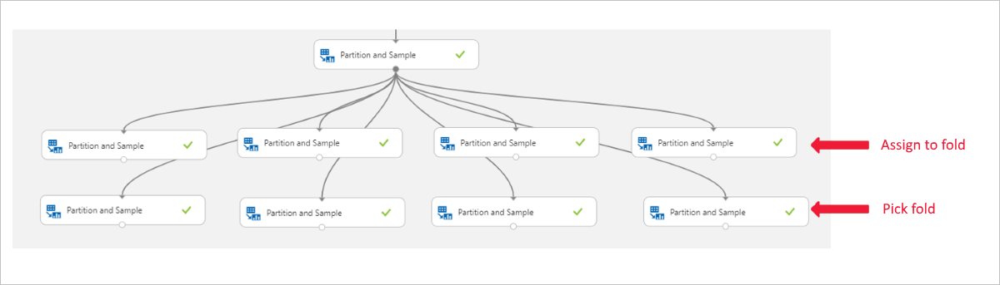

# Partition and Sample module

This article describes a module of the visual interface (preview) for Azure Machine Learning service.

Use this module to perform sampling on a dataset or to create partitions from your dataset.

Sampling is an important tool in machine learning because it lets you reduce the size of a dataset while maintaining the same ratio of values. This module supports several related tasks that are important in  machine learning: 

- Dividing your data into multiple subsections of the same size. 

    You might use the partitions for cross-validation, or to assign cases to random groups.

- Separating data into groups and then working with data from a specific group. 

    After randomly assigning cases to different groups, you might need to modify the features that are associated with only one group.

- Sampling. 

    You can extract a percentage of the data, apply random sampling, or choose a column to use for balancing the dataset and perform stratified sampling on its values.

- Creating a smaller dataset for testing. 

    If you have a lot of data, you might want to use only the first *n* rows while setting up the experiment, and then switch to using the full dataset when you build your model. You can also use sampling to create s smaller dataset for use in development.

## Configure Partition and Sample

This module supports multiple methods for dividing your data into partitions or for sampling. Choose the method first, and then set additional options required by the method.

- Head
- Sampling
- Assign to folds
- Pick fold

### Get TOP N rows from a dataset

Use this mode to get only the first *n* rows. This option is useful if you want to test an experiment on a small number of rows, and don't need the data to be balanced or sampled in any way.

1. Add the **Partition and Sample** module to your experiment in the interface, and connect the dataset.  

2. **Partition or sample mode**: Set this option to **Head**.

3. **Number of rows to select**: Type the number of rows to return.

    The number of rows you specify must be a non-negative integer. If the number of selected rows is larger than the number of rows in the dataset, the entire dataset is returned.

4. Run the experiment.

The module outputs a single dataset containing only the specified number of rows. The rows are always read from the top of the dataset.

### Create a sample of data

This option supports simple random sampling or stratified random sampling. This is useful if you want to create a smaller representative sample dataset for testing.

1. Add the **Partition and Sample** module to your experiment, and connect the dataset.

2. **Partition or sample mode**: Set this to  **Sampling**.

3. **Rate of sampling**: Type a value between 0 and 1. this value specifies the percentage of rows from the source dataset that should be included in the output dataset.

    For example, if you want only half of the original dataset, type `0.5` to indicate that the sampling rate should be 50%.

    The rows of the input dataset are shuffled and selectively put into the output dataset, according to the specified ratio.

4. **Random seed for sampling**: Optionally, type an integer to use as a seed value.

    This option is important if you want the rows to be divided the same way every time. The default value is 0, meaning that a starting seed is generated based on the system clock. This can lead to slightly different results each time you run the experiment.

5. **Stratified split for sampling**: Select this option if it is important that the rows in the dataset should be divided evenly by some key column before sampling.

    For **Stratification key column for sampling**, select a single *strata column* to use when dividing the dataset. The rows in the dataset are then divided as follows:

    1. All input rows are grouped (stratified) by the values in the specified strata column.

    2. Rows are shuffled within each group.

    3. Each group is selectively added to the output dataset to meet the specified ratio.

6. Run the experiment.

    With this option, the module outputs a single dataset that contains a representative sampling of the data. The remaining, unsampled portion of the dataset is not output. 

## Split data into partitions

Use this option when you want to divide the dataset into subsets of the data. This option is also useful when you want to create a custom number of folds for cross-validation, or to split rows into several groups.

1. Add the **Partition and Sample** module to your experiment, and connect the dataset.

2. For **Partition or sample mode**, select **Assign to Folds**.

3. **Use replacement in the partitioning**: Select this option if you want the sampled row to be put back into the pool of rows for potential reuse. As a result, the same row might be assigned to several folds.

    If you do not use replacement (the default option), the sampled row is not put back into the pool of rows for potential reuse. As a result, each row can be assigned to only one fold.

4. **Randomized split**:  Select this option if you want rows to be randomly assigned to folds.

    If you do not select this option, rows are assigned to folds using the round-robin method.

5. **Random seed**: Optionally, type an integer to use as the seed value. This option is important if you want the rows to be divided the same way every time. Otherwise, the default value of 0 means that a random starting seed will be used.

6. **Specify the partitioner method**: Indicate how you want data to be apportioned to each partition, using these options:

    - **Partition evenly**: Use this option to place an equal number of rows in each partition. To specify the number of output partitions, type a whole number in the **Specify number of folds to split evenly into** text box.

    - **Partition with customized proportions**: Use this option to specify the size of each partition as a comma-separated list.

        For example, if you want to create three partitions, with the first partition containing 50% of the data, and the remaining two partitions each containing 25% of the data, click the **List of proportions separated by comma** text box, and type these numbers: `.5, .25, .25`

        The sum of all partition sizes must add up to exactly 1.

        - If you enter numbers that add up to **less than 1**, an extra partition is created to hold the remaining rows. For example, if you type the values .2 and .3, a third partition is created that holds the remaining 50 percent of all rows.

        - If you enter numbers that add up to **more than 1**, an error is raised when you run the experiment.

7. **Stratified split**: Select this option if you want the rows to be stratified when split, and then choose the _strata column_.

8. Run the experiment.

    With this option, the module outputs multiple datasets, partitioned using the rules you specified.

### Use data from a predefined partition  

This option is used when you have divided a dataset into multiple partitions and now want to load each partition in turn for further analysis or processing.

1. Add the **Partition and Sample** module to the experiment.

2. Connect it to the output of a previous instance of **Partition and Sample**. That instance must have used the **Assign to Folds** option to generate some number of partitions.

3. **Partition or sample mode**: Select **Pick Fold**.

4. **Specify which fold to be sampled from**: Select a partition to use by typing its index. Partition indices are 1-based. For example, if you divided the dataset into three parts, the partitions would have the indices 1, 2, and 3.

    If you type an invalid index value, a design-time error is raised: "Error 0018: Dataset contains invalid data."

    In addition to grouping the dataset by folds, you can separate the dataset into two groups: a target fold, and everything else. To do this, type the index of a single fold, and then select the option, **Pick complement of the selected fold**, to get everything but the data in the specified fold.

5. If you are working with multiple partitions, you must add additional instances of the **Partition and Sample** module to handle each partition.

    For example, let's say previously partitioned patients into four folds using age. To work with each individual fold, you need four copies of the **Partition and Sample** module, and in each, you select a different fold, as shown below. It's not correct to use the **Assign to Folds** output directly.  

    

5. Run the experiment.

    With this option, the module outputs a single dataset containing only the rows assigned to that fold.

> [!NOTE]
>  You cannot view the fold designations directly; they are present only in the metadata.

## Next steps

See the [set of modules available](module-reference.md) to Azure Machine Learning service. 