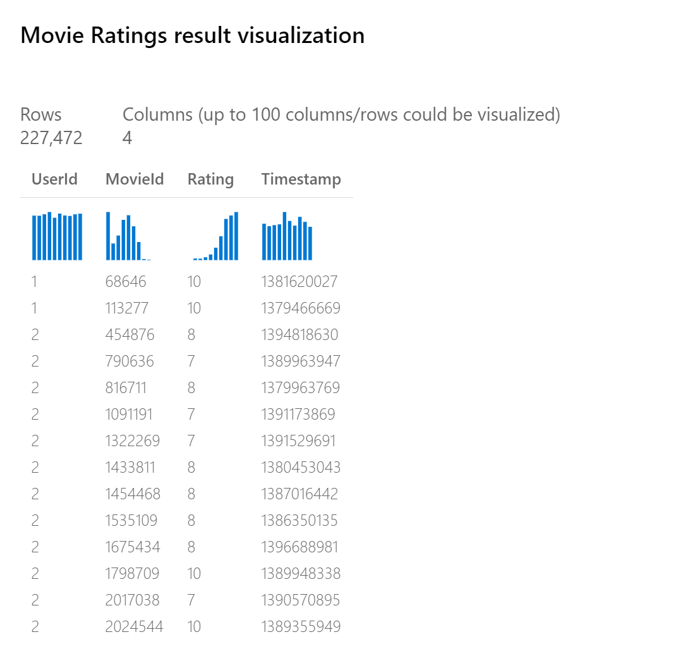

# Train SVD Recommender

This article describes how to use the Train SVD Recommender module in Azure Machine Learning designer (preview). Use this module to train a recommendation model based on the Single Value Decomposition (SVD) algorithm.  

The Train SVD Recommender module reads a dataset of user-item-rating triples. It returns a trained SVD recommender. You can then use the trained model to predict ratings or generate recommendations, by using the [Score SVD Recommender](score-svd-recommender.md) module.  

  
## More about recommendation models and the SVD recommender  

The main aim of a recommendation system is to recommend one or more *items* to *users* of the system. Examples of an item might be a movie, restaurant, book, or song. A user might be a person, a group of persons, or another entity with item preferences.  

There are two principal approaches to recommender systems: 

+ A **content-based** approach makes use of features for both users and items. Users can be described by properties such as age and gender. Items can be described by properties such as author and manufacturer. You can find typical examples of content-based recommendation systems on social matchmaking sites. 
+ **Collaborative filtering** uses only identifiers of the users and the items. It gets implicit information about these entities from a (sparse) matrix of ratings given by the users to the items. We can learn about a user from the items they've rated and from other users who have rated the same items.  

The SVD recommender uses identifiers of the users and the items, and a matrix of ratings given by the users to the items. It's a *collaborative recommender*. 

For more information about the SVD recommender, see the relevant research paper: [Matrix factorization techniques for recommender systems](https://datajobs.com/data-science-repo/Recommender-Systems-[Netflix].pdf).

## How to configure Train SVD Recommender  

### Prepare data

Before you use the module, your input data must be in the format that the recommendation model expects. A training data set of user-item-rating triples is required.

+ The first column contains user identifiers.
+ The second column contains item identifiers.
+ The third column contains the rating for the user-item pair. Rating values must be numeric type.  

The **Movie Ratings** dataset in Azure Machine Learning designer (select **Datasets** and then **Samples**) demonstrates the expected format:

From this sample, you can see that a single user has rated several movies. 

### Train the model

1.  Add the Train SVD Recommender module to your pipeline in the designer, and connect it to the training data.  
   
2.  For **Number of factors**, specify the number of factors to use with the recommender.  
    
    Each factor measures how much the user is relating with the item. The number of factors is also the dimensionality of latent factor space. With the number of users and items increasing, it's better to set a larger number of factors. But if the number is too large, performance might drop.
    
3.  **Number of recommendation algorithm iterations** indicates how many times the algorithm should process the input data. The higher this number is, the more accurate the predictions are. However, a higher number means slower training. The default value is 30.

4.  For **Learning rate**, enter a number between 0.0 and 2.0 that defines the step size for learning.

    The learning rate determines the size of the step at each iteration. If the step size is too large, you might overshoot the optimal solution. If the step size is too small, training takes longer to find the best solution. 
  
5.  Submit the pipeline.  

## Next steps

See the [set of modules available](module-reference.md) to Azure Machine Learning. 
