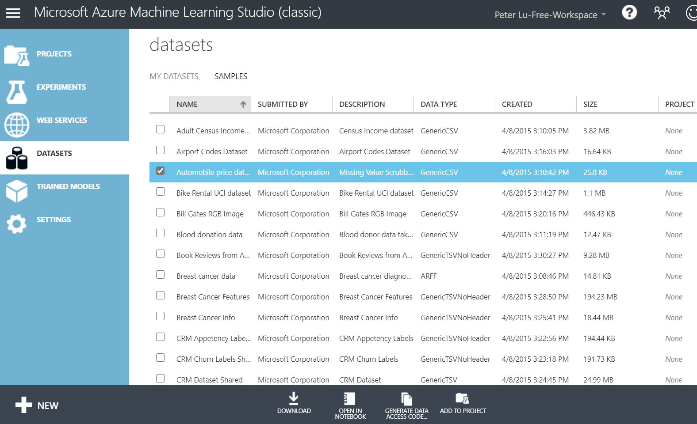
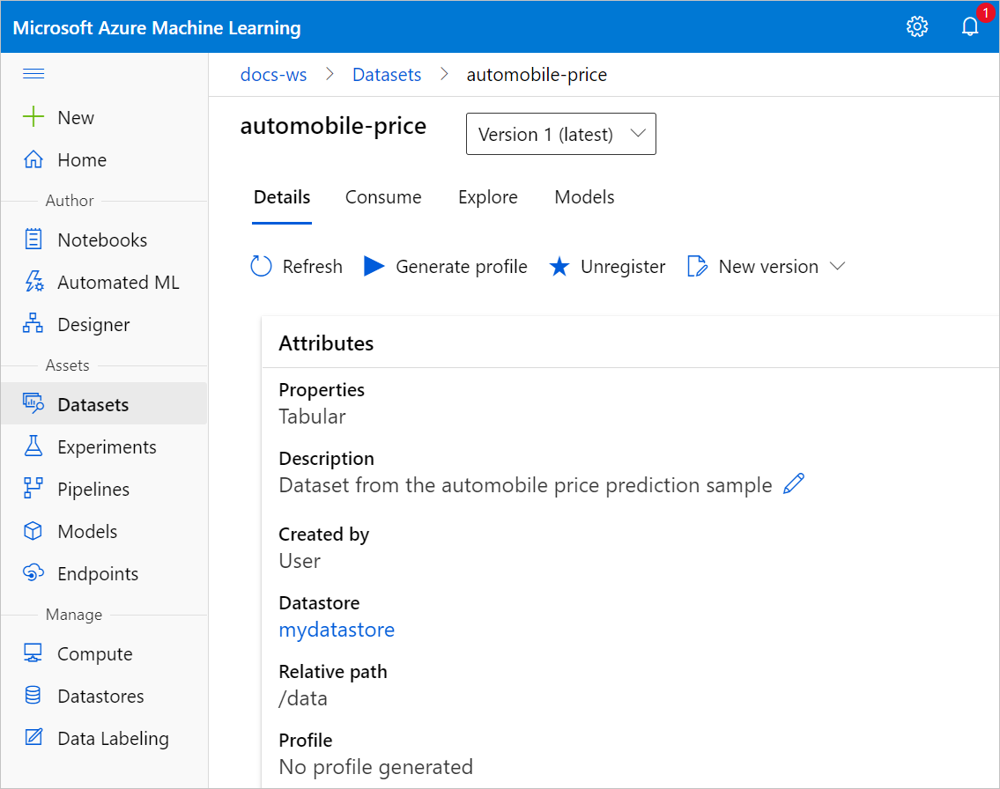
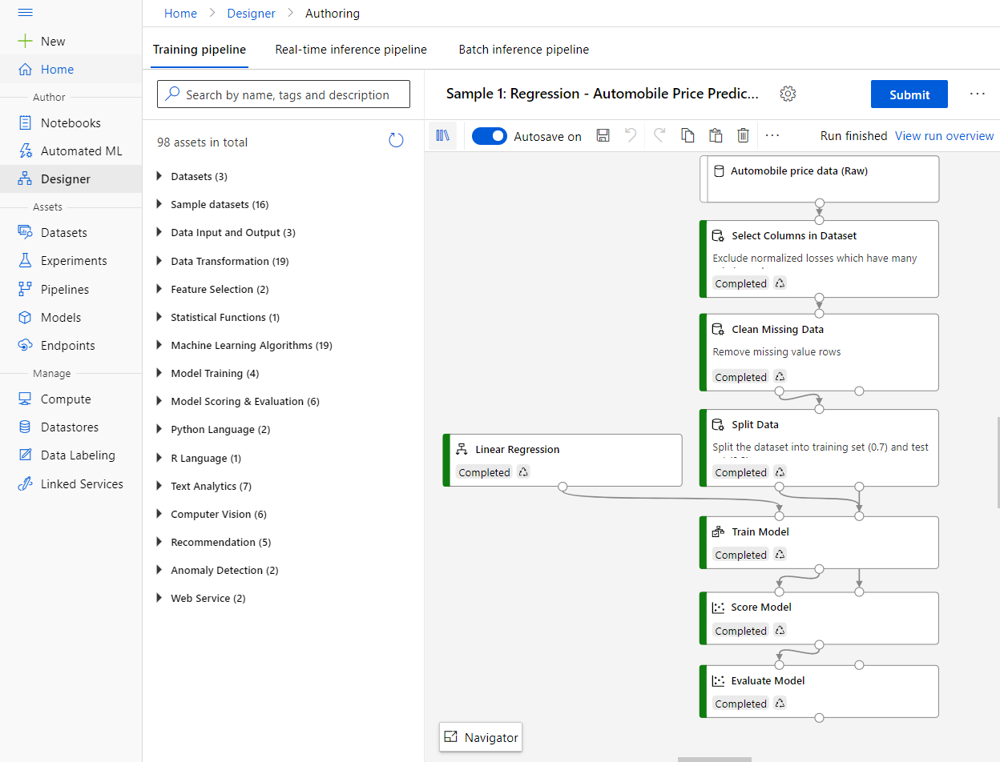
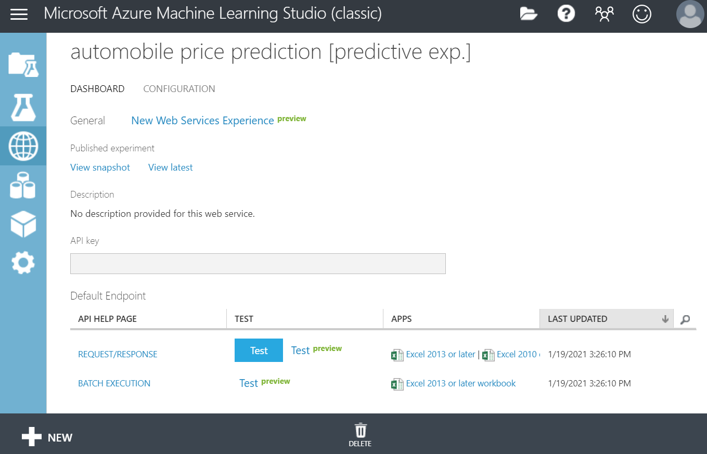
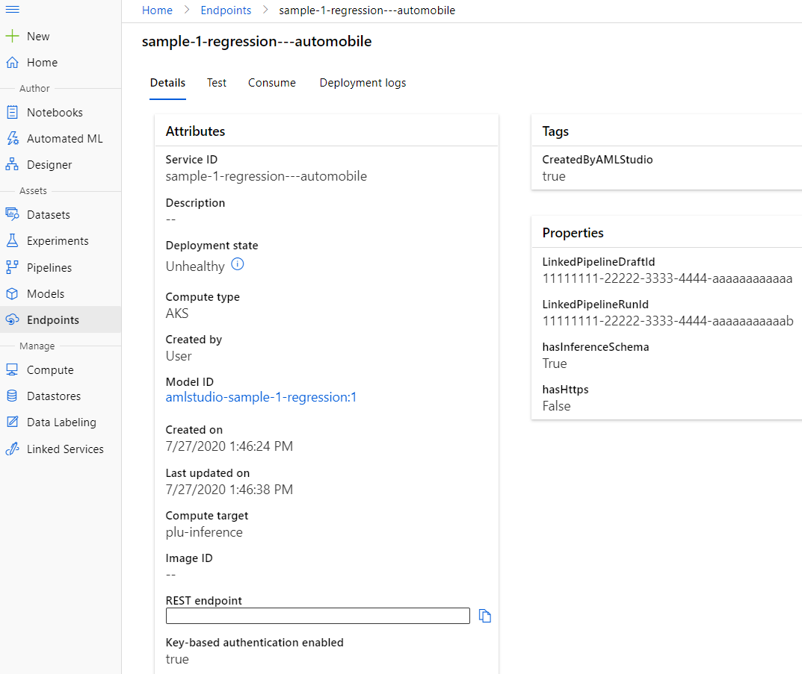

# Migrate to Azure Machine Learning from Studio (classic)

In this article, you learn how to migrate Studio (classic) assets to Azure Machine Learning. At this time, to migrate resources to Azure Machine Learning, you must manually rebuild your experiments.

Azure Machine Learning provides a modernized data science platform that combines no-code and code-first approaches. To learn more about the differences between Studio (classic) and Azure Machine Learning, see the  [Assess readiness](#step-1-assess-readiness) section.

## Recommended approach

To migrate from Studio (classic) to Azure Machine Learning, we recommend the following approach:

> [!div class="checklist"]
> * Step 1: Assess readiness
> * Step 2: Prepare to migrate
> * Step 3: Rebuild experiments and web services
> * Step 4: Integrate client apps

## Step 1: Assess readiness
1. Learn about [Azure Machine Learning](https://azure.microsoft.com/services/machine-learning/); it's benefits, costs, and architecture.
1. [Compare the capabilities](../overview-what-is-machine-learning-studio.md#ml-studio-classic-vs-azure-machine-learning-studio) of Azure Machine Learning and Studio (classic).
    
     Azure Machine Learning supports code-first development in addition to the drag-and-drop designer. For more information on the code-first development cycle, see [MLOps: Model management, deployment, and monitoring](../concept-model-management-and-deployment.md).

## Step 2: Prepare to migrate

1. Identify which data sets, models, and web services you want to migrate:
    
    Go your Studio (classic) workspace and take the opportunity to clean up resources that you no longer use, and identify which resources to migrate.

1. Determine the impact that a migration will have on your business.
    
    For example, can you afford any downtime while the migration takes place?

1. Create a migration plan.

## Step 3: Rebuild experiments and web services

1. [Create the Azure Machine Learning workspace](../how-to-manage-workspace.md#create-a-workspace) that want to migrate to.
1. Use the designer to [rebuild experiments](migrate-rebuild-experiment.md) and deploy [web services](migrate-rebuild-web-service.md) with drag-and-drop modules.

> [!NOTE]
> Azure Machine Learning also supports code-first workflows for [training](../how-to-setup-training-targets.md) and [deployment](../how-to-deploy-and-where.md).

## Step 4: Integrate client apps

1. Cut over any client applications to your new [Azure Machine Learning endpoints](migreate-rebuild-integrate-with-client-app.md).

## Example migration

The following experiment migration highlights some of the differences between Studio (classic) and Azure Machine Learning.

### Datasets

In Studio (classic), **datasets** were saved in your workspace and could only be used by Studio (classic).

In Azure Machine Learning, **datasets** are registered to the workspace and can be used across all of Azure Machine Learning. For more information on the benefits of Azure Machine Learning datasets, see [Secure data access](../concept-data.md#reference-data-in-storage-with-datasets).

### Pipeline

In Studio (classic), **experiments** contained the processing logic for your work. You created experiments with drag-and-drop modules.

In Azure Machine Learning, **pipelines** contain the processing logic for your work. You can create pipelines with either drag-and-drop modules or by writing code.

### Web service endpoint

In Studio (classic), the **REQUEST/RESPOND API** was used for real-time prediction. The **BATCH EXECUTION API** was used for batch prediction or retraining.

In Azure Machine Learning, **real-time endpoints** are used for real-time prediction. **Pipeline endpoints** are used for  batch prediction or retraining.

## Next steps

In this article, you learned the recommended plan for  detailed steps on how to migrate from Studio (classic) to Azure Machine Learning:

1. [Create an Azure Machine Learning workspace](../how-to-manage-workspace.md#create-a-workspace).
1. [Rebuild the training pipeline](migrate-rebuild-experiment.md).
1. [Rebuild the web service](migrate-rebuild-web-service.md).
1. [Integrate web service with client app](migrate-rebuild-integrate-with-client-app.md).

