# Migrate to Azure Machine Learning from Studio (classic)

In this article, you learn about:
- Studio (classic) retirement road map
- How to migrate Studio (classic) assets to Azure Machine Learning

## Retirement road map

Azure Machine Learning Studio (classic) will retire on February 29, 2024. We encourage users to migrate to Azure Machine Learning for a modernized data science platform. To understand the benefits, see [ML Studio (classic) vs Azure Machine Learning](../overview-what-is-machine-learning-studio.md#ml-studio-classic-vs-azure-machine-learning).

 - **Current customers** can create new experiments and run existing Studio (classic) assets like experiments and web services until the retirement date.

- **New customers and new resources** like workspaces and web service plans cannot be created after May 31, 2021. If you plan to use a workspace or web service plan during the 3 year period to deprecation, you must create it before May 31, 2021.

- **Free-tier workspaces** are unaffected by retirement and can continue to be created and used without SLA commitments.

## Migration overview

At this time, migrating resources from Studio (classic) to Azure Machine Learning requires you to manually rebuild your experiments in Azure Machine Learning.

To rebuild your Studio (classic) experiments and web services you must:

1. [Create the following Azure Machine Learning resources](#create-azure-machine-learning-resource):
    - Azure Machine Learning workspace
    - Training compute target
    - Inference compute target

1. [Rebuild the training experiment using drag-and-drop designer modules](#rebuild-the-experiment-to-train-a-model)
    - Use the [module-mapping table](migrate-reference.md#studio-classic-and-designer-module-mapping-table) to select replacement modules.
        
1. Recreate the web service
    - Use the designer to deploy your web service as a pipeline endpoint or real-time endpoint.

1. [Integrate your web service with client apps](#integrate-with-client-app).
    - Configure applications to use the new Azure Machine Learning endpoint.

Let's use [Automobile price prediction](./create-experiment.md) project as an example go give you a glance what it looks like in Azure Machine Learning after rebuild. 

### In Machine Learning Studio(classic)

In Machine Learning Studio(classic), there are there key assets for an end-to-end machine learning project- dataset, experiment and web service.

**Dataset**: The data that will be used for training. The Automobile price prediction project use a sample dataset. Your own datasets lays under **MY DATASETS** tab. 
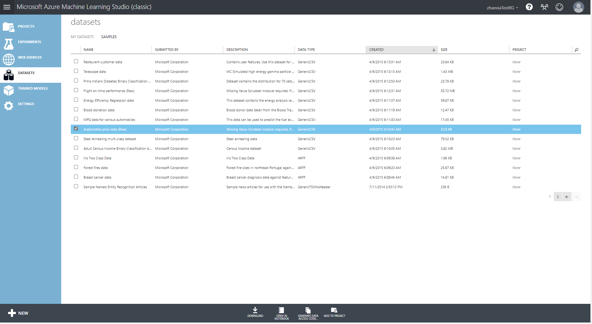

**Experiment**: The experiment that trains a model. It's a visual graph build by modules and datasets.
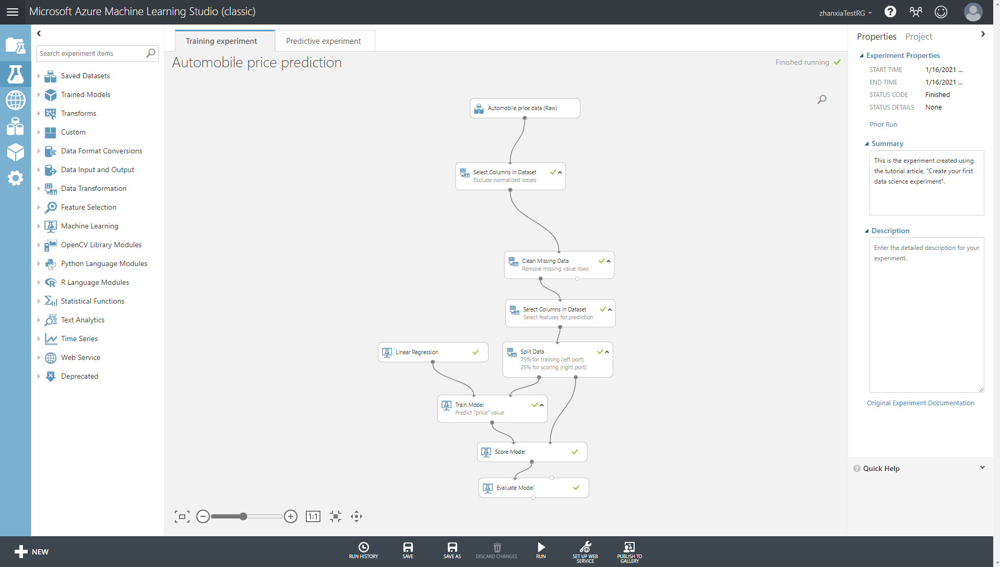

**Web service**: There REQUES/RESPOND API can be used for realtime prediction. The BATCH EXECUTION API can be used for batch prediction or retraining. 
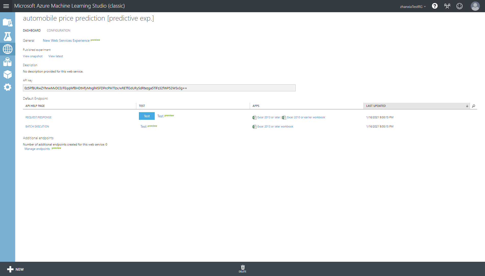

### In Azure Machine Learning

To rebuild the project in Azure Machine Learning, you will use several components and below screenshot shows what it looks like in Azure Machine Learning Studio using the automobile price prediction as an example. [This tutorial] walks through how to train a model and deploy a real-time endpoint for the automobile price prediction problem.  

**Dataset**:  Dataset is the component to manage your data in Azure Machine Learning. For this example, we download the dataset from Studio(classic) and upload to Azure Machine Learning.
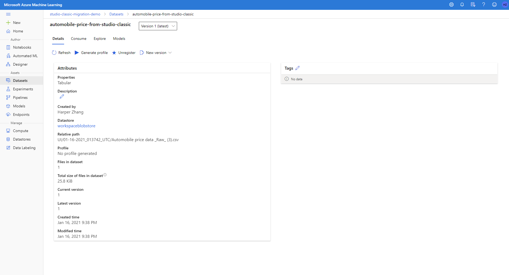

**Designer**: Designer is the component to train the model by drag-and-drop and deploy the model with a few clicks.
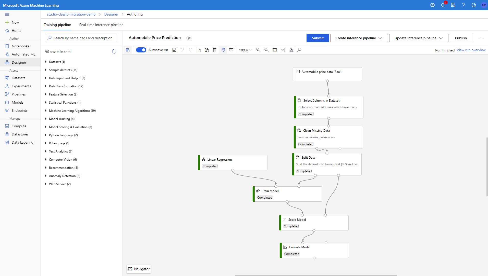

**Real-time endpoint** By deploy the real-time inference pipeline in designer, you will get a real-time endpoint, which can be used for real-time prediction.
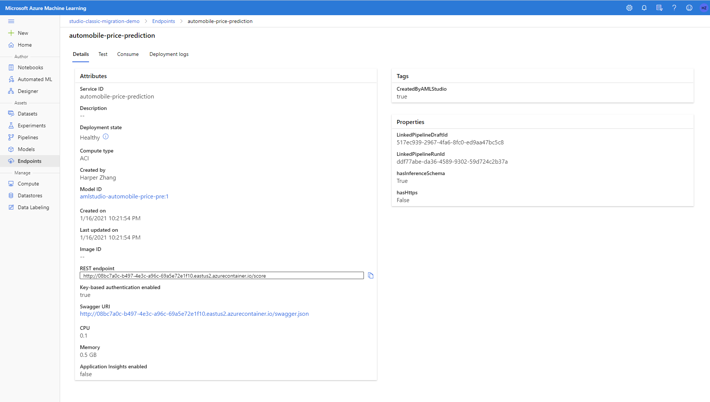

**Pipeline endpoint** By publish a pipeline in designer, you will get a pipeline endpoint. Pipeline endpoint is used for batch prediction or retraining purpose.
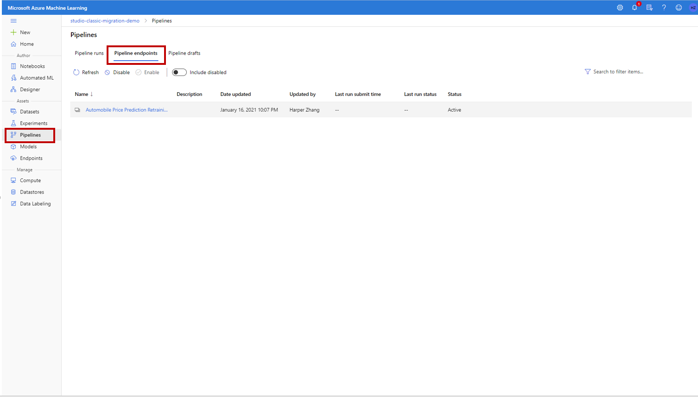

**Compute**  Azure Machine Learning allows you to use the remote compute resources in Azure for training and inference. Compute is the component to manage your compute resources. 
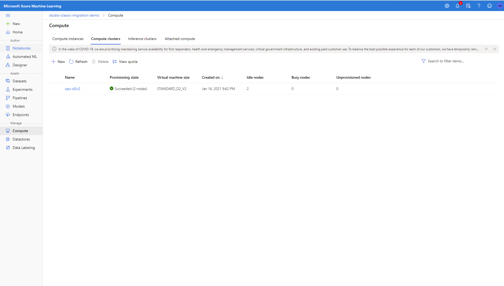

  

For each of the migration step, we have following articles to describe how-to in detail.   

## Create Azure Machine Learning workspace

The workspace is the top-level resource for Azure Machine Learning, it provides a centralized place to work with all the artifacts you create in Azure Machine Learning.

Follow [this article](../how-to-manage-workspace.md) to create Azure Machine Learning workspace. 

After create the workspace, go to ml.azure.com and select your workspace. We will do the following migration steps in this web portal. 

### Compute cluster for training

Machine Learning Studio(classic) runs on proprietary compute resource that is transparent to customers. Every customer has a fix size of compute to run their experiment and it only support CPU compute. 

However, Azure Machine Learning enables more scalable training by bringing variety type and size of Azure VMs as compute target. Customer can choose compute target based on their needs. 
 
Azure Machine Learning designer supports to do training in compute clusters..

Customer can easily create compute clusters in the **Compute -> Compute clusters** tab in Azure Machine Learning Studio. Follow [this article](../how-to-create-attach-compute-studio.md) to check step-by-step guidance.
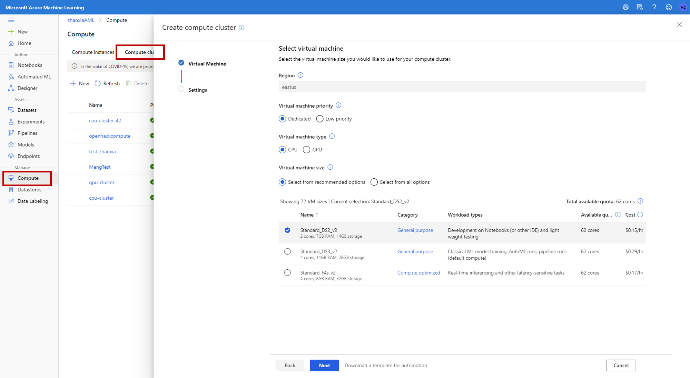

### AKS for inference

Customer can create a new Azure Kubernetes Service (AKS) cluster or attach an existing AKS cluster to the workspace, then deploy the model to AKS for large-scale inferencing.

Customer can easily create AKS clusters in the **Compute -> Inference clusters** tab in Azure Machine Learning Studio. Follow [this article](../how-to-create-attach-compute-studio.md) to check step-by-step guidance. 

[Create and attach an Azure Kubernetes Service cluster](../how-to-create-attach-kubernetes.md) describes how to create or attach an AKS cluster with more details on limitation and AKS version. 

## Rebuild the experiment for training

Rebuild ML Studio(classic) experiment can be further divided into following steps:

1.  [Migrate the dataset](#migrate-the-dataset)
1.  [Rebuild the graph by drag and drop](#rebuild-the-graph-by-drag-and-drop)
1.  [Submit a run and check result](#submit-a-run-and-check-result)

Usually you will repeat 2-3 many times to build the training pipeline iteratively.

### Migrate the dataset

In short, there are two steps to migrate dataset from ML Studio(classic) to Azure Machine Learning:

- 1. Download the dataset from Studio(classic)
- 2. Create a dataset in Azure Machine Learning

#### Download the dataset

Studio(classic) support several data types. for data types listed below, you can directly download them in DATASETS tab as shown in below screenshot.

* Plain text (.txt)
* Comma-separated values (CSV) with a header (.csv) or without (.nh.csv)
* Tab-separated values (TSV) with a header (.tsv) or without (.nh.tsv)
* Excel file
* Zip file (.zip)

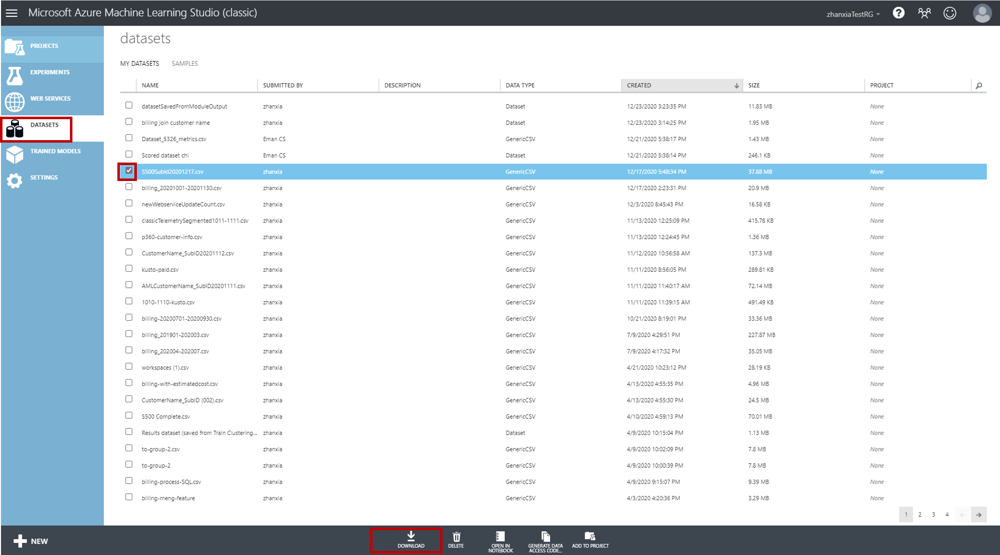

For other data types (listed below), use the Convert to CSV module to convert the type to CSV first then download the result of Convert to CSV module.

* SVMLight data (.svmlight) 
* Attribute Relation File Format (ARFF) data (.arff) 
* R object or workspace file (.RData)
* Dataset type (.data). Dataset type is  Studio(classic) internal data type for module output.

Below experiment screenshot shows how to convert the type and download.

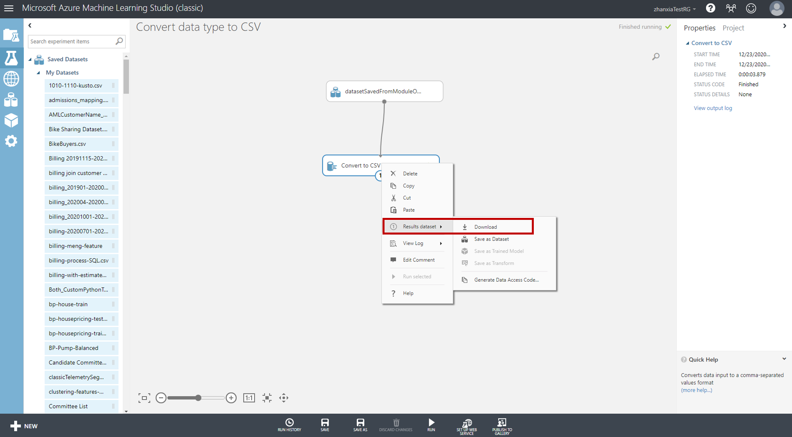

#### Create dataset in Azure Machine Learning Studio

With the data files downloaded from previous step, we can register them as dataset in Azure Machine Learning Studio. 

In Azure Machine Learning, there are two concepts related to data: datastores and datasets. Datastores store connection information with original data source service like Blob storage in a secure way. They store connection information, like your subscription ID and token authorization in your Key Vault associated with the workspace, so you can securely access your storage without having to hard code them in your script.

Azure Machine Learning Datasets make it easier to access and work with your data. By creating a dataset, you create a reference to the data source location along with a copy of its metadata. Because the data remains in its existing location, you incur no extra storage cost, and don't risk the integrity of your data sources. For more information, see [Create and register Azure Machine Learning Datasets](../how-to-create-register-datasets.md)

Follow below steps to create a dataset in Azure Machine Learning Studio.

1. Go to Azure Machine Learning Studio (ml.azure.com)
1. Navigate to Datasets tab under Assets
1. Click Create dataset -> From local files
1. Type dataset name and description following the wizard. Select Dataset type as tabular. (except .zip file, select file type for .zip file)
1. For Datastore and file selection section, select the datastore to upload your local files. By default it will select the worksapceblobstore, which is the blob storage associated to the workspace. 
1. For Settings and preview section, set data parsing settings based on your data.
1. For Schema section, you can view the schema of the data and choose columns to include.
1. Confirm details to finish creating the dataset.

    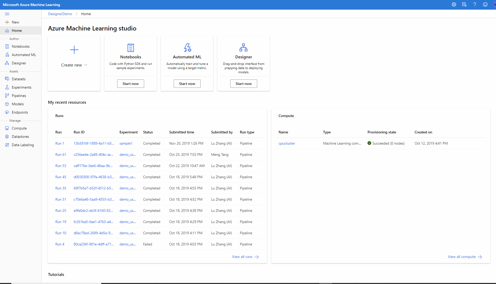

After create a dataset, you will be able to see the dataset in designer module palette on the left, under Datasets category.

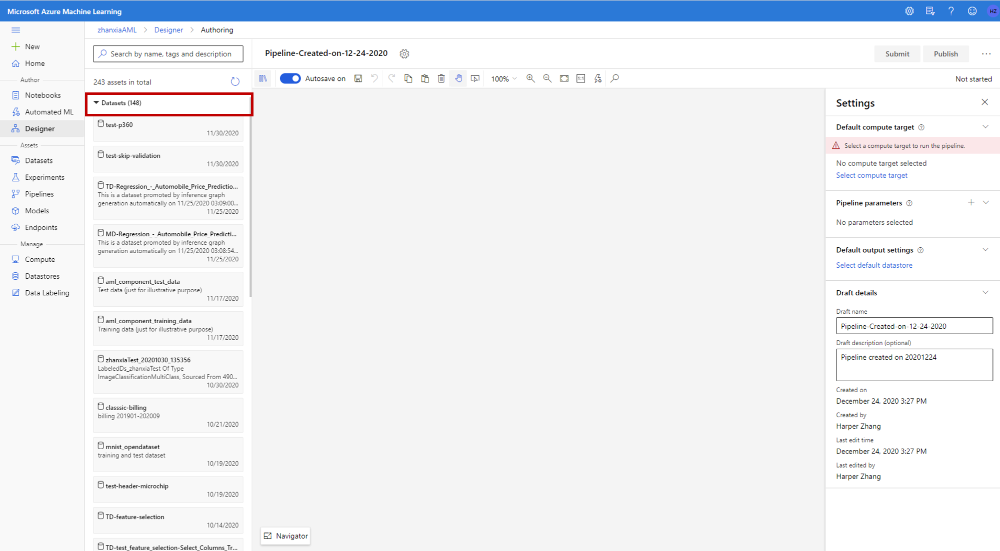

### Rebuild the graph by drag and drop

ML Studio(classic) allows customer visually connect dataset and modules to create an experiment to train a model. Azure Machine Learning designer provides similar experience. In Azure Machine Learning, the visual graph is called pipeline draft. Customer can submit a run from a pipeline draft, which turns into a pipeline run and the record of each run will be tracked in Azure Machine Learning Studio.  

Go through the [designer-tutorial](../tutorial-designer-automobile-price-train-score.md) before you start rebuild the ML Studio(classic) experiments in designer. The tutorial will give you a good walk-through on how to use designer. 

The process of rebuild the graph can be summarized as following steps:

1. Create a new pipeline in designer

1. Rebuild the graph by drag-n-drop the needed dataset and modules

1. Set parameters
    1. Set module parameter. Click on a module the module setting panel will pop up on the right. In the setting panel, you can set parameters for the module. Check [module reference](../algorithm-module-reference/module-reference.md) to understand how to use each module. 
    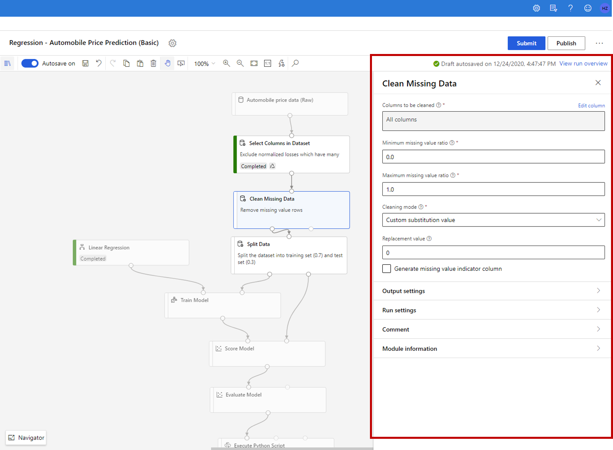
    1. Set compute.  
    
        A pipeline runs on a compute target, which is a compute resource that's attached to your workspace.  You can set a Default compute target for the entire pipeline, which will tell every module to use the same compute target by default. However, you can specify compute targets on a per-module basis. It can be done in the **Run Settings** section in module panel in above screenshot.
    
        To set a default compute for the entire pipeline, select the **Gear icon**  next to the pipeline name to open the run setting panel. Select **Select compute target** in the panel, then select an existing compute or create a new compute following the **Set up compute target** pop up window. You only need to set the default compute target before you run the pipeline for the first time. Later runs will use the default compute target. 
        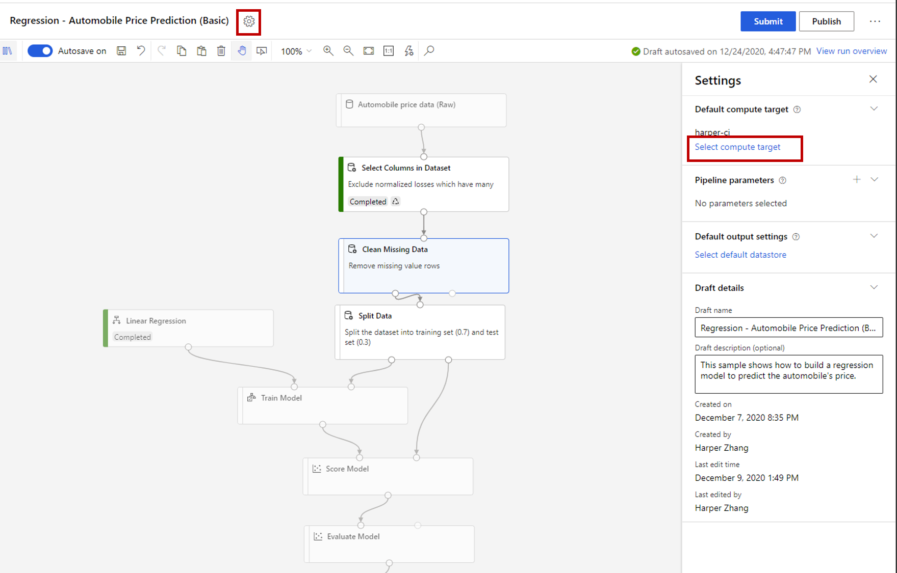 

### Submit a run and check result

1. At the top of the canvas, select **Submit**.
    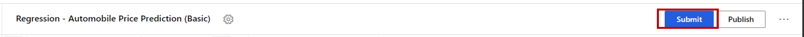
1. In the **Set up pipeline run** dialog box, select **Create new** to create a new experiment.
    
1. Enter a descriptive name for **New experiment Name**.

1. Select **Submit**.

> [!NOTE]
> Experiments group similar pipeline runs together. If you run a pipeline multiple times, you can select the same experiment for successive runs.

After submit a run, the run status will show up at the top right of the canvas and in the right sidebar of each module.

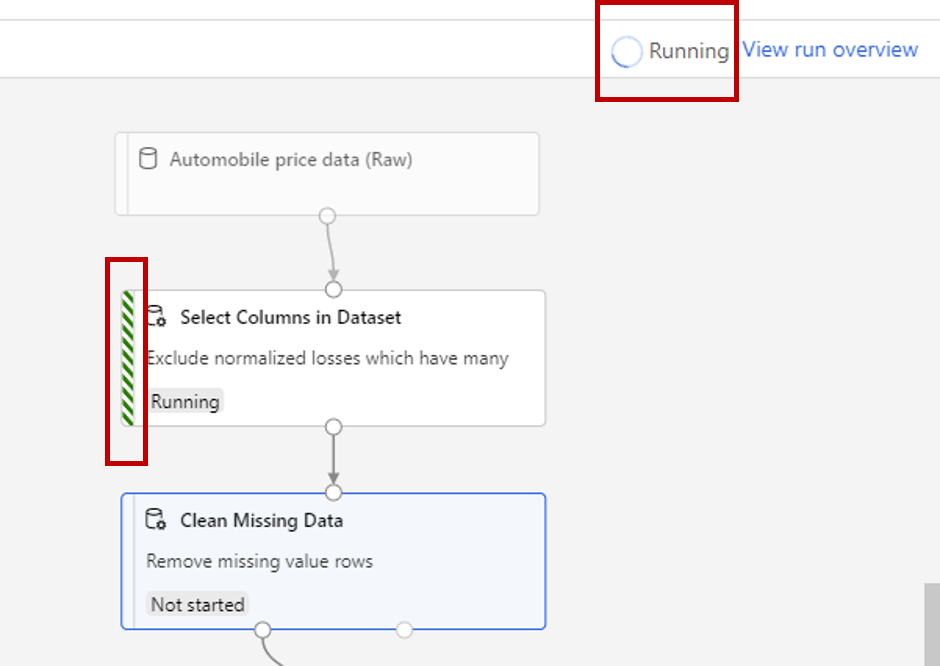

If is the first run, it may take up to 20 minutes for your pipeline to finish running. The default compute settings have a minimum node size of 0, which means that the designer must allocate resources after being idle. Repeated pipeline runs will take less time since the compute resources are already allocated. To speed up the running time, you can keep at least one node idle. See how to create compute in [create compute section](#compute-for-training)

After the run finish, you can check the output of each module. Here are a few helpful options if you right-click a module.

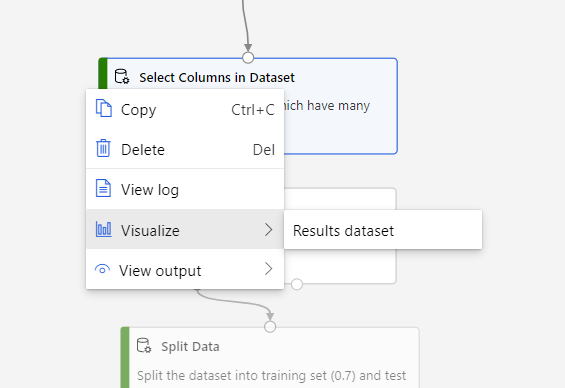
 - **Visualize**: Preview the result dataset to help you understand the result of a module.
- **View Output**: Link you to the storage account that stores module's output, in which you can further explore/download the output. 
- **View Log** : View log to understand what happens under the hood. The **70_driver_log** would be the most helpful log in most cases since in contains the information related to customer script. You can drag the right panel to expand the log area or expand into full screen as shown in below gif.
 
    

> [!TIP]
> The [migration reference article](./migrate-reference.md) call outs the difference of Studio(classic) and designer that you should pay attention to. For example, it includes the module mapping table, the tips to migrate R script.

## Web services

In ML Studio(classic), there are three types of web service: request/respond web service, batch web service, and retraining web service. The mapping in Azure Machine Learning is summarized in below table.

|ML Studio(classic) web service|Azure Machine Learning endpoint|
|---|---|
|Request/respond web service (for real-time prediction)|Real-time endpoint|
|Batch web service (for batch prediction)|Pipeline endpoint|
|Retraining web service (for retraining purpose)|Pipeline endpoint| 
    
This section will cover how to recreate the web service by:
- [Deploy real time endpoint for real time prediction](#deploy-realtime-endpoint-for-realtime-prediction) 
- [Publish pipeline endpoint for batch prediction or retraining](#publish-pipeline-endpoint-for-batch-prediction-or-retraining)   

## Deploy real time endpoint for real time prediction

In ML Studio(classic), the REQUEST/RESPOND endpoint is used for real-time inference. In Azure Machine Learning, it's done by real-time endpoint. 

[This article](../how-to-deploy-and-where.md) explains how model deployment works in Azure Machine Learning. The deployment workflow can be summarized as:
1. Register the model.
1. Prepare an inference configuration.
1. Prepare an entry script.
1. Choose a compute target.
1. Deploy the model to the compute target.
1. Test the resulting web service. 

Designer further simplifies the process by doing register model, prepare inference configuration and prepare entry script automatically when customer clicks **Deploy** button. Customer needs to select the compute target then designer will deploy the model to the compute target. Designer supports deploy to ACI and AKS as compute target and below table summarize when to use for each. 

| Compute target | Used for | Description |
| ----- |  ----- | ----- |
|[Azure Kubernetes Service (AKS)](../how-to-deploy-azure-kubernetes-service.md) |Real-time inference|Use for high-scale production deployments. Provides fast response time and autoscaling of the deployed service. Cluster autoscaling isn't supported through the Azure Machine Learning SDK. To change the nodes in the AKS cluster, use the UI for your AKS cluster in the Azure portal.|
|[Azure Container Instances](../articles/machine-learning/how-to-deploy-azure-container-instance.md)|Testing or development|Use for low-scale CPU-based workloads that require less than 48 GB of RAM.|

In short, deploy real-time endpoint in designer have following steps:

1. Convert training pipeline (already finish a run) to real-time inference pipeline. 
    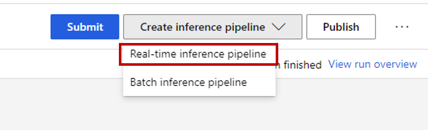
        
    After click **Create Real-time inference pipeline**, designer will convert the training pipeline to a real-time inference pipeline. This conversion is same with Studio(classic)'s training experiment to predictive experiment conversion. Under the hood, it will:
    - Save the model you've trained and replace training modules
    - Remove modules that only needed for training
    - Define where the web service will accept input and where it generates the output.  
1. Run the real-time inference pipeline to make sure it works as expected.

    The steps to run a real-time inference pipeline is same with run a training pipeline, which is described in section [submit a run and check result](#submit-a-run-and-check-result).

1. Deploy. Choose compute target and set deployment settings.

    If you choose to deploy to Azure Kubernetes Service, make sure you have an ASK cluster in your workspace. See section [create-aks-for-inference](#aks-for-inference) for how to create AKS cluster.

    If you choose to deploy to ACI, just select ACI in the dialog then Azure Machine Learning will create an ACI and deploy the model on it.
    
1. Test the resulting endpoint.
    
    After deploy finish, you will see the deployed real-time endpoint in Endpoints tab in Azure Machine Learning Studio. And you can test the endpoint by click the endpoint name to enter endpoint detail page, then click **Test** tab.
    
    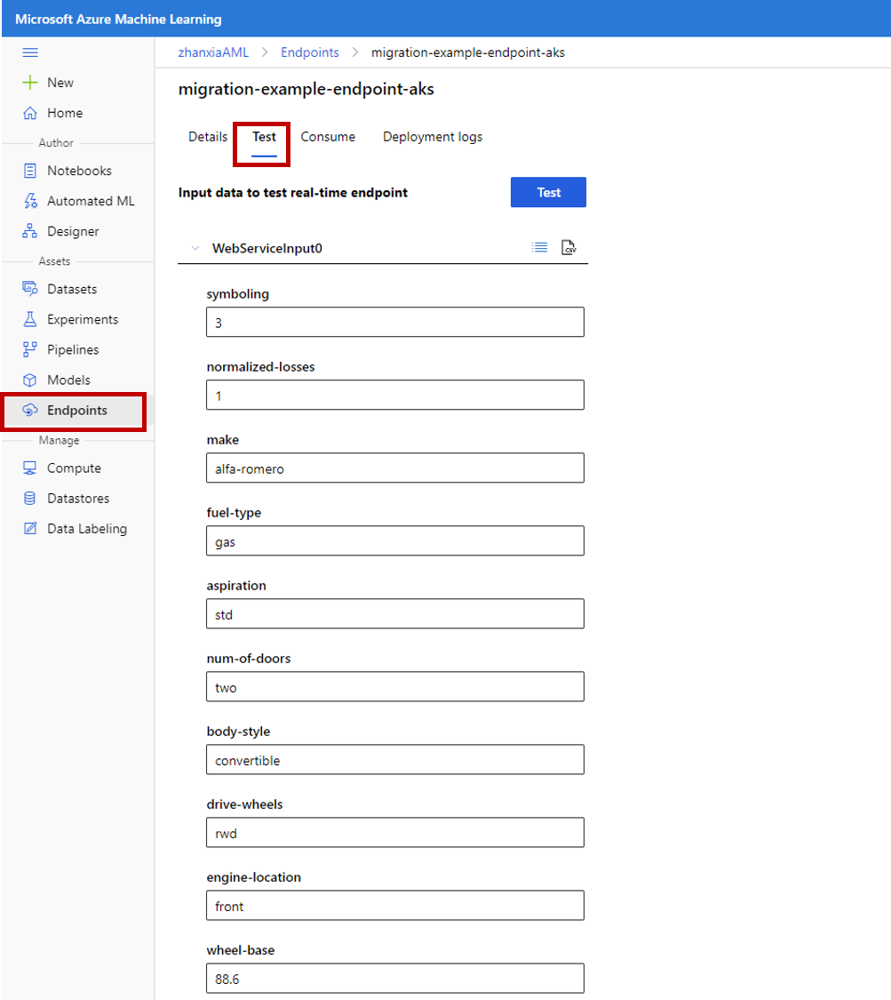
    

[This tutorial](../tutorial-designer-automobile-price-deploy.md) has more detailed step-by-step guidance on how to deploy a model in designer.  

## Publish pipeline endpoint for batch prediction or retraining

In ML Studio(classic), the web service has two REST endpoints -  batch execution endpoint and request/respond endpoint. Batch execution endpoint is for batch prediction purpose. It takes path of a file as input, make prediction for all data in the file, then write the prediction to the output file. 

In ML Studio(classic), customer can also deploy a retraining web service to retrain the model with new set of parameters. The retraining web service will save the trained model to Blob Storage. More detail in [this article](./retrain-machine-learning-model.md).

In Azure Machine Learning, both batch prediction and retraining are done through machine learning pipeline. Customer can publish a pipeline to get a REST endpoint(pipeline endpoint). The pipeline endpoint can be used to run the pipeline from any HTTP library on any platform.  If the original pipeline is set up for prediction, the pipeline endpoint can be used for batch prediction purpose. If the original pipeline is set up for training, the pipeline endpoint can be used for retraining purpose. This section will explain how to publish a pipeline with Azure Machine Learning designer.

In previous section, you already migrated the ML Studio(classic) experiment as pipeline draft for training. Now we will start with a pipeline draft to publish it as a pipeline endpoint. In generate it takes following steps:

1. Create batch inference pipeline (optional, for batch prediction)
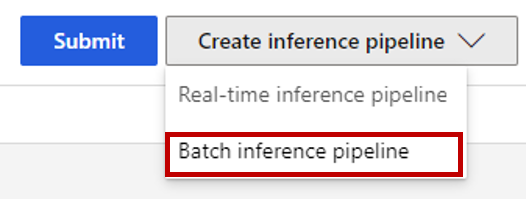
    
    After click the **Create Batch inference pipeline** button, designer will save the trained model and replace the training module in batch inference pipeline. 
1. Publish the pipeline
    
    For batch prediction purpose, publish the batch inference pipeline created in previous step. For retraining purpose, skip previous step and publish the training pipeline directly.

    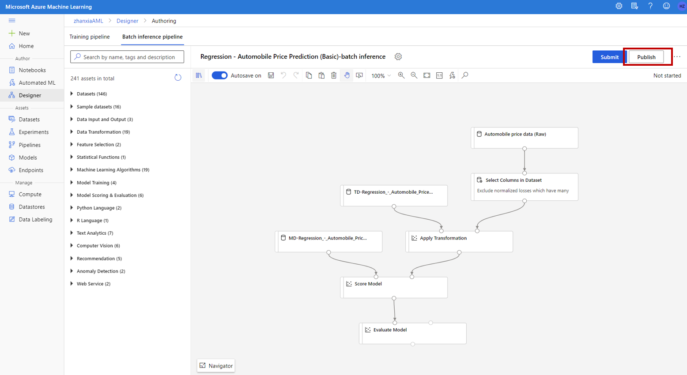

1. Set up published pipeline

    
    
    Select create new PipelineEndpoint, which will generate a new endpoint to trigger the pipeline. You can set dataset or module parameter as pipeline parameter, then you can trigger the pipeline with new data or module parameter. Check [this article](https://docs.microsoft.com/en-us/azure/machine-learning/how-to-retrain-designer#create-a-pipeline-parameter) to learn how to set pipeline parameter.

1. Invoke the pipeline endpoint with UI or REST call

    After publish a pipeline, you can see the pipeline endpoint under **Pipelines -> Pipeline endpoints** tab in Azure Machine Learning Studio. 
    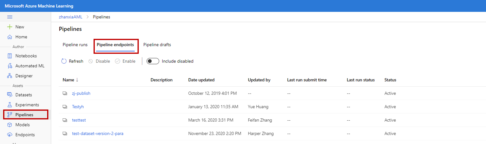
    
    Click a pipeline endpoint name you will enter the detail page for this pipeline endpoint, below screenshot shows what a pipeline endpoint detail page looks like.

    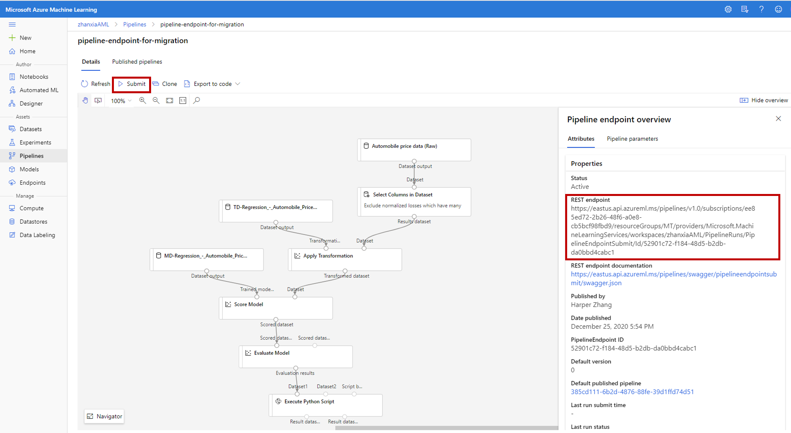

    By click the **Submit** button on the top left, you can submit a new run for this pipeline in the UI. It's also possible to trigger the pipeline through a REST call. How to trigger through REST endpoint will be described in next section.
    

 
Check [how to run batch prediction in designer](../how-to-run-batch-predictions-designer.md) and [how to retrain in designer](../how-to-retrain-designer.md) with more detailed guidance.

## Integrate with client app

Following previous steps, we already have the REST endpoint by deploying a model or publishing a pipeline. The last step of the migration is integrate the REST endpoint with client app, so you can consume the model/pipeline through REST call.  

### Realtime endpoint 

You can call the real-time endpoint to make real time predictions. In Azure Machine Learning Studio, there is sample consumption code Under **Endpoints -> Consume** tab.

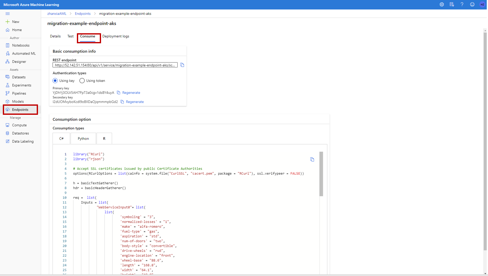  

There is Swagger URI for the real time endpoint in the **Endpoints -> Details** tab. You can refer to the swagger to understand the endpoint schema.

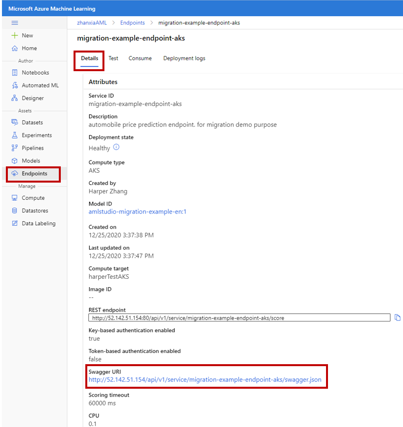
 

### Pipeline endpoint

You can consume the pipeline endpoint for retraining or batch prediction purpose. There are two possible approaches to consume the pipeline endpoint - through REST call or through integration with Azure Data Factory.

**REST call**

After publish the pipeline, there will be a swagger as the endpoint documentation. Check the swagger to learn how to call the endpoint.
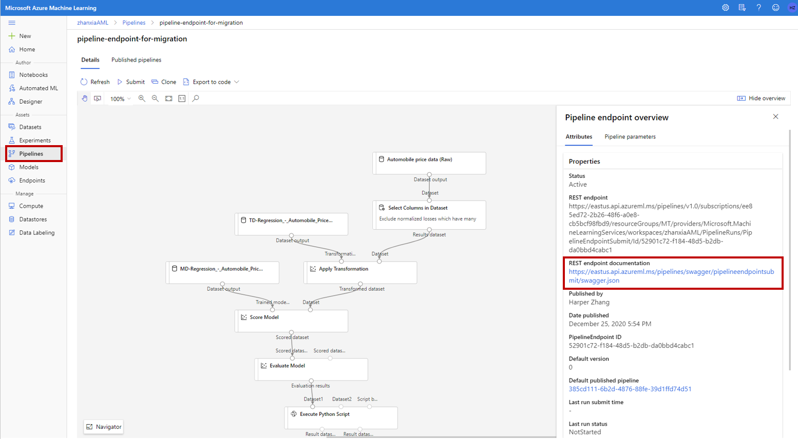 

**Integrate with Azure Data Factory**

You can run your machine learning pipeline as a step in Azure Data Factory pipeline for batch prediction scenarios.Check [Execute Azure Machine Learning pipelines in Azure Data Factory](../../data-factory/transform-data-machine-learning-service.md) to learn how. 
