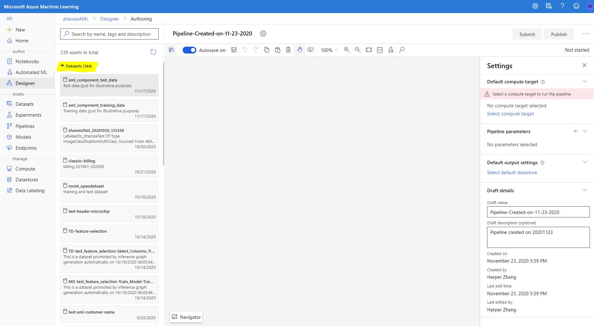
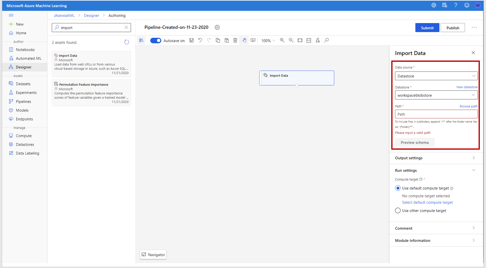

# Migrate to Azure Machine Learning designer

Azure Machine Learning Studio(classic) will start retire on Feb 29,2024. Before this date, customers have access to their existing Machine Learning Studio(classic) workspace. The experiments and web services can still run. But new resource (workspace, commitment plan) creation will be stopped after May 31 2021. 

Customer should move to use Azure Machine Learning, the new modern machine learning platform for enterprise. 

For customers prefer low code/no code experience, designer in Azure Machine Learning Studio provides the similar drag-n-drop experience for training and deployment. This article will focus on how to rebuild your Machine Learning Studio(classic) projects using Azure Machine Learning designer. 

## Key steps for the migration

This section aims to give you an overview of the key steps of the migration.

- 1. [Create Azure Machine Learning resources](#1-create-azure-machine-learning-resource)

        Create resources that will be used in later steps of the migration, include:
        - Workspace
        - Training compute target
        - Inference compute target

- 2. [Rebuild the experiment to train a model](#rebuild-the-experiment-to-train-a-model)

        It can be further divided as following steps:
        - 2.1 Migrate the dataset
        - 2.2 Rebuild the graph by drag and drop
        - 2.3 Submit a run and check result
        
- 3. Recreate the web service.
    
    In ML Studio(classic), there are three types of web service: request/respond web service, batch web service, and retraining web service. The mapping in Azure Machine Learning is summarized in below table.

    |ML Studio(classic) web service|Azure Machine Learning endpoint|
    |---|---|
    |Request/respond web service (for real-time prediction)|Real-time endpoint|
    |Batch web service (for batch prediction)|Pipeline endpoint|
    |Retraining web service (for retraining purpose)|Pipeline endpoint| 
    
    This article will cover how to recreate the web service by:
    - 3.1 [Deploy realtime endpoint for realtime prediction](#3.1-deploy-realtime-endpoint-for-realtime-prediction) 
    - 3.2 [Publish pipeline endpoint for batch prediction or retraining](#3.2-publish-pipeline-endpoint-for-batch-prediction-or-retraining)   

- 4. [Integrate with client app](#4-integrate-with-client-app).
    
    The last step is to integrate the new created endpoint in step 3 with client app to make prediction. 


### 1. Create Azure Machine Learning resource

#### 1.1 Workspace

The workspace is the top-level resource for Azure Machine Learning, it provides a centralized place to work with all the artifacts you create in Azure Machine Learning.

Follow [this article](../how-to-manage-workspace.md) to create Azure Machine Learning workspace. 


#### 1.2 Compute for training

Machine Learning Studio(classic) runs on proprietary compute resource that is transparent to customers. Every customer has a fix size of compute resource to run their experiment and it only support CPU compute. 

However, Azure Machine Learning enables more scalable training by bringing variety type and size of Azure VMs as compute target. Customer can choose compute target based on their needs. 
 
Azure Machine Learning designer supports following compute target types.

|Compute target type|Brief description|When to use|
|------|------|------|
|Compute Instance|A fully managed single node cloud-base machine learning workstation. |test/small date size|
|Azure Machine Learning Compute|Single or multi-node cluster, fully managed by Azure Machine Learning. Autoscale when you submit a run.|big data size? |

**[?? compute instance not released for 3P]**

Customer can easily create compute clusters in the **Compute** tab in Azure Machine Learning Studio. Follow [this article](../how-to-create-attach-compute-studio.md) to check step-by-step guidance.


#### 1.3 AKS for inference

## 2. Rebuild the experiment to train a model

This section will describe how to rebuild ML Studio(classic) experiment in Azure Machine Learning designer. Designer provides a similar drag and drop experience. If you have never use designer before, it's recommended to go through [designer tutorial](../tutorial-designer-automobile-price-train-score.md) to get familiar with it.

Rebuild ML Studio(classic) experiment can be further divided into following steps:

1.  [Migrate the dataset](#migrate-the-dataset)
1.  [Rebuild the graph by drag and drop](#rebuild-the-graph-by-drag-and-drop)
1.  [Submit a run and check result](#submit-a-run-and-check-result)

Usually you will repeat 2-3 many times to build the training pipeline iteratively.


### 2.1. Migrate the dataset

In short, there are two steps to migrate dataset from ML Studio(classic) to Azure Machine Learning:

- 1. Download the dataset from Studio(classic)
- 2. Create a dataset in Azure Machine Learning

#### Download the dataset

Studio(classic) support several data types. for following data types, you can directly download them in DATASETS tab as shown in below image shows how.

* Plain text (.txt)
* Comma-separated values (CSV) with a header (.csv) or without (.nh.csv)
* Tab-separated values (TSV) with a header (.tsv) or without (.nh.tsv)
* Excel file
* Zip file (.zip)


For other data types (listed below), use the Convert to CSV module to convert the type to CSV first then download the result of Convert to CSV module.

* SVMLight data (.svmlight) 
* Attribute Relation File Format (ARFF) data (.arff) 
* R object or workspace file (.RData)
* Dataset type (.data). Dataset type is  Studio(classic) internal data type for module output.

Below experiment screenshot shows how to convert the type and download.


#### Create dataset in Azure Machine Learning Studio

With the data files downloaded from previous step, we can register them as dataset in Azure Machine Learning Studio. 

In Azure Machine Learning, there are two concepts related to data: datastores and datasets. Datastores store connection information with original data source service like Blob storage in a secure way. They store connection information, like your subscription ID and token authorization in your Key Vault associated with the workspace, so you can securely access your storage without having to hard code them in your script.

Azure Machine Learning Datasets make it easier to access and work with your data. By creating a dataset, you create a reference to the data source location along with a copy of its metadata. Because the data remains in its existing location, you incur no extra storage cost, and don't risk the integrity of your data sources. For more information, see [Create and register Azure Machine Learning Datasets](../how-to-create-register-datasets.md)

Follow below steps to create a dataset in Azure Machine Learning Studio.

1. Go to Azure Machine Learning Studio (ml.azure.com)
1. Navigate to Datasets tab under Assets
1. Click Create dataset -> From local files
1. Type dataset name and description following the wizard. Select Dataset type as tabular. (except .zip file, select file type for .zip file)
1. For Datastore and file selection, select the datastore to upload your local files. By default it will select the worksapceblobstore, which is the blob storage associated to the workspace. 
1. For Settings and preview, set settings based on your data.
1. In Schema, you can view the schema of the data and choose columns to include.
1. Confirm details to finish creating the dataset.

**[to-do: add a gif of create dataset from local]**

After create a dataset, you will be able to see the dataset in designer module palette on the left, under Datasets category.


### 2.2 Rebuild the graph by drag and drop

ML Studio(classic) allows customer visually connect dataset and modules to create an experiment to train a model. Azure Machine Learning designer provides similar experience. In Azure Machine Learning, the visual graph is called pipeline draft. Customer can submit a run from pipeline draft, which turns into a pipeline run and the record of each run will be tracked in Azure Machine Learning Studio.  

Go through the [designer-tutorial](../tutorial-designer-automobile-price-train-score.md) before you start rebuild the ML Studio(classic) experiments in designer. The tutorial will give you a good walk-through on how to use designer. 

The process of rebuild the graph can be summarized as following steps:

1. Create a new pipeline in designer


1. Rebuild the graph by drag-n-drop the needed dataset and modules

1. Set parameters
    1. Set module parameter. Click on a module the module setting panel will pop up on the right. In the setting panel, you can set parameters for the module. Check [module reference](../algorithm-module-reference/module-reference.md) to understand how to use each module. 
    
    1. Set compute.  
    
        A pipeline runs on a compute target, which is a compute resource that's attached to your workspace.  You can set a Default compute target for the entire pipeline, which will tell every module to use the same compute target by default. However, you can specify compute targets on a per-module basis. It can be done in the **Run Settings** section in module panel in above screenshot.
    
        To set a default compute for the entire pipeline, select the **Gear icon**  next to the pipeline name to open the run setting panel. Select **Select compute target** in the panel, then select an existing compute or create a new compute following the **Set up compute target** pop up window. You only need to set the default compute target before you run the pipeline for the first time. Later runs will use the default compute target. 
         

### 2.3 Submit a run and check result

1. At the top of the canvas, select **Submit**.
    
1. In the **Set up pipeline run** dialog box, select **Create new** to create a new experiment.
    
1. Enter a descriptive name for **New experiment Name**.

1. Select **Submit**.

> [!NOTE]
> Experiments group similar pipeline runs together. If you run a pipeline multiple times, you can select the same experiment for successive runs.

After submit a run, the run status will show up at the top right of the canvas and in the right sidebar of each module.


If is the first run, it may take up to 20 minutes for your pipeline to finish running. The default compute settings have a minimum node size of 0, which means that the designer must allocate resources after being idle. Repeated pipeline runs will take less time since the compute resources are already allocated. To speed up the running time, you can keep at least one node idle. See how to create compute in [create compute section](#compute-for-training)

After the run finish, you can check the output of each module. Here are a few helpful options if you right-click a module.

 - **Visualize**: Preview the result data to help you understand the result of a module.
- **View Output**: Link you to the storage account that stores module's output, in which you can further explore/download the output. 
- **View Log** : View log to understand what happens under the hood. The **70_driver_log** would be the most helpful log in most cases since in contains the information related to customer script. You can drag the right panel to expand the log area or expand into full screen as shown in below gif.
 
    


So far we have gone through the key steps to rebuild the training experiment in designer. Following sections will highlight the difference of ML Studio(classic) and designer, which you need pay special attention in migration.

#### Import Data

In Studio(classic), ingest data from cloud storage is done through Import Data module. In designer, there are two options:

|Option|Description|When to use|
|---| --- | --- |
|AML dataset|Ingest data from local and online data sources (Blob, ADLS Gen1, ADLs Gen2, File share, SQL DB). It will register the data as a dataset asset to the workspace. And advanced data features like data versioning and data monitoring are enabled.|Recommended|
|Import Data Module in designer|Ingest data from online data sources (Blob, ADLS Gen1, ADLS Gen2, File share, SQL DB).  It will not create a dataset asset to the workspace. |When customer does not want to register a dataset to workspace.|

[!Note]
There are four cloud data sources (Hive Query, Azure Table, Azure Cosmos DB, On-premises SQL Database) that supported in ML Studio(classic) but not supported in AML. It's recommended to move your data to supported storages using Azure Data Factory.  

To ingest data from cloud storage, there are two steps:
1. Create datastore, which links the cloud storage service to your Azure Machine Learning workspace. 

    [This article](https://github.com/MicrosoftDocs/azure-docs-pr/blob/master/articles/machine-learning/how-to-connect-data-ui.md#create-datastores) has step-by-step guidance on how to create datastore.
2. (Option 1) Create dataset and drop it in designer. 

    [This article](https://github.com/MicrosoftDocs/azure-docs-pr/blob/master/articles/machine-learning/how-to-connect-data-ui.md#create-datasets) has the step-by-step guidance on how to create datasets in AML Studio. Remember to choose **Tabular** for dataset type since ML Studio(classic) supported data are essentially tabular format.   
    
    After create the dataset, you can find the dataset in designer left palette, under **Datasets** category. Then drop the dataset in canvas to use it. 

    

1.  (Option 2) Use Import Data Module in designer 

    After create datastore, you can use Import Data module in designer to ingest data from created datastore. This module will not create a dataset asset to your workspace. Follow the settings in right panel to set up this module. First, select datastore to import data from. Then select path or edit SQL query to identify the needed data from datastore. 
    
    
 


#### Build-in module mapping

Module for same functionality has the same name in AML designer and ML Studio(classic).  See below table for the module mapping. 

>![Important]
> The machine learning modules in designer are implemented with Python, using open-source packages like sklearn. The Studio(classic) machine learning modules are implemented with C# and using a Microsoft internal machine learning package. The result of the same module might have slight difference deu to the difference of underlying technology.


|Category|ML Studio(classic) module|AML designer module|
|--------------|----------------|--------------------------------------|
|Data input and output|- Enter Data Manually </br> - Export Data </br> - Import Data </br> - Load Trained Model </br> - Unpack Zipped Datasets|- Enter Data Manually </br> - Export Data </br> - Import Data|
|Data Format Conversions|- Convert to CSV </br> - Convert to Dataset </br> - Convert to ARFF </br> - Convert to SVMLight </br> - Convert to TSV|- Convert to CSV </br> - Convert to Dataset|
|Data Transformation - Manipulation|- Add Columns</br> - Add Rows </br> - Apply SQL Transformation </br> - Cleaning Missing Data </br> - Convert to Indicator Values </br> - Edit Metadata </br> - Join Data </br> - Remove Duplicate Rows </br> - Select Columns in Dataset </br> - Select Columns Transform </br> - SMOTE </br> - Group Categorical Values|- Add Columns</br> - Add Rows </br> - Apply SQL Transformation </br> - Cleaning Missing Data </br> - Convert to Indicator Values </br> - Edit Metadata </br> - Join Data </br> - Remove Duplicate Rows </br> - Select Columns in Dataset </br> - Select Columns Transform </br> - SMOTE|
|Data Transformation – Scale and Reduce |- Clip Values </br> - Group Data into Bins </br> - Normalize Data </br>- Principal Component Analysis |- Clip Values </br> - Group Data into Bins </br> - Normalize Data|
|Data Transformation – Sample and Split|- Partition and Sample </br> - Split Data|- Partition and Sample </br> - Split Data|
|Data Transformation – Filter |- Apply Filter </br> - FIR Filter </br> - IIR Filter </br> - Median Filter </br> - Moving Average Filter </br> - Threshold Filter </br> - User Defined Filter||
|Data Transformation – Learning with Counts |- Build Counting Transform </br> - Export Count Table </br> - Import Count Table </br> - Merge Count Transform</br>  - Modify Count Table Parameters||
|Feature Selection |- Filter Based Feature Selection </br> - Fisher Linear Discriminant Analysis  </br> - Permutation Feature Importance |- Filter Based Feature Selection </br>  - Permutation Feature Importance|
| Model - Classification| - Multiclass Decision Forest </br> - Multiclass Decision Jungle  </br> - Multiclass Logistic Regression  </br>- Multiclass Neural Network  </br>- One-vs-All Multiclass </br>- Two-Class Averaged Perceptron </br>- Two-Class Bayes Point Machine </br>- Two-Class Boosted Decision Tree  </br> - Two-Class Decision Forest  </br> - Two-Class Decision Jungle  </br> - Two-Class Locally-Deep SVM </br> - Two-Class Logistic Regression  </br> - Two-Class Neural Network </br> - Two-Class Support Vector Machine  | - Multiclass Decision Forest </br>  - Multiclass Boost Decision Tree  </br> - Multiclass Logistic Regression </br> - Multiclass Neural Network </br> - One-vs-All Multiclass  </br> - Two-Class Averaged Perceptron  </br> - Two-Class Boosted Decision Tree  </br> - Two-Class Decision Forest </br>-  Two-Class Logistic Regression </br> - Two-Class Neural Network </br>-   Two-Class Support Vector Machine  |
| Model - Clustering| - K-means clustering| - K-means clustering|
| Model - Regression| - Bayesian Linear Regression  </br> - Boosted Decision Tree Regression  </br>- Decision Forest Regression  </br> - Fast Forest Quantile Regression  </br> - Linear Regression </br> - Neural Network Regression </br> - Ordinal Regression  Poisson Regression| - Boosted Decision Tree Regression  </br>- Decision Forest Regression  </br> - Fast Forest Quantile Regression </br> - Linear Regression  </br> - Neural Network Regression </br> - Poisson Regression|
| Model – Anomaly Detection| - One-Class SVM  </br> - PCA-Based Anomaly Detection | - PCA-Based Anomaly Detection|
| Machine Learning – Evaluate  | - Cross Validate Model  </br>- Evaluate Model  </br>- Evaluate Recommender | - Cross Validate Model  </br>- Evaluate Model </br> - Evaluate Recommender|
| Machine Learning – Train| - Sweep Clustering  </br> - Train Anomaly Detection Model </br>- Train Clustering Model  </br> - Train Matchbox Recommender  -</br> Train Model  </br>- Tune Model Hyperparameters| - Train Anomaly Detection Model  </br> - Train Clustering Model </br> -  Train Model  -</br> - Train PyTorch Model  </br>- Train SVD Recommender  </br>- Train Wide and Deep Recommender </br>- Tune Model Hyperparameters|
| Machine Learning – Score| - Apply Transformation  </br>- Assign Data to clusters  </br>- Score Matchbox Recommender </br> - Score Model|-  Apply Transformation  </br> - Assign Data to clusters </br> - Score Image Model  </br> - Score Model </br>- Score SVD Recommender </br> -Score Wide and Deep Recommender|
| OpenCV Library Modules| - Import Images </br>- Pre-trained Cascade Image Classification | |
| Python Language Modules| - Execute Python Script| - Execute Python Script  </br> - Create Python Model |
| R Language Modules  | - Execute R Script  </br> - Create R Model| - Execute R Script|
| Statistical Functions | - Apply Math Operation </br>-  Compute Elementary Statistics  </br>- Compute Linear Correlation  </br>- Evaluate Probability Function  </br>- Replace Discrete Values  </br>- Summarize Data  </br>- Test Hypothesis using t-Test| - Apply Math Operation  </br>- Summarize Data|
| Text Analytics| - Detect Languages  </br>- Extract Key Phrases from Text  </br>- Extract N-Gram Features from Text  </br>- Feature Hashing </br>- Latent Dirichlet Allocation  </br>- Named Entity Recognition </br>-  Preprocess Text  </br>- Score Vowpal Wabbit Version 7-10 Model  </br>- Score Vowpal Wabbit Version 8 Model </br>- Train Vowpal Wabbit Version 7-10 Model  </br>- Train Vowpal Wabbit Version 8 Model |-  Convert Word to Vector </br> - Extract N-Gram Features from Text </br>-  Feature Hashing  </br>- Latent Dirichlet Allocation </br>- Preprocess Text  </br>- Score Vowpal Wabbit Model </br> - Train Vowpal Wabbit Model|
| Time Series| - Time Series Anomaly Detection | |
| Web Service | - Input </br> -   Output | - Input </br>  - Output|
| Computer Vision| | - Apply Image Transformation </br> - Convert to Image Directory </br> - Init Image Transformation </br> - Split Image Directory  </br> - DenseNet Image Classification   </br>- ResNet Image Classification |

Find more about how to use designer modules in [module reference](../algorithm-module-reference/module-reference.md) 
 
#### What if the wanted module is not in designer? 

Azure Machine Learning designer builds the most popular modules in ML Studio(classic). It also added some new modules leveraging the state of art technology (for example DenseNet for image classification). We expect designer supported module will cover most of the migration scenario. If your migration is blocked by missing modules in designer, contact us by connecting support.
    
#### Notes for Execute R Script

Execute R Script module is a popular module in ML Studio(classic), which allows customer to do customized task using R script. Given that ML Studio(classic) is hosted on Windows platform and the Azure Machine Learning designer is running on Linux platform, it would be slightly different to install an R package in designer.
||ML Studio(classic)|Azure Machine Learning designer|
|---|---|---|
|Script Interface|maml.mapInputPort and maml.mapOutputPort|Function interface|
|Platform|Windows|Linux|
|Internet Accessible |No|Yes|
|Memory|14G|Depend on Compute SKU|

Below are the migration steps for R script.

**Change the R script interface**

Here is a quick sample of R script in Azure Machine Learning Studio (classic). 
```r
# Map 1-based optional input ports to variables 
dataset1 <- maml.mapInputPort(1) # class: data.frame 
dataset2 <- maml.mapInputPort(2) # class: data.frame 

# Contents of optional Zip port are in ./src/ 
# source("src/yourfile.R"); 
# load("src/yourData.rdata"); 

# Sample operation 
data.set = rbind(dataset1, dataset2); 

 
# You'll see this output in the R Device port. 
# It'll have your stdout, stderr and PNG graphics device(s). 

plot(data.set); 

# Select data.frame to be sent to the output Dataset port 
maml.mapOutputPort("data.set"); 
```

Here is the upgraded version in Azure Machine Learning designer. Basically, the main change is replacing the maml.mapInputPort and maml.mapOutputPort with a normal function interface with name “azureml_main”. 
```r
azureml_main <- function(dataframe1, dataframe2){ 
    # Use the parameters dataframe1 and dataframe2 directly 
    dataset1 <- dataframe1 
    dataset2 <- dataframe2 

    # Contents of optional Zip port are in ./src/ 
    # source("src/yourfile.R"); 
    # load("src/yourData.rdata"); 

    # Sample operation 
    data.set = rbind(dataset1, dataset2); 


    # You'll see this output in the R Device port. 
    # It'll have your stdout, stderr and PNG graphics device(s). 
    plot(data.set); 

  # Return datasets as a Named List 

  return(list(dataset1=data.set)) 
} 
```

Learn more in designer [Execute R Script reference](../algorithm-module-reference/execute-r-script.md/).

 **Install R packages from Internet**

ML Studio(classic) runs on a sandbox environment with no internet access. To install a new R package that not in pre-installed list, customer needs to upload the package in a zip bundle and load them in script.

In the Azure Machine Learning, it’s allowed to install the packages from CRAN directly. Customer can install the R package with the code below.
```r
  if(!require(zoo)) { 
      install.packages("zoo",repos = "http://cran.us.r-project.org") 
  } 
  library(zoo) 
```


## 3.1 Deploy realtime endpoint for realtime prediction

In ML Studio(classic), the REQUEST/RESPOND endpoint is used for real-time inference. In Azure Machine Learning, it's done by real-time endpoint. 

[This article](../how-to-deploy-and-where.md) explains how model deployment works in Azure Machine Learning. The deployment workflow can be summarized as:
1. Register the model.
1. Prepare an inference configuration.
1. Prepare an entry script.
1. Choose a compute target.
1. Deploy the model to the compute target.
1. Test the resulting web service. 

Designer further simplifies the process by doing register model, prepare inference configuration and prepare entry script automatically when customer clicks **Deploy** button. Customer needs to select the compute target then designer will deploy the model to the compute target. Designer supports deploy to ACI and AKS as compute target and below table summarize when to use for each. 

| Compute target | Used for | Description |
| ----- |  ----- | ----- |
|[Azure Kubernetes Service (AKS)](../how-to-deploy-azure-kubernetes-service.md) |Real-time inference|Use for high-scale production deployments. Provides fast response time and autoscaling of the deployed service. Cluster autoscaling isn't supported through the Azure Machine Learning SDK. To change the nodes in the AKS cluster, use the UI for your AKS cluster in the Azure portal.|
|[Azure Container Instances](../articles/machine-learning/how-to-deploy-azure-container-instance.md)|Testing or development|Use for low-scale CPU-based workloads that require less than 48 GB of RAM.|

In short, deploy real-time endpoint in designer have following steps:

1. Convert training pipeline (already finish a run) to real-time inference pipeline. 
    
        
    After click **Create Real-time inference pipeline**, designer will convert the training pipeline to a real-time inference pipeline. This conversion is same with Studio(classic)'s training experiment to predictive experiment conversion. Under the hood, it will:
    - Save the model you've trained and replace training modules
    - Remove modules that only needed for training
    - Define where the web service will accept input and where it generates the output.  
1. Run the real-time inference pipeline to make sure it works as expected.

    The steps to run a real-time inference pipeline is same with run a training pipeline, which is described in section 2.3.

1. Deploy. Choose compute target and set deployment settings.

    If you choose to deploy to Azure Kubernetes Service, make sure you have an ASK cluster associated the workspace. See section 1.3 for how to create AKS cluster.

    If you choose to deploy to ACI, just select ACI in the dialog then Azure Machine Learning will create an ACI and deploy the model on it.
    
1. Test the resulting endpoint.
    
    After deploy finish, you will see the deployed real-time endpoint in Endpoints tab in Azure Machine Learning Studio. And you can test the endpoint by click the endpoint name to enter endpoint detail page, then click **Test** tab.
    
    
    

[This tutorial](../tutorial-designer-automobile-price-deploy.md) has more detailed step-by-step guidance on how to deploy a model in designer.  


## 3.2 Publish pipeline endpoint for batch prediction or retraining

In ML Studio(classic), the web service has two REST endpoints -  batch execution endpoint and request/respond endpoint. Batch execution endpoint is for batch prediction purpose. It takes path of a file as input, make prediction for all data in the file, then write the prediction to the output file. 

In ML Studio(classic), customer can also deploy a retraining web service to retrain the model with new set of parameters. The retraining web service will save the trained model to Blob Storage. More detail in [this article](./retrain-machine-learning-model.md).

In Azure Machine Learning, both batch prediction and retraining are done through machine learning pipeline. Customer can publish a pipeline to get a REST endpoint(pipeline endpoint). The pipeline endpoint can be used to run the pipeline from any HTTP library on any platform.  If the original pipeline is set up for prediction, the pipeline endpoint can be used for batch prediction purpose. If the original pipeline is set up for training, the pipeline endpoint can be used for retraining purpose. This section will explain how to publish a pipeline with Azure Machine Learning designer.

In previous section, you already migrated the ML Studio(classic) experiment as pipeline draft for training. Now we will start with a pipeline draft to publish it as a pipeline endpoint. In generate it takes following steps:

1. Create batch inference pipeline (optional, for batch prediction)

    
    After click the **Create Batch inference pipeline** button, designer will save the trained model and replace the training module in batch inference pipeline. 
1. Publish the pipeline
    
    For batch prediction purpose, publish the batch inference pipeline created in previous step. For retraining purpose, skip previous step and publish the training pipeline directly.
    

1. Set up published pipeline
    
    
    Select create new PipelineEndpoint, which will generate a new endpoint to trigger the pipeline. You can set dataset or module parameter as pipeline parameter, then you can trigger the pipeline with new data or module parameter. Check [this article](https://docs.microsoft.com/en-us/azure/machine-learning/how-to-retrain-designer#create-a-pipeline-parameter) to learn how to set pipeline parameter.

1. Invoke the pipeline endpoint with UI or REST call

    After publish a pipeline, you can see the pipeline endpoint under **Pipelines -> Pipeline endpoints** tab in Azure Machine Learning Studio. 
    
    
    Click a pipeline endpoint name you will enter the detail page for this pipeline endpoint, in which you can see all pipeline run history. You can also trigger a new pipeline run in UI or through REST endpoint. How to trigger through REST endpoint will be described in next section.
    

 
Check [how to run batch prediction in designer](../how-to-run-batch-predictions-designer.md) and [how to retrain in designer](../how-to-retrain-designer.md) with more detailed guidance.


## 4. Integrate with client app

### Realtime endpoint 

#### Sample code


### Pipeline endpoint

#### Sample code
#### Integrate with Azure Data Factory