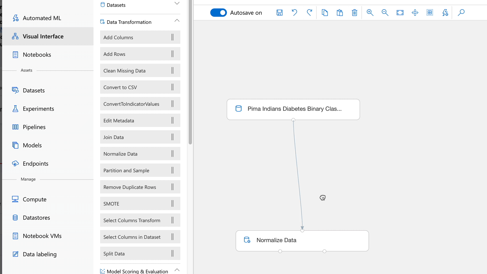

# How Azure Machine Learning compares to ML Studio

[ML Studio (classic)](/studio/what-is-ml-studio.md) is a collaborative, drag-and-drop visual workspace where you can build, test, and deploy machine learning solutions without needing to write code. It uses prebuilt and preconfigured machine learning algorithms and data-handling modules as well as a proprietary compute platform.

Meanwhile, [**Azure Machine Learning**](/service/overview-what-is-azure-ml.md) provides both a web interface called the designer (preview) and several SDKs and CLI to quickly prep data, train and deploy machine learning models. The designer provides a similar drag-and-drop experience to Studio (classic). However, unlike the proprietary compute platform of Studio (classic), the designer uses your own compute resources, is scalable, and is fully integrated into Azure Machine Learning.

> [!TIP]
> Customers currently using or evaluating Machine Learning Studio (classic) are encouraged to try [Azure Machine Learning designer](https://docs.microsoft.com/azure/machine-learning/service/ui-concept-visual-interface) (preview), which provides drag and drop ML modules __plus__ scalability, version control, and enterprise security.

Here is a quick comparison.

||  Azure Machine Learning designer|Studio (classic) |
|---| --- | --- |
|| In preview|Generally available (GA) | 
|Drag-and-drop interface| Yes | Yes|
|Experiment| Scale with compute target|Scale (10GB training data limit) | 
|Modules for interface|  Many popular modules|Many |
|Training compute targets| AML Compute(GPU/CPU)|Proprietary compute target, CPU only|
|Inferencing compute targets| Azure Kubernetes Service for real-time inference  AML Compute for batch inference|Proprietary web service format, not customizable | 
|ML Pipeline| Pipeline authoring   Published pipeline   Pipeline endpoint   [Learn more about ML pipeline](/service/concept-ml-pipelines.md)|Not supported | 
|ML Ops| Configurable deployment, model and pipeline versioning|Basic model management and deployment | 
|Model| Standard format, various depends on the training job|Proprietary, non portable format.| 
|Automated model training & hyperparameter tuning |Not yet in the designer, but possible through the interface and SDKs.| No | 

## Get started with Azure Machine Learning designer

The following resources can help you get started with Azure Machine Learning

- Read the [Azure Machine Learning overview](./service/tutorial-first-experiment-automated-ml.md) 

- [Create your first designer pipeline](./service/ui-tutorial-automobile-price-train-score.md) to predict auto prices.

## Next steps

In addition to the drag-n-drop capabilities in the designer, Azure Machine Learning has other tools available:  
  + [Use Python notebooks to train & deploy ML models](./service/tutorial-1st-experiment-sdk-setup.md)
  + [Use R Markdown to train & deploy ML models](./service/tutorial-1st-r-experiment.md) 
  + [Use automated machine learning to train & deploy ML models](./service/ui-tutorial-automobile-price-train-score.md) 
  + [Use the machine learning CLI to train and deploy a model](./service/tutorial-train-deploy-model-cli.md)

