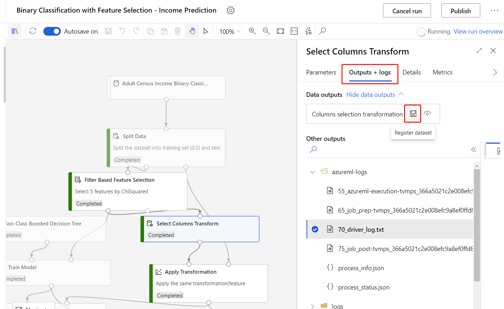

# Apply Transformation component

This article describes a component in Azure Machine Learning designer.

Use this component to modify an input dataset based on a previously computed transformation. This component is necessary in if you need to update transformations in inference pipelines.

For example, if you used z-scores to normalize your training data by using the **Normalize Data** component, you would want to use the z-score value that was computed for training during the scoring phase as well. In Azure Machine Learning, you can save the normalization method as a transform, and then using **Apply Transformation** to apply the z-score to the input data before scoring.

## How to save transformations

The designer lets you save data transformations as **datasets** so that you can use them in other pipelines.

1. Select a data transformation component that has successfully run.

1. Select the **Outputs + logs** tab.

1. Find the transformation output, and select the **Register dataset** to save it as a component under **Datasets** category in the component palette.

## How to use Apply Transformation  
  
1. Add the **Apply Transformation** component to your pipeline. You can find this component in the **Model Scoring & Evaluation** section of the component palette. 
  
1. Find the saved transformation you want to use under **Datasets** in the component palette.

1. Connect the output of the saved transformation to the left input port of the **Apply Transformation** component.

    The dataset should have exactly the same schema (number of columns, column names, data types) as the dataset for which the transformation was first designed.  
  
1. Connect the dataset output of the desired component to the right input port of the **Apply Transformation** component.
  
1. To apply a transformation to the new dataset, submit the pipeline.  

> [!IMPORTANT]
> To make sure the updated transformation in training pipelines is also feasible in inference pipelines, you need to follow the steps below each time there is updated transformation in the training pipeline:
> 1. In the training pipeline, register the output of the [Select Columns Transform](select-columns-transform.md) as a dataset.
> 
> 1. In the inference pipeline, remove the **TD-** component, and replace it with the registered dataset in the previous step.
> 

## Next steps

See the [set of components available](component-reference.md) to Azure Machine Learning. 