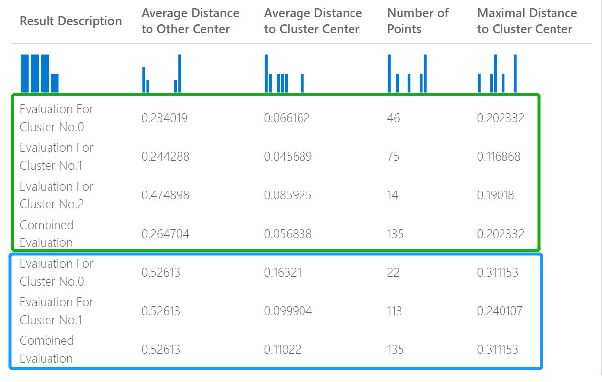

# Evaluate Model component

This article describes a component in Azure Machine Learning designer.

Use this component to measure the accuracy of a trained model. You provide a dataset containing scores generated from a model, and the **Evaluate Model** component computes a set of industry-standard evaluation metrics.
  
 The metrics returned by **Evaluate Model** depend on the type of model that you are evaluating:  
  
-   **Classification Models**    
-   **Regression Models**  
-   **Clustering Models**  

> [!TIP]
> If you are new to model evaluation, we recommend the video series by Dr. Stephen Elston, as part of the [machine learning course](/archive/blogs/machinelearning/new-edx-course-data-science-machine-learning-essentials) from EdX. 

## How to use Evaluate Model
1. Connect the **Scored dataset** output of the [Score Model](./score-model.md) or Result dataset output of the [Assign Data to Clusters](./assign-data-to-clusters.md) to the left input port of **Evaluate Model**. 
    > [!NOTE] 
    > If use components like "Select Columns in Dataset" to select part of input dataset, please ensure
    > Actual label column (used in training), 'Scored Probabilities' column and 'Scored Labels' column exist to calculate metrics like AUC, Accuracy for binary classification/anomaly detection.
    > Actual label column, 'Scored Labels' column exist to calculate metrics for multi-class classification/regression.
    > 'Assignments' column, columns 'DistancesToClusterCenter no.X' (X is centroid index, ranging from 0, ..., Number of centroids-1)     exist to calculate metrics for clustering.

    > [!IMPORTANT]
    > + To evaluate the results, the output dataset should contain specific score column names, which meet Evaluate Model component requirements.
    > + The `Labels` column will be considered as actual labels.
    > + For regression task, the dataset to evaluate must has one column, named `Regression Scored Labels`, which represents scored labels.
    > + For binary classification task, the dataset to evaluate must has two columns, named `Binary Class Scored Labels`,`Binary Class Scored Probabilities`, which represent scored labels, and probabilities respectively.
    > + For multi classification task, the dataset to evaluate must has one column, named `Multi Class Scored Labels`, which represents scored labels.
    > If the outputs of the upstream component does not have these columns, you need to modify according to the requirements above.

2. [Optional] Connect the **Scored dataset** output of the [Score Model](./score-model.md) or Result dataset output of the Assign Data to Clusters for the second model to the **right** input port of **Evaluate Model**. You can easily compare results from two different models on the same data. The two input algorithms should be the same algorithm type. Or, you might compare scores from two different runs over the same data with different parameters.

    > [!NOTE]
    > Algorithm type refers to 'Two-class Classification', 'Multi-class Classification', 'Regression', 'Clustering' under 'Machine Learning Algorithms'. 

3. Submit the pipeline to generate the evaluation scores.

## Results

After you run **Evaluate Model**, select the component to open up the **Evaluate Model** navigation panel on the right.  Then, choose the **Outputs + Logs** tab, and on that tab the **Data Outputs** section has several icons. The **Visualize** icon has a bar graph icon, and is a first way to see the results.

For binary-classification, after you click **Visualize** icon, you can visualize the binary confusion matrix.
For multi-classification, you can find the confusion matrix plot file under the **Outputs + Logs** tab like following:
> [!div class="mx-imgBorder"]
> 

If you connect datasets to both inputs of **Evaluate Model**, the results will contain metrics for both set of data, or both models.
The model or data attached to the left port is presented first in the report, followed by the metrics for the dataset, or model attached on the right port.  

For example, the following image represents a comparison of results from two clustering models that were built on the same data, but with different parameters.  

  

Because this is a clustering model, the evaluation results are different than if you compared scores from two regression models, or compared two classification models. However, the overall presentation is the same. 

## Metrics

This section describes the metrics returned for the specific types of models supported for use with **Evaluate Model**:

+ [classification models](#metrics-for-classification-models)
+ [regression models](#metrics-for-regression-models)
+ [clustering models](#metrics-for-clustering-models)

### Metrics for classification models

The following metrics are reported when evaluating binary classification models.
  
-   **Accuracy** measures the goodness of a classification model as the proportion of true results to total cases.  
  
-   **Precision** is the proportion of true results over all positive results. Precision = TP/(TP+FP)  
  
-   **Recall** is the fraction of the total amount of relevant instances that were actually retrieved. Recall = TP/(TP+FN)  
  
-   **F1 score** is computed as the weighted average of precision and recall between 0 and 1, where the ideal F1 score value is 1.  
  
-   **AUC** measures the area under the curve plotted with true positives on the y axis and false positives on the x axis. This metric is useful because it provides a single number that lets you compare models of different types. AUC is classification-threshold-invariant. It measures the quality of the model's predictions irrespective of what classification threshold is chosen.

### Metrics for regression models
 
The metrics returned for regression models are designed to estimate the amount of error.  A model is considered to fit the data well if the difference between observed and predicted values is small. However, looking at the pattern of the residuals (the difference between any one predicted point and its corresponding actual value) can tell you a lot about potential bias in the model.  
  
 The following metrics are reported for evaluating regression models.
  
- **Mean absolute error (MAE)** measures how close the predictions are to the actual outcomes; thus, a lower score is better.  
  
- **Root mean squared error (RMSE)** creates a single value that summarizes the error in the model. By squaring the difference, the metric disregards the difference between over-prediction and under-prediction.  
  
- **Relative absolute error (RAE)** is the relative absolute difference between expected and actual values; relative because the mean difference is divided by the arithmetic mean.  
  
- **Relative squared error (RSE)** similarly normalizes the total squared error of the predicted values by dividing by the total squared error of the actual values.  
  

  
- **Coefficient of determination**, often referred to as R2, represents the predictive power of the model as a value between 0 and 1. Zero means the model is random (explains nothing); 1 means there is a perfect fit. However, caution should be used in interpreting  R2 values, as low values can be entirely normal and high values can be suspect.

###  Metrics for clustering models

Because clustering models differ significantly from classification and regression models in many respects, [Evaluate Model](evaluate-model.md) also returns a different set of statistics for clustering models.  
  
 The statistics returned for a clustering model describe how many data points were assigned to each cluster, the amount of separation between clusters, and how tightly the data points are bunched within each cluster.  
  
 The statistics for the clustering model are averaged over the entire dataset, with additional rows containing the statistics per cluster.  
  
The following metrics are reported for evaluating clustering models.
    
-   The scores in the column, **Average Distance to Other Center**, represent how close, on average, each point in the cluster is to the centroids of all other clusters.   

-   The scores in the column, **Average Distance to Cluster Center**, represent the closeness of all points in a cluster to the centroid of that cluster.  
  
-   The **Number of Points** column shows how many data points were assigned to each cluster, along with the total overall number of data points in any cluster.  
  
     If the number of data points assigned to clusters is less than the total number of data points available, it means that the data points could not be assigned to a cluster.  
  
-   The scores in the column, **Maximal Distance to Cluster Center**, represent the max of the distances between each point and the centroid of that point's cluster.  
  
     If this number is high, it can mean that the cluster is widely dispersed. You should review this statistic together with the **Average Distance to Cluster Center** to determine the cluster's spread.   

-   The **Combined Evaluation** score at the bottom of each section of results lists the averaged scores for the clusters created in that particular model.  

## Next steps

See the [set of components available](component-reference.md) to Azure Machine Learning.
