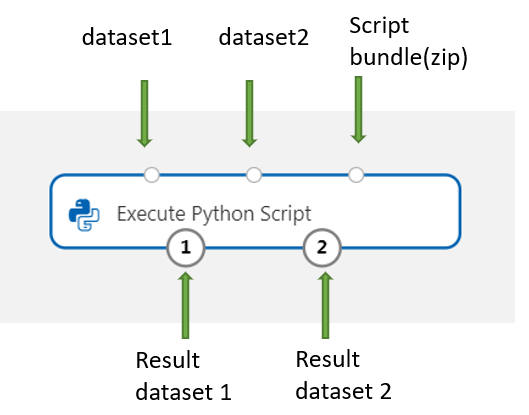
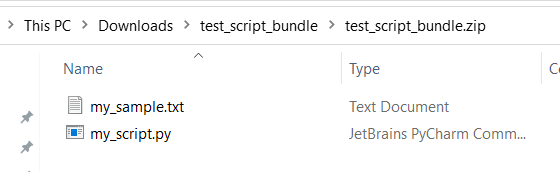

# Execute Python Script component

This article describes the Execute Python Script component in Azure Machine Learning designer.

Use this component to run Python code. For more information about the architecture and design principles of Python, see [how run Python code in Azure Machine Learning designer](../v1/how-to-designer-python.md).

With Python, you can perform tasks that existing components don't support, such as:

+ Visualizing data by using `matplotlib`.
+ Using Python libraries to enumerate datasets and models in your workspace.
+ Reading, loading, and manipulating data from sources that the [Import Data](./import-data.md) component doesn't support.
+ Run your own deep learning code. 

## Supported Python packages

Azure Machine Learning uses the Anaconda distribution of Python, which includes many common utilities for data processing. We will update the Anaconda version automatically. The current version is:
 -  Anaconda 4.5+ distribution for Python 3.6 

For a complete list, see the section [Preinstalled Python packages](#preinstalled-python-packages).

To install packages that aren't in the preinstalled list (for example, *scikit-misc*), add the following code to your script: 

```python
import os
os.system(f"pip install scikit-misc")
```

Use the following code to install packages for better performance, especially for inference:
```python
import importlib.util
package_name = 'scikit-misc'
spec = importlib.util.find_spec(package_name)
if spec is None:
    import os
    os.system(f"pip install scikit-misc")
```

> [!NOTE]
> If your pipeline contains multiple Execute Python Script components that need packages that aren't in the preinstalled list, install the packages in each component.

> [!WARNING]
> Excute Python Script component does not support installing packages that depend on extra native libraries with command like "apt-get", such as Java, PyODBC and etc. This is because this component is executed in a simple environment with Python pre-installed only and with non-admin permission.  

## Access to current workspace and registered datasets

You can refer to the following sample code to access to the [registered datasets](../v1/how-to-create-register-datasets.md) in your workspace:

```Python
def azureml_main(dataframe1 = None, dataframe2 = None):

    # Execution logic goes here
    print(f'Input pandas.DataFrame #1: {dataframe1}')
    from azureml.core import Run
    run = Run.get_context(allow_offline=True)
    #access to current workspace
    ws = run.experiment.workspace

    #access to registered dataset of current workspace
    from azureml.core import Dataset
    dataset = Dataset.get_by_name(ws, name='test-register-tabular-in-designer')
    dataframe1 = dataset.to_pandas_dataframe()
     
    # If a zip file is connected to the third input port,
    # it is unzipped under "./Script Bundle". This directory is added
    # to sys.path. Therefore, if your zip file contains a Python file
    # mymodule.py you can import it using:
    # import mymodule

    # Return value must be of a sequence of pandas.DataFrame
    # E.g.
    #   -  Single return value: return dataframe1,
    #   -  Two return values: return dataframe1, dataframe2
    return dataframe1,
```

## Upload files
The Execute Python Script component supports uploading files by using the [Azure Machine Learning Python SDK](/python/api/azureml-core/azureml.core.run%28class%29#upload-file-name--path-or-stream-).

The following example shows how to upload an image file in the Execute Python Script component:

```Python

# The script MUST contain a function named azureml_main,
# which is the entry point for this component.

# Imports up here can be used to
import pandas as pd

# The entry point function must have two input arguments:
#   Param<dataframe1>: a pandas.DataFrame
#   Param<dataframe2>: a pandas.DataFrame
def azureml_main(dataframe1 = None, dataframe2 = None):

    # Execution logic goes here
    print(f'Input pandas.DataFrame #1: {dataframe1}')

    from matplotlib import pyplot as plt
    plt.plot([1, 2, 3, 4])
    plt.ylabel('some numbers')
    img_file = "line.png"
    plt.savefig(img_file)

    from azureml.core import Run
    run = Run.get_context(allow_offline=True)
    run.upload_file(f"graphics/{img_file}", img_file)

    # Return value must be of a sequence of pandas.DataFrame
    # For example:
    #   -  Single return value: return dataframe1,
    #   -  Two return values: return dataframe1, dataframe2
    return dataframe1,
```

After the pipeline run is finished, you can preview the image in the right panel of the component.

> [!div class="mx-imgBorder"]
> 

You can also upload file to any datastore using following code. You can only preview the file in your storage account.
```Python
import pandas as pd

# The entry point function MUST have two input arguments.
# If the input port is not connected, the corresponding
# dataframe argument will be None.
#   Param<dataframe1>: a pandas.DataFrame
#   Param<dataframe2>: a pandas.DataFrame
def azureml_main(dataframe1 = None, dataframe2 = None):

    # Execution logic goes here
    print(f'Input pandas.DataFrame #1: {dataframe1}')

    from matplotlib import pyplot as plt
    import os

    plt.plot([1, 2, 3, 4])
    plt.ylabel('some numbers')
    img_file = "line.png"

    # Set path
    path = "./img_folder"
    os.mkdir(path)
    plt.savefig(os.path.join(path,img_file))

    # Get current workspace
    from azureml.core import Run
    run = Run.get_context(allow_offline=True)
    ws = run.experiment.workspace
    
    # Get a named datastore from the current workspace and upload to specified path
    from azureml.core import Datastore 
    datastore = Datastore.get(ws, datastore_name='workspacefilestore')
    datastore.upload(path)

    return dataframe1,
```


## How to configure Execute Python Script

The Execute Python Script component contains sample Python code that you can use as a starting point. To configure the Execute Python Script component, provide a set of inputs and Python code to run in the **Python script** text box.

1. Add the **Execute Python Script** component to your pipeline.

2. Add and connect on **Dataset1** any datasets from the designer that you want to use for input. Reference this dataset in your Python script as **DataFrame1**.

    Use of a dataset is optional. Use it if you want to generate data by using Python, or use Python code to import the data directly into the component.

    This component supports the addition of a second dataset on **Dataset2**. Reference the second dataset in your Python script as **DataFrame2**.

    Datasets stored in Azure Machine Learning are automatically converted to pandas data frames when loaded with this component.

    

4. To include new Python packages or code, connect the zipped file that contains these custom resources to **Script bundle** port. Or if your script is larger than 16 KB, use the **Script Bundle** port to avoid errors like *CommandLine exceeds the limit of 16597 characters*. 

    
    1. Bundle the script and other custom resources to a zip file.
    1. Upload the zip file as a **File Dataset** to the studio. 
    1. Drag the dataset component from the *Datasets* list in the left component pane in the designer authoring page. 
    1. Connect the dataset component to the **Script Bundle** port of **Execute Python Script** component.
    
    Any file contained in the uploaded zipped archive can be used during pipeline execution. If the archive includes a directory structure, the structure is preserved.
 
    > [!IMPORTANT]
    > Please use unique and meaningful name for files in the script bundle since some common words (like `test`, `app` and etc) are reserved for built-in services.
   
    Following is a script bundle example, which contains a Python script file and a txt file:
      
    > [!div class="mx-imgBorder"]
    >   

    Following is the content of `my_script.py`:

    ```python
    def my_func(dataframe1):
        return dataframe1
    ```
    Following is sample code showing how to consume the files in the script bundle:    

    ```python
    import pandas as pd
    from my_script import my_func
 
    def azureml_main(dataframe1 = None, dataframe2 = None):
 
        # Execution logic goes here
        print(f'Input pandas.DataFrame #1: {dataframe1}')
 
        # Test the custom defined Python function
        dataframe1 = my_func(dataframe1)
 
        # Test to read custom uploaded files by relative path
        with open('./Script Bundle/my_sample.txt', 'r') as text_file:
            sample = text_file.read()
    
        return dataframe1, pd.DataFrame(columns=["Sample"], data=[[sample]])
    ```

5. In the **Python script** text box, type or paste valid Python script.

    > [!NOTE]
    >  Be careful when writing your script. Make sure there are no syntax errors, such as using undeclared variables or unimported components or functions. Pay extra attention to the preinstalled component list. To import components that aren't listed, install the corresponding packages in your script, such as:
    >  ``` Python
    > import os
    > os.system(f"pip install scikit-misc")
    > ```
    
    The **Python script** text box is prepopulated with some instructions in comments, and sample code for data access and output. You must edit or replace this code. Follow Python conventions for indentation and casing:

    + The script must contain a function named `azureml_main` as the entry point for this component.
    + The entry point function must have two input arguments, `Param<dataframe1>` and `Param<dataframe2>`, even when these arguments aren't used in your script.
    + Zipped files connected to the third input port are unzipped and stored in the directory `.\Script Bundle`, which is also added to the Python `sys.path`. 

    If your .zip file contains `mymodule.py`, import it by using `import mymodule`.

    Two datasets can be returned to the designer, which must be a sequence of type `pandas.DataFrame`. You can create other outputs in your Python code and write them directly to Azure storage.

    > [!WARNING]
    > It's **Not** recommended to connect to a Database or other external storages in **Execute Python Script component**. You can use [Import Data component](./import-data.md) and [Export Data component](./export-data.md)     

6. Submit the pipeline.

    If the component is completed, check the output if as expected.

    If the component is failed, you need to do some troubleshooting. Select the component, and open **Outputs+logs** in the right pane. Open **70_driver_log.txt** and search **in azureml_main**, then you could find which line caused the error. For example, "File "/tmp/tmp01_ID/user_script.py", line 17, in azureml_main" indicates that the error occurred in the 17 line of your Python script.

## Results

The results of any computations by the embedded Python code must be provided as `pandas.DataFrame`, which is automatically converted to the Azure Machine Learning dataset format. You can then use the results with other components in the pipeline.

The component returns two datasets:  
  
+ **Results Dataset 1**, defined by the first returned pandas data frame in a Python script.

+ **Result Dataset 2**, defined by the second returned pandas data frame in a Python script.

## Preinstalled Python packages
The preinstalled packages are:
-    adal==1.2.2
-    applicationinsights==0.11.9
-    attrs==19.3.0
-    azure-common==1.1.25
-    azure-core==1.3.0
-    azure-graphrbac==0.61.1
-    azure-identity==1.3.0
-    azure-mgmt-authorization==0.60.0
-    azure-mgmt-containerregistry==2.8.0
-    azure-mgmt-keyvault==2.2.0
-    azure-mgmt-resource==8.0.1
-    azure-mgmt-storage==8.0.0
-    azure-storage-blob==1.5.0
-    azure-storage-common==1.4.2
-    azureml-core==1.1.5.5
-    azureml-dataprep-native==14.1.0
-    azureml-dataprep==1.3.5
-    azureml-defaults==1.1.5.1
-    azureml-designer-classic-modules==0.0.118
-    azureml-designer-core==0.0.31
-    azureml-designer-internal==0.0.18
-    azureml-model-management-sdk==1.0.1b6.post1
-    azureml-pipeline-core==1.1.5
-    azureml-telemetry==1.1.5.3
-    backports.tempfile==1.0
-    backports.weakref==1.0.post1
-    boto3==1.12.29
-    botocore==1.15.29
-    cachetools==4.0.0
-    certifi==2019.11.28
-    cffi==1.12.3
-    chardet==3.0.4
-    click==7.1.1
-    cloudpickle==1.3.0
-    configparser==3.7.4
-    contextlib2==0.6.0.post1
-    cryptography==2.8
-    cycler==0.10.0
-    dill==0.3.1.1
-    distro==1.4.0
-    docker==4.2.0
-    docutils==0.15.2
-    dotnetcore2==2.1.13
-    flask==1.0.3
-    fusepy==3.0.1
-    gensim==3.8.1
-    google-api-core==1.16.0
-    google-auth==1.12.0
-    google-cloud-core==1.3.0
-    google-cloud-storage==1.26.0
-    google-resumable-media==0.5.0
-    googleapis-common-protos==1.51.0
-    gunicorn==19.9.0
-    idna==2.9
-    imbalanced-learn==0.4.3
-    isodate==0.6.0
-    itsdangerous==1.1.0
-    jeepney==0.4.3
-    jinja2==2.11.1
-    jmespath==0.9.5
-    joblib==0.14.0
-    json-logging-py==0.2
-    jsonpickle==1.3
-    jsonschema==3.0.1
-    kiwisolver==1.1.0
-    liac-arff==2.4.0
-    lightgbm==2.2.3
-    markupsafe==1.1.1
-    matplotlib==3.1.3
-    more-itertools==6.0.0
-    msal-extensions==0.1.3
-    msal==1.1.0
-    msrest==0.6.11
-    msrestazure==0.6.3
-    ndg-httpsclient==0.5.1
-    nimbusml==1.6.1
-    numpy==1.18.2
-    oauthlib==3.1.0
-    pandas==0.25.3
-    pathspec==0.7.0
-    pip==20.0.2
-    portalocker==1.6.0
-    protobuf==3.11.3
-    pyarrow==0.16.0
-    pyasn1-modules==0.2.8
-    pyasn1==0.4.8
-    pycparser==2.20
-    pycryptodomex==3.7.3
-    pyjwt==1.7.1
-    pyopenssl==19.1.0
-    pyparsing==2.4.6
-    pyrsistent==0.16.0
-    python-dateutil==2.8.1
-    pytz==2019.3
-    requests-oauthlib==1.3.0
-    requests==2.23.0
-    rsa==4.0
-    ruamel.yaml==0.15.89
-    s3transfer==0.3.3
-    scikit-learn==0.22.2
-    scipy==1.4.1
-    secretstorage==3.1.2
-    setuptools==46.1.1.post20200323
-    six==1.14.0
-    smart-open==1.10.0
-    urllib3==1.25.8
-    websocket-client==0.57.0
-    werkzeug==0.16.1
-    wheel==0.34.2

## Next steps

See the [set of components available](component-reference.md) to Azure Machine Learning.
