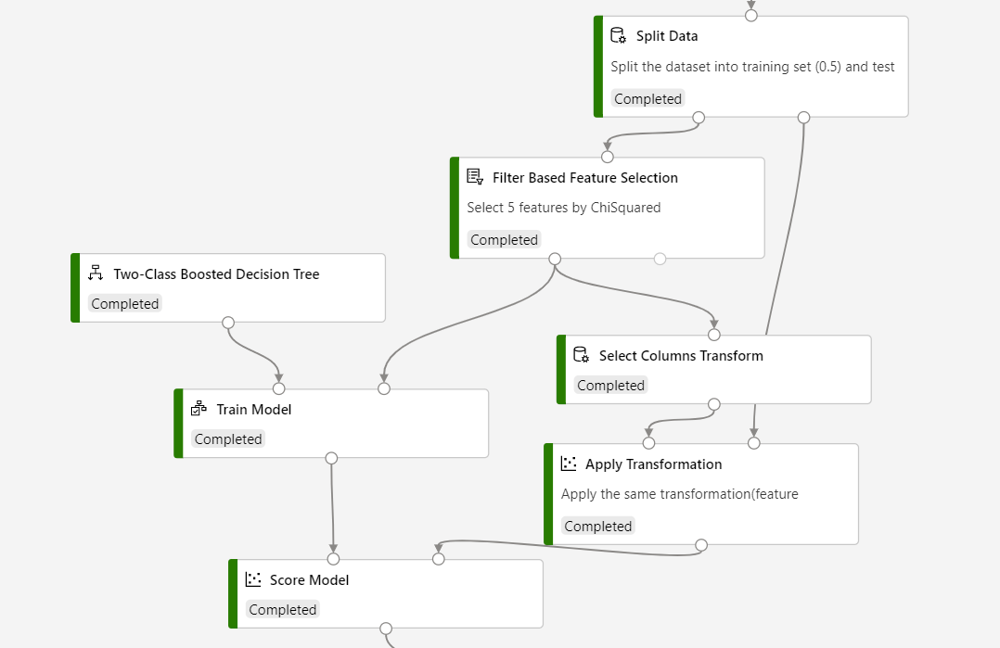

# Filter Based Feature Selection

This article describes how to use the Filter Based Feature Selection component in Azure Machine Learning designer. This component helps you identify the columns in your input dataset that have the greatest predictive power. 

In general, *feature selection* refers to the process of applying statistical tests to inputs, given a specified output. The goal is to determine which columns are more predictive of the output. The Filter Based Feature Selection component provides multiple feature selection algorithms to choose from. The component includes correlation methods such as Pearson correlation and chi-squared values. 

When you use the Filter Based Feature Selection component, you provide a dataset and identify the column that contains the label or dependent variable. You then specify a single method to use in measuring feature importance.

The component outputs a dataset that contains the best feature columns, as ranked by predictive power. It also outputs the names of the features and their scores from the selected metric.  

## What filter-based feature selection is  

This component for feature selection is called "filter-based" because you use the selected metric to find irrelevant attributes. You then filter out redundant columns from your model. You choose a single statistical measure that suits your data, and the component calculates a score for each feature column. The columns are returned ranked by their feature scores. 

By choosing the right features, you can potentially improve the accuracy and efficiency of classification. 

You typically use only the columns with the best scores to build your predictive model. Columns with poor feature selection scores can be left in the dataset and ignored when you build a model.  

## How to choose a feature selection metric

The Filter-Based Feature Selection component provides a variety of metrics for assessing the information value in each column. This section provides a general description of each metric, and how it's applied. You can find additional requirements for using each metric in the [technical notes](#technical-notes) and in the [instructions](#how-to-configure-filter-based-feature-selection) for configuring each component.

-   **Pearson correlation**  

    Pearson’s correlation statistic, or Pearson’s correlation coefficient, is also known in statistical models as the `r` value. For any two variables, it returns a value that indicates the strength of the correlation.

    Pearson's correlation coefficient is computed by taking the covariance of two variables and dividing by the product of their standard deviations. Changes of scale in the two variables don't affect the coefficient.  

-   **Chi squared**  

    The two-way chi-squared test is a statistical method that measures how close expected values are to actual results. The method assumes that variables are random and drawn from an adequate sample of independent variables. The resulting chi-squared statistic indicates how far results are from the expected (random) result.  

> [!TIP]
> If you need a different option for the custom feature selection method, use the [Execute R Script](execute-r-script.md) component. 

## How to configure Filter-Based Feature Selection

You choose a standard statistical metric. The component computes the correlation between a pair of columns: the label column and a feature column.

1.  Add the Filter-Based Feature Selection component to your pipeline. You can find it in the **Feature Selection** category in the designer.

2. Connect an input dataset that contains at least two columns that are potential features.  

    To ensure that a column is analyzed and a feature score is generated, use the [Edit Metadata](edit-metadata.md) component to set the **IsFeature** attribute. 

    > [!IMPORTANT]
    > Ensure that the columns that you're providing as input are potential features. For example, a column that contains a single value has no information value.
    >
    > If you know that some columns would make bad features, you can remove them from the column selection. You can also use the [Edit Metadata](edit-metadata.md) component to flag them as **Categorical**. 
3.  For **Feature scoring method**, choose one of the following established statistical methods to use in calculating scores.  

    | Method              | Requirements                             |
    | ------------------- | ---------------------------------------- |
    | Pearson correlation | Label can be text or numeric. Features must be numeric. |
    Chi squared| Labels and features can be text or numeric. Use this method for computing feature importance for two categorical columns.|

    > [!TIP]
    > If you change the selected metric, all other selections will be reset. So be sure to set this option first.
4.  Select the **Operate on feature columns only** option to generate a score only for columns that were previously marked as features. 

    If you clear this option, the component will create a score for any column that otherwise meets the criteria, up to the number of columns specified in **Number of desired features**.  

5.  For **Target column**, select **Launch column selector** to choose the label column either by name or by its index. (Indexes are one-based.)  
    A label column is required for all methods that involve statistical correlation. The component returns a design-time error if you choose no label column or multiple label columns. 

6.  For **Number of desired features**, enter the number of feature columns that you want returned as a result:  

    - The minimum number of features that you can specify is one, but we recommend that you increase this value.  

    - If the specified number of desired features is greater than the number of columns in the dataset, then all features are returned. Even features with zero scores are returned.  

    - If you specify fewer result columns than there are feature columns, the features are ranked by descending score. Only the top features are returned. 

7.  Submit the pipeline.

> [!IMPORTANT]
> If you are going to use **Filter Based Feature Selection** in inference, you need to use [Select Columns Transform](./select-columns-transform.md) to store the feature selected result and [Apply Transformation](./apply-transformation.md) to apply the feature selected transformation to the scoring dataset.
>
> Refer to the following screenshot to build your pipeline, to ensure that column selections are the same for the scoring process.
> [!div class="mx-imgBorder"]
> 

## Results

After processing is complete:

+ To see a complete list of the analyzed feature columns and their scores, right-click the component and select **Visualize**.  

+ To view the dataset based on your feature selection criteria, right-click the component and select **Visualize**. 

If the dataset contains fewer columns than you expected, check the component settings. Also check the data types of the columns provided as input. For example, if you set **Number of desired features** to 1, the output dataset contains just two columns: the label column, and the most highly ranked feature column.

##  Technical notes  

### Implementation details

If you use Pearson correlation on a numeric feature and a categorical label, the feature score is calculated as follows:  

1.  For each level in the categorical column, compute the conditional mean of numeric column.  

2.  Correlate the column of conditional means with the numeric column.  

### Requirements  

-   A feature selection score can't be generated for any column that's designated as a **Label** or **Score** column.  

-   If you try to use a scoring method with a column of a data type that the method doesn't support, the component will raise an error. Or, a zero score will be assigned to the column.  

-   If a column contains logical (true/false) values, they're processed as `True = 1` and `False = 0`.  

-   A column can't be a feature if it has been designated as a **Label** or a **Score**.  

### How missing values are handled  

-   You can't specify as a target (label) column any column that has all missing values.  

-   If a column contains missing values, the component ignores them when it's computing the score for the column.  

-   If a column designated as a feature column has all missing values, the component assigns a zero score.   

## Next steps

See the [set of components available](component-reference.md) to Azure Machine Learning. 
