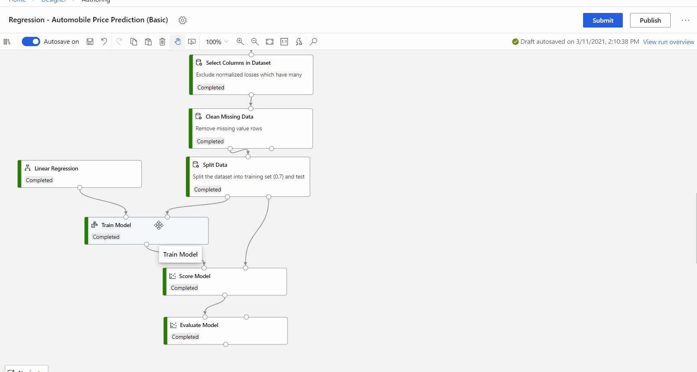

# Train Model component

This article describes a component in Azure Machine Learning designer.

Use this component to train a classification or regression model. Training takes place after you have defined a model and set its parameters, and requires tagged data. You can also use **Train Model** to retrain an existing model with new data. 

## How the training process works

In Azure Machine Learning, creating and using a machine learning model is typically a three-step process. 

1. You configure a model, by choosing a particular type of algorithm, and defining its parameters or hyperparameters. Choose any of the following model types: 

    + **Classification** models, based on neural networks, decision trees, and decision forests, and other algorithms.
    + **Regression** models, which can include standard linear regression, or which use other algorithms, including neural networks and Bayesian regression.  

2. Provide a dataset that is labeled, and has data compatible with the algorithm. Connect both the data and the model to **Train Model**.

    What training produces is a specific binary format, the iLearner, that encapsulates the statistical patterns learned from the data. You cannot directly modify or read this format; however, other components can use this trained model. 
    
    You can also view properties of the model. For more information, see the Results section.

3. After training is completed, use the trained model with one of the [scoring components](./score-model.md), to make predictions on new data.

## How to use Train Model 
    
1. Add the **Train Model** component to the pipeline.  You can find this component under the **Machine Learning** category. Expand **Train**, and then drag the **Train Model** component into your pipeline.
  
1.  On the left input, attach the untrained mode. Attach the training dataset to the right-hand input of **Train Model**.

    The training dataset must contain a label column. Any rows without labels are ignored.
  
1.  For **Label column**, click **Edit column** in the right panel of component, and choose a single column that contains outcomes the model can use for training.
  
    - For classification problems, the label column must contain either **categorical** values or **discrete** values. Some examples might be a yes/no rating, a disease classification code or name, or an income group.  If you pick a noncategorical column, the component will return an error during training.
  
    -   For regression problems, the label column must contain **numeric** data that represents the response variable. Ideally the numeric data represents a continuous scale. 
    
    Examples might be a credit risk score, the projected time to failure for a hard drive, or the forecasted number of calls to a call center on a given day or time.  If you do not choose a numeric column, you might get an error.
  
    -   If you do not specify which label column to use, Azure Machine Learning will try to infer which is the appropriate label column, by using the metadata of the dataset. If it picks the wrong column, use the column selector to correct it.
  
    > [!TIP] 
    > If you have trouble using the Column Selector, see the article [Select Columns in Dataset](./select-columns-in-dataset.md) for tips. It describes some common scenarios and tips for using the **WITH RULES** and **BY NAME** options.
  
1.  Submit the pipeline. If you have a lot of data, it can take a while.

    > [!IMPORTANT] 
    > If you have an ID column which is the ID of each row, or a text column, which contains too many unique values, **Train Model** may hit an error like "Number of unique values in column: "{column_name}" is greater than allowed.
    >
    > This is because the column hit the threshold of unique values, and may cause out of memory. You can use [Edit Metadata](edit-metadata.md) to mark that column as **Clear feature** and it will not be used in training, or [Extract N-Gram Features from Text component](extract-n-gram-features-from-text.md) to preprocess text column. See [Designer error code](././designer-error-codes.md) for more error details.

## Model Interpretability

Model interpretability provides possibility to comprehend the ML model and to present the underlying basis for decision-making in a way that is understandable to humans.

Currently **Train Model** component supports [using interpretability package to explain ML models](../v1/how-to-machine-learning-interpretability-aml.md#generate-feature-importance-values-via-remote-runs). Following built-in algorithms are supported:

- Linear Regression
- Neural Network Regression
- Boosted Decistion Tree Regression
- Decision Forest Regression
- Poisson Regression
- Two-Class Logistic Regression
- Two-Class Support Vector Machine
- Two-Class Boosted Decistion Tree
- Two-Class Decision Forest
- Multi-class Decision Forest
- Multi-class Logistic Regression
- Multi-class Neural Network

To generate model explanations, you can select **True** in the drop-down list of **Model Explanation** in Train Model component. By default it is set to False in the **Train Model** component. Please note that generating explanation requires extra compute cost.

After the pipeline run completed, you can visit **Explanations** tab in the right pane of **Train Model** component, and explore the model performance, dataset and feature importance.

To learn more about using model explanations in Azure Machine Learning, refer to the how-to article about [Interpret ML models](../v1/how-to-machine-learning-interpretability-aml.md#generate-feature-importance-values-via-remote-runs).

## Results

After the model is trained:

+ To use the model in other pipelines, select the component and select the **Register dataset** icon under the **Outputs** tab in right panel. You can access saved models in the component palette under **Datasets**.

+ To use the model in predicting new values, connect it to the [Score Model](./score-model.md) component, together with new input data.

## Next steps

See the [set of components available](component-reference.md) to Azure Machine Learning.