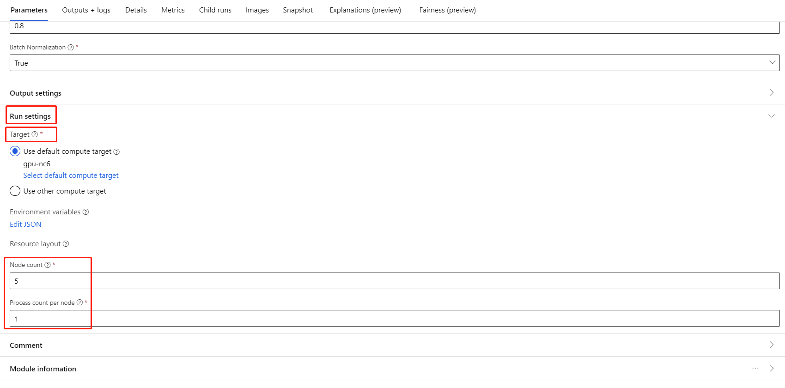
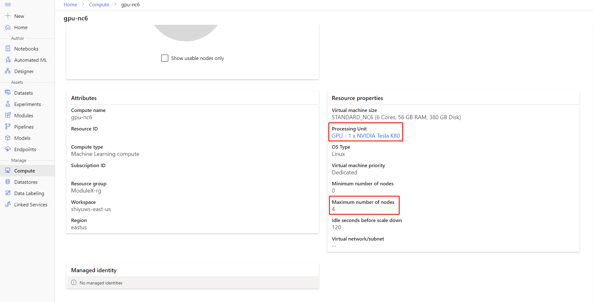
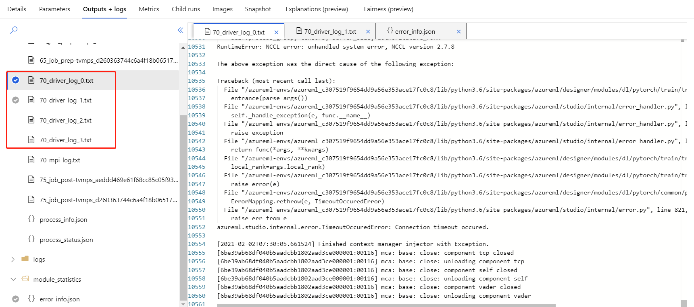

# Train PyTorch Model

This article describes how to use the **Train PyTorch Model** component in Azure Machine Learning designer to train PyTorch models like DenseNet. Training takes place after you define a model and set its parameters, and requires labeled data. 

Currently, **Train PyTorch Model** component supports both single node and distributed training.

## How to use Train PyTorch Model 

1. Add [DenseNet](densenet.md) component or [ResNet](resnet.md) to your pipeline draft in the designer.

2. Add the **Train PyTorch Model** component to the pipeline. You can find this component under the **Model Training** category. Expand **Train**, and then drag the **Train PyTorch Model** component into your pipeline.

   > [!NOTE]
   > **Train PyTorch Model** component is better run on **GPU** type compute for large dataset, otherwise your pipeline will fail. You can select compute for specific component in the right pane of the component by setting **Use other compute target**.

3.  On the left input, attach an untrained model. Attach the training dataset and validation dataset to the middle and right-hand input of **Train PyTorch Model**.

    For untrained model, it must be a PyTorch model like DenseNet; otherwise, a 'InvalidModelDirectoryError' will be thrown.

    For dataset, the training dataset must be a labeled image directory. Refer to **Convert to Image Directory** for how to get a labeled image directory. If not labeled, a 'NotLabeledDatasetError' will be thrown.

    The training dataset and validation dataset have the same label categories, otherwise a InvalidDatasetError will be thrown.

4.  For **Epochs**, specify how many epochs you'd like to train. The whole dataset will be iterated in every epoch, by default 5.

5.  For **Batch size**, specify how many instances to train in a batch, by default 16.

6.  For **Warmup step number**, specify how many epochs you'd like to warm up the training, in case initial learning rate is slightly too large to start converging, by default 0.

7.  For **Learning rate**, specify a value for the *learning rate*, and the default value is 0.001. Learning rate controls the size of the step that is used in optimizer like sgd each time the model is tested and corrected.

    By setting the rate smaller, you test the model more often, with the risk that you might get stuck in a local plateau. By setting the rate larger, you can converge faster, with the risk of overshooting the true minima.

    > [!NOTE]
    > If train loss becomes nan during training, which may be caused by too large learning rate, decreasing learning rate may help.
    > In distributed training, to keep gradient descent stable, the actual learning rate is calculated by `lr * torch.distributed.get_world_size()` because batch size of the process group is world size times that of single process.
    > Polynomial learning rate decay is applied and can help result in a better performing model.

8.  For **Random seed**, optionally type an integer value to use as the seed. Using a seed is recommended if you want to ensure reproducibility of the experiment across jobs.

9.  For **Patience**, specify how many epochs to early stop training if validation loss does not decrease consecutively. by default 3.

10. For **Print frequency**, specify training log print frequency over iterations in each epoch, by default 10.

11. Submit the pipeline. If your dataset has larger size, it will take a while and GPU compute are recommended.

## Distributed training

In distributed training the workload to train a model is split up and shared among multiple mini processors, called worker nodes. These worker nodes work in parallel to speed up model training. Currently the designer support distributed training for **Train PyTorch Model** component.

### Training time

Distributed training makes it possible to train on a large dataset like ImageNet (1000 classes, 1.2 million images) in just several hours by **Train PyTorch Model**. The following table shows training time and performance during training 50 epochs of Resnet50 on ImageNet from scratch based on different devices.

| Devices       | Training Time  | Training Throughput  | Top-1 Validation Accuracy | Top-5 Validation Accuracy |
| ------------- | -------------- | -------------------- | ------------------------- | ------------------------- |
| 16 V100 GPUs  | 6h22min        | ~3200 Images/Sec     | 68.83%                    | 88.84%                    | 
| 8 V100 GPUs   | 12h21min       | ~1670 Images/Sec     | 68.84%                    | 88.74%                    |

Click on this component 'Metrics' tab and see training metric graphs, such as 'Train images per second' and 'Top 1 accuracy'.

### How to enable distributed training

To enable distributed training for **Train PyTorch Model** component, you can set in **Job settings** in the right pane of the component. Only **[AML Compute cluster](../how-to-create-attach-compute-cluster.md?tabs=python)** is supported for distributed training.

> [!NOTE]
> **Multiple GPUs** are required to activate distributed training because NCCL backend Train PyTorch Model component uses needs cuda.

1. Select the component and open the right panel. Expand the **Job settings** section.

    

2. Make sure you have select AML compute for the compute target.

3. In **Resource layout** section, you need to set the following values:

    - **Node count** : Number of nodes in the compute target used for training. It should be **less than or equal to** the **Maximum number of nodes** your compute cluster. By default it is 1, which means single node job.

    - **Process count per node**: Number of processes triggered per node. It should be **less than or equal to** the **Processing Unit** of your compute. By default it is 1, which means single process job.

    You can check the **Maximum number of nodes** and **Processing Unit** of your compute by clicking the compute name into the compute detail page.

    

You can learn more about distributed training in Azure Machine Learning [here](../concept-distributed-training.md).

### Troubleshooting for distributed training

If you enable distributed training for this component, there will be driver logs for each process. `70_driver_log_0` is for master process. You can check driver logs for error details of each process under **Outputs+logs** tab in the right pane.

 

If the component enabled distributed training fails without any `70_driver` logs, you can check `70_mpi_log` for error details.

The following example shows a common error, which is **Process count per node** is larger than **Processing Unit** of the compute.

You can refer to [this article](designer-error-codes.md) for more details about component troubleshooting.

## Results

After pipeline job is completed, to use the model for scoring, connect the [Train PyTorch Model](train-PyTorch-model.md) to [Score Image Model](score-image-model.md), to predict values for new input examples.

## Technical notes
###  Expected inputs  

| Name               | Type                    | Description                              |
| ------------------ | ----------------------- | ---------------------------------------- |
| Untrained model    | UntrainedModelDirectory | Untrained model, require PyTorch         |
| Training dataset   | ImageDirectory          | Training dataset                         |
| Validation dataset | ImageDirectory          | Validation dataset for evaluation every epoch |

###  Component parameters  

| Name          | Range            | Type    | Default | Description                              |
| ------------- | ---------------- | ------- | ------- | ---------------------------------------- |
| Epochs        | >0               | Integer | 5       | Select the column that contains the label or outcome column |
| Batch size    | >0               | Integer | 16      | How many instances to train in a batch   |
| Warmup step number | >=0         | Integer | 0       | How many epochs to warm up training |
| Learning rate | >=double.Epsilon | Float   | 0.1   | The initial learning rate for the Stochastic Gradient Descent optimizer. |
| Random seed   | Any              | Integer | 1       | The seed for the random number generator used by the model. |
| Patience      | >0               | Integer | 3       | How many epochs to early stop training   |
| Print frequency |             >0 | Integer | 10      | Training log print frequency over iterations in each epoch |

###  Outputs  

| Name          | Type           | Description   |
| ------------- | -------------- | ------------- |
| Trained model | ModelDirectory | Trained model |

## Next steps

See the [set of components available](component-reference.md) to Azure Machine Learning.