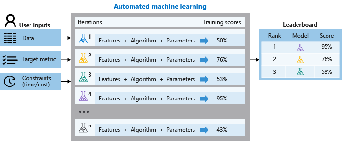

# What is automated machine learning (AutoML)?

Automated machine learning, also referred to as automated ML or AutoML, is the process of automating the time consuming, iterative tasks of machine learning model development. It allows data scientists, analysts, and developers to build ML models with high scale, efficiency, and productivity all while sustaining model quality. Automated ML in Azure Machine Learning is based on a breakthrough from our [Microsoft Research division](https://www.microsoft.com/research/project/automl/).

Traditional machine learning model development is resource-intensive, requiring significant domain knowledge and time to produce and compare dozens of models. With automated machine learning, you'll accelerate the time it takes to get production-ready ML models with great ease and efficiency.

## AutoML in Azure Machine Learning

Azure Machine Learning offers two experiences for working with automated ML:

* For code experienced customers, [Azure Machine Learning Python SDK](/python/api/overview/azure/ml/intro).  Get started with [Tutorial: Use automated machine learning to predict taxi fares](tutorial-auto-train-models.md).

* For limited/no code experience customers, Azure Machine Learning studio at [https://ml.azure.com](https://ml.azure.com/).  Get started with these tutorials:
    * [Tutorial: Create a classification model with automated ML in Azure Machine Learning](tutorial-first-experiment-automated-ml.md).
    *  [Tutorial: Forecast demand with automated machine learning](tutorial-automated-ml-forecast.md)

## When to use AutoML: classify, regression, & forecast

Apply automated ML when you want Azure Machine Learning to train and tune a model for you using the target metric you specify. Automated ML democratizes the machine learning model development process, and empowers its users, no matter their data science expertise, to identify an end-to-end machine learning pipeline for any problem.

Data scientists, analysts, and developers across industries can use automated ML to:
+ Implement ML solutions without extensive programming knowledge
+ Save time and resources
+ Leverage data science best practices
+ Provide agile problem-solving

### Classification

Classification is a common machine learning task. Classification is a type of supervised learning in which models learn using training data, and apply those learnings to new data. Azure Machine Learning offers featurizations specifically for these tasks, such as deep neural network text featurizers for classification. Learn more about [featurization options](how-to-configure-auto-features.md#featurization). 

The main goal of classification models is to predict which categories new data will fall into based on learnings from its training data. Common classification examples include fraud detection, handwriting recognition, and object detection. Learn more and see an example at [Create a classification model with automated ML](tutorial-first-experiment-automated-ml.md).

See examples of classification and automated machine learning in these Python notebooks: [Fraud Detection](https://github.com/Azure/MachineLearningNotebooks/blob/master/how-to-use-azureml/automated-machine-learning/classification-credit-card-fraud/auto-ml-classification-credit-card-fraud.ipynb), [Marketing Prediction](https://github.com/Azure/MachineLearningNotebooks/blob/master/how-to-use-azureml/automated-machine-learning/classification-bank-marketing-all-features/auto-ml-classification-bank-marketing-all-features.ipynb), and [Newsgroup Data Classification](https://towardsdatascience.com/automated-text-classification-using-machine-learning-3df4f4f9570b)

### Regression

Similar to classification, regression tasks are also a common supervised learning task. Azure Machine Learning offers [featurizations specifically for these tasks](how-to-configure-auto-features.md#featurization).

Different from classification where predicted output values are categorical, regression models predict numerical output values based on independent predictors. In regression, the objective is to help establish the relationship among those independent predictor variables by estimating how one variable impacts the others. For example, automobile price based on features like, gas mileage, safety rating, etc. Learn more and see an example of [regression with automated machine learning](tutorial-auto-train-models.md).

See examples of regression and automated machine learning for predictions in these Python notebooks: [CPU Performance Prediction](https://github.com/Azure/MachineLearningNotebooks/blob/master/how-to-use-azureml/automated-machine-learning/regression-explanation-featurization/auto-ml-regression-explanation-featurization.ipynb), 

### Time-series forecasting

Building forecasts is an integral part of any business, whether it's revenue, inventory, sales, or customer demand. You can use automated ML to combine techniques and approaches and get a recommended, high-quality time-series forecast. Learn more with this how-to: [automated machine learning for time series forecasting](how-to-auto-train-forecast.md). 

An automated time-series experiment is treated as a multivariate regression problem. Past time-series values are "pivoted" to become additional dimensions for the regressor together with other predictors. This approach, unlike classical time series methods, has an advantage of naturally incorporating multiple contextual variables and their relationship to one another during training. Automated ML learns a single, but often internally branched model for all items in the dataset and prediction horizons. More data is thus available to estimate model parameters and generalization to unseen series becomes possible.

Advanced forecasting configuration includes:
* holiday detection and featurization
* time-series and DNN learners (Auto-ARIMA, Prophet, ForecastTCN)
* many models support through grouping
* rolling-origin cross validation
* configurable lags
* rolling window aggregate features

See examples of regression and automated machine learning for predictions in these Python notebooks: [Sales Forecasting](https://github.com/Azure/MachineLearningNotebooks/blob/master/how-to-use-azureml/automated-machine-learning/forecasting-orange-juice-sales/auto-ml-forecasting-orange-juice-sales.ipynb), [Demand Forecasting](https://github.com/Azure/MachineLearningNotebooks/blob/master/how-to-use-azureml/automated-machine-learning/forecasting-energy-demand/auto-ml-forecasting-energy-demand.ipynb), and [Beverage Production Forecast](https://github.com/Azure/MachineLearningNotebooks/blob/master/how-to-use-azureml/automated-machine-learning/forecasting-beer-remote/auto-ml-forecasting-beer-remote.ipynb).

## How automated ML works

During training, Azure Machine Learning creates a number of pipelines in parallel that try different algorithms and parameters for you. The service iterates through ML algorithms paired with feature selections, where each iteration produces a model with a training score. The higher the score, the better the model is considered to "fit" your data.  It will stop once it hits the exit criteria defined in the experiment. 

Using **Azure Machine Learning**, you can design and run your automated ML training experiments with these steps:

1. **Identify the ML problem** to be solved: classification, forecasting, or regression

1. **Choose whether you want to use the Python SDK or the studio web experience**:
   Learn about the parity between the [Python SDK and studio web experience](#parity).

   * For limited or no code experience, try the Azure Machine Learning studio web experience at [https://ml.azure.com](https://ml.azure.com/)  
   * For Python developers, check out the [Azure Machine Learning Python SDK](how-to-configure-auto-train.md) 
    
1. **Specify the source and format of the labeled training data**: Numpy arrays or Pandas dataframe

1. **Configure the compute target for model training**, such as your [local computer, Azure Machine Learning Computes, remote VMs, or Azure Databricks](how-to-set-up-training-targets.md).

1. **Configure the automated machine learning parameters** that determine how many iterations over different models, hyperparameter settings, advanced preprocessing/featurization, and what metrics to look at when determining the best model.  
1. **Submit the training run.**

1. **Review the results** 

The following diagram illustrates this process. 

You can also inspect the logged run information, which [contains metrics](how-to-understand-automated-ml.md) gathered during the run. The training run produces a Python serialized object (`.pkl` file) that contains the model and data preprocessing.

While model building is automated, you can also [learn how important or relevant features are](how-to-configure-auto-train.md#explain) to the generated models.

> [!VIDEO https://www.microsoft.com/videoplayer/embed/RE2Xc9t]

## Feature engineering

Feature engineering is the process of using domain knowledge of the data to create features that help ML algorithms learn better. In Azure Machine Learning, scaling and normalization techniques are applied to facilitate feature engineering. Collectively, these techniques and feature engineering are referred to as featurization.

For automated machine learning experiments, featurization is applied automatically, but can also be customized based on your data. [Learn more about what featurization is included](how-to-configure-auto-features.md#featurization).  

> [!NOTE]
> Automated machine learning featurization steps (feature normalization, handling missing data,
> converting text to numeric, etc.) become part of the underlying model. When using the model for
> predictions, the same featurization steps applied during training are applied to
> your input data automatically.

### Automatic featurization (standard)

In every automated machine learning experiment, your data is automatically scaled or normalized to help algorithms perform well. During model training, one of the following scaling or normalization techniques will be applied to each model. Learn how AutoML helps [prevent over-fitting and imbalanced data](concept-manage-ml-pitfalls.md) in your models.

|Scaling&nbsp;&&nbsp;processing| Description |
| ------------- | ------------- |
| [StandardScaleWrapper](https://scikit-learn.org/stable/modules/generated/sklearn.preprocessing.StandardScaler.html)  | Standardize features by removing the mean and scaling to unit variance  |
| [MinMaxScalar](https://scikit-learn.org/stable/modules/generated/sklearn.preprocessing.MinMaxScaler.html)  | Transforms features by scaling each feature by that column's minimum and maximum  |
| [MaxAbsScaler](https://scikit-learn.org/stable/modules/generated/sklearn.preprocessing.MaxAbsScaler.html#sklearn.preprocessing.MaxAbsScaler) |Scale each feature by its maximum absolute value |
| [RobustScalar](https://scikit-learn.org/stable/modules/generated/sklearn.preprocessing.RobustScaler.html) |This Scaler features by their quantile range |
| [PCA](https://scikit-learn.org/stable/modules/generated/sklearn.decomposition.PCA.html) |Linear dimensionality reduction using Singular Value Decomposition of the data to project it to a lower dimensional space |
| [TruncatedSVDWrapper](https://scikit-learn.org/stable/modules/generated/sklearn.decomposition.TruncatedSVD.html) |This transformer performs linear dimensionality reduction by means of truncated singular value decomposition (SVD). Contrary to PCA, this estimator does not center the data before computing the singular value decomposition, which means it can work with scipy.sparse matrices efficiently |
| [SparseNormalizer](https://scikit-learn.org/stable/modules/generated/sklearn.preprocessing.Normalizer.html) | Each sample (that is, each row of the data matrix) with at least one non-zero component is rescaled independently of other samples so that its norm (l1 or l2) equals one |

### Customize featurization

Additional feature engineering techniques such as, encoding and transforms are also available. 

Enable this setting with:

+ Azure Machine Learning studio: Enable **Automatic featurization** in the **View additional configuration** section [with these steps](how-to-use-automated-ml-for-ml-models.md#customize-featurization).

+ Python SDK: Specify `"feauturization": 'auto' / 'off' / 'FeaturizationConfig'` in your [AutoMLConfig](/python/api/azureml-train-automl-client/azureml.train.automl.automlconfig.automlconfig) object. Learn more about [enabling featurization](how-to-configure-auto-features.md). 

##  Ensemble models

Automated machine learning supports ensemble models, which are enabled by default. Ensemble learning improves machine learning results and predictive performance by combining multiple models as opposed to using single models. The ensemble iterations appear as the final iterations of your run. Automated machine learning uses both voting and stacking ensemble methods for combining models:

* **Voting**: predicts based on the weighted average of predicted class probabilities (for classification tasks) or predicted regression targets (for regression tasks).
* **Stacking**: stacking combines heterogenous models and trains a meta-model based on the output from the individual models. The current default meta-models are LogisticRegression for classification tasks and ElasticNet for regression/forecasting tasks.

The [Caruana ensemble selection algorithm](http://www.niculescu-mizil.org/papers/shotgun.icml04.revised.rev2.pdf) with sorted ensemble initialization is used to decide which models to use within the ensemble. At a high level, this algorithm initializes the ensemble with up to five models with the best individual scores, and verifies that these models are within 5% threshold of the best score to avoid a poor initial ensemble. Then for each ensemble iteration, a new model is added to the existing ensemble and the resulting score is calculated. If a new model improved the existing ensemble score, the ensemble is updated to include the new model.

See the [how-to](how-to-configure-auto-train.md#ensemble) for changing default ensemble settings in automated machine learning.

## Guidance on local vs. remote managed ML compute targets

The web interface for automated ML always uses a remote [compute target](concept-compute-target.md).  But when you use the Python SDK, you will choose either a local compute or a remote compute target for automated ML training.

* **Local compute**: Training occurs on your local laptop or VM compute. 
* **Remote compute**: Training occurs on Machine Learning compute clusters.  

### Choose compute target
Consider these factors when choosing your compute target:

 * **Choose a local compute**: If your scenario is about initial explorations or demos using small data and short trains (i.e. seconds or a couple of minutes per child run), training on your local computer might be a better choice.  There is no setup time, the infrastructure resources (your PC or VM) are directly available.
 * **Choose a remote ML compute cluster**: If you are training with larger datasets like in production training creating models which need longer trains, remote compute will provide much better end-to-end time performance because `AutoML` will parallelize trains across the cluster's nodes. On a remote compute, the start-up time for the internal infrastructure will add around 1.5 minutes per child run, plus additional minutes for the cluster infrastructure if the VMs are not yet up and running.

### Pros and cons
Consider these pros and cons when choosing to use local vs. remote.

|  | Pros (Advantages)  |Cons (Handicaps)  |
|---------|---------|---------|---------|
|**Local compute target** |  <li> No environment start-up time   | <li>  Subset of features<li>  Can't parallelize runs <li> Worse for large data. <li>No data streaming while training <li>  No DNN-based featurization <li> Python SDK only |
|**Remote ML compute clusters**|  <li> Full set of features <li> Parallelize child runs <li>   Large data support<li>  DNN-based featurization <li>  Dynamic scalability of compute cluster on demand <li> No-code experience (web UI) also available  |  <li> Start-up time for cluster nodes <li> Start-up time for each child run    |

### Feature availability 

 More features are available when you use the remote compute, as shown in the table below. 

| Feature                                                    | Remote | Local | 
|------------------------------------------------------------|--------|-------|
| Data streaming (Large data support, up to 100 GB)          | ✓      |       | 
| DNN-BERT-based text featurization and training             | ✓      |       |
| Out-of-the-box GPU support (training and inference)        | ✓      |       |
| Image Classification and Labeling support                  | ✓      |       |
| Auto-ARIMA, Prophet and ForecastTCN models for forecasting | ✓      |       | 
| Multiple runs/iterations in parallel                       | ✓      |       |
| Create models with interpretability in AutoML studio web experience UI      | ✓      |       |
| Feature engineering customization in studio web experience UI| ✓      |       |
| Azure ML hyperparameter tuning                             | ✓      |       |
| Azure ML Pipeline workflow support                         | ✓      |       |
| Continue a run                                             | ✓      |       |
| Forecasting                                                | ✓      | ✓     |
| Create and run experiments in notebooks                    | ✓      | ✓     |
| Register and visualize experiment's info and metrics in UI | ✓      | ✓     |
| Data guardrails                                            | ✓      | ✓     |

## Many models 

The [Many Models Solution Accelerator](https://aka.ms/many-models) (preview) builds on Azure Machine Learning and enables you to use automated ML to train, operate, and manage hundreds or even thousands of machine learning models.

For example, building a model __for each instance or individual__ in the following scenarios can lead to improved results:

* Predicting sales for each individual store
* Predictive maintenance for hundreds of oil wells
* Tailoring an experience for individual users.

### Experiment settings 

The following settings allow you to configure your automated ML experiment. 

| |The Python SDK|The studio web experience|
----|:----:|:----:
|**Split data into train/validation sets**| ✓|✓
|**Supports ML tasks: classification, regression, and forecasting**| ✓| ✓
|**Optimizes based on primary metric**| ✓| ✓
|**Supports Azure ML compute as compute target** | ✓|✓
|**Configure forecast horizon, target lags & rolling window**|✓|✓
|**Set exit criteria** |✓|✓ 
|**Set concurrent iterations**| ✓|✓
|**Drop columns**| ✓|✓
|**Block algorithms**|✓|✓
|**Cross validation** |✓|✓
|**Supports training on Azure Databricks clusters**| ✓|
|**View engineered feature names**|✓|
|**Featurization summary**| ✓|
|**Featurization for holidays**|✓|
|**Log file verbosity levels**| ✓|

### Model settings

These settings can be applied to the best model as a result of your automated ML experiment.

| |The Python SDK|The studio web experience|
|----|:----:|:----:|
|**Best model registration, deployment, explainability**| ✓|✓|
|**Enable voting ensemble & stack ensemble models**| ✓|✓|
|**Show best model based on non-primary metric**|✓||
|**Enable/disable ONNX model compatibility**|✓||
|**Test the model** | ✓| |

### Run control settings

These settings allow you to review and control your experiment runs and its child runs. 

| |The Python SDK|The studio web experience|
|----|:----:|:----:|
|**Run summary table**| ✓|✓|
|**Cancel runs & child runs**| ✓|✓|
|**Get guardrails**| ✓|✓|
|**Pause & resume runs**| ✓| |

## AutoML & ONNX

With Azure Machine Learning, you can use automated ML to build a Python model and have it converted to the ONNX format. Once the models are in the ONNX format, they can be run on a variety of platforms and devices. Learn more about [accelerating ML models with ONNX](concept-onnx.md).

See how to convert to ONNX format [in this Jupyter notebook example](https://github.com/Azure/MachineLearningNotebooks/blob/master/how-to-use-azureml/automated-machine-learning/classification-bank-marketing-all-features/auto-ml-classification-bank-marketing-all-features.ipynb). Learn which [algorithms are supported in ONNX](how-to-configure-auto-train.md#select-your-experiment-type).

The ONNX runtime also supports C#, so you can use the model built automatically in your C# apps without any need for recoding or any of the network latencies that REST endpoints introduce. Learn more about [using an AutoML ONNX model in a .NET application with ML.NET](./how-to-use-automl-onnx-model-dotnet.md) and [inferencing ONNX models with the ONNX runtime C# API](https://github.com/plaidml/onnxruntime/blob/plaidml/docs/CSharp_API.md). 

## Next steps

There are multiple resources to get you up and running with AutoML. 

### Tutorials/ how-tos
Tutorials are end-to-end introductory examples of AutoML scenarios.
+ **For a code first experience**, follow the [Tutorial: Automatically train a regression model with Azure Machine Learning Python SDK](tutorial-auto-train-models.md).

 + **For a low or no-code experience**, see the [Tutorial: Create automated ML classification models with Azure Machine Learning studio](tutorial-first-experiment-automated-ml.md).

How to articles provide additional detail into what functionality AutoML offers. For example, 

+ Configure the settings for automatic training experiments
    + In Azure Machine Learning studio, [use these steps](how-to-use-automated-ml-for-ml-models.md). 
    + With the Python SDK, [use these steps](how-to-configure-auto-train.md).

+  Learn how to auto train using time series data, [with these steps](how-to-auto-train-forecast.md).

### Jupyter notebook samples 

Review detailed code examples and use cases in the [GitHub notebook repository for automated machine learning samples](https://github.com/Azure/MachineLearningNotebooks/blob/master/how-to-use-azureml/automated-machine-learning/).

### Python SDK reference

Deepen your expertise of SDK design patterns and class specifications with the [AutoML class reference documentation](/python/api/azureml-train-automl-client/azureml.train.automl.automlconfig.automlconfig). 

> [!Note]
> Automated machine learning capabilities are also available in other Microsoft solutions such as, 
[ML.NET](/dotnet/machine-learning/automl-overview), 
[HDInsight](../hdinsight/spark/apache-spark-run-machine-learning-automl.md), [Power BI](/power-bi/service-machine-learning-automated) and [SQL Server](https://cloudblogs.microsoft.com/sqlserver/2019/01/09/how-to-automate-machine-learning-on-sql-server-2019-big-data-clusters/)
