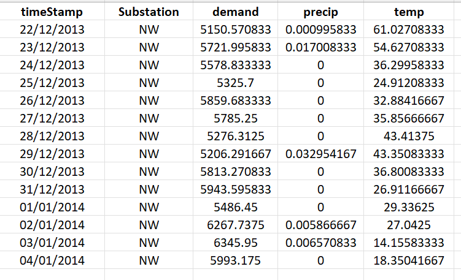
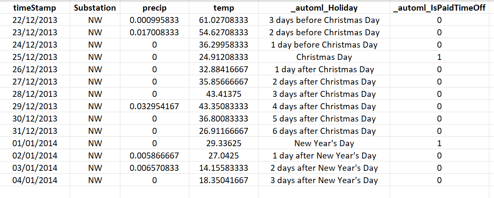

# Calendar features for time series forecasting in AutoML

This article focuses on the calendar-based features that AutoML creates to increase the accuracy of forecasting regression models. Since holidays can have a strong influence on how the modeled system behaves, the time before, during, and after a holiday can bias the series’ patterns. Each holiday generates a window over your existing dataset that the learner can assign an effect to. This can be especially useful in scenarios such as holidays that generate high demands for specific products. See the [methods overview article](./concept-automl-forecasting-methods.md) for more general information about forecasting methodology in AutoML. Instructions and examples for training forecasting models in AutoML can be found in our [set up AutoML for time series forecasting](./how-to-auto-train-forecast.md) article.

As a part of feature engineering, AutoML transforms datetime type columns provided in the training data into new columns of calendar-based features. These features can help regression models learn seasonal patterns at several cadences. AutoML can always create calendar features from the time index of the time series since this is a required column in the training data. Calendar features are also made from other columns with datetime type, if any are present. See the [how AutoML uses your data](./concept-automl-forecasting-methods.md#how-automl-uses-your-data) guide for more information on data requirements.

AutoML considers two categories of calendar features: standard features that are based entirely on date and time values and holiday features which are specific to a country or region of the world. We go over these features in the remainder of the article. 

## Standard calendar features

Th following table shows the full set of AutoML's standard calendar features along with an example output. The example uses the standard `YY-mm-dd %H-%m-%d` format for datetime representation. 

| Feature name | Description | Example output for 2011-01-01 00:25:30 |
| --- | ----------- | -------------- |
|`year`|Numeric feature representing the calendar year |2011|
|`year_iso`|Represents ISO year as defined in ISO 8601. ISO years start on the first week of year that has a Thursday. For example, if January 1 is a Friday, the ISO year begins on January 4. ISO years may differ from calendar years.|2010|
|`half`| Feature indicating whether the date is in the first or second half of the year. It's 1 if the date is prior to July 1 and 2 otherwise.
|`quarter`|Numeric feature representing the quarter of the given date.  It takes values 1, 2, 3, or 4 representing first, second, third, fourth quarter of calendar year.|1|
|`month`|Numeric feature representing the calendar month. It takes values 1 through 12.|1|
|`month_lbl`|String feature representing the name of month.|'January'|
|`day`|Numeric feature representing the day of the month. It takes values from 1 through 31.|1|
|`hour`|Numeric feature representing the hour of the day. It takes values 0 through 23.|0|
|`minute`|Numeric feature representing the minute within the hour. It takes values 0 through 59.|25|
|`second`|Numeric feature representing the second of the given datetime. In the case where only date format is provided, then it's assumed as 0. It takes values 0 through 59.|30|
|`am_pm`|Numeric feature indicating whether the time is in the morning or evening. It's 0 for times before 12PM and 1 for times after 12PM. |0|
|`am_pm_lbl`|String feature indicating whether the time is in the morning or evening.|'am'|
|`hour12`|Numeric feature representing the hour of the day on a 12 hour clock. It takes values 0 through 12 for first half of the day and 1 through 11 for second half.|0|
|`wday`|Numeric feature representing the day of the week.  It takes values 0 through 6, where 0 corresponds to Monday. |5|
|`wday_lbl`|String feature representing name of the day of the week. |
|`qday`|Numeric feature representing the day within the quarter. It takes values 1 through 92.|1|
|`yday`|Numeric feature representing the day of the year. It takes values 1 through 365, or 1 through 366 in the case of leap year.|1|
|`week`|Numeric feature representing [ISO week](https://en.wikipedia.org/wiki/ISO_week_date) as defined in ISO 8601. ISO weeks always start on Monday and end on Sunday. It takes values 1 through 52, or 53 for years having 1st January falling on Thursday or for leap years having 1st January falling on Wednesday.|52|

The full set of standard calendar features may not be created in all cases. The generated set depends on the frequency of the time series and whether the training data contains datetime features in addition to the time index. The following table shows the features created for different column types:

Column purpose | Calendar features
--- | ---
Time index | The full set minus calendar features that have high correlation with other features. For example, if the time series frequency is daily, then any features with a more granular frequency than daily will be removed since they don't provide useful information.
Other datetime column | A reduced set consisting of  `Year`,  `Month`,  `Day`,  `DayOfWeek`,  `DayOfYear`,  `QuarterOfYear`,  `WeekOfMonth`,  `Hour`,  `Minute`, and `Second`. If the column is a date with no time, `Hour`,  `Minute`, and `Second` will be 0.

## Holiday features

AutoML can optionally create features representing holidays from a specific country or region. These features are configured in AutoML using the `country_or_region_for_holidays` parameter, which accepts an [ISO country code](https://en.wikipedia.org/wiki/List_of_ISO_3166_country_codes).

> [!NOTE]
> Holiday features can only be made for time series with daily frequency.

The following table summarizes the holiday features:

Feature name | Description
 --- | ----------- |
`Holiday`| String feature that specifies whether a date is a national/regional holiday. Days within some range of a holiday are also marked. 
`isPaidTimeOff`| Binary feature that takes value 1 if the day is a "paid time-off holiday" in the given country or region.

AutoML uses Azure Open Datasets as a source for holiday information. For more information, see the [PublicHolidays](/python/api/azureml-opendatasets/azureml.opendatasets.publicholidays) documentation.

To better understand the holiday feature generation, consider the following example data: 

</img>

To make American holiday features for this data, we set the `country_or_region_for_holiday` to 'US' in the [forecast settings](/python/api/azure-ai-ml/azure.ai.ml.automl.forecastingjob#azure-ai-ml-automl-forecastingjob-set-forecast-settings) as shown in the following code sample:
```python
from azure.ai.ml import automl

# create a forcasting job
forecasting_job = automl.forecasting(
    compute='test_cluster',   # Name of single or multinode AML compute infrastructure created by user
    experiment_name=exp_name, # name of experiment 
    training_data=sample_data,  
    target_column_name='demand',
    primary_metric='NormalizedRootMeanSquaredError',
    n_cross_validations=3,
    enable_model_explainability=True
)

# set custom forecast settings
forecasting_job.set_forecast_settings(
    time_column_name='timeStamp',
    country_or_region_for_holidays='US'
)
```
The generated holiday features look like the following output:

<a name='output'></img></a>

Note that generated features have the prefix `_automl_` prepended to their column names. AutoML generally uses this prefix to distinguish input features from engineered features.

## Next steps
* Learn more about [how to set up AutoML to train a time-series forecasting model](./how-to-auto-train-forecast.md).
* Browse [AutoML Forecasting Frequently Asked Questions](./how-to-automl-forecasting-faq.md).
* Learn about [AutoML Forecasting Lagged Features](./concept-automl-forecasting-lags.md).
* Learn about [how AutoML uses machine learning to build forecasting models](./concept-automl-forecasting-methods.md).
