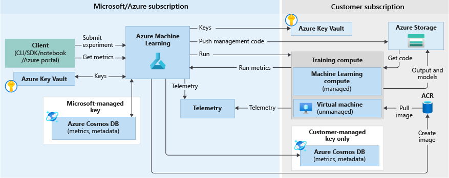
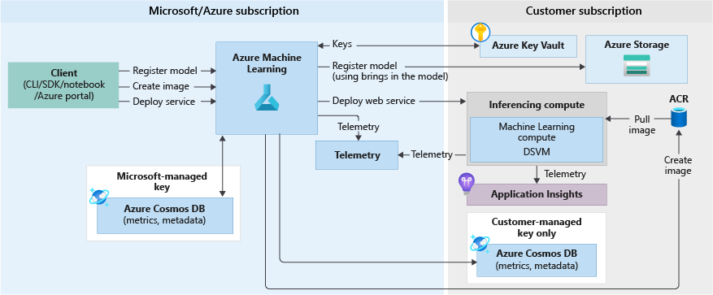

# How Azure Machine Learning works: Architecture and concepts

Learn about the architecture and concepts for [Azure Machine Learning](overview-what-is-azure-ml.md).  This article gives you a high-level understanding of the components and how they work together to assist in the process of building, deploying, and maintaining machine learning models.

##  Workspace

A [machine learning workspace](concept-workspace.md) is the top-level resource for Azure Machine Learning.

:::image type="content" source="media/concept-azure-machine-learning-architecture/architecture.svg" alt-text="Diagram: Azure Machine Learning architecture of a workspace and its components":::

The workspace is the centralized place to:

* Manage resources you use for training and deployment of models, such as [computes](#compute-instance)
* Store assets you create when you use Azure Machine Learning, including:
  * [Environments](#environments)
  * [Experiments](#experiments)
  * [Pipelines](#ml-pipelines)
  * [Datasets](#datasets-and-datastores)
  * [Models](#models)
  * [Endpoints](#endpoints)

A workspace includes other Azure resources that are used by the workspace:

+ [Azure Container Registry (ACR)](https://azure.microsoft.com/services/container-registry/): Registers docker containers that you use during training and when you deploy a model. To minimize costs, ACR is only created when deployment images are created.
+ [Azure Storage account](https://azure.microsoft.com/services/storage/): Is used as the default datastore for the workspace.  Jupyter notebooks that are used with your Azure Machine Learning compute instances are stored here as well.
+ [Azure Application Insights](https://azure.microsoft.com/services/application-insights/): Stores monitoring information about your models.
+ [Azure Key Vault](https://azure.microsoft.com/services/key-vault/): Stores secrets that are used by compute targets and other sensitive information that's needed by the workspace.

You can share a workspace with others.

## Computes

A [compute target](concept-compute-target.md) is any machine or set of machines you use to run your training script or host your service deployment. You can use your local machine or a remote compute resource as a compute target.  With compute targets, you can start training on your local machine and then scale out to the cloud without changing your training script.

Azure Machine Learning introduces two fully managed cloud-based virtual machines (VM) that are configured for machine learning tasks:

*  **Compute instance**: A compute instance is a VM that includes multiple tools and environments installed for machine learning. The primary use of a compute instance is for your development workstation.  You can start running sample notebooks with no setup required. A compute instance can also be used as a compute target for training and inferencing jobs.

* **Compute clusters**: Compute clusters are a cluster of VMs with multi-node scaling capabilities. Compute clusters are better suited for compute targets for large jobs and production.  The cluster scales up automatically when a job is submitted.  Use as a training compute target or for dev/test deployment.

For more information about training compute targets, see [Training compute targets](concept-compute-target.md#train).  For more information about deployment compute targets, see [Deployment targets](concept-compute-target.md#deploy).

## Datasets and datastores

[**Azure Machine Learning Datasets**](concept-data.md#datasets)  make it easier to access and work with your data. By creating a dataset, you create a reference to the data source location along with a copy of its metadata. Because the data remains in its existing location, you incur no extra storage cost, and don't risk the integrity of your data sources.

For more information, see [Create and register Azure Machine Learning Datasets](how-to-create-register-datasets.md).  For more examples using Datasets, see the [sample notebooks](https://github.com/Azure/MachineLearningNotebooks/tree/master/how-to-use-azureml/work-with-data/datasets-tutorial).

Datasets use [datastores](concept-data.md#datastores) to securely connect to your Azure storage services. Datastores store connection information without putting your authentication credentials and the integrity of your original data source at risk. They store connection information, like your subscription ID and token authorization in your Key Vault associated with the workspace, so you can securely access your storage without having to hard code them in your script.

## Environments

[Workspace](#workspace) > **Environments**

An [environment](concept-environments.md) is the encapsulation of the environment where training or scoring of your machine learning model happens. The environment specifies the Python packages, environment variables, and software settings around your training and scoring scripts.  

For code samples, see the "Manage environments" section of [How to use environments](how-to-use-environments.md#manage-environments).

## Experiments

[Workspace](#workspace) > **Experiments**

An experiment is a grouping of many runs from a specified script. It always belongs to a workspace. When you submit a run, you provide an experiment name. Information for the run is stored under that experiment. If the name doesn't exist when you submit an experiment, a new experiment is automatically created.
  
For an example of using an experiment, see [Tutorial: Train your first model](tutorial-1st-experiment-sdk-train.md).

### Runs

[Workspace](#workspace) > [Experiments](#experiments) > **Run**

A run is a single execution of a training script. An experiment will typically contain multiple runs.

Azure Machine Learning records all runs and stores the following information in the experiment:

* Metadata about the run (timestamp, duration, and so on)
* Metrics that are logged by your script
* Output files that are autocollected by the experiment or explicitly uploaded by you
* A snapshot of the directory that contains your scripts, prior to the run

You produce a run when you submit a script to train a model. A run can have zero or more child runs. For example, the top-level run might have two child runs, each of which might have its own child run.

### Run configurations

[Workspace](#workspace) > [Experiments](#experiments) > [Run](#runs) > **Run configuration**

A run configuration defines how a script should be run in a specified compute target. You use the configuration to specify the script, the compute target and Azure ML environment to run on, any distributed job-specific configurations, and some additional properties. For more information on the full set of configurable options for runs, see [ScriptRunConfig](/python/api/azureml-core/azureml.core.scriptrunconfig).

A run configuration can be persisted into a file inside the directory that contains your training script.   Or it can be constructed as an in-memory object and used to submit a run.

For example run configurations, see [Configure a training run](how-to-set-up-training-targets.md).

### Snapshots

[Workspace](#workspace) > [Experiments](#experiments) > [Run](#runs) > **Snapshot**

When you submit a run, Azure Machine Learning compresses the directory that contains the script as a zip file and sends it to the compute target. The zip file is then extracted, and the script is run there. Azure Machine Learning also stores the zip file as a snapshot as part of the run record. Anyone with access to the workspace can browse a run record and download the snapshot.

### Logging

Azure Machine Learning automatically logs standard run metrics for you. However, you can also [use the Python SDK to log arbitrary metrics](how-to-log-view-metrics.md).

There are multiple ways to view your logs: monitoring run status in real time, or viewing results after completion. For more information, see [Monitor and view ML run logs](how-to-log-view-metrics.md).

> [!NOTE]
> [!INCLUDE [amlinclude-info](../../includes/machine-learning-amlignore-gitignore.md)]

### Git tracking and integration

When you start a training run where the source directory is a local Git repository, information about the repository is stored in the run history. This works with runs submitted using a script run configuration or ML pipeline. It also works for runs submitted from the SDK or Machine Learning CLI.

For more information, see [Git integration for Azure Machine Learning](concept-train-model-git-integration.md).

### Training workflow

When you run an experiment to train a model, the following steps happen. These are illustrated in the training workflow diagram below:

* Azure Machine Learning is called with the snapshot ID for the code snapshot saved in the previous section.
* Azure Machine Learning creates a run ID (optional) and a Machine Learning service token, which is later used by compute targets like Machine Learning Compute/VMs to communicate with the Machine Learning service.
* You can choose either a managed compute target (like Machine Learning Compute) or an unmanaged compute target (like VMs) to run training jobs. Here are the data flows for both scenarios:
   * VMs/HDInsight, accessed by SSH credentials in a key vault in the Microsoft subscription. Azure Machine Learning runs management code on the compute target that:

   1. Prepares the environment. (Docker is an option for VMs and local computers. See the following steps for Machine Learning Compute to understand how running experiments on Docker containers works.)
   1. Downloads the code.
   1. Sets up environment variables and configurations.
   1. Runs user scripts (the code snapshot mentioned in the previous section).

   * Machine Learning Compute, accessed through a workspace-managed identity.
Because Machine Learning Compute is a managed compute target (that is, it's managed by Microsoft) it runs under your Microsoft subscription.

   1. Remote Docker construction is kicked off, if needed.
   1. Management code is written to the user's Azure Files share.
   1. The container is started with an initial command. That is, management code as described in the previous step.

* After the run completes, you can query runs and metrics. In the flow diagram below, this step occurs when the training compute target writes the run metrics back to Azure Machine Learning from storage in the Cosmos DB database. Clients can call Azure Machine Learning. Machine Learning will in turn pull metrics from the Cosmos DB database and return them back to the client.

## Models

At its simplest, a model is a piece of code that takes an input and produces output. Creating a machine learning model involves selecting an algorithm, providing it with data, and [tuning hyperparameters](how-to-tune-hyperparameters.md). Training is an iterative process that produces a trained model, which encapsulates what the model learned during the training process.

You can bring a model that was trained outside of Azure Machine Learning. Or you can train a model by submitting a [run](#runs) of an [experiment](#experiments) to a [compute target](#compute-targets) in Azure Machine Learning. Once you have a model, you [register the model](#register-model) in the workspace.

Azure Machine Learning is framework agnostic. When you create a model, you can use any popular machine learning framework, such as Scikit-learn, XGBoost, PyTorch, TensorFlow, and Chainer.

For an example of training a model using Scikit-learn, see [Tutorial: Train an image classification model with Azure Machine Learning](tutorial-train-models-with-aml.md).

###  Model registry

[Workspace](#workspace) > **Models**

The **model registry** lets you keep track of all the models in your Azure Machine Learning workspace.

Models are identified by name and version. Each time you register a model with the same name as an existing one, the registry assumes that it's a new version. The version is incremented, and the new model is registered under the same name.

When you register the model, you can provide additional metadata tags and then use the tags when you search for models.

> [!TIP]
> A registered model is a logical container for one or more files that make up your model. For example, if you have a model that is stored in multiple files, you can register them as a single model in your Azure Machine Learning workspace. After registration, you can then download or deploy the registered model and receive all the files that were registered.

You can't delete a registered model that is being used by an active deployment.

For an example of registering a model, see [Train an image classification model with Azure Machine Learning](tutorial-train-models-with-aml.md).

## Deployment

You deploy a [registered model](#register-model) as a service endpoint. You need the following components:

* **Environment**. This environment encapsulates the dependencies required to run your model for inference.
* **Scoring code**. This script accepts requests, scores the requests by using the model, and returns the results.
* **Inference configuration**. The inference configuration specifies the environment, entry script, and other components needed to run the model as a service.

For more information about these components, see [Deploy models with Azure Machine Learning](how-to-deploy-and-where.md).

### Endpoints

[Workspace](#workspace) > **Endpoints**

An endpoint is an instantiation of your model into either a web service that can be hosted in the cloud or an IoT module for integrated device deployments.

#### Web service endpoint

When deploying a model as a web service, the endpoint can be deployed on Azure Container Instances, Azure Kubernetes Service, or FPGAs. You create the service from your model, script, and associated files. These are placed into a base container image, which contains the execution environment for the model. The image has a load-balanced, HTTP endpoint that receives scoring requests that are sent to the web service.

You can enable Application Insights telemetry or model telemetry to monitor your web service. The telemetry data is accessible only to you.  It's stored in your Application Insights and storage account instances. If you've enabled automatic scaling, Azure automatically scales your deployment.

The following diagram shows the inference workflow for a model deployed as a web service endpoint:

Here are the details:

* The user registers a model by using a client like the Azure Machine Learning SDK.
* The user creates an image by using a model, a score file, and other model dependencies.
* The Docker image is created and stored in Azure Container Registry.
* The web service is deployed to the compute target (Container Instances/AKS) using the image created in the previous step.
* Scoring request details are stored in Application Insights, which is in the user's subscription.
* Telemetry is also pushed to the Microsoft/Azure subscription.

For an example of deploying a model as a web service, see [Deploy an image classification model in Azure Container Instances](tutorial-deploy-models-with-aml.md).

#### Real-time endpoints

When you deploy a trained model in the designer, you can [deploy the model as a real-time endpoint](tutorial-designer-automobile-price-deploy.md). A real-time endpoint commonly receives a single request via the REST endpoint and returns a prediction in real-time. This is in contrast to batch processing, which processes multiple values at once and saves the results after completion to a datastore.

#### Pipeline endpoints

Pipeline endpoints let you call your [ML Pipelines](#ml-pipelines) programatically via a REST endpoint. Pipeline endpoints let you automate your pipeline workflows.

A pipeline endpoint is a collection of published pipelines. This logical organization lets you manage and call multiple pipelines using the same endpoint. Each published pipeline in a pipeline endpoint is versioned. You can select a default pipeline for the endpoint, or specify a version in the REST call.
 

#### IoT module endpoints

A deployed IoT module endpoint is a Docker container that includes your model and associated script or application and any additional dependencies. You deploy these modules by using Azure IoT Edge on edge devices.

If you've enabled monitoring, Azure collects telemetry data from the model inside the Azure IoT Edge module. The telemetry data is accessible only to you, and it's stored in your storage account instance.

Azure IoT Edge ensures that your module is running, and it monitors the device that's hosting it. 
## Automation

### Azure Machine Learning CLI 

The [Azure Machine Learning CLI](reference-azure-machine-learning-cli.md) is an extension to the Azure CLI, a cross-platform command-line interface for the Azure platform. This extension provides commands to automate your machine learning activities.

### ML Pipelines

You use [machine learning pipelines](concept-ml-pipelines.md) to create and manage workflows that stitch together machine learning phases. For example, a pipeline might include data preparation, model training, model deployment, and inference/scoring phases. Each phase can encompass multiple steps, each of which can run unattended in various compute targets. 

Pipeline steps are reusable, and can be run without rerunning the previous steps if the output of those steps hasn't changed. For example, you can retrain a model without rerunning costly data preparation steps if the data hasn't changed. Pipelines also allow data scientists to collaborate while working on separate areas of a machine learning workflow.

## Monitoring and logging

Azure Machine Learning provides the following monitoring and logging capabilities:

* For __Data Scientists__, you can monitor your experiments and log information from your training runs. For more information, see the following articles:
   * [Start, monitor, and cancel training runs](how-to-track-monitor-analyze-runs.md)
   * [Log metrics for training runs](how-to-log-view-metrics.md)
   * [Track experiments with MLflow](how-to-use-mlflow.md)
   * [Visualize runs with TensorBoard](how-to-monitor-tensorboard.md)
* For __Administrators__, you can monitor information about the workspace, related Azure resources, and events such as resource creation and deletion by using Azure Monitor. For more information, see [How to monitor Azure Machine Learning](monitor-azure-machine-learning.md).
* For __DevOps__ or __MLOps__, you can monitor information generated by models deployed as web services or IoT Edge modules to identify problems with the deployments and gather data submitted to the service. For more information, see [Collect model data](how-to-enable-data-collection.md) and [Monitor with Application Insights](how-to-enable-app-insights.md).

## Interacting with your workspace

### Studio

[Azure Machine Learning studio](overview-what-is-machine-learning-studio.md) provides a web view of all the artifacts in your workspace.  You can view results and details of your datasets, experiments, pipelines, models, and endpoints.  You can also manage compute resources and datastores in the studio.

The studio is also where you access the interactive tools that are part of Azure Machine Learning:

+ [Azure Machine Learning designer](concept-designer.md) to perform workflow steps without writing code
+ Web experience for [automated machine learning](concept-automated-ml.md)
+ [Azure Machine Learning notebooks](how-to-run-jupyter-notebooks.md) to write and run your own code in integrated Jupyter notebook servers.
+ [Data labeling projects](how-to-create-labeling-projects.md) to create, manage, and monitor projects to label your data

### Programming tools

> [!IMPORTANT]
> Tools marked (preview) below are currently in public preview.
> The preview version is provided without a service level agreement, and it's not recommended for production workloads. Certain features might not be supported or might have constrained capabilities. 
> For more information, see [Supplemental Terms of Use for Microsoft Azure Previews](https://azure.microsoft.com/support/legal/preview-supplemental-terms/).

+  Interact with the service in any Python environment with the [Azure Machine Learning SDK for Python](/python/api/overview/azure/ml/intro).
+ Interact with the service in any R environment with the [Azure Machine Learning SDK for R](https://azure.github.io/azureml-sdk-for-r/reference/index.html) (preview).
+ Use [Azure Machine Learning designer](concept-designer.md) to perform the workflow steps without writing code. 
+ Use [Azure Machine Learning CLI](./reference-azure-machine-learning-cli.md) for automation.
+ The [Many Models Solution Accelerator](https://aka.ms/many-models) (preview) builds on Azure Machine Learning and enables you to train, operate, and manage hundreds or even thousands of machine learning models.

## Next steps

To get started with Azure Machine Learning, see:

* [What is Azure Machine Learning?](overview-what-is-azure-ml.md)
* [Create an Azure Machine Learning workspace](how-to-manage-workspace.md)
* [Tutorial (part 1): Train a model](tutorial-train-models-with-aml.md)