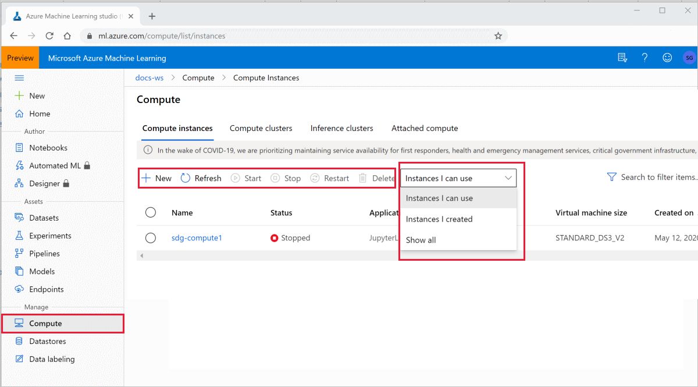

# What is an Azure Machine Learning compute instance?

An Azure Machine Learning compute instance is a managed cloud-based workstation for data scientists.

Compute instances make it easy to get started with Azure Machine Learning development as well as provide management and enterprise readiness capabilities for IT administrators.  

Use a compute instance as your fully configured and managed development environment in the cloud for machine learning. They can also be used as a compute target for training and inferencing for development and testing purposes.  

For production grade model training use an [Azure Machine Learning compute cluster](how-to-set-up-training-targets.md#amlcompute) with multi-node scaling capabilities. For production grade model deployment, use [Azure Kubernetes Service cluster](how-to-deploy-azure-kubernetes-service.md).

## Why use a compute instance?

A compute instance is a fully-managed cloud-based workstation optimized for your machine learning development environment. It provides the following benefits:

|Key benefits||
|----|----|
|Productivity|You can build and deploy models using integrated notebooks and the following tools in Azure Machine Learning studio: -  Jupyter -  JupyterLab -  RStudio (preview) Compute instance is fully integrated with Azure Machine Learning workspace and studio. You can share notebooks and data with other data scientists in the workspace. You can also setup VS Code remote development using [SSH](how-to-set-up-vs-code-remote.md) |
|Managed & secure|Reduce your security footprint and add compliance with enterprise security requirements. Compute instances  provide robust management policies and secure networking configurations such as:  - Auto-provisioning from Resource Manager templates or Azure Machine Learning SDK - [Role-based access control (RBAC)](/azure/role-based-access-control/overview) - [Virtual network support](how-to-enable-virtual-network.md#compute-instance) - SSH policy to enable/disable SSH access TLS 1.2 enabled |
|Preconfigured&nbsp;for&nbsp;ML|Save time on setup tasks with pre-configured and up-to-date ML packages, deep learning frameworks, GPU drivers.|
|Fully customizable|Broad support for Azure VM types including GPUs and persisted low-level customization such as installing packages and drivers makes advanced scenarios a breeze. |

## Tools and environments

Azure Machine Learning compute instance enables you to author, train, and deploy models in a fully integrated notebook experience in your workspace.

These tools and environments are installed on the compute instance: 

|General tools & environments|Details|
|----|:----:|
|Drivers|`CUDA` `cuDNN` `NVIDIA` `Blob FUSE` |
|Intel MPI library||
|Azure CLI ||
|Azure Machine Learning samples ||
|Docker||
|Nginx||
|NCCL 2.0 ||
|Protobuf|| 

|**R** tools & environments|Details|
|----|:----:|
|RStudio Server Open Source Edition (preview)||
|R kernel||
|Azure Machine Learning SDK for R|[azuremlsdk](https://azure.github.io/azureml-sdk-for-r/reference/index.html) SDK samples|

|**PYTHON** tools & environments|Details|
|----|----|
|Anaconda Python||
|Jupyter and extensions||
|Jupyterlab and extensions||
[Azure Machine Learning SDK for Python](https://docs.microsoft.com/python/api/overview/azure/ml/intro?view=azure-ml-py) from PyPI|Includes most of the azureml extra packages.  To see the full list, [open a terminal window on your compute instance](how-to-run-jupyter-notebooks.md#terminal) and run   `conda list -n azureml_py36 azureml*` |
|Other PyPI packages|`jupytext` `tensorboard` `nbconvert` `notebook` `Pillow`|
|Conda packages|`cython` `numpy` `ipykernel` `scikit-learn` `matplotlib` `tqdm` `joblib` `nodejs` `nb_conda_kernels`|
|Deep learning packages|`PyTorch` `TensorFlow` `Keras` `Horovod` `MLFlow` `pandas-ml` `scrapbook`|
|ONNX packages|`keras2onnx` `onnx` `onnxconverter-common` `skl2onnx` `onnxmltools`|
|Azure Machine Learning Python & R SDK samples||

Python packages are all installed in the **Python 3.6 - AzureML** environment.  

### Installing packages

You can install packages directly in a Jupyter notebook or Rstudio:

* RStudio Use the **Packages** tab on the bottom right, or the **Console** tab on the top left.  
* Python: Add install code and execute in a Jupyter notebook cell.

Or you can access a terminal window in any of these ways:

* RStudio: Select the **Terminal** tab on top left.
* Jupyter Lab:  Select the **Terminal** tile under the **Other** heading in the Launcher tab.
* Jupyter:  Select **New>Terminal** on top right in the Files tab.
* SSH to the machine.  Then install Python packages into the **Python 3.6 - AzureML** environment.  Install R packages into the **R** environment.

## Accessing files

Notebooks and R scripts are stored in the default storage account of your workspace in Azure file share.  These files are located under your “User files” directory. This storage makes it easy to share notebooks between compute instances. The storage account also keeps your notebooks safely preserved when you stop or delete a compute instance.

The Azure file share account of your workspace is mounted as a drive on the compute instance. This drive is the default working directory for Jupyter, Jupyter Labs, and RStudio. This means that the notebooks and other files you create in Jupyter, JupyterLab, or RStudio are automatically stored on the file share and available to use in other compute instances as well.

The files in the file share are accessible from all compute instances in the same workspace. Any changes to these files on the compute instance will be reliably persisted back to the file share.

You can also clone the latest Azure Machine Learning samples to your folder under the user files directory in the workspace file share.

Writing small files can be slower on network drives than writing to the compute instance local disk itself.  If you are writing many small files, try using a directory directly on the compute instance, such as a `/tmp` directory. Please note these files will not be accessible from other compute instances. 

You can use the `/tmp` directory on the compute instance for your temporary data.  However, do not write large files of data on the OS disk of the compute instance.  Use [datastores](concept-azure-machine-learning-architecture.md#datasets-and-datastores) instead. If you have installed JupyterLab git extension it can also lead to slowdown in compute instance performance.

## Managing a compute instance

In your workspace in Azure Machine Learning studio, select **Compute**, then select **Compute Instance** on the top.

You can perform the following actions:

* [Create a compute instance](#create). 
* Refresh the compute instances tab.
* Start, stop and restart a compute instance.  You do pay for the instance whenever it is running. Stop the compute instance when you are not using it to reduce cost. Stopping a compute instance deallocates it. Then start it again when you need it. 
* Delete a compute instance.
* Filter the list of compute instances to the ones you created.  These are the compute instances you can access.

For each compute instance in your workspace that you have access to, you can:

* Access Jupyter, JupyterLab, RStudio on the compute instance
* SSH into compute instance. SSH access is disabled by default but can be enabled at compute instance creation time. SSH access is through public/private key mechanism. The tab will give you details for SSH connection such as IP address, username, and port number.
* Get details about a specific compute instance such as IP address, and region.

[RBAC](/azure/role-based-access-control/overview) allows you to control which users in the workspace can create, delete, start, stop, restart a compute instance. All users in the workspace contributor and owner role can create, delete, start, stop, and restart compute instances across the workspace. However, only the creator of a specific compute instance is allowed to access Jupyter, JupyterLab, and RStudio on that compute instance. The creator of the compute instance has the compute instance dedicated to them, have root access, and can terminal in through Jupyter/JupyterLab/RStudio. Compute instance will have single-user login of creator user and all actions will use that user’s identity for RBAC and attribution of experiment runs. SSH access is controlled through public/private key mechanism.

These actions can be controlled by RBAC:
* *Microsoft.MachineLearningServices/workspaces/computes/read*
* *Microsoft.MachineLearningServices/workspaces/computes/write*
* *Microsoft.MachineLearningServices/workspaces/computes/delete*
* *Microsoft.MachineLearningServices/workspaces/computes/start/action*
* *Microsoft.MachineLearningServices/workspaces/computes/stop/action*
* *Microsoft.MachineLearningServices/workspaces/computes/restart/action*

### Create a compute instance

In your workspace in Azure Machine Learning studio, create a new compute instance from either the **Compute** section or in the **Notebooks** section when you are ready to run one of your notebooks.

:::image type="content" source="media/concept-compute-instance/create-compute-instance.png" alt-text="Create a new compute instance":::

|Field  |Description  |
|---------|---------|
|Compute name     |  <li>Name is required and must be between 3 to 24 characters long.</li><li>Valid characters are upper and lower case letters, digits, and the  **-** character.</li><li>Name must start with a letter</li><li>Name needs to be unique across all existing computes within an Azure region. You will see an alert if the name you choose is not unique</li><li>If **-**  character is used, then it needs to be followed by at least one letter later in the name</li>     |
|Virtual machine type |  Choose CPU or GPU. This type cannot be changed after creation     |
|Virtual machine size     |  Supported virtual machine sizes might be restricted in your region. Check the [availability list](https://azure.microsoft.com/global-infrastructure/services/?products=virtual-machines)     |
|Enable/disable SSH access     |   SSH access is disabled by default.  SSH access cannot be. changed after creation. Make sure to enable access if you plan to debug interactively with [VS Code Remote](how-to-set-up-vs-code-remote.md)   |
|Advanced settings     |  Optional. Configure a virtual network. Specify the **Resource group**, **Virtual network**, and **Subnet** to create the compute instance inside an Azure Virtual Network (vnet). For more information, see these [network requirements](how-to-enable-virtual-network.md#compute-instance) for vnet .        |

You can also create an instance
* Directly from the [integrated notebooks experience](tutorial-1st-experiment-sdk-setup.md#azure)
* In Azure portal
* From Azure Resource Manager template
* With [Azure Machine Learning SDK](https://github.com/Azure/MachineLearningNotebooks/blob/master/how-to-use-azureml/training/train-on-computeinstance/train-on-computeinstance.ipynb)
* From the [CLI extension for Azure Machine Learning](reference-azure-machine-learning-cli.md#computeinstance)

The dedicated cores per region per VM family quota and total regional quota, which applies to compute instance creation. is unified and shared with Azure Machine Learning training compute cluster quota. Stopping the compute instance does not release quota to ensure you will be able to restart the compute instance.

## Compute target

Compute instances can be used as a [training compute target](concept-compute-target.md#train) similar to Azure Machine Learning compute training clusters. 

A compute instance:
* Has a job queue.
* Runs jobs securely in a virtual network environment, without requiring enterprises to open up SSH port. The job executes in a containerized environment and packages your model dependencies in a Docker container.
* Can run multiple small jobs in parallel (preview).  Two jobs per core can run in parallel while the rest of the jobs are queued.

You can use compute instance as a local inferencing deployment target for test/debug scenarios.

> [!NOTE]
> Distributed training jobs are not supported on compute instance.  Use (compute clusters](how-to-set-up-training-targets.md#amlcompute) for distributed training.

For more details, see the notebook [train-on-computeinstance](https://github.com/Azure/MachineLearningNotebooks/blob/master/how-to-use-azureml/training/train-on-computeinstance/train-on-computeinstance.ipynb). This notebook is also available in the studio **Samples** folder in *training/train-on-computeinstance*.

## What happened to Notebook VM?

Compute instances are replacing the Notebook VM.  

Any notebook files stored in the workspace file share and data in workspace data stores will be accessible from a compute instance. However, any custom packages previously installed on a Notebook VM will need to be re-installed on the compute instance. Quota limitations which apply to compute clusters creation will apply to compute instance creation as well.

New Notebook VMs cannot be created. However, you can still access and use Notebook VMs you have created, with full functionality. Compute instances can be created in same workspace as the existing Notebook VMs.

## Next steps

 * [Tutorial: Train your first ML model](tutorial-1st-experiment-sdk-train.md) shows how to use a compute instance with an integrated notebook.
