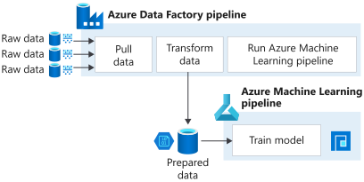

# Data ingestion options for Azure Machine Learning workflows

In this article, you learn the pros and cons of data ingestion options available with Azure Machine Learning. 

Choose from:
+ [Azure Data Factory](#azure-data-factory) pipelines, specifically built to extract, load, and transform data

+ [Azure Machine Learning Python SDK](#azure-machine-learning-python-sdk), providing a custom code solution for basic data ingestion tasks.

+ a combination of both

Data ingestion is the process in which unstructured data is extracted from one or multiple sources and then prepared for training machine learning models. It's also time intensive, especially if done manually, and if you have large amounts of data from multiple sources. Automating this effort frees up resources and ensures your models use the most recent and applicable data.

## Azure Data Factory

[Azure Data Factory](https://docs.microsoft.com/azure/data-factory/introduction) offers native support for data source monitoring and triggers for data ingestion pipelines.  

The following table summarizes the pros and cons for using Azure Data Factory for your data ingestion workflows.

|Pros|Cons
---|---
Specifically built to extract, load, and transform data.|Currently offers a limited set of Azure Data Factory pipeline tasks 
Allows you to create data-driven workflows for orchestrating data movement and transformations at scale.|Expensive to construct and maintain. See Azure Data Factory's [pricing page](https://azure.microsoft.com/pricing/details/data-factory/data-pipeline/) for more information.
Integrated with various Azure tools like [Azure Databricks](https://docs.microsoft.com/azure/data-factory/transform-data-using-databricks-notebook) and [Azure Functions](https://docs.microsoft.com/azure/data-factory/control-flow-azure-function-activity) | Doesn't natively run scripts, instead relies on separate compute for script runs 
Natively supports data source triggered data ingestion| 
Data preparation and model training processes are separate.|
Embedded data lineage capability for Azure Data Factory dataflows|
Provides a low code experience [user interface](https://docs.microsoft.com/azure/data-factory/quickstart-create-data-factory-portal) for non-scripting approaches |

These steps and the following diagram illustrate Azure Data Factory's data ingestion workflow.

1. Pull the data from its sources
1. Transform and save the data to an output blob container, which serves as data storage for Azure Machine Learning
1. With prepared data stored, the Azure Data Factory pipeline invokes a training Machine Learning pipeline that receives the prepared data for model training

    
    
Learn how to build a data ingestion pipeline for Machine Learning with [Azure Data Factory](how-to-data-ingest-adf.md).

## Azure Machine Learning Python SDK 

With the [Python SDK](https://docs.microsoft.com/python/api/overview/azure/ml), you can incorporate data ingestion tasks into an [Azure Machine Learning pipeline](how-to-create-your-first-pipeline.md) step.

The following table summarizes the pros and con for using the SDK and an ML pipelines step for data ingestion tasks.

Pros| Cons
---|---
Configure your own Python scripts | Does not natively support data source change triggering. Requires Logic App or Azure Function implementations
Data preparation as part of every model training execution|Requires development skills to create a data ingestion script
Supports data preparation scripts on various compute targets, including [Azure Machine Learning compute](concept-compute-target.md#azure-machine-learning-compute-managed) |Does not provide a user interface for creating the ingestion mechanism

In the following diagram, the Azure Machine Learning pipeline consists of two steps: data ingestion and model training. The data ingestion step encompasses tasks that can be accomplished using Python libraries and the Python SDK, such as extracting data from local/web sources, and basic data transformations, like missing value imputation. The training step then uses the prepared data as input to your training script to train your machine learning model. 

## Next steps

Follow these how-to articles:
* [Build a data ingestion pipeline with Azure Data Factory](how-to-data-ingest-adf.md)

* [Automate and manage data ingestion pipelines with Azure Pipelines](how-to-cicd-data-ingestion.md).
