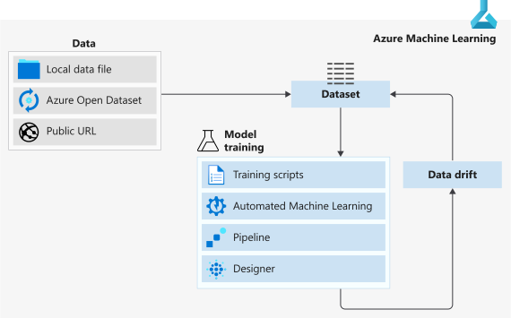

# Data access in Azure Machine Learning

In this article, you learn Azure Machine Learning's data access solutions for connecting to your data in Azure storage, and consuming it in machine learning tasks.

This article assumes you've already created an [Azure storage account](https://docs.microsoft.com/azure/storage/common/storage-quickstart-create-account?tabs=azure-portal) and [Azure storage service](https://docs.microsoft.com/azure/storage/common/storage-introduction).

When you're ready to use the data in your Azure storage solution, we recommend the following data delivery workflow. 

1. Create an Azure Machine Learning datastore to store connection information to your Azure storage.

2. From that datastore, create an Azure Machine Learning dataset to point to a specific file(s) in your underlying storage. 

3. To use that dataset in your machine learning experiment you can either
    1. Mount it to your experiment's compute target for model training.

        **OR** 

    1. Consume it directly in Azure Machine Learning solutions like, automated machine learning (automated ML) experiment runs, machine learning pipelines, or the [Azure Machine Learning designer](concept-designer.md).

4. Create dataset monitors for your model output dataset to detect for data drift. 

5. If data drift is detected, update your input dataset and retrain your model accordingly.

The following diagram provides a visual demonstration of this recommended workflow.

## Datastores

Azure Machine Learning datastores securely keep the connection information to your Azure storage, so you don't have to code it in your scripts. [Register and create a datastore](how-to-access-data.md) to easily connect to your storage account, and access the data in your underlying Azure storage service. 

Supported Azure storage services that can be registered as datastores:

+ Azure Blob Container
+ Azure File Share
+ Azure Data Lake
+ Azure Data Lake Gen2
+ Azure SQL Database
+ Azure Database for PostgreSQL
+ Databricks File System
+ Azure Database for MySQL

## Datasets

Azure Machine Learning datasets are references that point to the data in your storage service. They aren't copies of your data, so no extra storage cost is incurred. To interact with your data in storage, [create a dataset](how-to-create-register-datasets.md) to package your data into a consumable object for machine learning tasks. Register the dataset to your workspace to share and reuse it across different experiments without data ingestion complexities.

Datasets can be created from local files, public urls, Azure Open Datasets, or specific file(s) in your datastores. To create a dataset from an in memory pandas dataframe, write the data to a local file, like a csv, and create your dataset from that file.  

The following diagram shows that if you don't have an Azure storage service, you can create a dataset directly from local files, public urls, or an Azure Open Dataset. Doing so connects your dataset to the default datastore that was automatically created with your experiment's [Azure Machine Learning workspace](concept-workspace.md).

Additional datasets capabilities can be found in the following documentation:

+ [Version and track](how-to-version-track-datasets.md) dataset lineage.
+ [Monitor your dataset](how-to-monitor-datasets.md) to help with data drift detection.
+  See the following for documentation on the two types of datasets:
    + A [TabularDataset](https://docs.microsoft.com/python/api/azureml-core/azureml.data.tabulardataset?view=azure-ml-py) represents data in a tabular format by parsing the provided file or list of files. Which lets you materialize the data into a Pandas or Spark DataFrame for further manipulation and cleansing. For a complete list of files you can create TabularDatasets from, see the [TabularDatasetFactory class](https://aka.ms/tabulardataset-api-reference).

    + A [FileDataset](https://docs.microsoft.com/python/api/azureml-core/azureml.data.file_dataset.filedataset?view=azure-ml-py) references single or multiple files in your datastores or public URLs. By this method, you can [download or mount files](how-to-train-with-datasets.md#option-2--mount-files-to-a-remote-compute-target) of your choosing to your compute target as a FileDataset object.

## Work with your data

With datasets, you can accomplish a number of machine learning tasks through seamless integration with Azure Machine Learning features. 

+ Create a [data labeling project](#label).
+ Create a dataset from an [Azure Open Dataset](how-to-create-register-datasets.md#create-datasets-with-azure-open-datasets).
+ [Train machine learning models](how-to-train-with-datasets.md).
+ Consume datasets in 
     + [automated ML experiments](how-to-create-portal-experiments.md)
     + the [designer](tutorial-designer-automobile-price-train-score.md#import-data) 
     + [Azure Machine Learning pipelines](how-to-create-your-first-pipeline.md)
+ Access datasets for scoring with batch inference in [machine learning pipelines](how-to-create-your-first-pipeline.md).
+ Set up a dataset monitor for [data drift](#drift) detection.

## Data labeling

Labeling large amounts of data has often been a headache in machine learning projects. Those with a computer vision component, such as image classification or object detection, generally require thousands of images and corresponding labels.

Azure Machine Learning gives you a central location to create, manage, and monitor labeling projects. Labeling projects help coordinate the data, labels, and team members, allowing you to more efficiently manage the labeling tasks. Currently supported tasks are image classification, either multi-label or multi-class, and object identification using bounded boxes.

+ Create a [data labeling project](how-to-create-labeling-projects.md), and output a dataset for use in machine learning experiments.

## Data drift

In the context of machine learning, data drift is the change in model input data that leads to model performance degradation. It is one of the top reasons model accuracy degrades over time, thus monitoring data drift helps detect model performance issues.
See the [Create a dataset monitor](how-to-monitor-datasets.md) article, to learn more about how to detect and alert to data drift on new data in a dataset.

## Next steps 

+ Create a dataset in Azure Machine Learning studio or with the Python SDK [using these steps.](how-to-create-register-datasets.md)
+ Try out dataset training examples with our [sample notebooks](https://aka.ms/dataset-tutorial).
+ For data drift examples, see this [data drift tutorial](https://aka.ms/datadrift-notebook).
