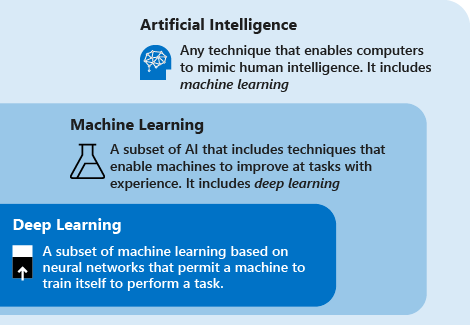

# Deep learning vs. machine learning

This article helps you compare deep learning vs. machine learning. You'll learn how the two concepts compare and how they fit into the broader category of artificial intelligence. The article also describes how deep learning can be applied to real-world scenarios such as fraud detection, voice and facial recognition, sentiment analytics, and time series forecasting.

## Deep learning, machine learning, and AI

Consider the following definitions to understand deep learning vs. machine learning vs. AI:

- **Deep learning** is a subset of machine learning that's based on artificial neural networks. The _learning process_ is _deep_ because the structure of artificial neural networks consists of multiple input, output, and hidden layers. Each layer contains units that transform the input data into information that the next layer can use for a certain predictive task. Thanks to this structure, a machine can learn through its own data processing.

- **Machine learning** is a subset of artificial intelligence that uses techniques (such as deep learning) that enable machines to use experience to improve at tasks. The _learning process_ is based on the following steps:

   1. Feed data into an algorithm. (In this step you can provide additional information to the model, for example, by performing feature extraction.)
   1. Use this data to train a model.
   1. Test and deploy the model.
   1. Consume the deployed model to do an automated predictive task. (In other words, call and use the deployed model to receive the predictions returned by the model.)

- **Artificial intelligence (AI)** is a technique that enables computers to mimic human intelligence. It includes machine learning. 
 
It's important to understand the relationship among AI, machine learning, and deep learning. Machine learning is a way to achieve artificial intelligence. By using machine learning and deep learning techniques, you can build computer systems and applications that do tasks that are commonly associated with human intelligence. These tasks include image recognition, speech recognition, and language translation.

## Techniques of deep learning vs. machine learning 

Now that you have the overview of machine learning vs. deep learning, let's compare the two techniques. In machine learning, the algorithm needs to be told how to make an accurate prediction by consuming more information (for example, by performing feature extraction). In deep learning, the algorithm can learn how to make an accurate prediction through its own data processing, thanks to the artificial neural network structure.

The following table compares the two techniques in more detail:

| |All machine learning |Only deep learning|
|---|---|---|
|  **Number of data points** | Can use small amounts of data to make predictions. | Needs to use large amounts of training data to make predictions. |
|  **Hardware dependencies** | Can work on low-end machines. It doesn't need a large amount of computational power. | Depends on high-end machines. It inherently does a large number of matrix multiplication operations. A GPU can efficiently optimize these operations. |
|  **Featurization process** | Requires features to be accurately identified and created by users. | Learns high-level features from data and creates new features by itself. |
|  **Learning approach** | Divides the learning process into smaller steps. It then combines the results from each step into one output. | Moves through the learning process by resolving the problem on an end-to-end basis. |
|  **Execution time** | Takes comparatively little time to train, ranging from a few seconds to a few hours. | Usually takes a long time to train because a deep learning algorithm involves many layers. |
|  **Output** | The output is usually a numerical value, like a score or a classification. | The output can have multiple formats, like a text, a score or a sound. |

## Deep learning use cases

Because of the artificial neural network structure, deep learning excels at identifying patterns in unstructured data such as images, sound, video, and text. For this reason, deep learning is rapidly transforming many industries, including healthcare, energy, finance, and transportation. These industries are now rethinking traditional business processes. 

Some of the most common applications for deep learning are described in the following paragraphs.

### Named-entity recognition

Named-entity recognition is a deep learning method that takes a piece of text as input and transforms it into a pre-specified class. This new information could be a postal code, a date, a product ID. The information can then be stored in a structured schema to build a list of addresses or serve as a benchmark for an identity validation engine.

### Object detection

Deep learning has been applied in many object detection use cases. Object detection comprises two parts: image classification and then image localization. Image _classification_ identifies the image's objects, such as cars or people. Image _localization_ provides the specific location of these objects. 

Object detection is already used in industries such as gaming, retail, tourism, and self-driving cars.

### Image caption generation

Like image recognition, in image captioning, for a given image, the system must generate a caption that describes the contents of the image. When you can detect and label objects in photographs, the next step is to turn those labels into descriptive sentences. 

Usually, image captioning applications use convolutional neural networks to identify objects in an image and then use a recurrent neural network to turn the labels into consistent sentences.

### Machine translation

Machine translation takes words or sentences from one language and automatically translates them into another language. Machine translation has been around for a long time, but deep learning achieves impressive results in two specific areas: automatic translation of text (and translation of speech to text) and automatic translation of images.

With the appropriate data transformation, a neural network can understand text, audio, and visual signals. Machine translation can be used to identify snippets of sound in larger audio files and transcribe the spoken word or image as text.

### Text analytics

Text analytics based on deep learning methods involves analyzing large quantities of text data (for example, medical documents or expenses receipts), recognizing patterns, and creating organized and concise information out of it.

Companies use deep learning to perform text analysis to detect insider trading and compliance with government regulations. Another common example is insurance fraud: text analytics has often been used to analyze large amounts of documents to recognize the chances of an insurance claim being fraud. 

## Artificial neural networks

Artificial neural networks are formed by layers of connected nodes. Deep learning models use neural networks that have a large number of layers. 

The following sections explore most popular artificial neural network typologies.

### Feedforward neural network

The feedforward neural network is the most basic type of artificial neural network. In a feedforward network, information moves in only one direction from input layer to output layer. Feedforward neural networks transform an input by putting it through a series of hidden layers. Every layer is made up of a set of neurons, and each layer is fully connected to all neurons in the layer before. The last fully connected layer (the output layer) represents the generated predictions.

### Recurrent neural network

Recurrent neural networks are a widely used artificial neural network. These networks save the output of a layer and feed it back to the input layer to help predict the layer's outcome. Recurrent neural networks have great learning abilities. They're widely used for complex tasks such as time series forecasting, learning handwriting and recognizing language.

### Convolutional neural networks

A convolutional neural network is a particularly effective artificial neural network, and it presents a unique architecture. Layers are organized in three dimensions: width, height, and depth. The neurons in one layer connect not to all the neurons in the next layer, but only to a small region of the layer's neurons. The final output is reduced to a single vector of probability scores, organized along the depth dimension. 

Convolutional neural networks have been used in areas such as video recognition, image recognition and recommender systems.

## Next steps

The following articles show you how to use deep learning technology in [Azure Machine Learning](https://docs.microsoft.com/azure/machine-learning/?WT.mc_id=docs-article-lazzeri):

- [Classify handwritten digits by using a TensorFlow model](https://docs.microsoft.com/azure/machine-learning/how-to-train-tensorflow?WT.mc_id=docs-article-lazzeri)

- [Classify handwritten digits by using a TensorFlow estimator and Keras](https://docs.microsoft.com/azure/machine-learning/how-to-train-keras?WT.mc_id=docs-article-lazzeri)

- [Classify images by using a Pytorch model](https://docs.microsoft.com/azure/machine-learning/how-to-train-pytorch?WT.mc_id=docs-article-lazzeri)

- [Classify handwritten digits by using a Chainer model](https://docs.microsoft.com/azure/machine-learning/how-to-train-ml-models)

Also, use the [Machine Learning Algorithm Cheat Sheet](algorithm-cheat-sheet.md) to choose algorithms for your model.
