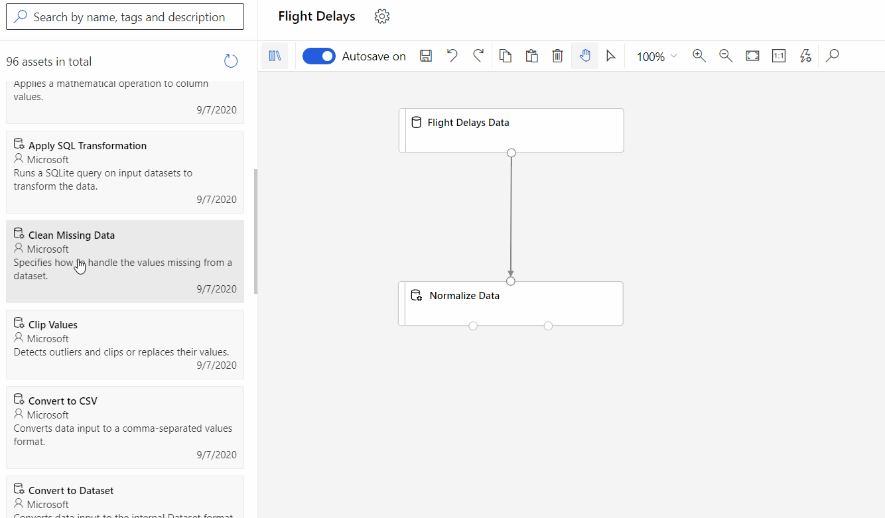
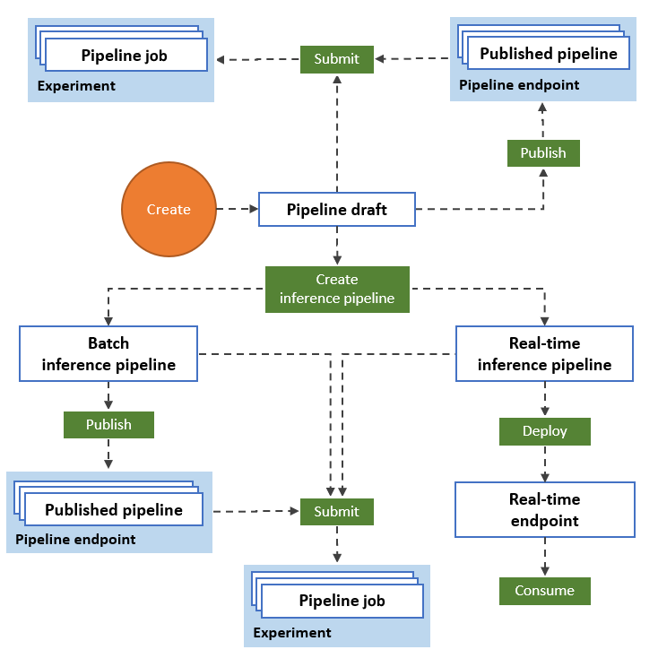

# What is Azure Machine Learning designer (preview)? 
[!INCLUDE [applies-to-skus](../../includes/aml-applies-to-enterprise-sku.md)]

Azure Machine Learning designer lets you visually connect [datasets](#datasets) and [modules](#module) on an interactive canvas to create machine learning models. To learn how to get started with the designer, see [Tutorial: Predict automobile price with the designer](tutorial-designer-automobile-price-train-score.md)

The designer uses your Azure Machine Learning [workspace](concept-workspace.md) to organize shared resources such as:

+ [Pipelines](#pipeline)
+ [Datasets](#datasets)
+ [Compute resources](#compute)
+ [Registered models](concept-azure-machine-learning-architecture.md#models)
+ [Published pipelines](#publish)
+ [Real-time endpoints](#deploy)

## Model training and deployment

The designer gives you a visual canvas to build, test, and deploy machine learning models. With the designer you can:

+ Drag-and-drop [datasets](#datasets) and [modules](#module) onto the canvas.
+ Connect the modules to create a [pipeline draft](#pipeline-draft).
+ Submit a [pipeline run](#pipeline-run) using the compute resources in your Azure Machine Learning workspace.
+ Convert your **training pipelines** to **inference pipelines**.
+ [Publish](#publish) your pipelines to a REST **pipeline endpoint** to submit a new pipeline that runs with different parameters and datasets.
    + Publish a **training pipeline** to reuse a single pipeline to train multiple models while changing parameters and datasets.
    + Publish a **batch inference pipeline** to make predictions on new data by using a previously trained model.
+ [Deploy](#deploy) a **real-time inference pipeline** to a real-time endpoint to make predictions on new data in real-time.

## Pipeline

A [pipeline](concept-azure-machine-learning-architecture.md#ml-pipelines) consists of datasets and analytical modules, which you connect. Pipelines have many uses: you can make a pipeline that trains a single model, or one that trains multiple models. You can create a pipeline that makes predictions in real-time or in batch, or make a pipeline that only cleans data. Pipelines let you reuse your work and organize your projects.

### Pipeline draft

As you edit a pipeline in the designer, your progress is saved as a **pipeline draft**. You can edit a pipeline draft at any point by adding or removing modules, configuring compute targets, creating parameters, and so on.

A valid pipeline has these characteristics:

* Datasets can only connect to modules.
* Modules can only connect to either datasets or other modules.
* All input ports for modules must have some connection to the data flow.
* All required parameters for each module must be set.

When you're ready to run your pipeline draft, you submit a pipeline run.

### Pipeline run

Each time you run a pipeline, the configuration of the pipeline and its results are stored in your workspace as a **pipeline run**. You can go back to any pipeline run to inspect it for troubleshooting or auditing purposes. **Clone** a pipeline run to create a new pipeline draft for you to edit.

Pipeline runs are grouped into [experiments](concept-azure-machine-learning-architecture.md#experiments) to organize run history. You can set the experiment for every pipeline run. 

## Datasets

A machine learning dataset makes it easy to access and work with your data. Several sample datasets are included in the designer for you to experiment with. You can [register](how-to-create-register-datasets.md) more datasets as you need them.

## Module

A module is an algorithm that you can perform on your data. The designer has several modules ranging from data ingress functions to training, scoring, and validation processes.

A module may have a set of parameters that you can use to configure the module's internal algorithms. When you select a module on the canvas, the module's parameters are displayed in the Properties pane to the right of the canvas. You can modify the parameters in that pane to tune your model. You can set the compute resources for individual modules in the designer. 

:::image type="content" source="./media/concept-designer/properties.png"alt-text="Module properties":::

For some help navigating through the library of machine learning algorithms available, see [Algorithm & module reference overview](algorithm-module-reference/module-reference.md). For help choosing an algorithm, see the [Azure Machine Learning Algorithm Cheat Sheet](algorithm-cheat-sheet.md).

##  Compute resources

Use compute resources from your workspace to run your pipeline and host your deployed models as real-time endpoints or pipeline endpoints (for batch inference). The supported compute targets are:

| Compute target | Training | Deployment |
| ---- |:----:|:----:|
| Azure Machine Learning compute | ✓ | |
| Azure Machine Learning compute instance | ✓ | |
| Azure Kubernetes Service | | ✓ |

Compute targets are attached to your [Azure Machine Learning workspace](concept-workspace.md). You manage your compute targets in your workspace in the [Azure Machine Learning studio](https://ml.azure.com).

## Deploy

To perform real-time inferencing, you must deploy a pipeline as a **real-time endpoint**. The real-time endpoint creates an interface between an external application and your scoring model. A call to a real-time endpoint returns prediction results to the application in real-time. To make a call to a real-time endpoint, you pass the API key that was created when you deployed the endpoint. The endpoint is based on REST, a popular architecture choice for web programming projects.

Real-time endpoints must be deployed to an Azure Kubernetes Service cluster.

To learn how to deploy your model, see [Tutorial: Deploy a machine learning model with the designer](tutorial-designer-automobile-price-deploy.md).

## Publish

You can also publish a pipeline to a **pipeline endpoint**. Similar to a real-time endpoint, a pipeline endpoint lets you submit new pipeline runs from external applications using REST calls. However, you cannot send or receive data in real-time using a pipeline endpoint.

Published pipelines are flexible, they can be used to train or retrain models, [perform batch inferencing](how-to-run-batch-predictions-designer.md), process new data, and much more. You can publish multiple pipelines to a single pipeline endpoint and specify which pipeline version to run.

A published pipeline runs on the compute resources you define in the pipeline draft for each module.

The designer creates the same [PublishedPipeline](https://docs.microsoft.com/python/api/azureml-pipeline-core/azureml.pipeline.core.graph.publishedpipeline?view=azure-ml-py) object as the SDK.

## Moving from the visual interface to the designer

The visual interface (preview) has been updated and is now Azure Machine Learning designer (preview). The designer has been rearchitected to use a pipeline-based backend that fully integrates with the other features of Azure Machine Learning. 

As a result of these updates, some concepts and terms for the visual interface have been changed or renamed. See the table below for the most important conceptual changes. 

| Concept in the designer | Previously in the visual interface |
| ---- |:----:|
| Pipeline draft | Experiment |
| Real-time endpoint | Web service |

### Migrating to the designer

You can convert existing visual interface experiments and web services to pipelines and real-time endpoints in the designer. Use the following steps to migrate your visual interface assets:

[!INCLUDE [migrate from the visual interface](../../includes/aml-vi-designer-migration.md)]

## Next steps

* Learn the basics of predictive analytics and machine learning with [Tutorial: Predict automobile price with the designer](tutorial-designer-automobile-price-train-score.md)
* Learn how to modify existing [designer samples](samples-designer.md) to adapt them to your needs.
