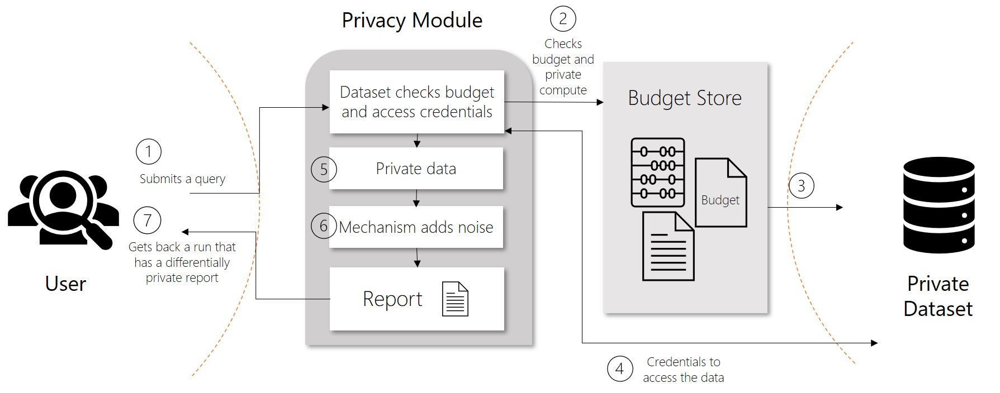

# Preserve data privacy by using differential privacy and the WhiteNoise package

Learn what differential privacy is and how the WhiteNoise package can help you implement differentially private systems.

As the amount of data that an organization collects and uses for analyses increases, so do concerns of privacy and security. Analyses require data. Typically, the more data used to train models, the more accurate they are. When personal information is used for these analyses, it's especially important that the data remains private throughout its use.

## How differential privacy works

Differential privacy is a set of systems and practices that help keep the data of individuals safe and private.

> [!div class="mx-imgBorder"]
> 

In traditional scenarios, raw data is stored in files and databases. When users analyze data, they typically use the raw data. This is a concern because it might infringe on an individual's privacy. Differential privacy tries to deal with this problem by adding "noise" or randomness to the data so that users can't identify any individual data points. At the least, such a system provides plausible deniability.

In differentially private systems, data is shared through requests called **queries**. When a user submits a query for data, operations known as **privacy mechanisms** add noise to the requested data. Privacy mechanisms return an *approximation of the data* instead of the raw data. This privacy-preserving result appears in a **report**. Reports consist of two parts, the actual data computed and a description of how the data was created.

## Differential privacy metrics

Differential privacy tries to protect against the possibility that a user can produce an indefinite number of reports to eventually reveal sensitive data. A value known as **epsilon** measures how noisy or private a report is. Epsilon has an inverse relationship to noise or privacy. The lower the epsilon, the more noisy (and private) the data is.

Epsilon values are non-negative. Values below 1 provide full plausible deniability. Anything above 1 comes with a higher risk of exposure of the actual data. As you implement differentially private systems, you want to produce reports with epsilon values between 0 and 1.

Another value directly correlated to epsilon is **delta**. Delta is a measure of the probability that a report is not fully private. The higher the delta, the higher the epsilon. Because these values are correlated, epsilon is used more often.

## Privacy budget

To ensure privacy in systems where multiple queries are allowed, differential privacy defines a rate limit. This limit is known as a **privacy budget**. Privacy budgets are allocated an epsilon amount, typically between 1 and 3 to limit the risk of reidentification. As reports are generated, privacy budgets keep track of the epsilon value of individual reports as well as the aggregate for all reports. After a privacy budget is spent or depleted, users can no longer access data.  

## Reliability of data

Although the preservation of privacy should be the goal, there is a tradeoff when it comes to usability and reliability of the data. In data analytics, accuracy can be thought of as a measure of uncertainty introduced by sampling errors. This uncertainty tends to fall within certain bounds. **Accuracy** from a differential privacy perspective instead measures the reliability of the data, which is affected by the uncertainty introduced by the privacy mechanisms. In short, a higher level of noise or privacy translates to data that has a lower epsilon, accuracy, and reliability. Although the data is more private, because it's not reliable, the less likely it is to be used.

## Implementing differentially private systems

Implementing differentially private systems is difficult. WhiteNoise is an open-source project that contains different components for building global differentially private systems. WhiteNoise is made up of the following top-level components:

- Core
- System

### Core

The core library includes the following privacy mechanisms for implementing a differentially private system:

|Component  |Description  |
|---------|---------|
|Analysis     | A graph description of arbitrary computations. |
|Validator     | A Rust library that contains a set of tools for checking and deriving the necessary conditions for an analysis to be differentially private.          |
|Runtime     | The medium to execute the analysis. The reference runtime is written in Rust but runtimes can be written using any computation framework such as SQL and Spark depending on your data needs.        |
|Bindings     | Language bindings and helper libraries to build analyses. Currently WhiteNoise provides Python bindings. |

### System

The system library provides the following tools and services for working with tabular and relational data:

|Component  |Description  |
|---------|---------|
|Data Access     | Library that intercepts and processes SQL queries and produces reports. This library is implemented in Python and supports the following ODBC and DBAPI data sources:<ul><li>PostgreSQL</li><li>SQL Server</li><li>Spark</li><li>Preston</li><li>Pandas</li></ul>|
|Service     | Execution service that provides a REST endpoint to serve requests or queries against shared data sources. The service is designed to allow composition of differential privacy modules that operate on requests containing different delta and epsilon values, also known as heterogeneous requests. This reference implementation accounts for additional impact from queries on correlated data. |
|Evaluator     | Stochastic evaluator that checks for privacy violations, accuracy, and bias. The evaluator supports the following tests: <ul><li>Privacy Test -  Determines whether a report adheres to the conditions of differential privacy.</li><li>Accuracy Test - Measures whether the reliability of reports falls within the upper and lower bounds given a 95% confidence level.</li><li>Utility Test - Determines whether the confidence bounds of a report are close enough to the data while still maximizing privacy.</li><li>Bias Test - Measures the distribution of reports for repeated queries to ensure they are not unbalanced</li></ul> |

## Next steps

[Preserve data privacy](how-to-differential-privacy.md) in Azure Machine Learning.

To learn more about the components of WhiteNoise, check out the GitHub repositories for [WhiteNoise Core package](https://github.com/opendifferentialprivacy/whitenoise-core), [WhiteNoise System package](https://github.com/opendifferentialprivacy/whitenoise-system) and [WhiteNoise samples](https://github.com/opendifferentialprivacy/whitenoise-samples).