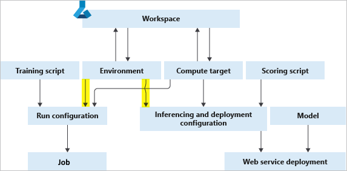
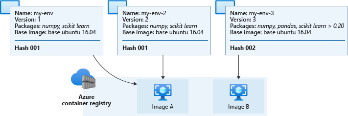

# What are Azure Machine Learning environments?

Azure Machine Learning environments are an encapsulation of the environment where your machine learning training happens. They specify the Python packages, environment variables, and software settings around your training and scoring scripts. They also specify runtimes (Python, Spark, or Docker). The environments are managed and versioned entities within your Machine Learning workspace that enable reproducible, auditable, and portable machine learning workflows across a variety of compute targets.

You can use an `Environment` object on your local compute to:
* Develop your training script.
* Reuse the same environment on Azure Machine Learning Compute for model training at scale.
* Deploy your model with that same environment.
* Revisit the environment in which an existing model was trained.

The following diagram illustrates how you can use a single `Environment` object in both your job configuration (for training) and your inference and deployment configuration (for web service deployments).

The environment, compute target and training script together form the job configuration: the full specification of a training job.

## Types of environments

Environments can broadly be divided into three categories: *curated*, *user-managed*, and *system-managed*.

Curated environments are provided by Azure Machine Learning and are available in your workspace by default. Intended to be used as is, they contain collections of Python packages and settings to help you get started with various machine learning frameworks. These pre-created environments also allow for faster deployment time. For a full list, see the [curated environments article](resource-curated-environments.md).

In user-managed environments, you're responsible for setting up your environment and installing every package that your training script needs on the compute target. Also be sure to include any dependencies needed for model deployment.

You use system-managed environments when you want [conda](https://conda.io/docs/) to manage the Python environment for you. A new conda environment is materialized from your conda specification on top of a base docker image.

## Create and manage environments

You can create environments from clients like the Azure Machine Learning Python SDK, Azure Machine Learning CLI, Environments page in Azure Machine Learning studio, and [VS Code extension](how-to-manage-resources-vscode.md#create-environment). Every client allows you to customize the base image, Dockerfile, and Python layer if needed.

For specific code samples, see the "Create an environment" section of [How to use environments](how-to-manage-environments-v2.md#create-an-environment). 

Environments are also easily managed through your workspace, which allows you to:

* Register environments.
* Fetch environments from your workspace to use for training or deployment.
* Create a new instance of an environment by editing an existing one.
* View changes to your environments over time, which ensures reproducibility.
* Build Docker images automatically from your environments.

"Anonymous" environments are automatically registered in your workspace when you submit an experiment. They will not be listed but may be retrieved by version.

For code samples, see the "Manage environments" section of [How to use environments](how-to-manage-environments-v2.md#manage-environments).

## Environment building, caching, and reuse

Azure Machine Learning builds environment definitions into Docker images and conda environments. It also caches the environments so they can be reused in subsequent training jobs and service endpoint deployments. Running a training script remotely requires the creation of a Docker image, but a local job can use a conda environment directly. 

### Submitting a job using an environment

When you first submit a remote job using an environment, the Azure Machine Learning service invokes an [ACR Build Task](../container-registry/container-registry-tasks-overview.md) on the Azure Container Registry (ACR) associated with the Workspace. The built Docker image is then cached on the Workspace ACR. Curated environments are backed by Docker images that are cached in Global ACR. At the start of the job execution, the image is retrieved by the compute target from the relevant ACR.

For local jobs, a Docker or conda environment is created based on the environment definition. The scripts are then executed on the target compute - a local runtime environment or local Docker engine.

### Building environments as Docker images

If the image for a particular environment definition doesn't already exist in the workspace ACR, a new image will be built. The image build consists of two steps:

 1. Downloading a base image, and executing any Docker steps
 2. Building a conda environment according to conda dependencies specified in the environment definition.

The second step is optional, and the environment may instead come from the Docker build context or base image. In this case you're responsible for installing any Python packages, by including them in your base image, or specifying custom Docker steps. You're also responsible for specifying the correct location for the Python executable. It is also possible to use a [custom Docker base image](./how-to-deploy-custom-container.md).

### Image caching and reuse

If you use the same environment definition for another job, Azure Machine Learning reuses the cached image from the Workspace ACR to save time.

To view the details of a cached image, check the Environments page in Azure Machine Learning studio or use [`MLClient.environments`](/python/api/azure-ai-ml/azure.ai.ml.mlclient#azure-ai-ml-mlclient-environments) to get and inspect the environment.

To determine whether to reuse a cached image or build a new one, Azure Machine Learning computes a [hash value](https://en.wikipedia.org/wiki/Hash_table) from the environment definition and compares it to the hashes of existing environments. The hash is based on the environment definition's:
 
 * Base image
 * Custom docker steps
 * Python packages
 * Spark packages

The hash isn't affected by the environment name or version. If you rename your environment or create a new one with the same settings and packages as another environment, then the hash value will remain the same. However, environment definition changes like adding or removing a Python package or changing a package version will result cause the resulting hash value to change. Changing the order of dependencies or channels in an environment will also change the hash and require a new image build. Similarly, any change to a curated environment will result in the creation of a new "non-curated" environment. 

> [!NOTE]
> You will not be able to submit any local changes to a curated environment without changing the name of the environment. The prefixes "AzureML-" and "Microsoft" are reserved exclusively for curated environments, and your job submission will fail if the name starts with either of them.

The environment's computed hash value is compared with those in the Workspace and global ACR, or on the compute target (local jobs only). If there is a match then the cached image is pulled and used, otherwise an image build is triggered.

The following diagram shows three environment definitions. Two of them have different names and versions but identical base images and Python packages, which results in the same hash and corresponding cached image. The third environment has different Python packages and versions, leading to a different hash and cached image.

Actual cached images in your workspace ACR will have names like `azureml/azureml_e9607b2514b066c851012848913ba19f` with the hash appearing at the end.

>[!IMPORTANT]
> * If you create an environment with an unpinned package dependency (for example, `numpy`), the environment uses the package version that was *available when the environment was created*. Any future environment that uses a matching definition will use the original version. 
>
>   To update the package, specify a version number to force an image rebuild. An example of this would be changing `numpy` to `numpy==1.18.1`. New dependencies--including nested ones--will be installed, and they might break a previously working scenario.
>
> * Using an unpinned base image like `mcr.microsoft.com/azureml/openmpi3.1.2-ubuntu18.04` in your environment definition results in rebuilding the image every time the `latest` tag is updated. This helps the image receive the latest patches and system updates.

### Image patching

Microsoft is responsible for patching the base images for known security vulnerabilities. Updates for supported images are released every two weeks, with a commitment of no unpatched vulnerabilities older than 30 days in the latest version of the image. Patched images are released with a new immutable tag and the `:latest` tag is updated to the latest version of the patched image. 

You'll need to update associated Azure Machine Learning assets to use the newly patched image. For example, when working with a managed online endpoint, you'll need to redeploy your endpoint to use the patched image.

If you provide your own images, you're responsible for updating them and updating the Azure Machine Learning assets that use them.

For more information on the base images, see the following links:

* [Azure Machine Learning base images](https://github.com/Azure/AzureML-Containers) GitHub repository.
* [Use a custom container to deploy a model to an online endpoint](how-to-deploy-custom-container.md)
* [Managing environments and container images](concept-vulnerability-management.md#managing-environments-and-container-images)

## Next steps

* Learn how to [create and use environments](how-to-use-environments.md) in Azure Machine Learning.
* See the Python SDK reference documentation for the [environment class](/python/api/azure-ai-ml/azure.ai.ml.entities.environment).
