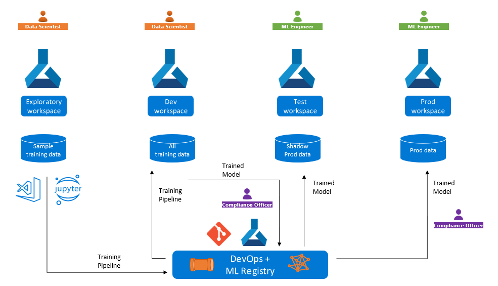

# Machine Learning registries for MLOps

### Challenges with cross-workspace MLOps

In this article, you will learn how to scale MLOps across development, testing and production environments. Such application environments can vary from few to many based on the complexity of IT environment and is influenced by factors such as:
* Security and compliance policies - do production environments need to be isolated from development environments in terms of access controls, network architecture, data exposure, etc.?
* Subscriptions - Are your development environments in one subscription but production environments in a different  subscriptions to account for billing, budgeting, and cost management purposes?
* Regions - Do you need to deploy to different Azure regions to support latency and redundancy requirements? 

In such scenarios, you may be using different AzureML workspaces for development, testing and production. This presents with the following challenges model training and deployment:
* You need to train a model in development workspace but deploy it an endpoint in a production workspace, possibly in a different Azure subscription or region. In this case, you will must be able to trace back the training job to analyze the metrics, logs, code, environment and data used to train the model if you encounter accuracy or performance issues with the model deployed in production. 
* You need to develop a training pipeline with test data or anonymized data in the development workspace but retrain the model with production data in the production workspace. In this case, you may need to compare training metrics on sample vs production data to ensure the training optimizations are performing well with actual data. 

### Cross-workspace MLOps with registries - Concept

Registries, much like a Git repository, decouples ML assets from workspaces and hosts them in a central location, making them available to all workspaces in your organization.

In the scenario in which you want to promote models across dev, test and prod environments, you start by iteratively developing a model in the dev workspace and when you have a good candidate model, you can publish it to a Registry.
You can either register a model directly in a Registry from the output of a training job or promote an model already registered in a workspace to a Registry. You can then deploy the model from the registry to endpoints in different workspaces. 

In the scenario in which you want to develop a pipeline in workspace but run it in different workspaces, you register the components and environments that form the building blocks of pipelines in the registry. You can run submit pipeline jobs that reference these components and environment to different workspaces by specifying the compute and training data that are unique to each workspace in which the pipelines are run. 

Below below diagram captures the pipleine promotion between exploratory and dev workspaces and model promotion from dev to test and prod workspaces.  

### Cross-workspace MLOps with registries - Practice

Learn how to [create a registry](./how-to-manage-registries.md).

Refer to [sharing models, components and environments using Python SDK](./how-to-share-models-pipelines-across-workspaces-with-registries-sdk.md) or [sharing models, components and environments using CLI](./how-to-share-models-pipelines-across-workspaces-with-registries.md) to try out a walk through of creating assets in a registry and using them in workspaces. 