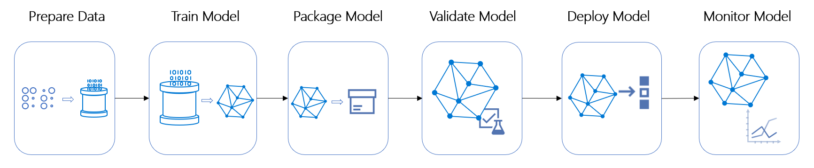

# What are Azure Machine Learning pipelines?

In this article, you can learn how Azure Machine Learning pipelines help you build, optimize, and manage machine learning workflows. These workflows have a number of benefits: 

+ Simplicity
+ Speed
+ Repeatability
+ Flexibility
+ Versioning and tracking
+ Modularity 
+ Quality assurance
+ Cost control

These benefits become significant as soon as your machine learning project moves beyond pure exploration and into iteration. Even simple one-step pipelines can be valuable. Machine learning projects are often in a complex state, and it can be a relief to make the precise accomplishment of a single workflow a trivial process.

Learn how to [create your first pipeline](how-to-create-your-first-pipeline.md).



<a name="compare"></a>
### Which Azure pipeline technology should I use?

The Azure cloud provides several other pipelines, each with a different purpose. The following table lists the different pipelines and what they are used for:

| Scenario | Primary persona | Azure offering | OSS offering | Canonical pipe | Strengths | 
| -------- | --------------- | -------------- | ------------ | -------------- | --------- | 
| Model orchestration (Machine learning) | Data scientist | Azure Machine Learning Pipelines | Kubeflow Pipelines | Data -> Model | Distribution, caching, code-first, reuse | 
| Data orchestration (Data prep) | Data engineer | [Azure Data Factory pipelines](https://docs.microsoft.com/azure/data-factory/concepts-pipelines-activities) | Apache Airflow | Data -> Data | Strongly-typed movement. Data-centric activities. |
| Code & app orchestration (CI/CD) | App Developer / Ops | [Azure DevOps Pipelines](https://azure.microsoft.com/services/devops/pipelines/) | Jenkins | Code + Model -> App/Service | Most open and flexible activity support, approval queues, phases with gating | 

## What can Azure ML pipelines do?

An Azure Machine Learning pipeline is an independently executable workflow of a complete machine learning task. Subtasks are encapsulated as a series of steps within the pipeline. An Azure Machine Learning pipeline can be as simple as one that calls a Python script, so _may_ do just about anything. Pipelines _should_ focus on machine learning tasks such as:

+ Data preparation including importing, validating and cleaning, munging and transformation, normalization, and staging
+ Training configuration including parameterizing arguments, filepaths, and logging / reporting configurations
+ Training and validating efficiently and repeatedly. Efficiency might come from specifying specific data subsets, different hardware compute resources, distributed processing, and progress monitoring
+ Deployment, including versioning, scaling, provisioning, and access control 

Independent steps allow multiple data scientists to work on the same pipeline at the same time without over-taxing compute resources. Separate steps also make it easy to use different compute types/sizes for each step.

After the pipeline is designed, there is often more fine-tuning around the training loop of the pipeline. When you rerun a pipeline, the run jumps to the steps that need to be rerun, such as an updated training script. Steps that do not need to be rerun are skipped. The same analysis applies to unchanged scripts used for the accomplishment of the step. This reuse functionality helps to avoid running costly and time-intensive steps like data ingestion and transformation if the underlying data hasn't changed.

With Azure Machine Learning, you can use various toolkits and frameworks, such as PyTorch or TensorFlow, for each step in your pipeline. Azure coordinates the various [compute targets](concept-azure-machine-learning-architecture.md) you use, so your intermediate data can be shared with the downstream compute targets.

You can [track the metrics for your pipeline experiments](https://docs.microsoft.com/azure/machine-learning/how-to-track-experiments) directly in  Azure portal or your [workspace landing page (preview)](https://ml.azure.com). After a pipeline has been published, you can configure a REST endpoint, which allows you to rerun the pipeline from any platform or stack.

In short, all of the complex tasks of the machine learning lifecycle can be helped with pipelines. Other Azure pipeline technologies have their own strengths. [Azure Data Factory pipelines](https://docs.microsoft.com/azure/data-factory/concepts-pipelines-activities) excels at working with data and [Azure Pipelines](https://azure.microsoft.com/services/devops/pipelines/) is the right tool for continuous integration and deployment. But if your focus is machine learning, Azure Machine Learning pipelines are likely to be the best choice for your workflow needs. 

## What are Azure ML pipelines?

An Azure ML pipeline performs a complete logical workflow with an ordered sequence of steps. Each step is a discrete processing action. Pipelines run in the context of an Azure Machine Learning [Experiment](https://docs.microsoft.com/python/api/azureml-core/azureml.core.experiment.experiment?view=azure-ml-py).

In the early stages of an ML project, it's fine to have a single Jupyter notebook or Python script that does all the work of Azure workspace and resource configuration, data preparation, run configuration, training, and validation. But just as functions and classes quickly become preferable to a single imperative block of code, ML workflows quickly become preferable to a monolithic notebook or script. 

By modularizing ML tasks, pipelines support the Computer Science imperative that a component should "do (only) one thing well." Modularity is clearly vital to project success when programming in teams, but even when working alone, even a small ML project involves separate tasks, each with a good amount of complexity. Tasks include: workspace configuration and data access, data preparation, model definition and configuration, and deployment. While the outputs of one or more tasks form the inputs to another, the exact implementation details of any one task are, at best, irrelevant distractions in the next. At worst, the computational state of one task can cause a bug in another. 

### Analyzing dependencies

Many programming ecosystems have tools that orchestrate resource, library, or compilation dependencies. Generally, these tools use file timestamps to calculate dependencies. When a file is changed, only it and its dependents are updated (downloaded, recompiled, or packaged). Azure ML pipelines extend this concept dramatically. Like traditional build tools, pipelines calculate dependencies between steps and only perform the necessary recalculations. 

The dependency analysis in Azure ML pipelines is more sophisticated than simple timestamps though. Every step may run in a different hardware and software environment. Data preparation might be a time-consuming process but not need to run on hardware with powerful GPUs, certain steps might require OS-specific software, you might want to use distributed training, and so forth. While the cost savings for optimizing resources may be significant, it can be overwhelming to manually juggle all the different variations in hardware and software resources. It's even harder to do all that without ever making a mistake in the data you transfer between steps. 

Pipelines solve this problem. Azure Machine Learning automatically orchestrates all of the dependencies between pipeline steps. This orchestration might include spinning up and down Docker images, attaching and detaching compute resources, and moving data between the steps in a consistent and automatic manner.

### Reusing results

Additionally, the output of a step may, if you choose, be reused. If you specify reuse as a possibility and there are no upstream dependencies triggering recalculation, the pipeline service will use a cached version of the step's results. Such reuse can dramatically decrease development time. If you have a complex data preparation task, you probably rerun it more often than is strictly necessary. Pipelines relieve you of that worry: if necessary, the step will run, if not, it won't.

All of this dependency analysis, orchestration, and activation are handled by Azure Machine Learning when you instantiate a [Pipeline](https://docs.microsoft.com/python/api/azureml-pipeline-core/azureml.pipeline.core.pipeline(class)?view=azure-ml-py) object, pass it to an `Experiment`, and call `submit()`. 

### Coordinating the steps involved

When you create and run a `Pipeline` object, the following high-level steps occur:

+ For each step, the service calculates requirements for:
    + Hardware compute resources
    + OS resources (Docker image(s))
    + Software resources (Conda / virtualenv dependencies)
    + Data inputs 
+ The service determines the dependencies between steps, resulting in a dynamic execution graph
+ When each node in the execution graph runs:
    + The service configures the necessary hardware and software environment (perhaps reusing existing resources)
    + The step runs, providing logging and monitoring information to its containing `Experiment` object
    + When the step completes, its outputs are prepared as inputs to the next step and/or written to storage
    + Resources that are no longer needed are finalized and detached


## Building pipelines with the Python SDK

In the [Azure Machine Learning Python SDK](https://docs.microsoft.com/python/api/overview/azure/ml/install?view=azure-ml-py), a pipeline is a Python object defined in the `azureml.pipeline.core` module. A [Pipeline](https://docs.microsoft.com/python/api/azureml-pipeline-core/azureml.pipeline.core.pipeline%28class%29?view=azure-ml-py) object contains an ordered sequence of one or more [PipelineStep](https://docs.microsoft.com/python/api/azureml-pipeline-core/azureml.pipeline.core.builder.pipelinestep?view=azure-ml-py) objects. The `PipelineStep` class is abstract and the actual steps will be of subclasses such as [EstimatorStep](https://docs.microsoft.com/python/api/azureml-pipeline-steps/azureml.pipeline.steps.estimatorstep?view=azure-ml-py), [PythonScriptStep](https://docs.microsoft.com/python/api/azureml-pipeline-steps/azureml.pipeline.steps.pythonscriptstep?view=azure-ml-py), or [DataTransferStep](https://docs.microsoft.com/python/api/azureml-pipeline-steps/azureml.pipeline.steps.datatransferstep?view=azure-ml-py). The [ModuleStep](https://docs.microsoft.com/python/api/azureml-pipeline-steps/azureml.pipeline.steps.modulestep?view=azure-ml-py) class holds a reusable sequence of steps that can be shared among pipelines. A `Pipeline` runs as part of an `Experiment`.

An Azure ML pipeline is associated with an Azure Machine Learning workspace and a pipeline step is associated with a compute target available within that workspace. For more information, see [Create and manage Azure Machine Learning workspaces in the Azure portal](https://docs.microsoft.com/azure/machine-learning/how-to-manage-workspace) or [What are compute targets in Azure Machine Learning?](https://docs.microsoft.com/azure/machine-learning/concept-compute-target).

In Azure Machine Learning, a compute target is the environment in which an ML phase occurs. The software environment may be a Remote VM, Azure Machine Learning Compute, Azure Databricks, Azure Batch, and so on. The hardware environment can also vary greatly, depending on GPU support, memory, storage, and so forth. You may specify the compute target for each step, which gives you fine-grained control over costs. You can use more- or less- powerful resources for the specific action, data volume, and performance needs of your project. 

## Building pipelines with the designer

Developers who prefer a visual design surface can use the Azure Machine Learning designer to create pipelines. You can access this tool from the **Designer** selection on the homepage of your workspace.  The designer allows you to drag and drop steps onto the design surface. For rapid development, you can use existing modules across the spectrum of ML tasks; existing modules cover everything from data transformation to algorithm selection to training to deployment. Or you can create a fully custom pipeline by combining your own steps defined in Python scripts.

When you visually design pipelines, the inputs and outputs of a step are displayed visibly. You can drag and drop data connections, allowing you to quickly understand and modify the dataflow of your pipeline.
 


### Understanding the execution graph

The steps within a pipeline may have dependencies on other steps. The Azure ML pipeline service does the work of analyzing and orchestrating these dependencies. The nodes in the resulting "execution graph" are processing steps. Each step may involve creating or reusing a particular combination of hardware and software, reusing cached results, and so on. The service's orchestration and optimization of this execution graph can significantly speed up an ML phase and reduce costs. 

Because steps run independently, objects to hold the input and output data that flows between steps must be defined externally. This is the role of [DataSet](https://docs.microsoft.com/python/api/azureml-core/azureml.data.data_reference.datareference?view=azure-ml-py)and [PipelineData](https://docs.microsoft.com/python/api/azureml-pipeline-core/azureml.pipeline.core.pipelinedata?view=azure-ml-py), objects. These data objects are associated with a [Datastore](https://docs.microsoft.com/python/api/azureml-core/azureml.core.datastore%28class%29?view=azure-ml-py) object that encapsulates their storage configuration. The `PipelineStep` base class is always created with a `name` string, a list of `inputs`, and a list of `outputs`. Usually, it also has a list of `arguments` and often it will have a list of `resource_inputs`. Subclasses will generally have additional arguments as well (for instance, `PythonScriptStep` requires the filename and path of the script to run). 

The execution graph is acyclic, but pipelines can be run on a recurring schedule and can run Python scripts that can write state information to the file system, making it possible to create complex profiles. If you design your pipeline so that certain steps may run in parallel or asynchronously, Azure Machine Learning transparently handles the dependency analysis and coordination of fan-out and fan-in. You generally don't have to concern yourself with the details of the execution graph, but it's available via the [Pipeline.graph](https://docs.microsoft.com/python/api/azureml-pipeline-core/azureml.pipeline.core.pipeline.pipeline?view=azure-ml-py#attributes) attribute. 


### A simple Python Pipeline

This snippet shows the objects and calls needed to create and run a basic `Pipeline`:

```python
ws = Workspace.from_config() 
blob_store = Datastore(ws, "workspaceblobstore")
compute_target = ws.compute_targets["STANDARD_NC6"]
experiment = Experiment(ws, 'MyExperiment') 

input_data = Dataset.File.from_files(
    DataPath(datastore, '20newsgroups/20news.pkl'))

output_data = PipelineData("output_data", datastore=blob_store)

input_named = input_data.as_named_input('input')

steps = [ PythonScriptStep(
    script_name="train.py",
    arguments=["--input", input_named.as_download(), "--output", output_data],
    inputs=[input_data],
    outputs=[output_data],
    compute_target=compute_target,
    source_directory="myfolder"
) ]

pipeline = Pipeline(workspace=ws, steps=steps)

pipeline_run = experiment.submit(pipeline)
pipeline_run.wait_for_completion()
```

The snippet starts with common Azure Machine Learning objects, a `Workspace`, a `Datastore`, a [ComputeTarget](https://docs.microsoft.com/python/api/azureml-core/azureml.core.computetarget?view=azure-ml-py), and an `Experiment`. Then, the code creates the objects to hold `input_data` and `output_data`. The array `steps` holds a single element, a `PythonScriptStep` that will use the data objects and run on the `compute_target`. Then, the code instantiates the `Pipeline` object itself, passing in the workspace and steps array. The call to `experiment.submit(pipeline)` begins the Azure ML pipeline run. The call to `wait_for_completion()` blocks until the pipeline is finished. 

To learn more about connecting your pipeline to your data, see the articles [Data access in Azure Machine Learning](concept-data.md) and [Moving data into and between ML pipeline steps (Python)](how-to-move-data-in-out-of-pipelines.md). 

## Best practices when using pipelines

As you can see, creating an Azure ML pipeline is a little more complex than starting a script. Pipelines require a few Python objects be configured and created. 

Some situations that suggest using a pipeline:

* In a team environment: divide ML tasks into multiple independent steps so that developers can work and evolve their programs independently. 

* When in or near deployment: nail down the configuration and use scheduled and event-driven operations to stay on top of changing data.

* In the early stages of an ML project or working alone: use pipelines to automate the build. If you've started worrying about recreating the configuration and computational state before implementing a new idea, that's a signal that you might consider using a pipeline to automate the workflow. 

It's easy to become enthusiastic about reusing cached results, fine-grained control over compute costs, and process isolation, but pipelines do have costs. Some anti-patterns include:

* Using pipelines as the sole means to separate concerns. Python's built-in functions, objects, and modules go a long way to avoid confusing programmatic state! A pipeline step is much more expensive than a function call.

* Heavy coupling between pipeline steps. If refactoring a dependent step frequently requires modifying the outputs of a previous step, it's likely that separate steps are currently more of a cost than a benefit. Another clue that steps are overly coupled is arguments to a step that are not data but flags to control processing. 

* Prematurely optimizing compute resources. For instance, there are often several stages to data preparation and one can often see "Oh, here's a place where I could use an `MpiStep` for parallel-programming but here's a place where I could use a `PythonScriptStep` with a less-powerful compute target," and so forth. And maybe, in the long run, creating fine-grained steps like that might prove worthwhile, especially if there's a possibility to use cached results rather than always recalculating. But pipelines are not intended to be a substitute for Python's native `multiprocessing` module. 

Until a project gets large or nears deployment, your pipelines should be coarser rather than fine-grained. If you think of your ML project as involving _stages_ and a pipeline as providing a complete workflow to move you through a particular stage, you're on the right path. 

## Key advantages

The key advantages of using pipelines for your machine learning workflows are:

|Key advantage|Description|
|:-------:|-----------|
|**Unattended&nbsp;runs**|Schedule steps to run in parallel or in sequence in a reliable and unattended manner. Data preparation and modeling can last days or weeks, and pipelines allow you to focus on other tasks while the process is running. |
|**Heterogenous compute**|Use multiple pipelines that are reliably coordinated across heterogeneous and scalable compute resources and storage locations. Make efficient use of available compute resources by running individual pipeline steps on different compute targets, such as HDInsight, GPU Data Science VMs, and Databricks.|
|**Reusability**|Create pipeline templates for specific scenarios, such as retraining and batch-scoring. Trigger published pipelines from external systems via simple REST calls.|
|**Tracking and versioning**|Instead of manually tracking data and result paths as you iterate, use the pipelines SDK to explicitly name and version your data sources, inputs, and outputs. You can also manage scripts and data separately for increased productivity.|
| **Modularity** | Separating areas of concerns and isolating changes allows software to evolve at a faster rate with higher quality. | 
|**Collaboration**|Pipelines allow data scientists to collaborate across all areas of the machine learning design process, while being able to concurrently work on pipeline steps.|

### Choosing the proper PipelineStep subclass

The `PythonScriptStep` is the most flexible subclass of the abstract `PipelineStep`. Other subclasses, such as `EstimatorStep` subclasses and `DataTransferStep` can accomplish specific tasks with less code. For instance, an `EstimatorStep` can be created just by passing in a name for the step, an `Estimator`, and a compute target. Or, you can override inputs and outputs, pipeline parameters, and arguments. For more information, see [Train models with Azure Machine Learning using estimator](how-to-train-ml-models.md). 

The `DataTransferStep` makes it easy to move data between data sources and sinks. The code to do this transfer manually is straightforward but repetitive. Instead, you can just create a `DataTransferStep` with a name, references to a data source and a data sink, and a compute target. The notebook [Azure Machine Learning Pipeline with DataTransferStep](https://github.com/Azure/MachineLearningNotebooks/blob/master/how-to-use-azureml/machine-learning-pipelines/intro-to-pipelines/aml-pipelines-data-transfer.ipynb) demonstrates this flexibility.

## Modules

While pipeline steps allow the reuse of the results of a previous run, in many cases the construction of the step assumes that the scripts and dependent files required must be locally available. If a data scientist wants to build on top of existing code, the scripts and dependencies often must be cloned from a separate repository.

Modules are similar in usage to pipeline steps, but provide versioning facilitated through the workspace, which enables collaboration and reusability at scale. Modules are designed to be reused in multiple pipelines and can evolve to adapt a specific computation to different use-cases. Users can do the following tasks through the workspace, without using external repositories:

* Create new modules, and publish new versions of existing modules
* Deprecate existing versions
* Mark versions disabled to prevent consumers from using that version
* Designate default versions
* Retrieve modules by version from the workspace, to ensure teams are using the same code

See the [notebook](https://github.com/Azure/MachineLearningNotebooks/blob/master/how-to-use-azureml/machine-learning-pipelines/intro-to-pipelines/aml-pipelines-how-to-use-modulestep.ipynb) for code examples on how to create, connect, and use modules in Azure Machine Learning pipelines.

## Next steps

Azure ML pipelines are a powerful facility that begins delivering value in the early development stages. The value increases as the team and project grows. This article has explained how pipelines are specified with the Azure Machine Learning Python SDK and orchestrated on Azure. You've seen some basic source code and been introduced to a few of the `PipelineStep` classes that are available. You should have a sense of when to use Azure ML pipelines and how Azure runs them. 


+ Learn how to [create your first pipeline](how-to-create-your-first-pipeline.md).

+ Learn how to [run batch predictions on large data](tutorial-pipeline-batch-scoring-classification.md ).

+ See the SDK reference docs for [pipeline core](https://docs.microsoft.com/python/api/azureml-pipeline-core/?view=azure-ml-py) and [pipeline steps](https://docs.microsoft.com/python/api/azureml-pipeline-steps/?view=azure-ml-py).

+ Try out example Jupyter notebooks showcasing [Azure Machine Learning pipelines](https://github.com/Azure/MachineLearningNotebooks/blob/master/how-to-use-azureml/machine-learning-pipelines). Learn how to [run notebooks to explore this service](samples-notebooks.md).
