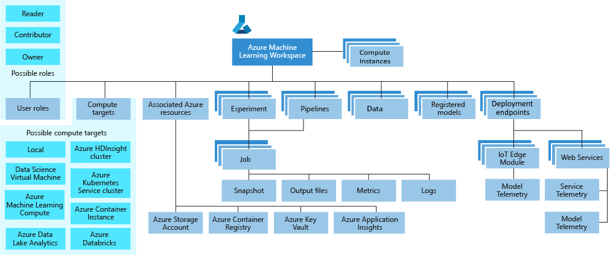

# What is an Azure Machine Learning workspace?

The workspace is the top-level resource for Azure Machine Learning, providing a centralized place to work with all the artifacts you create when you use Azure Machine Learning.  The workspace keeps a history of all training runs, including logs, metrics, output, and a snapshot of your scripts. You use this information to determine which training run produces the best model.  

Once you have a model you like, you register it with the workspace. You then use the registered model and scoring scripts to deploy to Azure Container Instances, Azure Kubernetes Service, or to a field-programmable gate array (FPGA) as a REST-based HTTP endpoint. You can also deploy the model to an Azure IoT Edge device as a module.

Pricing and features available depend on whether [Basic or Enterprise edition](overview-what-is-azure-ml.md#sku) is selected for the workspace. You select the edition when you [create the workspace](#create-workspace).  You can also [upgrade](#upgrade) from Basic to Enterprise edition.

## Taxonomy 

A taxonomy of the workspace is illustrated in the following diagram:

The diagram shows the following components of a workspace:

+ A workspace can contain [Azure Machine Learning compute instances](concept-compute-instance.md), cloud resources configured with the Python environment necessary to run Azure Machine Learning.

+ [User roles](how-to-assign-roles.md) enable you to share your workspace with other users, teams or projects.
+ [Compute targets](concept-azure-machine-learning-architecture.md#compute-targets) are used to run your experiments.
+ When you create the workspace, [associated resources](#resources) are also created for you.
+ [Experiments](concept-azure-machine-learning-architecture.md#experiments) are training runs you use to build your models.  
+ [Pipelines](concept-azure-machine-learning-architecture.md#ml-pipelines) are reusable workflows for training and retraining your model.
+ [Datasets](concept-azure-machine-learning-architecture.md#datasets-and-datastores) aid in management of the data you use for model training and pipeline creation.
+ Once you have a model you want to deploy, you create a registered model.
+ Use the registered model and a scoring script to create a [deployment endpoint](concept-azure-machine-learning-architecture.md#endpoints).

## Tools for workspace interaction

You can interact with your workspace in the following ways:

+ On the web:
    + [Azure Machine Learning studio ](https://ml.azure.com) 
    + [Azure Machine Learning designer](concept-designer.md) - Available only in [Enterprise edition](overview-what-is-azure-ml.md#sku) workspaces.
+ In any Python environment with the [Azure Machine Learning SDK for Python](https://docs.microsoft.com/python/api/overview/azure/ml/intro?view=azure-ml-py).
+ In any R environment with the [Azure Machine Learning SDK for R](https://azure.github.io/azureml-sdk-for-r/reference/index.html).
+ On the command line using the Azure Machine Learning [CLI extension](https://docs.microsoft.com/azure/machine-learning/reference-azure-machine-learning-cli)

## Machine learning with a workspace

Machine learning tasks read and/or write artifacts to your workspace.

+ Run an experiment to train a model - writes experiment run results to the workspace.
+ Use automated ML to train a model - writes training results to the workspace.
+ Register a model in the workspace.
+ Deploy a model - uses the registered model to create a deployment.
+ Create and run reusable workflows.
+ View machine learning artifacts such as experiments, pipelines, models, deployments.
+ Track and monitor models.

## Workspace management

You can also perform the following workspace management tasks:

| Workspace management task   | Portal              | Studio | Python SDK / R SDK       | CLI        |
|---------------------------|---------|---------|------------|------------|
| Create a workspace        | **&check;**     | | **&check;** | **&check;** |
| Manage workspace access    | **&check;**   || |  **&check;**    |
| Upgrade to Enterprise edition    | **&check;** | **&check;**  | |     |
| Create and manage compute resources    | **&check;**   | **&check;** | **&check;** |  **&check;**   |
| Create a Notebook VM |   | **&check;** | |     |

> [!NOTE]
> Compute instances are available only for workspaces with a region of **North Central US** or **UK South**.
>If your workspace is in any other region, you can continue to create and use a [Notebook VM](concept-compute-instance.md#notebookvm) instead.

##  Create a workspace

When you create a workspace, you decide whether to create it with [Basic or Enterprise edition](overview-what-is-azure-ml.md#sku). The edition determines the features available in the workspace. Among other features, Enterprise edition gives you access to [Azure Machine Learning designer](concept-designer.md) and the studio version of building [automated machine learning experiments](tutorial-first-experiment-automated-ml.md).  For more details and pricing information, see [Azure Machine Learning pricing](https://azure.microsoft.com/pricing/details/machine-learning/).

There are multiple ways to create a workspace:  

* Use the [Azure portal](how-to-manage-workspace.md) for a point-and-click interface to walk you through each step.
* Use the [Azure Machine Learning SDK for Python](https://docs.microsoft.com/python/api/overview/azure/ml/intro?view=azure-ml-py#workspace) to create a workspace on the fly from Python scripts or Jupiter notebooks
* Use an [Azure Resource Manager template](how-to-create-workspace-template.md) or the [Azure Machine Learning CLI](reference-azure-machine-learning-cli.md) when you need to automate or customize the creation with corporate security standards.
* If you work in Visual Studio Code, use the [VS Code extension](tutorial-setup-vscode-extension.md).

##  Upgrade to Enterprise edition

You can [upgrade your workspace from Basic to Enterprise edition](how-to-manage-workspace.md#upgrade) using Azure portal. You cannot downgrade an Enterprise edition workspace to a Basic edition workspace. 

##  Associated resources

When you create a new workspace, it automatically creates several Azure resources that are used by the workspace:

+ [Azure Container Registry](https://azure.microsoft.com/services/container-registry/): Registers docker containers that you use during training and when you deploy a model. To minimize costs, ACR is **lazy-loaded** until deployment images are created.
+ [Azure Storage account](https://azure.microsoft.com/services/storage/): Is used as the default datastore for the workspace.  Jupyter notebooks that are used with your Azure Machine Learning compute instances are stored here as well.
+ [Azure Application Insights](https://azure.microsoft.com/services/application-insights/): Stores monitoring information about your models.
+ [Azure Key Vault](https://azure.microsoft.com/services/key-vault/): Stores secrets that are used by compute targets and other sensitive information that's needed by the workspace.

> [!NOTE]
> In addition to creating new versions, you can also use existing Azure services.

## Next steps

To get started with Azure Machine Learning, see:

+ [Azure Machine Learning overview](overview-what-is-azure-ml.md)
+ [Create a workspace](how-to-manage-workspace.md)
+ [Manage a workspace](how-to-manage-workspace.md)
+ [Tutorial: Get started creating your first ML experiment with the Python SDK](tutorial-1st-experiment-sdk-setup.md)
+ [Tutorial: Get started with Azure Machine Learning with the R SDK](tutorial-1st-r-experiment.md)
+ [Tutorial: Create your first classification model with automated machine learning](tutorial-first-experiment-automated-ml.md) (Available only in [Enterprise edition](overview-what-is-azure-ml.md#sku) workspaces)
+ [Tutorial: Predict automobile price with the designer](tutorial-designer-automobile-price-train-score.md) (Available only in [Enterprise edition](overview-what-is-azure-ml.md#sku) workspaces)
