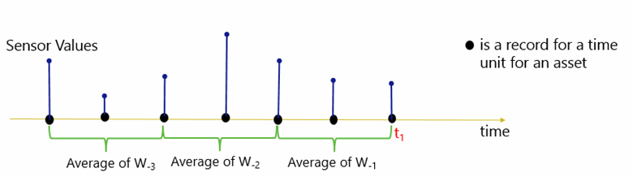
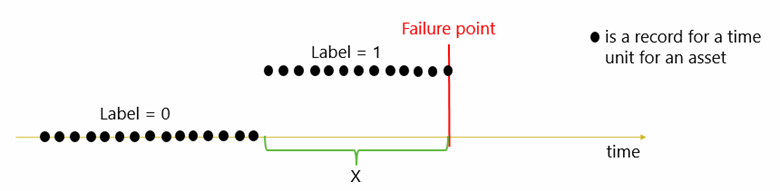
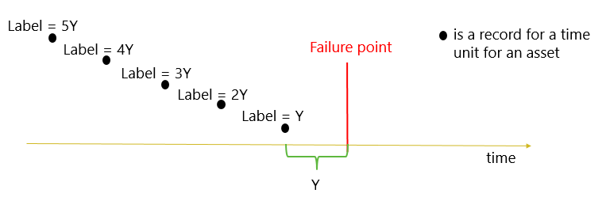
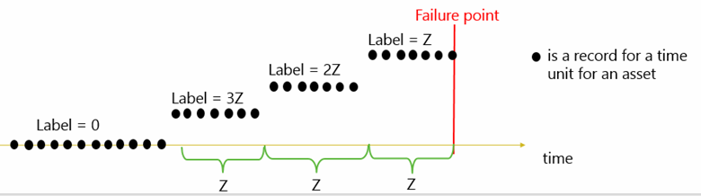
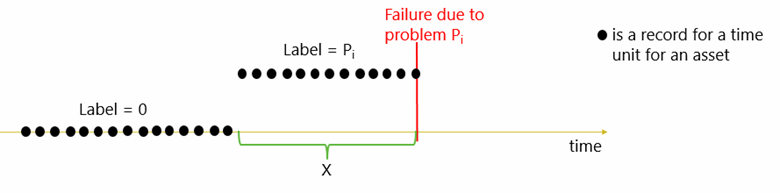
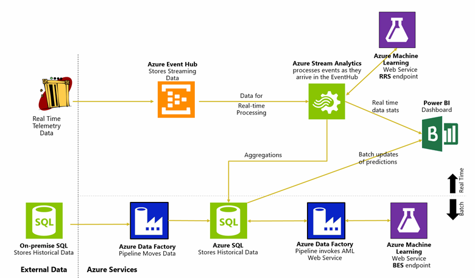

<properties
	pageTitle="Cortana Intelligence Solution Template Playbook for predictive maintenance in aerospace and other businesses | Microsoft Azure"
	description="A Solution Template with Microsoft Cortana Intelligence for predictive maintenance in aerospace, utilities, and transportation."
	services="cortana-analytics"
	documentationCenter=""
	authors="fboylu"
	manager="paulettm"
	editor="cgronlun"/>

<tags
	ms.service="cortana-analytics"
	ms.workload="data-services"
	ms.tgt_pltfrm="na"
	ms.devlang="na"
	ms.topic="article"
	ms.date="06/21/2016"
	ms.author="fboylu" />

# Cortana Intelligence Solution Template Playbook for predictive maintenance in aerospace and other businesses

## Executive summary  
Predictive maintenance is one of the most demanded applications of
predictive analytics with unarguable benefits including tremendous
amount of cost savings. This playbook aims at providing a reference for
predictive maintenance solutions with the emphasis on major use cases.
It is prepared to give the reader an understanding of the most common
business scenarios of predictive maintenance, challenges of qualifying
business problems for such solutions, data required to solve these
business problems, predictive modeling techniques to build solutions
using such data and best practices with sample solution architectures.
It also describes the specifics of the predictive models developed such
as feature engineering, model development and performance evaluation. In
essence, this playbook brings together the business and analytical
guidelines needed for a successful development and deployment of
predictive maintenance solutions. These guidelines are prepared to help
the audience create an initial solution using Cortana Intelligence Suite
and specifically Azure Machine Learning as a starting point in their
long term predictive maintenance strategy. The documentation regarding
Cortana Intelligence Suite and Azure Machine Learning can be found in
[Cortana
Analytics](http://www.microsoft.com/server-cloud/cortana-analytics-suite/overview.aspx)
and [Azure Machine
Learning](https://azure.microsoft.com/services/machine-learning/)
pages.

>[AZURE.TIP]
For a technical guide to implementing this Solution Template, see [Technical guide to the Cortana Intelligence Solution Template for predictive maintenance](cortana-analytics-technical-guide-predictive-maintenance.md).
To download a diagram that provides an architectural overview of this template, see
[Architecture of the Cortana Intelligence Solution Template for predictive maintenance](cortana-analytics-architecture-predictive-maintenance.md).

## Playbook overview and target audience  
This playbook is organized to benefit both technical
and non-technical audience with varying backgrounds and interests in
predictive maintenance space. The playbook covers both high level
aspects of the different types of predictive maintenance solutions and
details of how to implement them. The content is balanced to
cater both to the audience who are only interested in understanding the
solution space and the type of applications as well as those who are
looking to implement these solutions and are hence interested in the
technical details.

Majority of the content in this playbook does not assume prior data
science knowledge or expertise. However, some parts of the playbook will
require somewhat familiarity with data science concepts to be able to
follow implementation details. Introductory level data science skills
are required to fully benefit from the material in those sections.

The first half of the playbook covers an introduction to predictive
maintenance applications, how to qualify a predictive maintenance
solution, a collection of common use cases with the details of the
business problem, the data surrounding these use cases and the business
benefits of implementing these predictive maintenance solutions. These
sections don’t require any technical knowledge in the predictive
analytics domain.

In the second half of the playbook, we cover the types of predictive
modeling techniques for predictive maintenance applications and how to
implement these models through examples from the use cases outlined in
the first half of the playbook. This is illustrated by going through the
steps of data preprocessing such as data labeling and feature
engineering, model selection, training/testing and performance evaluation
best practices. These sections are suitable for technical audience.

## Predictive maintenance in IoT
The impact of unscheduled equipment downtime can be extremely
destructive for businesses. It is critical to keep field equipment
running in order to maximize utilization and performance and by minimizing
costly, unscheduled downtime. Simply, waiting for the failure to occur
is not affordable in today’s business operations
scene. To remain competitive, companies look for new ways to maximize
asset performance by making use of the data collected from various
channels. One important way to analyze such information is to utilize
predictive analytic techniques that use historical patterns to predict
future outcomes. One of the most popular of these solutions is called
Predictive Maintenance which can generally be defined as but not limited
to predicting possibility of failure of an asset in the near future so
that the assets can be monitored to proactively identify failures and
take action before the failures occur. These solutions detect failure
patterns to determine assets that are at the greatest risk of failure.
This early identification of issues helps deploy limited maintenance
resources in a more cost-effective way and enhance quality and supply
chain processes.

With the rise of the Internet of Things (IoT) applications, predictive
maintenance has been gaining increasing attention in the industry as the
data collection and processing technologies has matured enough to
generate, transmit, store and analyze all kinds of data in batches or in
real-time. Such technologies enable easy development and deployment of
end-to-end solutions with advanced analytics solutions, with
predictive maintenance solutions providing
arguably the largest amount of benefits.

Business problems in the predictive maintenance domain range from high
operational risk due to unexpected failures and limited insight into the
root cause of problems in complex business environments. The majority of
these problems can be categorized to fall under the following business
questions:

-   What is the probability that an equipment will fail in the near
    future?
-   What is the remaining useful life of the equipment?
-   What are the causes of failures and what maintenance actions should
    be performed to fix these issues?

By utilizing predictive maintenance to answer these questions,
businesses can:
-   Reduce operational risk and increase rate of return on assets by
    spotting failures before they occurred
-   Reduce unnecessary time-based maintenance operations and control
    cost of maintenance
-   Improve overall brand image, eliminate bad publicity and resulting
    lost sales from customer attrition.
-   Lower inventory costs by reducing inventory levels by predicting the
    reorder point
-   Discover patterns connected to various maintenance problems

Predictive maintenance solutions can provide businesses with key
performance indicators such as health scores to monitor real-time asset
condition, an estimate of the remaining lifespan of assets,
recommendation for proactive maintenance activities and estimated order
dates for replacement of parts.

## Qualification criteria for predictive maintenance
It is important to emphasize that not all use cases or business problems
can be effectively solved by predictive maintenance. Important
qualification criteria include whether the problem is predictive in nature,
that a clear path of action exists in order to prevent failures when they
are detected beforehand and most importantly, data with sufficient
quality to support the use case is available. Here, we focus on the data
requirements for building a successful predictive maintenance solution.

When building predictive models, we use historical data to train the
model which will then recognize hidden patterns and further identify
these patterns in the future data. These models are trained with
examples described by their features and the target of prediction. The
trained model is expected to make predictions on the target by only
looking at the features of the new examples. It is crucial that the
model capture the relationship between features and the target of
prediction. In order to train an effective machine learning model, we
need training data which includes features that actually have predictive
power towards the target of prediction meaning the data should be relevant
to the prediction goal to expect accurate predictions.

For example, if the target is to predict failures of train wheels, the
training data should contain wheel related features (e.g. telemetry
reflecting the health status of wheels, the mileage, car load, etc.).
However, if the target is to predict train engine failures, we probably
need another set of training data that has engine related features.
Before building predictive models, we expect the business expert to
understand the data relevancy requirement and provide the domain
knowledge that is needed to select relevant subsets of data for the analysis.

There are three essential data sources we look for when qualifying a
business problem to be suitable for a predictive maintenance solution:
1.  Failure History: Typically, in predictive maintenance applications,
    failure events are very rare. However, when building predictive
    models that will predict failures, the algorithm needs to learn the
    normal operation pattern as well as the failure pattern through the
    training process. Hence, it is essential that the training data
    contains sufficient number of examples in both categories in order
    to learn these two different patterns. For that reason, we require
    that data has sufficient number of failure events. Failure events
    can be found in maintenance records and parts replacement history or
    anomalies in the training data can also be used as failures as
    identified by the domain experts.
2.  Maintenance/Repair History: An essential source of data for
    predictive maintenance solutions is the detailed maintenance history
    of the asset containing information about the components replaced,
    preventive maintenance activates performed, etc. It is extremely
    important to capture these events as these will affect the
    degradation patterns and absence of this information will cause
    misleading results.
3.  Machine Conditions: In order to predict how many more days (hours,
    miles, transactions, etc.) a machine will last before it fails, we
    assume the machine’s health status will degrade over time during
    its operation. Therefore, we expect the data to contain time-varying
    features that capture this aging pattern and any anomalies that will
    lead to degradation. In IoT applications, the telemetry data from
    different sensors represent one good example. In order to predict if
    a machine is going to fail within a time frame, ideally the data
    should capture degrading trend during this time frame before the
    actual failure event.

Additionally, we require data that is directly related to the operating
conditions of the target asset of prediction. The decision of target is
based on both business needs and data availability. Taking the train
wheel failure prediction as an example, we may predict "if the wheel is
going to have a failure" or "if the whole train is going have a
failure". The first one targets a more specific component whereas the
second one targets failure of the train. The second one is a more general question
that will require a lot more dispersed data elements than the first one,
making it harder to build a model. Conversely, trying to predict wheel
failures just by looking at the high level train condition data may not
be feasible as it does not contain information at the component level.
In general, it is more sensible to predict specific failure events than
more general ones.

One common question that is usually asked about failure history data is
"How many failure events are required to train a model and how many is
considered as "enough"? There is no clear answer to that question as in
many predictive analytics scenarios, it is usually the quality of the
data that dictates what is acceptable. If the dataset does not include
features that are relevant to failure prediction, then even if there are
many failure events, building a good model may not be possible. However,
the rule of thumb is that the more the failure events the better the
model will be and a rough estimate of how many failure examples are
required is a very context and data dependent measure. This issue is
discussed in the section for handling imbalanced datasets where we
propose methods to cope with the problem of not having enough failures.

## Sample use cases
This section focuses on a collection of predictive maintenance use cases
from several industries such as Aerospace, Utilities and Transportation.
Each subsection drills into the use cases collected in these areas and
discuss business problem, the data surrounding the business problem and
the benefits of a predictive maintenance solution.

### Aerospace
#### Use Case 1: Flight delay and cancellations
##### *Business problem and data sources*
One of the major business problems that airlines face is the significant
costs that are associated with flights being delayed due to mechanical
problems. If the mechanical failures cannot be repaired, flights may
even be cancelled. This is extremely costly as delays create problems in
scheduling and operations, causes bad reputation and customer
dissatisfaction along with many other problems. Airlines are
particularly interested in predicting such mechanical failures in
advance so that they can reduce flight delays or cancellations. The goal
of the predictive maintenance solution for these cases is to predict the
probability of aircrafts being delayed or canceled in the future, based
on relevant data sources such as maintenance history and flight route
information. The two major data sources for this use case are the flight
legs and page logs. Flight leg data includes data about the flight route
details such as the date and time of departure and arrival, departure
and arrival airports, etc. Page log data includes a series of error and
maintenance codes that are recorded by the maintenance personnel.

##### *Business value of the predictive model*
Using the available historical data, a predictive model was built using
a multi-classification algorithm to predict the type of mechanical issue
which will result in a delay or cancellation of a flight within the next 24 hours.
By making this prediction, necessary maintenance actions can be taken
to mitigate the risk while the aircrafts are being serviced and thus prevent
possible delays or cancellations. Using Azure Machine Learning
web service, the predictive models can seamlessly and easily be integrated
into airlines’ existing operating platforms. 

#### Use Case 2: Aircraft component failure
##### *Business problem and data sources*
Aircraft engines are very sensitive and expensive pieces of equipment
and engine part replacements are among the most common maintenance tasks
in the airline industry. Maintenance solutions for airlines require
careful management of component stock availability, delivery and
planning. Being able to gather intelligence on component reliability
will lead to substantial reduction on investment costs. The major data
source for this use case is telemetry data collected from a number of
sensors in the aircraft providing information on the condition of the
aircraft. Maintenance records were also used to identify when component
failures occurred and replacements were made.

##### Business value of the predictive model
A multi-class classification model was built that predicts the
probability of a failure due to a certain component within the next
month. By employing these solutions, airlines can reduce component
repair costs, improve component stock availability, reduce inventory
levels of related assets and improve maintenance planning.

### Utilities
#### Use Case 1: ATM cash dispense failure
##### *Business problem and data sources*
Executives in asset intensive industries often state that primary
operational risk to their businesses is unexpected failures of their
assets. As an example, failure of machinery such as ATMs in banking
industry is a very common problem that occurs frequently. These type of
problems makes predictive maintenance solutions very desirable for
operators of such machinery. In this use case, prediction problem is
to calculate the probability that an ATM cash withdrawal transaction
will get interrupted due to a failure in the cash dispenser such as a
paper jam or a part failure. Major data sources for this case are sensor
readings that collect measurements while cash notes are being dispensed
and also maintenance records collected over time. Sensor data included
sensor readings per each transaction completed and also sensor readings
per each note dispensed. The sensor readings provided measurements such
as gaps between notes, thickness, note arrival distance etc. Maintenance
data included error codes and repair information. These were used to
identify failure cases.

##### *Business value of the predictive model*
Two predictive models were built to predict failures in the cash
withdrawal transactions and failures in the individual notes dispensed
during a transaction. By being able to predict transaction failures
beforehand, ATMs can be serviced proactively to prevent failures from
occurring. Also, with note failure prediction, if a transaction is
likely to fail before it is complete due to a note dispense failure, it
may be best to stop the process and warn the customer for incomplete
transaction rather than waiting for the maintenance service to arrive
after the error occurs which may lead to larger customer
dissatisfaction.

#### Use Case 2: Wind turbine failures
##### *Business problem and data sources*
With the raise of environmental awareness, wind turbines have become one
of the major sources of energy generation and they usually cost millions
of dollars. One of the key components of wind turbines is the generator
motor which is equipped with many sensors that helps to monitor turbine
conditions and status. The sensor readings contain valuable information
which can be used to build a predictive model to predict critical Key Performance Indicators (KPIs)
such as mean time to failure for components of the wind turbine. Data
for this use case comes from multiple wind turbines that are located in
3 different farm locations. Measurements from close to a hundred sensors from each
turbine were recorded every 10 seconds for one year. These readings
include measurements such as temperature, generator speed, turbine power
and generator winding.

##### *Business value of the predictive model*
Predictive models were built to estimate remaining useful life for
generators and temperature sensors. By predicting the probability of
failure, maintenance technicians can focus on suspicious turbines that
are likely to fail soon to complement time based maintenance regimes.
Additionally, predictive models bring insight to the level of
contribution for different factors to the probability of a failure which
helps business to have a better understanding of the root cause of the
problems.

#### Use Case 3: Circuit breaker failures
##### *Business problem and data sources*
Electricity and gas operations that include generation, distribution and
sale of electrical energy require significant amount of maintenance to
ensure power lines are operational at all times to guarantee delivery of
energy to households. Failure of such operations is critical as almost
every entity is effected by power problems in the regions that they
occur. Circuit breakers are critical for such operations as they are a
piece of equipment that cut electrical current in case of problems and
short circuits to prevent any damage to power lines from happening. The
business problem for this use case is to predict circuit breaker
failures given maintenance logs, command history and technical
specifications.

Three major data sources for this case are maintenance logs that include
corrective, preventive and systematic actions, operational data that
includes automatic and manual commands send to circuit breakers such as
for open and close actions and technical specification data about the
properties of each circuit breaker such as year made, location, model,
etc.

##### *Business value of the predictive model*
Predictive maintenance solutions help reduce repair costs and increase
the lifecycle of equipment such as circuit breakers. These models will
also help improve the quality of the power network since models will
provide warnings ahead of time that will reduce unexpected failures
which will lead to less interruptions to the service.

#### Use Case 4: Elevator door failures
##### *Business problem and data sources*
Most large elevator companies typically have millions of elevators running around the world. To gain a competitive edge, they focus on reliability which is what matters most to their customers. Drawing on the potential of the Internet of Things, by connecting their elevators to the cloud and gathering data from elevator sensors and systems, they will be able to transform data into valuable business intelligence which will vastly improve operations by offering predictive and preemptive maintenance that is not something that is available to the competitors yet. The business requirement for this case is to provide a knowledge base predictive application that will predict the potential causes of door failures. The required data for this implementation consists of three parts which are elevator static features (e.g. identifiers, contract maintenance frequency, building type, etc.), usage information (e.g. number of door cycles, average door close time, etc.) and failure history (i.e. historical failure records and their causes).

A multiclass logistic regression model was built with Azure Machine
Learning to solve the prediction problem, with the integrated static
features and usage data as features, and the causes of historical
failure records as class labels. This predictive model will be consumed
by an app on a mobile device which will be used by field technicians to
help improve working efficiency. When a technician goes on site to
repair an elevator, he/she can refer to this app for recommended causes
and best courses of maintenance actions to fix the elevator doors as
fast as possible.

### Transportation and logistics
#### Use Case 1: Brake disc failures
##### *Business problem and data sources*
Typical maintenance policies for vehicles include corrective and
preventive maintenance. Corrective maintenance implies that the vehicle
is repaired after a failure has occurred which can cause a severe
inconvenience to the driver as a result of an unexpected malfunction and
the time wasted on a visit to mechanic. Most vehicles are also subject
to a preventive maintenance policy, which requires performing certain
inspections at a schedule which does not take into account the actual
condition of the car subsystems. None of these approaches are successful
in fully eliminating problems. The specific use case here is brake disc
failure prediction based on data collected through sensors installed in
the tire system of a car which keeps track of historical driving patterns
and other conditions that the car is exposed to. The most important data
source for this case is the sensor data that measure, for instance,
accelerations, braking patterns, driving distances, velocity, etc. This
information, coupled with other static information such as car features,
help build a good set of predictors that can be used in a predictive model. Another set
of essential information is the failure data which is inferred from the
part order database (used to keep the spare part order dates and
quantities as cars are being serviced in the dealerships).

##### *Business value of the predictive model*
The business value of a predictive approach here is substantial. A
predictive maintenance system can schedule a visit to the dealer based
on a predictive model. The model can be based on sensory information that is representing the
current condition of the car and the driving
history. This approach can minimize the risk of unexpected failures,
which may as well occur before the next periodic maintenance.
It can also reduce the amount of unnecessary preventive maintenance
activities. Driver can proactively be informed that a change of parts
might be necessary in a few weeks and supply the dealer with that
information. The dealer could than prepare an individual maintenance
package for the driver in advance.

#### Use Case 2: Subway train door failures
##### *Business problem and data sources*
One of the major reasons of delays and problems on subway operations is
door failures of train cars. Predicting if a train car may have a door
failure, or being able to forecast the number of days till the next
door failure, is extremely important foresight. It provides the opportunity
to optimize train door servicing and reduce the train's down time.

#### Data sources

Three sources of data in this use
case are train event data which is historical records of train events,
maintenance data such as maintenance types, work order types, priority
codes etc and records of failures.

##### *Business value of the predictive model*
Two models were built to predict next day failure probability using
binary classification and days till failure using regression. Similar to
the earlier cases, the models create tremendous opportunity to improve
quality of service and increase customer satisfaction by complementing
the regular maintenance regimes.

## Data preparation
### Data sources
The common data elements for predictive maintenance problems can be
summarized as follows:
-   Failure history: The failure history of a machine or component
    within the machine.
-   Maintenance history: The repair history of a machine, e.g. error
    codes, previous maintenance activities or component replacements.
-   Machine conditions and usage: The operating conditions of a
    machine e.g. data collected from sensors.
-   Machine features: The features of a machine, e.g. engine size, make
    and model, location.
-   Operator features: The features of the operator, e.g. gender,
    past experience.

It is possible and usually the case that failure history is contained in
maintenance history such as in the form of special error codes or order
dates for spare parts. In those cases, failures can be extracted from
the maintenance data. Additionally, different business domains may have
a variety of other data sources that influence failure patterns which
are not listed here exhaustively. These should be identified by
consulting the domain experts when building predictive models.

Some examples of above data elements from use cases are:

Failure history: fight delay dates, aircraft component failure dates and
types, ATM cash withdrawal transaction failures, train/elevator door
failures, brake disk replacement order dates, wind turbine failure dates
and circuit breaker command failures.

Maintenance history: Flight error logs, ATM transaction error logs,
train maintenance records including maintenance type, short description
etc. and circuit breaker maintenance records.

Machine conditions and usage: Flight routes and times, sensor data
collected from aircraft engines, sensor readings from ATM transactions,
train events data, sensor readings from wind turbines, elevators and
connected cars.

Machine features: Circuit breaker technical specifications such as
voltage levels, geolocation or car features such as make, model, engine
size, tire types, production facility etc.

Given the above data sources, the two main data types we observe in
predictive maintenance domain are temporal data and static data.
Failure history, machine conditions, repair history, usage history
almost always come with time-stamps indicating the time of collection
for each piece of data. Machine features and operator features in
general are static since they usually describe the technical
specifications of machines or operator’s properties. It is possible for
these features to change over time and if so they should be treated as
time stamped data sources.

### Merging data sources

Before getting into any type of feature engineering or labeling process,
we need to first prepare our data in the form required to create
features from. The ultimate goal is to generate a record for each time
unit for each asset with its features and labels to be fed into the
machine learning algorithm. In order to prepare that clean final data
set, some pre-processing steps should be taken. First step is to divide
the duration of data collection into time units where each record
belongs to a time unit for an asset. Data collection can also be divided
into other units such as actions however for simplicity we will use time
unit for the rest of the explanations.

The measurement unit for time can be in seconds, minutes, hours, days,
months, cycles, miles or transactions depending on the efficiency of
data preparation and the changes observed in the conditions of the asset
from a time unit to the other or other factors specific to the domain.
In other words, the time unit does not have to be the same as the
frequency of data collection as in many cases data may not show any
difference from one unit to the other. For example, if temperature
values were being collected every 10 seconds, picking a time unit of 10
seconds for the whole analysis will inflate the number of examples
without providing any additional information. Better strategy would be
to use average over an hour as an example.

Example generic data schemas for the possible data sources explained in
the earlier section are:

Maintenance records: These are the records of maintenance actions
performed. The raw maintenance data usually comes with an Asset ID and
time stamp with information about what maintenance activities have been
performed at that time. In case of such raw data, maintenance activities
need to be translated into categorical columns with each category
corresponding to a maintenance action type. The basic data schema for
maintenance records would include asset ID, time and maintenance action
columns.

Failure records: These are the records that belong to the target of
prediction which we call failures or failure reason. These can be
specific error codes or events of failures defined by specific business
condition. In some cases, data includes multiple error codes some of
which correspond to failures of interest. Not all errors are target of
prediction so other errors are usually used to construct features that
may correlate with failures. The basic data schema for failure records
would include asset ID, time and failure or failure reason columns if
reason is available.

Machine conditions: These are preferably real-time monitoring data about
the operating conditions of the data. For example, for door failures,
door opening and closing times are good indicators about the current
condition of doors. The basic data schema for machine conditions would
include asset ID, time and condition value columns.

Machine and operator data: Machine and operator data can be merged into
one schema to identify which asset was operated by which operator along
with asset and operator properties. For example, a car is usually owned
by a driver with attributes such as age, driving experience etc. If this
data changes over time, this data should also include a time column and
should be treated as time varying data for feature generation. The basic
data schema for machine conditions would include asset ID, asset
features, operator ID and operator features.

The final table before labeling and feature generation can be generated
by left joining machine conditions table with failure records on Asset
ID and time fields. This table can then be joined with maintenance
records on Asset ID and Time fields and finally with machine and
operator features on Asset ID. The first left join will leave null
values for failure column when machine is in normal operation, these can
be imputed by an indicator value for normal operation. This failure
column will be used to create labels for the predictive model.

### Feature engineering
The first step in modeling is feature engineering.
The idea of feature generation is to conceptually
describe and abstract a machine’s health condition at a given time using
historical data that was collected up to that point in time. In the next
section, we provide an overview of the type of techniques that can be
used for predictive maintenance and how the labeling is done for each
technique. The exact technique that should be used will highly depend on
the data and business problem. However, the feature engineering methods
described below can be used as baseline for creating features. Below, we
discuss lag features that should be constructed from data sources that
come with time-stamps and also static features created from static data
sources and provide examples from the use cases.

#### Lag features
As mentioned earlier, in predictive maintenance, historical data usually
comes with timestamps indicating the time of collection for each piece
of data. There are many ways of creating features from the data that
comes with timestamped data. In this section, we discuss some of these methods
used for predictive maintenance. However, we are not limited by these
methods alone. Since feature engineering is considered to be one of the most
creative areas of predictive modeling, there could be many other ways
to create features. Here, we provide some general techniques.

##### *Rolling aggregates*
For each record of an asset, we pick a rolling window of size "W" which
is the number of units of time that we would like to compute historical
aggregates for. We then compute rolling aggregate features using the W
periods before the date of that record. Some example rolling aggregates
can be rolling counts, means, standard deviations, outliers based on
standard deviations, CUSUM measures, minimum and maximum values for the
window. Another interesting technique is to capture trend changes,
spikes and level changes using algorithms that detect anomalies in data
using anomaly detection algorithms.

For demonstration, see Figure 1 where we represent sensor values
recorded for an asset for each unit of time with the blue lines and mark
the rolling average feature calculation for W=3 for the records at t1
and t2 which are indicated by orange and green groupings respectively.

Figure 1. Rolling aggregate features

As examples, for aircraft component failure, sensor values from last
week, last three days and last day were used to create rolling means,
standard deviation and sum features. Similarly, for ATM failures, both
raw sensor values and rolling means, median, range, standard deviations,
number of outliers beyond three standard deviations, upper and lower
CUMSUM features were used.

For flight delay prediction, counts of error codes from last week were
used to create features. For train door failures, counts of the events
on the last day, counts of events over the previous 2 weeks and variance
of counts of events of the previous 15 days were used to create lag
features. Same counting was used for maintenance related events.

Additionally, by picking a W that is very large (ex. years), it is
possible to look at the whole history of an asset such as counting all
maintenance records, failures etc. up until the time of the record. This
method was used for counting circuit breaker failures for the last three
years. Also for train failures, all maintenance events were counted to
create a feature to captures the long term maintenance effects.

##### *Tumbling aggregates*
For each labelled record of an asset, we pick a window of size "W-k" where k is the number or windows of size "W" that we want to create lag
features for. "k" can be picked as a large number to capture long term
degradation patterns or a small number to capture short term effects. We
then use k tumbling windows W-k , W-(k-1), …, W-2 , W-1 to create aggregate features for the periods before the record date and
time (see Figure 2). These are also rolling windows at the record level
for a time unit which is not captured in Figure 2 but the idea is the
same as in Figure 1 where t2 is also used to demonstrate the rolling
effect.

Figure 2. Tumbling aggregate features

As an example, for wind turbines, W=1 and k=3 months were used to create
lag features for each of the last 3 months using top and bottom
outliers.

#### Static features
These are technical specifications of the equipment such as manufacture
date, model number, location, etc. While lag features are mostly numeric
in nature, static features usually become categorical variables in the
models. As an example, circuit breaker properties such as voltage,
current and power specifications along with transformer types, power
sources etc. were used. For brake disc failures, the type of tire wheels
such as if they are alloy or steel were used as some of the static
features.

During feature generation, some other important steps such as handling
missing values and normalization should be performed. There are numerous
methods of missing value imputation and also data normalization which
will not be discussed here. However, it is beneficial to try different
methods to see if an increase in prediction performance is possible.

The final feature table after feature engineering steps discussed in the
earlier section should resemble the following example data schema when
time unit is a day:

|Asset ID|Time|Feature Columns|Label|
|---|---|---|---|
|1|Day 1|||
|1|Day 2|||
|...|...|||
|2|Day 1|||
|2|Day 2|||
|...|...|||

## Modeling techniques
Predictive Maintenance is a very rich domain often employing business
questions which may be approached from many different angles of the
predictive modeling perspective. In the next sections, we will provide
main techniques that are used to model different business questions that
can be answered with predictive maintenance solutions. Although there
are similarities, each model has its own way of constructing labels
which are described in detail. As an accompanying resource, you can
refer to the predictive maintenance template that is included in the
sample experiments provided within Azure Machine Learning. The links to
the online material for this template will be provided in the resources
section. You can see how some of the feature engineering techniques
discussed above and the modeling technique that will be described in the
next sections are applied to predict aircraft engine failures using
Azure Machine Learning.

### Binary classification for predictive maintenance
Binary Classification for predictive maintenance is used to predict the
probability that an equipment will fail within a future time period. The
time period is determined by and based on business rules and the data at
hand. Some common time periods are minimum lead time required to
purchase spare parts to replace likely to damage components or time
required to deploy maintenance resources to perform maintenance routines
to fix the problem that is likely to occur within that time period. We
call this future horizon period "X".

In order to use binary classification, we need to identify two types of
examples which we call positive and negative. Each example is a record
that belongs to a time unit for an asset conceptually describing and
abstracting its operating conditions up to that time unit through
feature engineering using historical and other data sources described
earlier. In the context of binary classification for predictive
maintenance, positive type denotes failures (label 1) and negative type
denotes normal operations (label = 0) where labels are of type
categorical. The goal is to find a model that will identify each new
example as likely to fail or operate normally within the next X units of
time.

#### Label construction
In order to create a predictive model to answer the question "What is
the probability that the asset will fail in the next X units of time?",
labeling is done by taking X records prior to the failure of an asset
and labeling them as "about to fail" (label = 1) while labeling all
other records as "normal" (label =0). In this method, labels are
categorical variables (see Figure 3).

Figure 3. Labelling for binary classification

For flight delays and cancellations, X is picked as one day to predict
delays in the next 24 hours. All flights that are within 24 hours before
failures were labeled as 1s. For ATM cash dispense failures, two binary
classification models were built to predict the failure probability of a
transaction in the next 10 minutes and also to predict the probability
of failure in the next 100 notes dispensed. All transactions that
happened within the last 10 minutes of the failure are labeled as 1 for
the first model. And all notes dispensed within the last 100 notes of a
failure were labeled as 1 for the second model. For circuit breaker
failures, the task is to predict the probability that the next circuit
breaker command will fail in which case X is chosen to be one future
command. For train door failures, the binary classification model was
built to predict failures within the next 7 days. For wind turbine
failures, X was chosen as 3 months.

Wind turbine and train door cases are also used for regression analysis
to predict remaining useful life using the same data but by utilizing a
different labelling strategy which is explained in the next section.

### Regression for predictive maintenance
Regression models in predictive maintenance are used to compute the
remaining useful life (RUL) of an asset which is defined as the amount
of time that the asset will be operational before the next failure
occurs. Same as binary classification, each example is a record that
belongs to a time unit "Y" for an asset. However, in the context of
regression, the goal is to find a model that will calculate the
remaining useful life of each new example as a continuous number which
is the period of time remaining before the failure. We call this time
period some multiple of Y. Each example also has a remaining useful life
which can be calculated by measuring the amount of time remaining for
that example before the next failure.

#### Label construction
Given the question "What is the remaining useful life of the equipment?
", labels for the regression model can be constructed by taking each
record prior to the failure and labeling them by calculating how many
units of time remain before the next failure. In this method, labels are
continuous variables (See Figure 4).

Figure 4. Labelling for regression

Different than binary classification, for regression, assets without any
failures in the data cannot be used for modeling as labelling is done
in reference to a failure point and its calculation is not possible
without knowing how long the asset survived before failure. This issue
is best addressed by another statistical technique called Survival
Analysis.
We are not going to discuss Survival Analysis in this playbook because of the potential complications
that may arise when applying the technique to predictive maintenance use cases
that involve time-varying data with frequent intervals.

### Multi-class classification for predictive maintenance
Multi-class classification for predictive maintenance can be used to
predict two future outcomes. The first one is to assign an asset to one of
the multiple possible periods of time to give a range of time to failure
for each asset. The second one is to identify the likelihood of failure in a
future period due to one of the multiple root causes. That allows
maintenance personnel who are equipped with this knowledge to
handle the problems in advance. Another multi-class modeling
technique focuses on determining the most likely root
cause of a given a failure. This allows
recommendations to be given for the top maintenance actions
to be taken in order to fix a failure.
By having a ranked list of root causes and associated repair actions,  
technicians can be more effective in taking
their first repair actions after failures.

#### Label construction
Given the two questions which are "What is the probability that an asset
will fail in the next "aZ" units of time where "a" is the number of
periods" and "What is the probability that the asset will fail in the
next X units of time due to problem "Pi" where "i" is the number of
possible root causes, labelling is done in the following way for these
to techniques.

For the first question, labeling is done by taking aZ records prior to
the failure of an asset and labeling them using buckets of time (3Z, 2Z,
Z) as their labels while labeling all other records as "normal" (label
=0). In this method, label is categorical variable (See Figure 5).

Figure 5. Labelling for multiclass classification for failure time
prediction

For the second question, labeling is done by taking X records prior to
the failure of an asset and labeling them as "about to fail due to
problem Pi" (label = Pi) while labeling all other records as
"normal" (label =0). In this method, labels are categorical variables
(See Figure 6).

Figure 6. Labelling for multiclass classification for root cause
prediction

The model will assign a failure probability due to each Pi as well as
the probability of no failure. These probabilities can be ordered by
magnitude to allow prediction of the problems that are most likely to occur
in the future. Aircraft component failure use case was structured as a
multiclass classification problem. This enables the prediction of the probabilities of
failure due to two different pressure valve components occurring within the next
month.

For recommending maintenance actions after failures, labeling does not
require a future horizon to be picked. This is because the model is not predicting
failure in the future but it is just predicting the most likely root
cause once the failure has already happened. Elevator door failures
falls into the third case where the goal is to predict the
cause of the failure given historical data on operating conditions. This model
will then be used to predict the most likely root causes after a failure has
occurred. One key benefit of this model is that it will help
unexperienced technicians to easily diagnose and fix problems that would otherwise
need years’ worth of experience.

## Training, validation and testing methods in predictive maintenance
In predictive maintenance, similar to any other solution space
containing timestamped data, the typical training and testing routine
needs to take account the time varying aspects to better generalize on
unseen future data.

### Cross validation
Many machine learning algorithms depend on a number of hyperparameters
that can change model performance significantly. The optimal values of
these hyperparameters are not computed automatically when training the
model, but should be specified by data scientist. There are several ways
of finding good values of hyperparameters. The most common one is
"k-fold cross-validation" which splits the examples randomly into "k"
folds. For each set of hyperparameters values, learning algorithm is run
k times. At each iteration, the examples in the current fold are used as
a validation set, the rest of the examples are used as a training set.
The algorithm trains over training examples and the performance metrics
are computed over validation examples. At the end of this loop for each
set of hyperparameter values, we compute average of the k performance
metric values and choose hyperparameter values that have the best
average performance.

As mentioned before, in predictive maintenance problems, data is
recorded as a time series of events that come from several data sources.
These records can be ordered according to the time of labeling a record
or an example. Hence, if we split the dataset randomly into training and
validation set, some of the training examples will be later in time than
some of validation examples. This will result in estimating future
performance of hyperparameter values based on the data that arrived
before model was trained. These estimations might be overly optimistic,
especially if time-series are not stationary and change their behavior
over time. As a result, chosen hyperparameter values might be
suboptimal.

A better way of finding good values of hyperparameters is to split the
examples into training and validation set in a time-dependent way, such
that all validation examples are later in time than all training
examples. Then, for each set of values of hyperparameters we train the
algorithm over training set, measure model’s performance over the same
validation set and choose hyperparameter values that show the best
performance. When time-series data is not stationary and evolves over
time, the hyperparameter values chosen by train/validation split lead to
better future performance of the model than the ones chosen randomly by
cross-validation.

The final model is generated by training a learning algorithm over
entire data using the best hyperparameter values that are found by using
training/validation split or cross-validation.

### Testing for model performance
After building a model we need to estimate its future performance on new
data. The simplest estimate could be the performance of the model over
the training data. But this estimate is overly optimistic, because the
model is tailored to the data that is used to estimate performance. A
better estimate could be a performance metric of hyperparameter values
computed over the validation set or an average performance metric
computed from cross-validation. But for the same reasons as previously
stated, these estimations are still overly optimistic. We need more
realistic approaches for measuring model performance.

One way is to split the data randomly into training, validation and test
sets. The training and validation sets are used to select values of
hyperparameters and train the model with them. The performance of the
model is measured over the test set.

Another way which is relevant to predictive maintenance, is to split the
examples into training, validation and test sets in a time-dependent
way, such that all test examples are later in time than all training and
validation examples. After the split, model generation and performance
measurement is done the same as described earlier.

When time-series are stationary and easy to predict both approaches
generate similar estimations of future performance. But when time-series
are non-stationary and/or hard to predict, the second approach will
generate more realistic estimates of future performance than the first
one.

### Time dependent split
As a best practice, in this section we take a closer look at how to
implement time-dependent split. We describe a time-dependent two way
split between training and test sets, however exactly the same logic
should be applied for time-dependent split for training and validation
sets.

Suppose we have a stream of timestamped events such as measurements from
various sensors. Features of training and test examples, as well as
their labels, are defined over timeframes that contain multiple events.
For example, for binary classification, as described in Feature
Engineering and Modeling Techniques sections, features are created
based on the past events and labels are created based on future events
within "X" units of time in the future. Thus, the labeling timeframe of
an example comes later then the timeframe of its features. For time-
dependent split, we pick a point in time at which we will we train a
model with tuned hyperparameters by using historical data up to that
point. To prevent leakage of future labels that are beyond the training
cut-off into training data, we choose the latest timeframe to label
training examples to be X units before the training cut-off date. In
Figure 7, each solid circle represents a row in the final feature data
set for which the features and labels are computed according to the
method described above. Given that, the figure shows the records that
should go into training and testing sets when implementing
time-dependent split for X=2 and W=3:

Figure 7. Time dependent split for binary classification

The green squares represent the records belonging to the time units that
can be used for training. As explained earlier, each training example in
the final feature table is generated by looking at past 3 periods for
feature generation and 2 future periods for labelling before the
training day cut-off. We do not use examples in the training set when
any part of the 2 future periods for that example is beyond the training
cut-off since we assume that we do not have visibility beyond the
training cut-off. Due to that constraint, black examples represent the
records of the final labeled dataset that should not be used in the
training data set. These records won’t be used in testing data either
since they are before the training cut-off and their labeling timeframes
will partially depend on the training timeframe which should not be the
case as we would like to completely separate labelling timeframes for
training and testing to prevent label information leakage.

This technique allows for overlap in the data used for feature
generation between training and testing examples that are close to the
training cut-off. Depending on data availability, an even more severe
separation can be accomplished by not using any of the examples in the
test set that are within W time units of the training cut-off.

From our work, we found that regression models used for predicting
remaining useful life are more severely affected by the leakage problem
and using a random split leads to extreme overfitting. Similarly, in
regression problems, the split should be such that records belonging to
assets with failures before training cut off should be used for the
training set and assets that have failures after the cut-off should be
used for testing set.

As a general method, another important best practice for splitting data
for training and testing is to use a split by asset ID so that none of
the assets that were used in training are used for testing since the
idea of testing is to make sure that when a new asset is used to make
predictions on, the model provides realistic results.

### Handling imbalanced data
In classification problems, if there are more examples of one class than
of the others, the data is said to be imbalanced. Ideally, we would like
to have enough representatives of each class in the training data to be
able to differentiate between different classes. If one class is less
than 10% of the data, we can say that the data is imbalanced and we call
the underrepresented dataset minority class. Drastically, in many cases
we find imbalanced datasets where one class is severely underrepresented
compared to others for example by only constituting 0.001% of the data
points. Class imbalance is a problem in many domains including fraud
detection, network intrusion and predictive maintenance where failures
are usually rare occurrences in the lifetime of the assets which make up
the minority class examples.

In case of class imbalance, performance of most standard learning
algorithms are compromised as they aim to minimize the overall error
rate. For example, for a data set with 99% negative class examples and
1% positive class examples, we can get 99% accuracy by simply labeling
all instances as negative. However, this will misclassify all positive
examples so the algorithm is not a useful one although the accuracy
metric is very high. Consequently, conventional evaluation metrics such
as overall accuracy on error rate, are not sufficient in case of
imbalanced learning. Other metrics, such as precision, recall, F1 scores
and cost adjusted ROC curves are used for evaluations in case of
imbalanced datasets which will be discussed in the Evaluation Metrics
section.

However, there are some methods that help remedy class imbalance
problem. The two major ones are sampling techniques and cost sensitive
learning.

#### Sampling methods
The use of sampling methods in imbalanced learning consists of
modification of the dataset by some mechanisms in order to provide a
balanced dataset. Although there are a lot of different sampling
techniques, most straight forward ones are random oversampling and under
sampling.

Simply stated, random oversampling is selecting a random sample from
minority class, replicating these examples and adding them to training
data set. This increases the number of total examples in minority class
and eventually balance the number of examples of different classes. One
danger of oversampling is that multiple instances of certain examples
can cause the classifier to become too specific leading to overfitting.
This would result in high training accuracy but performance on the
unseen testing data may be very poor. Conversely, random under sampling
is selecting a random sample from majority class and removing those
examples from training data set. However, removing examples from
majority class may cause the classifier to miss important concepts
pertaining to the majority class. Hybrid sampling where minority class
is oversampled and majority class is under sampled at the same time is
another viable approach. There are many other more sophisticated
sampling techniques are available and effective sampling methods for
class imbalance is a popular research area receiving constant attention
and contributions from many channels. Use of different techniques to
decide on the most effective ones is usually left to the data scientist
to research and experiment and are highly dependent on the data
properties. Additionally, it is important to make sure that sampling
methods are applied only to the training set but not the test set.

#### Cost sensitive learning
In predictive maintenance, failures which constitute the minority class
are of more interest than normal examples and thus the focus is on the
performance of the algorithm on failures is usually the focus. This is
commonly referred as unequal loss or asymmetric costs of misclassifying
elements of different classes wherein incorrectly predicting a positive
as negative can cost more than vice versa. The desired classifier should
be able to give high prediction accuracy over the minority class,
without severely compromising on the accuracy for the majority class.

There are several ways this can be achieved. By assigning a high cost to
misclassification of the minority class, and trying to minimize the
overall cost, the problem of unequal loses can be effectively dealt
with. Some machine learning algorithms use this idea inherently such as
SVMs (Support Vector Machines) where cost of positive and negative
examples can be incorporated during training time. Similarly, boosting
methods are used and usually show good performance in case of imbalanced
data such as boosted decision tree algorithms.

## Evaluation metrics
As mentioned earlier, class imbalance causes poor performance as
algorithms tend to classify majority class examples better in expense of
minority class cases as the total misclassification error is much
improved when majority class is labeled correctly. This causes low
recall rates and becomes a larger problem when the cost of false alarms
to the business is very high. Accuracy is the most popular metric used
for describing a classifier’s performance. However as explained above
accuracy is ineffective and do not reflect the real performance of a
classifier’s functionality as it is very sensitive to data
distributions. Instead, other evaluation metrics are used to assess
imbalanced learning problems. In those cases, precision, recall and F1
scores should be the initial metrics to look at when evaluating
predictive maintenance model performance. In predictive maintenance,
recall rates denote how many of the failures in the test set were
correctly identified by the model. Higher recall rates mean the model is
successful in catching the true failures. Precision metric relates to
the rate of false alarms where lower precision rates correspond to
higher false alarms. F1 score considers both precision and recall rates
with best value being 1 and worst being 0.

Moreover, for binary classification, decile tables and lift charts are
very informative when evaluating performance. They focus only on the
positive class (failures) and provide a more complex picture of the
algorithm performance than what is seen by looking at just a fixed
operating point on the ROC (Receiver Operating Characteristic) curve.
Decile tables are obtained by ordering the test examples according to
their predicted probabilities of failures computed by the model before
thresholding to decide on the final label. The ordered samples are then
grouped in deciles (i.e. the 10% samples with largest probability and
then 20%, 30% and so on). By computing the ratio between true positive
rate of each decile and its random baseline (i.e. 0.1, 0.2 ..) one can
estimate how the algorithm performance changes at each decile. Lift
charts are used to plot decile values by plotting decile true positive
rate versus random true positive rate pairs for all deciles. Usually,
the first deciles are the focus of the results since here we see the
largest gains. First deciles can also be seen as representative for "at
risk" when used for predictive maintenance.

## Sample solution architecture
When deploying a predictive maintenance solution, we are interested in
an end to end solution that provides a continuous cycle of data
ingestion, data storage for model training, feature generation,
prediction and visualization of the results along with an alert
generating mechanism such as an asset monitoring dashboard. We want a
data pipeline that provides future insights to the user in a continuous
automated manner. An example predictive maintenance architecture for
such an IoT data pipeline is illustrated in Figure 8 below. In the
architecture, real time telemetry is collected into an Event Hub which
stores streaming data. This data is ingested by stream analytics for
real-time processing of data such as feature generation. The features
are then used to call the predictive model web service and results are
displayed on the dashboard. At the same time, ingested data is also
stored in an historical database and merged with external data sources
such as on-premise data bases to create training examples for modeling.
Same data warehouses can be used for batch scoring of the examples and
storing of the results which can again be used to provide predictive
reports on the dashboard.

Figure 8. Example solution architecture for predictive maintenance

For more information about each of the components of the architecture
please refer to [Azure](https://azure.microsoft.com/) documentation.
