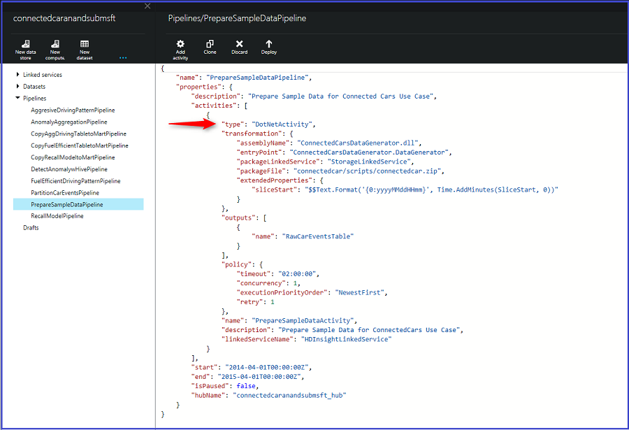
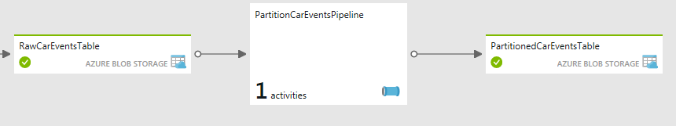
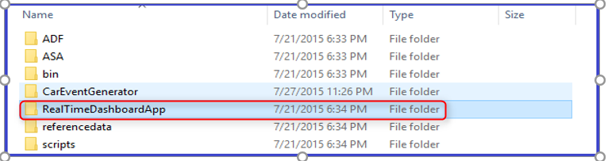
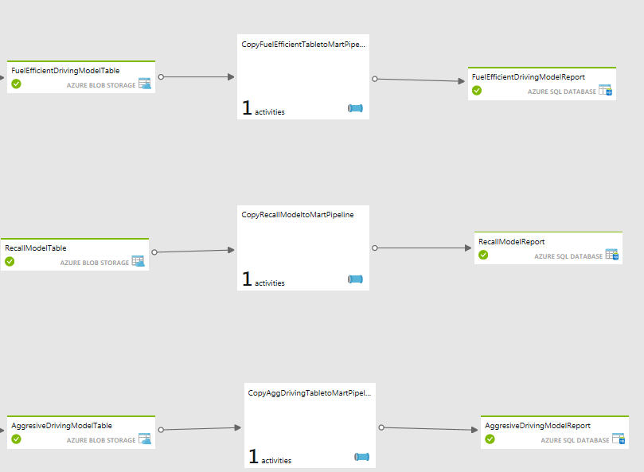
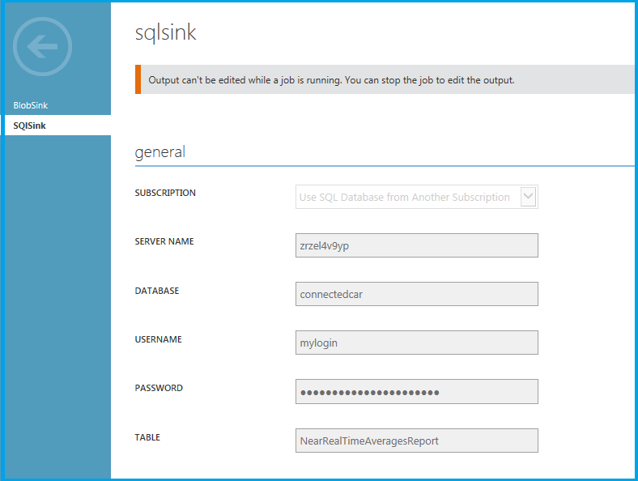
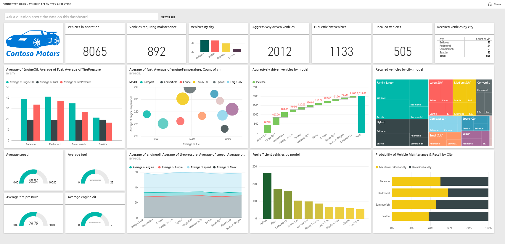

<properties 
	pageTitle="Vehicle telemetry analytics solution playbook: deep dive into the solution | Microsoft Azure" 
	description="Use the capabilities of Cortana Intelligence to gain real-time and predictive insights on vehicle health and driving habits." 
	services="machine-learning" 
	documentationCenter="" 
	authors="bradsev" 
	manager="paulettm" 
	editor="cgronlun" />

<tags 
	ms.service="machine-learning" 
	ms.workload="data-services" 
	ms.tgt_pltfrm="na" 
	ms.devlang="na" 
	ms.topic="article" 
	ms.date="05/27/2016" 
	ms.author="bradsev" />

# Vehicle telemetry analytics solution playbook: deep dive into the solution

This **menu** links to the sections of this playbook: 

[AZURE.INCLUDE [cap-vehicle-telemetry-playbook-selector](../../includes/cap-vehicle-telemetry-playbook-selector.md)]

This section drills down into the details of each one of the stages depicted in the Solution Architecture with instructions and pointers for customization. 

## Data Sources

The solution uses two different data sources:

- **simulated vehicle signals and diagnostic dataset** and 
- **vehicle catalog**

A vehicle telematics simulator is included as part of this solution. It emits diagnostic information and signals corresponding to the state of the vehicle and driving pattern at a given point in time. Click [Vehicle Telematics Simulator](http://go.microsoft.com/fwlink/?LinkId=717075) to download the **Vehicle Telematics Simulator Visual Studio Solution** for customizations based on your requirements. The vehicle catalog contains a reference dataset with a VIN to model mapping.

*Figure 2 – Vehicle Telematics Simulator*

This is a JSON format dataset and contains the below schema.

Column | Description | Values   
 ------- | ----------- | ---------  
VIN | Randomly generated Vehicle Identification Number | This is obtained from a master list of 10,000 randomly generated vehicle identification number
Outside temperature | The outside temperature where the vehicle is driving | Randomly generated number from 0-100
Engine temperature | The engine temperature of the vehicle | Randomly generated number from 0-500
Speed | The engine speed at which the vehicle is driving | Randomly generated number from 0-100
Fuel | The fuel level of the vehicle | Randomly generated number from 0-100 (indicates fuel level percentage)
EngineOil | The engine oil level of the vehicle | Randomly generated number from 0-100 (indicates engine oil level percentage)
Tirepressure | The tirepressure of the vehicle | Randomly generated number from 0-50 (indicates tirepressure level percentage)
Odometer | The odometer reading of the vehicle | Randomly generated number from 0-200000
Accelerator_pedal_position | The accelerator pedal position of the vehicle | Randomly generated number from 0-100 (indicates accelerator level percentage)
Parking_brake_status | Indicates whether the vehicle is parked or not | True or False
Headlamp_status | Indicates where the headlamp is on or not | True or False
Brake_pedal_status | Indicates whether the brake pedal is pressed or not | True or False
Transmission_gear_position | The transmission gear position of the vehicle | States: first, second, third, fourth, fifth, sixth, seventh, eighth
Ignition_status | Indicates whether the vehicle is running or stopped | True or False
Windshield_wiper_status | Indicates whether the windshield wiper is turned or not | True or False
ABS | Indicates whether ABS is engaged or not | True or False
Timestamp | The timestamp when the data point is created | Date
City | The location of the vehicle | 4 cities in this solution : Bellevue, Redmond, Sammamish, Seattle

The vehicle model reference dataset contains VIN to the model mapping. 

VIN	| Model |
--------------|------------------
FHL3O1SA4IEHB4WU1 | Sedan |
8J0U8XCPRGW4Z3NQE | Hybrid |
WORG68Z2PLTNZDBI7 | Family Saloon |
JTHMYHQTEPP4WBMRN | Sedan |
W9FTHG27LZN1YWO0Y | Hybrid |
MHTP9N792PHK08WJM | Family Saloon |
EI4QXI2AXVQQING4I | Sedan |
5KKR2VB4WHQH97PF8 | Hybrid |
W9NSZ423XZHAONYXB | Family Saloon |
26WJSGHX4MA5ROHNL | Convertible |
GHLUB6ONKMOSI7E77 | Station Wagon |
9C2RHVRVLMEJDBXLP | Compact Car |
BRNHVMZOUJ6EOCP32 | Small SUV |
VCYVW0WUZNBTM594J | Sports Car |
HNVCE6YFZSA5M82NY | Medium SUV |
4R30FOR7NUOBL05GJ | Station Wagon |
WYNIIY42VKV6OQS1J | Large SUV |
8Y5QKG27QET1RBK7I | Large SUV |
DF6OX2WSRA6511BVG | Coupe |
Z2EOZWZBXAEW3E60T | Sedan |
M4TV6IEALD5QDS3IR | Hybrid |
VHRA1Y2TGTA84F00H | Family Saloon |
R0JAUHT1L1R3BIKI0 | Sedan |
9230C202Z60XX84AU | Hybrid |
T8DNDN5UDCWL7M72H | Family Saloon |
4WPYRUZII5YV7YA42 | Sedan |
D1ZVY26UV2BFGHZNO | Hybrid |
XUF99EW9OIQOMV7Q7 | Family Saloon
8OMCL3LGI7XNCC21U | Convertible |
…….	 |   |

### To generate simulated data
1.	Click on the arrow on the upper right on the Vehicle Telematics Simulator node to download the data simulator package. Save and extract the files locally on your machine.  *Figure 3 – Vehicle Telemetry Analytics Solution Blueprint*

2.	On your local machine, go to the folder where you extracted the Vehicle Telematics Simulator package.  *Figure 4 – Vehicle Telematics Simulator folder*

3.	Execute the application **CarEventGenerator.exe**.

### References

[Vehicle Telematics Simulator Visual Studio Solution](http://go.microsoft.com/fwlink/?LinkId=717075) 

[Azure Event Hub](https://azure.microsoft.com/services/event-hubs/)

[Azure Data Factory](https://azure.microsoft.com/documentation/learning-paths/data-factory/)

## Ingestion
Combinations of Azure Event Hubs, Stream Analytics and Data Factory are leveraged to ingest the vehicle signals and the diagnostic events and real-time and batch analytics. All these components are created and configured as part of the solution deployment. 

### Real-time analysis
The events generated by the Vehicle Telematics Simulator are published to the Event Hub using the Event Hub SDK. The Stream Analytics job ingests these events from the Event Hub and processes the data in real-time to analyze the vehicle health. 

 

*Figure 5 - Event Hub dashboard*

 

*Figure 6 - Stream analytics job processing data*

The stream analytics job ingests data from the Event Hub, performs a join with the reference data to map the vehicle VIN to the corresponding model and also persists them into Azure blob storage for rich batch analytics. The below stream analytics query is used to persist the data into Azure blob storage. 

 

*Figure 7 - Stream analytics job query for data ingestion*

### Batch analysis
We are also generating an additional volume of simulated vehicle signals and diagnostic dataset for richer batch analytics. This is required to ensure a good representative data volume for batch processing. For this purpose, we are using a pipeline named "PrepareSampleDataPipeline" in the Azure Data Factory workflow to generate one year's worth of simulated vehicle signals and diagnostic dataset. Click [Data Factory custom activity](http://go.microsoft.com/fwlink/?LinkId=717077) to download the Data Factory custom DotNet activity Visual Studio solution for customizations based on your requirements. 

 

*Figure 8 - Prepare Sample data for batch processing workflow*

The pipeline consists of a custom ADF .Net Activity, show below:

 

*Figure 9 - PrepareSampleDataPipeline*

Once the pipeline executes successfully and "RawCarEventsTable" dataset is marked "Ready", one-year worth of simulated vehicle signals and diagnostic data are produced. You will see the following folder and file created in your storage account under the "connectedcar" container:

 

*Figure 10 - PrepareSampleDataPipeline Output*

### References

[Azure Event Hub SDK for stream ingestion](../event-hubs/event-hubs-csharp-ephcs-getstarted.md)

[Azure Data Factory data movement capabilities](../data-factory/data-factory-data-movement-activities.md)
[Azure Data Factory DotNet Activity](../data-factory/data-factory-use-custom-activities.md)

[Azure Data Factory DotNet activity visual studio solution for preparing sample data](http://go.microsoft.com/fwlink/?LinkId=717077) 

## Prepare
>[AZURE.ALERT] This step in the solution is applicable only to batch processing. 

The raw semi-structured vehicle signals and diagnostic dataset is partitioned in the data preparation step into a YEAR/MONTH format for efficient querying and scalable long term storage (*i.e.*, it enables faulting over from one blob account to the next as the first fills up). The output data (labeled *PartitionedCarEventsTable*) is to be kept for a long period as the foundational/”rawest” form of data in the customer's “Data Lake”.  The input data to this pipeline would typically be discarded as the output data has full fidelity to the input - it's just stored (partitioned) better for subsequent use.

*Figure 11 – Partition Car Events workflow*

The raw data is partitioned using a Hive HDInsight activity in "PartitionCarEventsPipeline". A year's worth of sample data generated in step 1 is partitioned by YEAR/MONTH to generate vehicle signals and diagnostic data partitions corresponding to each month (total 12 partitions) in a year. 

*Figure 12 - PartitionCarEventsPipeline*

The Hive script shown below, named "partitioncarevents.hql", is used for partitioning and is located in the "\demo\src\connectedcar\scripts" folder of the downloaded zip. 

	SET hive.exec.dynamic.partition=true;
	SET hive.exec.dynamic.partition.mode = nonstrict;
	set hive.cli.print.header=true;

	DROP TABLE IF EXISTS RawCarEvents; 
	CREATE EXTERNAL TABLE RawCarEvents 
	(
            	vin								string,
				model							string,
				timestamp						string,
				outsidetemperature				string,
				enginetemperature				string,
				speed							string,
				fuel							string,
				engineoil						string,
				tirepressure					string,
				odometer						string,
				city							string,
				accelerator_pedal_position		string,
				parking_brake_status			string,
				headlamp_status					string,
				brake_pedal_status				string,
				transmission_gear_position		string,
				ignition_status					string,
				windshield_wiper_status			string,
				abs  							string,
				gendate							string
                
	) ROW FORMAT DELIMITED FIELDS TERMINATED BY ',' LINES TERMINATED BY '10' STORED AS TEXTFILE LOCATION '${hiveconf:RAWINPUT}'; 

	DROP TABLE IF EXISTS PartitionedCarEvents; 
	CREATE EXTERNAL TABLE PartitionedCarEvents 
	(
            	vin								string,
				model							string,
				timestamp						string,
				outsidetemperature				string,
				enginetemperature				string,
				speed							string,
				fuel							string,
				engineoil						string,
				tirepressure					string,
				odometer						string,
				city							string,
				accelerator_pedal_position		string,
				parking_brake_status			string,
				headlamp_status					string,
				brake_pedal_status				string,
				transmission_gear_position		string,
				ignition_status					string,
				windshield_wiper_status			string,
				abs  							string,
				gendate							string
	) partitioned by (YearNo int, MonthNo int) ROW FORMAT DELIMITED FIELDS TERMINATED BY ',' LINES TERMINATED BY '10' STORED AS TEXTFILE LOCATION '${hiveconf:PARTITIONEDOUTPUT}';

	DROP TABLE IF EXISTS Stage_RawCarEvents; 
	CREATE TABLE IF NOT EXISTS Stage_RawCarEvents 
	(
            	vin								string,
				model							string,
				timestamp						string,
				outsidetemperature				string,
				enginetemperature				string,
				speed							string,
				fuel							string,
				engineoil						string,
				tirepressure					string,
				odometer						string,
				city							string,
				accelerator_pedal_position		string,
				parking_brake_status			string,
				headlamp_status					string,
				brake_pedal_status				string,
				transmission_gear_position		string,
				ignition_status					string,
				windshield_wiper_status			string,
				abs  							string,
				gendate							string,
				YearNo 							int,
				MonthNo 						int) 
	ROW FORMAT delimited fields terminated by ',' LINES TERMINATED BY '10';

	INSERT OVERWRITE TABLE Stage_RawCarEvents
	SELECT
		vin,			
		model,
		timestamp,
		outsidetemperature,
		enginetemperature,
		speed,
		fuel,
		engineoil,
		tirepressure,
		odometer,
		city,
		accelerator_pedal_position,
		parking_brake_status,
		headlamp_status,
		brake_pedal_status,
		transmission_gear_position,
		ignition_status,
		windshield_wiper_status,
		abs,
		gendate,
		Year(gendate),
		Month(gendate)

	FROM RawCarEvents WHERE Year(gendate) = ${hiveconf:Year} AND Month(gendate) = ${hiveconf:Month}; 

	INSERT OVERWRITE TABLE PartitionedCarEvents PARTITION(YearNo, MonthNo) 
	SELECT
		vin,			
		model,
		timestamp,
		outsidetemperature,
		enginetemperature,
		speed,
		fuel,
		engineoil,
		tirepressure,
		odometer,
		city,
		accelerator_pedal_position,
		parking_brake_status,
		headlamp_status,
		brake_pedal_status,
		transmission_gear_position,
		ignition_status,
		windshield_wiper_status,
		abs,
		gendate,
		YearNo,
		MonthNo
	FROM Stage_RawCarEvents WHERE YearNo = ${hiveconf:Year} AND MonthNo = ${hiveconf:Month};

*Figure 13 - PartitionConnectedCarEvents Hive Script*

Once the pipeline is executed successfully, you will see the following partitions generated in your storage account under the "connectedcar" container.

*Figure 14 - Partitioned Output*

The data is now optimized, is more manageable and ready for further processing to gain rich batch insights. 

## Data Analysis

In this section, you will see how we have used the combination of Azure Stream Analytics, Azure Machine Learning, Azure Data Factory and Azure HDInsight for rich advanced analytics on vehicle health and driving habits.  There are 3 sub-sections here:

1.	**Machine Learning**: This sub-section contains information on the anomaly detection experiment that we have used in this solution to predict vehicles requiring servicing maintenance and vehicles requiring recalls due to safety issues
2.	**Real-time analysis**: This sub-section contains information regarding the real-time analytics using the Stream Analytics Query Language and operationalizing the machine learning experiment in real-time using a custom application
3.	**Batch analysis**: This sub-section contains information regarding the transforming and processing of the batch data using Azure HDInsight and Azure Machine Learning operationalized by Azure Data Factory

### Machine Learning

Our goal here is to predict the vehicles that require maintenance or recall based on certain heath statistics.  We make the following assumptions

- Vehicles require **servicing maintenance** if one of the following three conditions are true:
	- Tire pressure is low
	- Engine oil level is low
	- Engine temperature is high

- Vehicles may have a **safety issue** and require **recall** if one of the following conditions are true:
	- Engine temperature is high but outside temperature is low
	- Engine temperature is low but outside temperature is high

Based on the above requirements, we have created two separate models to detect anomalies, one for vehicle maintenance detection, and one for vehicle recall detection. In both these models, the built-in Principal Component Analysis (PCA) algorithm is used for anomaly detection . 

**Maintenance detection model**
In the maintenance detection model, the model reports an anomaly if one of three indicators - tire pressure, engine oil, or engine temperature - satisfies its respective condition. As a result, we only need to consider these three variables in building the model. In our experiment in Azure Machine Learning, we first use a **Select Columns in Dataset** module to extract these three variables. Next we use the PCA-based anomaly detection module to build the anomaly detection model. 

Principal Component Analysis (PCA) is an established technique in machine learning that can be applied to feature selection, classification, and anomaly detection. PCA converts a set of case containing possibly correlated variables, into a set of values called principal components. The key idea of PCA-based modeling is to project data onto a lower-dimensional space so that features and anomalies can be more easily identified.
 
In the case of anomaly detection, for each new input, the anomaly detector first computes its projection on the eigenvectors, and then computes the normalized reconstruction error. This normalized error is the anomaly score. The higher the error, the more anomalous the instance is. 

In the maintenance detection problem, each record can be considered as a point in a 3-dimensional space defined by tire pressure, engine oil, and engine temperature coordinates. To capture these anomalies, we can project the original data in the 3-dimensional onto a 2-dimensional space using PCA. Thus, we set the parameter Number of components to use in PCA to be 2. This parameter plays an important role in applying PCA-based anomaly detection. After projecting data using PCA, we can identify these anomalies more easily.

**Recall anomaly detection model**
In the recall anomaly detection model, we use the Select Columns in Dataset and PCA-based anomaly detection modules in a similar way. Specifically, we first extract three variables - engine temperature, outside temperature, and speed - using the **Select Columns in Dataset** module. We also include the speed variable since the engine temperature typically is correlated to the speed. Next we use PCA-based anomaly detection module to project the data from the 3-dimensional space onto a 2-dimensional space. The recall criteria are satisfied and so the vehicle requires recall when engine temperature and outside temperature are highly negatively correlated. Using PCA-based anomaly detection algorithm, we can capture the anomalies after performing PCA. 

Note that when training either model, we need to use normal data which does not require maintenance or recall as the input data to train the PCA-based anomaly detection model. In the scoring experiment, we use the trained anomaly detection model to detect if the vehicle requires maintenance or recall. 

### Real-time analysis

The following Stream Analytics SQL Query is used to get the average of all the important vehicle parameters like vehicle speed, fuel level, engine temperature, odometer reading, tire pressure, engine oil level etc to detect anomalies, issue alerts and determine the overall health conditions of vehicles operated in specific region and correlate it to demographics. 

Figure 15 – Stream analytics query for real-time processing

All the averages are calculated over a 3 seconds TumblingWindow. We are using TubmlingWindow in this case since we require non-overlapping and contiguous time intervals. 

To learn more about all the "Windowing" capabilities in Azure Stream Analytics, click [Windowing (Azure Stream Analytics)](https://msdn.microsoft.com/library/azure/dn835019.aspx).

**Real-time prediction**

An application is included as part of the solution to operationalize the machine learning model in real-time. This application called “RealTimeDashboardApp” is created and configured as part of the solution deployment. The application performs the following:

1.	Listens to an Event Hub instance where Stream Analytics is publishing the events in a continuously pattern. *Figure 16 – Stream analytics query for publishing the data to an output Event Hub instance* 

2.	For every event that this application receives: 

	- Processes the data using Machine Learning Request-Response Scoring (RRS) endpoint. The RRS endpoint is automatically published as part of the deployment.
	- The RRS output is published to a PowerBI dataset using the push APIs.

This pattern is also applicable in scenarios where you want to integrate a Line of Business application with the real-time analytics flow for scenarios such as alerts, notifications, messagings, etc. 

Click [RealtimeDashboardApp download](http://go.microsoft.com/fwlink/?LinkId=717078) to download the RealtimeDashboardApp Visual Studio solution for customizations. 

**To execute the Real-time Dashboard Application **

1.	Click on the PowerBI node on the diagram view and click the Download Real-time Dashboard Application" link on the properties pane.   *Figure 17 – PowerBI dashboard setup instructions*
2.	Extract and save locally   *Figure 18 – RealtimeDashboardApp folder*
3.	Execute the application RealtimeDashboardApp.exe
4.	Provide valid Power BI credentials, sign in and click Accept   

*Figure 19 – RealtimeDashboardApp: Sign-in to PowerBI*

>[AZURE.NOTE] Note: If you want to flush the PowerBI dataset, execute the RealtimeDashboardApp with the "flushdata" parameter: 

	RealtimeDashboardApp.exe -flushdata

### Batch analysis

The goal here is to showcase how Contoso Motors is utilizing the Azure compute capabilities to harness big data to gain rich insights on driving pattern, usage behavior and vehicle health for:

- Improving the customer experience and make it cheaper by providing insights on driving habits and fuel efficient driving behaviors
- Learning proactively about customers and their driving patters to govern business decisions and provide the best in class products & services

In this solution, we are targeting the following metrics:

1.	**Aggressive driving behavior** Identifies the trend of the models, locations, driving conditions, and time of the year to gain insights on aggressive driving pattern allowing Contoso Motors to use it for marketing campaigns, driving new personalized features and usage based insurance.
2.	**Fuel efficient driving behavior** Identifies the trend of the models, locations, driving conditions, and time of the year to gain insights on fuel efficient driving pattern allowing Contoso Motors to use it for marketing campaigns, driving new features and proactive reporting to the drivers for cost effective and environment friendly driving habits. 
3.	**Recall models** Identifies models requiring recalls by operationalizing the anomaly detection machine learning experiment

Let's look into the details of each of these metrics,

**Aggressive driving pattern**

The partitioned vehicle signals and diagnostic data are processed in the pipeline named "AggresiveDrivingPatternPipeline" using Hive to determine the models, location, vehicle and driving conditions etc that exhibits aggressive driving pattern.

 
*Figure 20 – Aggressive driving pattern workflow*

The Hive script named "aggresivedriving.hql" used for analyzing aggressive driving condition pattern is located at "\demo\src\connectedcar\scripts" folder of the downloaded zip. 

	DROP TABLE IF EXISTS PartitionedCarEvents; 
	CREATE EXTERNAL TABLE PartitionedCarEvents
	(
            	vin								string,
				model							string,
				timestamp						string,
				outsidetemperature				string,
				enginetemperature				string,
				speed							string,
				fuel							string,
				engineoil						string,
				tirepressure					string,
				odometer						string,
				city							string,
				accelerator_pedal_position		string,
				parking_brake_status			string,
				headlamp_status					string,
				brake_pedal_status				string,
				transmission_gear_position		string,
				ignition_status					string,
				windshield_wiper_status			string,
				abs  							string,
				gendate							string
                                
	) ROW FORMAT DELIMITED FIELDS TERMINATED BY ',' LINES TERMINATED BY '10' STORED AS TEXTFILE LOCATION '${hiveconf:PARTITIONEDINPUT}';

	DROP TABLE IF EXISTS CarEventsAggresive; 
	CREATE EXTERNAL TABLE CarEventsAggresive
	(
               	vin 						string, 
				model						string,
                timestamp					string,
				city						string,
				speed 			 			string,
				transmission_gear_position	string,
				brake_pedal_status			string,
				Year						string,
				Month						string
                                
	) ROW FORMAT DELIMITED FIELDS TERMINATED BY ',' LINES TERMINATED BY '10' STORED AS TEXTFILE LOCATION '${hiveconf:AGGRESIVEOUTPUT}';

	INSERT OVERWRITE TABLE CarEventsAggresive
	select
	vin,
	model,
	timestamp,
	city,
	speed,
	transmission_gear_position,
	brake_pedal_status,
	"${hiveconf:Year}" as Year,
	"${hiveconf:Month}" as Month
	from PartitionedCarEvents
	where transmission_gear_position IN ('fourth', 'fifth', 'sixth', 'seventh', 'eight') AND brake_pedal_status = '1' AND speed >= '50'

*Figure 21 – Aggressive driving pattern Hive query*

It uses the combination of vehicle's transmission gear position, brake pedal status and speed to detect reckless/aggressive driving behavior based on braking pattern at high speed. 

Once the pipeline is executed successfully, you will see the following partitions generated in your storage account under the "connectedcar" container.

 

*Figure 22 – AggressiveDrivingPatternPipeline output*

**Fuel efficient driving pattern**

The partitioned vehicle signals and diagnostic data are processed in the pipeline named "FuelEfficientDrivingPatternPipeline" using Hive to determine the models, location, vehicle and driving conditions etc that exhibits fuel efficient driving pattern.

 

*Figure 23 – Fuel efficient driving pattern workflow*

The Hive script named "fuelefficientdriving.hql" used for analyzing aggressive driving condition pattern is located at "\demo\src\connectedcar\scripts" folder of the downloaded zip. 

	DROP TABLE IF EXISTS PartitionedCarEvents; 
	CREATE EXTERNAL TABLE PartitionedCarEvents
	(
            	vin								string,
				model							string,
				timestamp						string,
				outsidetemperature				string,
				enginetemperature				string,
				speed							string,
				fuel							string,
				engineoil						string,
				tirepressure					string,
				odometer						string,
				city							string,
				accelerator_pedal_position		string,
				parking_brake_status			string,
				headlamp_status					string,
				brake_pedal_status				string,
				transmission_gear_position		string,
				ignition_status					string,
				windshield_wiper_status			string,
				abs  							string,
				gendate							string
                                
	) ROW FORMAT DELIMITED FIELDS TERMINATED BY ',' LINES TERMINATED BY '10' STORED AS TEXTFILE LOCATION '${hiveconf:PARTITIONEDINPUT}';

	DROP TABLE IF EXISTS FuelEfficientDriving; 
	CREATE EXTERNAL TABLE FuelEfficientDriving
	(
               	vin 						string, 
				model						string,
               	city						string,
				speed 			 			string,
				transmission_gear_position	string,                
				brake_pedal_status			string,            
				accelerator_pedal_position	string,                             
				Year						string,
				Month						string
                                
	) ROW FORMAT DELIMITED FIELDS TERMINATED BY ',' LINES TERMINATED BY '10' STORED AS TEXTFILE LOCATION '${hiveconf:FUELEFFICIENTOUTPUT}';

	INSERT OVERWRITE TABLE FuelEfficientDriving
	select
	vin,
	model,
	city,
	speed,
	transmission_gear_position,
	brake_pedal_status,
	accelerator_pedal_position,
	"${hiveconf:Year}" as Year,
	"${hiveconf:Month}" as Month
	from PartitionedCarEvents
	where transmission_gear_position IN ('fourth', 'fifth', 'sixth', 'seventh', 'eight') AND parking_brake_status = '0' AND brake_pedal_status = '0' AND speed <= '60' AND accelerator_pedal_position >= '50'

*Figure 24 – Fuel efficient driving pattern Hive query*

It uses the combination of vehicle's transmission gear position, brake pedal status, speed and accelerator pedal position to detect fuel efficient driving behavior based on acceleration, braking and speed patterns. 

Once the pipeline is executed successfully, you will see the following partitions generated in your storage account under the "connectedcar" container.

 

*Figure 25 – FuelEfficientDrivingPatternPipeline output*

**Recall Predictions**

The machine learning experiment is provisioned and published as a web service as part of the solution deployment. The batch scoring end point is leveraged in this workflow, registered as a data factory linked service and operationalized using data factory batch scoring activity.

 

*Figure 26 – Machine learning endpoint registered as a linked service in data factory*

The registered linked service is used in the DetectAnomalyPipeline to score the data using the anomaly detection model. 

 

*Figure 27 – Azure Machine Learning Batch Scoring activity in data factory* 

There are few steps performed in this pipeline for data preparation so that it can be operationalized with the batch scoring web service. 

 

*Figure 28 – DetectAnomalyPipeline for predicting vehicles requiring recalls* 

Once the scoring is completed, an HDInsight activity is used to process and aggregate the data that are categorized as anomalies by the model with a probability score of 0.60 or higher.  

	DROP TABLE IF EXISTS CarEventsAnomaly; 
	CREATE EXTERNAL TABLE CarEventsAnomaly 
	(
            	vin							string,
				model						string,
				gendate						string,
				outsidetemperature			string,
				enginetemperature			string,
				speed						string,
				fuel						string,
				engineoil					string,
				tirepressure				string,
				odometer					string,
				city						string,
				accelerator_pedal_position	string,
				parking_brake_status		string,
				headlamp_status				string,
				brake_pedal_status			string,
				transmission_gear_position	string,
				ignition_status				string,
				windshield_wiper_status		string,
				abs  						string,
				maintenanceLabel			string,
				maintenanceProbability		string,
				RecallLabel					string,
				RecallProbability			string
                                
	) ROW FORMAT DELIMITED FIELDS TERMINATED BY ',' LINES TERMINATED BY '10' STORED AS TEXTFILE LOCATION '${hiveconf:ANOMALYOUTPUT}';

	DROP TABLE IF EXISTS RecallModel; 
	CREATE EXTERNAL TABLE RecallModel 
	(

				vin							string,
				model						string,
				city						string,
				outsidetemperature			string,
				enginetemperature			string,
				speed						string,
            	Year						string,
				Month						string				
                                
	) ROW FORMAT DELIMITED FIELDS TERMINATED BY ',' LINES TERMINATED BY '10' STORED AS TEXTFILE LOCATION '${hiveconf:RECALLMODELOUTPUT}';

	INSERT OVERWRITE TABLE RecallModel
	select
	vin,
	model,
	city,
	outsidetemperature,
	enginetemperature,
	speed,
	"${hiveconf:Year}" as Year,
	"${hiveconf:Month}" as Month
	from CarEventsAnomaly
	where RecallLabel = '1' AND RecallProbability >= '0.60'

*Figure 29  – Recall aggregation hive query*

Once the pipeline is executed successfully, you will see the following partitions generated in your storage account under the "connectedcar" container.

 

*Figure 30 – Figure 30 – DetectAnomalyPipeline output*

## Publish

### Real-time analysis

One of the queries in the stream analytics job publishes the events to an output Event Hub instance. 

*Figure 31 – Stream analytics job publishes to an output Event Hub instance*

*Figure 32 – Stream analytics query to publish to the output Event Hub instance*

This stream of events are consumed by the RealTimeDashboardApp included in the solution. This application leverages the Machine Learning Request-Response web service for real-time scoring and publishes the resultant data to a PowerBI dataset for consumption. 

### Batch analysis

The results of the batch and real-time processing are published to the Azure SQL Database tables for consumption. The Azure SQL Server, Database and the tables are created automatically as part of the setup script. 

*Figure 33 – Batch processing results copy to data mart workflow*

*Figure 34 – Stream analytics job publishes to data mart*

*Figure 35 – Data mart setting in stream analytics job*

## Consume

Power BI gives this solution a rich dashboard for real-time data and predictive analytics visualizations. 

Click here for detailed instructions on setting up the PowerBI reports and the dashboard. The final dashboard looks like this:

*Figure 36 - PowerBI Dashboard*

## Summary

This document contains a detailed drill-down of the Vehicle Telemetry Analytics Solution. This showcases a lambda architecture pattern for real-time and batch analytics with predictions and actions. This pattern applies to a wide range of use cases that require hot path (real-time) and cold path (batch) analytics. 
