<properties 
	pageTitle="Vehicle telemetry analytics solution template PowerBI Dashboard setup instructions | Microsoft Azure" 
	description="Use the capabilities of Cortana Intelligence to gain real-time and predictive insights on vehicle health and driving habits." 
	services="machine-learning" 
	documentationCenter="" 
	authors="bradsev" 
	manager="paulettm" 
	editor="cgronlun" />

<tags 
	ms.service="machine-learning" 
	ms.workload="data-services" 
	ms.tgt_pltfrm="na" 
	ms.devlang="na" 
	ms.topic="article" 
	ms.date="05/27/2016" 
	ms.author="bradsev" />

# Vehicle telemetry analytics solution template PowerBI Dashboard setup instructions

This **menu** links to the chapters in this playbook. 

[AZURE.INCLUDE [cap-vehicle-telemetry-playbook-selector](../../includes/cap-vehicle-telemetry-playbook-selector.md)]

The Vehicle Telemetry Analytics solution showcases how car dealerships, automobile manufacturers and insurance companies can leverage the capabilities of Cortana Intelligence to gain real-time and predictive insights on vehicle health and driving habits to drive improvements in the area of customer experience, R&D and marketing campaigns. 
This document contains step by step instructions on how you can configure the PowerBI reports and dashboard once the solution is deployed in your subscription. 

## Prerequisites
1.	Deploy the Vehicle Telemetry Analytics solution by navigating to [https://gallery.cortanaanalytics.com/SolutionTemplate/Vehicle-Telemetry-Analytics-3](https://gallery.cortanaanalytics.com/SolutionTemplate/Vehicle-Telemetry-Analytics-3)  
2.	[Install Microsoft Power BI Desktop](http://www.microsoft.com/download/details.aspx?id=45331)
3.	An [Azure subscription](https://azure.microsoft.com/pricing/free-trial/). If you don't have an Azure subscription, get started with Azure free subscription
4.	Microsoft PowerBI account
	

## Cortana Intelligence Suite Components
As part of the Vehicle Telemetry Analytics solution template, the following Cortana Intelligence services are deployed in your subscription.

- **Event Hubs** for ingesting millions of vehicle telemetry events into Azure.
- **Stream Analytic**s for gaining real-time insights on vehicle health and persists that data into long-term storage for richer batch analytics.
- **Machine Learning** for anomaly detection in real-time and batch processing to gain predictive insights.
- **HDInsight** is leveraged to transform data at scale
- **Data Factory** handles orchestration, scheduling, resource management and monitoring of the batch processing pipeline.

**Power BI** gives this solution a rich dashboard for real-time data and predictive analytics visualizations. 

The solution uses two different data sources: **Simulated vehicle signals and diagnostic dataset** and **vehicle catalog**.

A vehicle telematics simulator is included as part of this solution. It emits diagnostic information and signals corresponding to the state of the vehicle and driving pattern at a given point in time. 

The Vehicle Catalog is a reference dataset containing VIN to model mapping

## PowerBI Dashboard Preparation

### Deployment

Once the deployment is completed, you should see the below diagram with all of these components marked in GREEN. 

- Click on the arrow on the upper right of the green nodes to navigate to the corresponding services to validate whether all of these have deployed successfully.
- Click on the arrow on the upper right on the Vehicle Telematics Simulator node to download the data simulator package. Save and extract the files locally on your machine. 

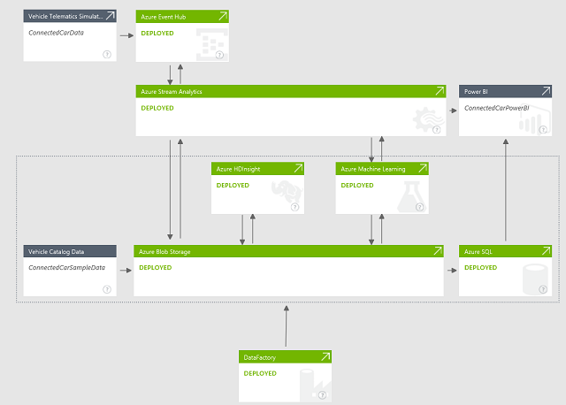

Now, you are ready to configure the PowerBI dashboard with rich visualizations to gain real-time and predictive insights on vehicle health and driving habits. It takes about 45 minutes to an hour to create all the reports and configure the dashboard. 

### Setup Power BI Real-Time Dashboard

**Generate simulated data**

1. On your local machine, go to the folder where you extracted the Vehicle Telematics Simulator package 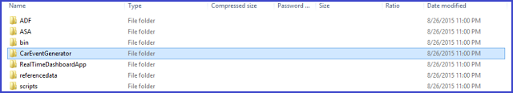
2.	Execute the application ***CarEventGenerator.exe***.
3.	It emits diagnostic information and signals corresponding to the state of the vehicle and driving pattern at a given point in time. This is published to an Azure Event Hub instance that is configured as part of your deployment.

	 
**Start the real-time dashboard application**

An application is included as part of the solution to generate the real-time dashboard in PowerBI. This application is listening to an Event Hub instance where Stream Analytics is publishing the events in a continuously pattern. For every event that this application received, it processes the data using Machine Learning Request-Response scoring endpoint and the resultant dataset is published to the PowerBI push API’s for visualization. 

To download the application:

1.	Click on the PowerBI node on the diagram view and click the **Download Real-time Dashboard Application**’ link on the properties pane.
2.	Extract and save the application locally 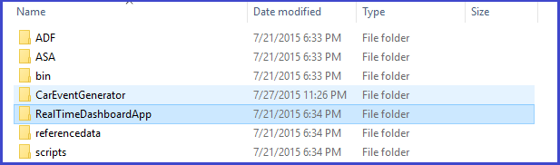

3.	Execute the application **RealtimeDashboardApp.exe**
4.	Provide valid Power BI credentials, sign in and click **Accept**
	
	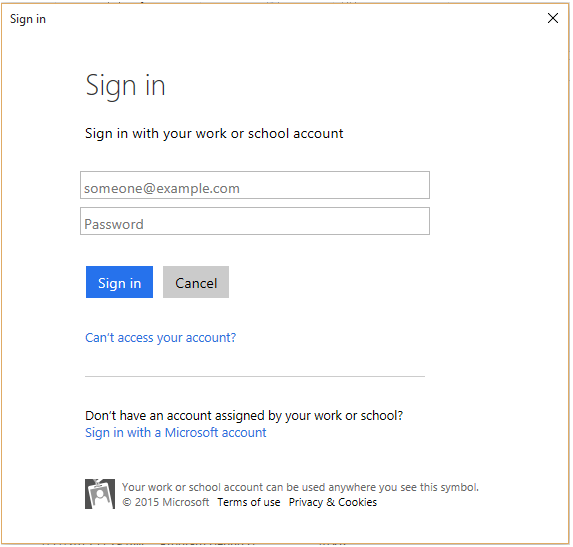
	
	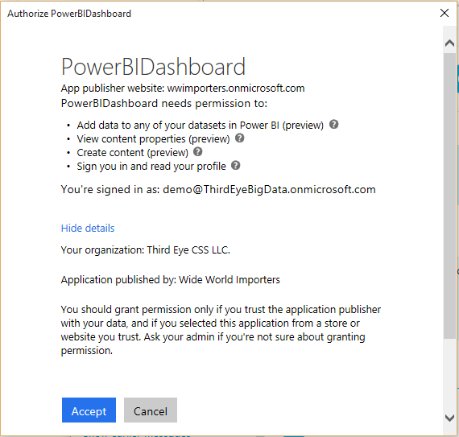

### Configure PowerBI reports
The real-time reports and the dashboard takes about 30-45 minutes to complete. 
Browse to [http://powerbi.com](http://powerbi.com) and login.

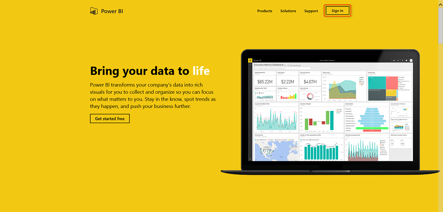

A new dataset will be generated in Power BI. Click on the **ConnectedCarsRealtime** dataset.

Save the blank report using **Ctrl + s**.

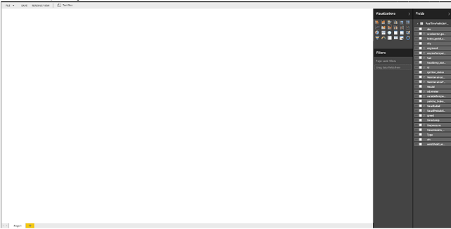

Provide report name *Vehicle Telemetry Analytics Real time - Reports*.

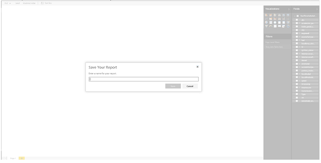

## Real-time reports
There are 3 real-time reports in this solution:

1.	Vehicles in operation
2.	Vehicles Requiring Maintenance
3.	Vehicles Health Statistics

You can choose to configure all the 3 real-time reports or stop after any stage and proceed to the next section of configuring the batch reports. We recommend you to create all the 3 reports to visualize the full insights of the real-time path of the solution.  

### 1. Vehicles in operation
  
Double-click on **Page 1** and rename it to “Vehicles in operation”  
	  

Select **vin** field from **Fields** and choose visualization type as **“Card”**.  

Card visualization will be created as shown in figure.  
	

Click on the blank area to add new visualization.  

Select **City** and **vin** from fields. Change visualization to **“Map”**. Drag **vin** in values area. Drag **city** from fields to **Legend** area.   
	
  
Select **format** section from **Visualizations**, Click on **Title** and change the Text to **“Vehicles in operation by city”**.  
	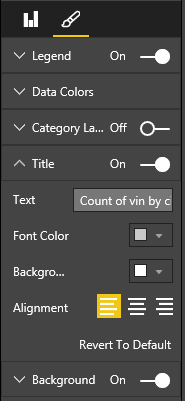   

Final visualization will look as shown in figure.    
	

Click on the blank area to add new visualization.  

Select **City** and **vin**, change visualization type to **Clustered Column Chart**. Ensure **City** field in **Axis area** and **vin** in **Value area**  

Sort chart by **“Count of vin”**  
	  

Change chart **Title** to **“Vehicles in operation by city”**  

Click on the **Format** section, then select **Data Colors**,  Click **“On”** to **Show All**  
	  

Change the color of individual city by clicking on color icon.  
	  

Click on the blank area to add new visualization.  

Select **Clustered Column Chart** visualization from visualizations, drag **city** field in **Axis** area, **Model** in **Legend** area and **vin** in **Value** area.  
	  
	
  
Rearrange all visualization on this page as shown in figure.  
	

You have successfully configured the “Vehicles in operation” real-time report. You can proceed to create the next real-time report or stop here and configure the dashboard. 

### 2. Vehicles Requiring Maintenance
  
Click on  to add a new report, rename it to **“Vehicles Requiring Maintenance”**

  

Select **vin** field and change visualization type to **Card**.  
	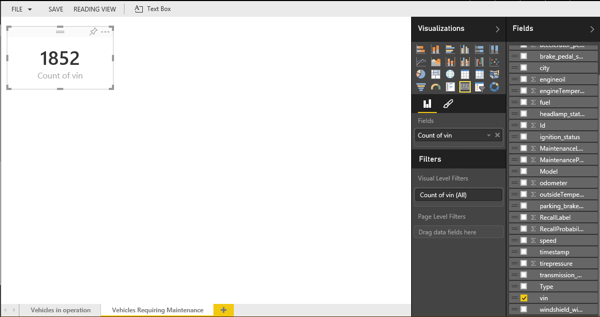  

In the dataset we have a field named “MaintenanceLabel”. This field can have a value of “0” or “1”.” It is set by the Azure Machine Learning model provisioned as part of solution and integrated with the real-time path. The “1” value indicate a vehicle requires maintenance. 

We will be adding **Page Level** filter for showing vehicles data which are requiring maintenance.  

1. Drag the **“MaintenanceLabel”** field into **Page Level Filters**.  
  

2. Click on **Basic Filtering** menu present at bottom of MaintenanceLabel Page Level Filter.  
  

3.  Set its filter value to **“1”**    
  

Click on the blank area to add new visualization.  

Select **Clustered Column Chart** from visualizations  
  

Drag field **Model** into **Axis** area, **Vin** to **Value** area. Then sort visualization by **Count of vin**.  Change chart **Title** to **“Vehicles requiring maintenance by model”**  

Drag **vin** fields into **Color Saturation** present at **Fields**  section of **Visualization** tab  
  

Change **Data Colors** in visualizations from **Format** section  
Change Minimum color to : **F2C812**  
Change Maximum color to: **FF6300**  
  
  

Click on the blank area to add new visualization.  

Select **Clustered column chart** from visualizations, drag **vin** field into **Value** area, drag **City** field into **Axis** area. Sort chart by **“Count of vin”**. Change chart **Title** to **“Vehicles requiring maintenance by city”**   
  

Click on the blank area to add new visualization.  

Select **Multi Row Card** visualization from visualizations, drag **Model** and **vin** into the **Fields** area.  
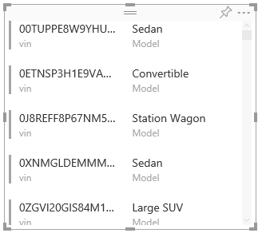    

Rearrange all visualization, The final report will look like as shown below  
  

You have successfully configured the “Vehicles Requiring Maintenance” real-time report. You can proceed to create the next real-time report or stop here and configure the dashboard. 

### 3. Vehicles Health Statistics
  
Click on  to add new report, rename it to **“Vehicles Health Statistics”**  

Select **Gauge** visualization from visualizations, then drag the **Speed** field into
**Value, Minimum Value, Maximum Value** areas.  
  

Change the default aggregation of **speed** in **Value area** to **Average** 

Change the default aggregation of **speed** in **Minimum area** to **Minimum**

Change the default aggregation of **speed** in **Maximum area** to **Maximum**

  

Rename the **Gauge Title** to **“Average speed”** 
 
  

Click on the blank area to add new visualization.  

Similarly add a **Gauge** for **average engine oil**, **average fuel**, and **average engine temperate**.  

Change the default aggregation of fields in each gauge as per above steps in **“Average speed”** gauge.

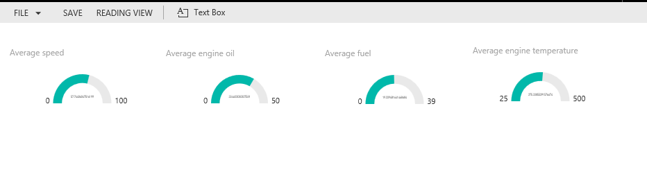

Click on the blank area to add new visualization.

Select **Line and Clustered Column Chart** from visualizations, then drag **City** field into **Shared Axis**, drag **speed**, **tirepressure and engineoil fields** into **Column Values** area, change their aggregation type to **Average**. 

Drag the **engineTemperature** field into **Line Values** area, change the  aggregation type to **Average**. 

Change the chart **Title** to **“Average speed, tire pressure, engine oil and engine temperature”**  

Click on the blank area to add new visualization.

Select **Treemap** visualization from visualizations, drag the **Model** field into the **Group** area, and drag the field **MaintenanceProbability** into the **Values** area.

Change the chart **Title** to **“Vehicle models requiring maintenance”**

Click on the blank area to add new visualization.

Select **100% Stacked Bar Chart** from visualization from visualizations, drag the **city** field into the **Axis** area, and drag the **MaintenanceProbability**, **RecallProbability** fields into the **Value** area

Click on **Format**, select **Data Colors**, change the **MaintenanceProbability** color to the value **“F2C80F”**

Change the **Title** of the chart to **“Probability of Vehicle Maintenance & Recall by City”**  

Click on the blank area to add new visualization.

Select **Area Chart** from visualization from visualizations, drag the **Model** field into the **Axis** area, and drag the **engineOil, tirepressure, speed and MaintenanceProbability** fields into the **Values** area. Change their aggregation type to **“Average”**. 

Change the Title of the chart to **“Average engine oil, tire pressure, speed and maintenance probability by model”**

Click on the blank area to add new visualization.

1. Select **Scatter Chart** visualization from visualizations
2. Drag the **Model** field into the **Details** and **Legend** area 
3. Drag the **fuel** field into the **X Axis** area, change the aggregation to Average
4. Drag **engineTemparature** into **Y Axis area**, change the aggregation to **Average**
5. drag the **vin** field into the **Size** area

Change the chart **Title** to **“Averages of Fuel, Engine Temperature by Model”**

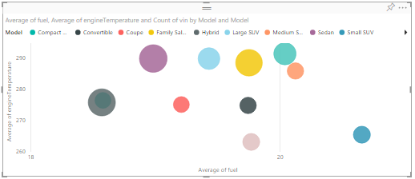

The final report will look like as shown below.

### Pin visualizations from the reports to the real-time dashboard
  
Create a blank dashboard by clicking on the plus icon next to Dashboards. You can name it “Vehicle Telemetry Analytics Dashboard”

Pin the visualization from the above reports to the dashboard. 
 

The dashboard should look as shown below when all the 3 reports are created and the corresponding visualizations are pinned to the dashboard. Your dashboard could look different if you have not created all the reports. 

Congratulations!! You have successfully created the real-time dashboard. As you continue to execute CarEventGenerator.exe and RealtimeDashboardApp.exe, you should see live updates on the dashboard. 
It should take about 10 to 15 minutes to complete the below steps.
 
##  Setup Power BI batch processing dashboard

Note: It takes about 2 hours (from the successful completion of the deployment)  for the end to end batch processing pipeline to finish execution and process a year worth of generated data. Please wait before proceeding with the next steps. 

**Download the PowerBI designer file**
-	A pre-configured  PowerBI designer file is included as part of the deployment
-	Click on the PowerBI node on the diagram view and click 'Download the PowerBI designer' file link on the properties pane 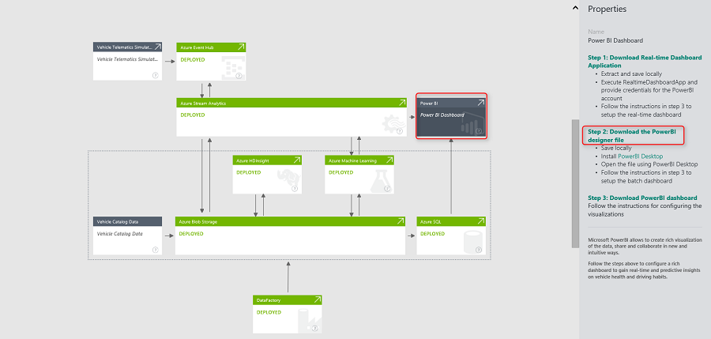

-	Save locally

**Configure PowerBI reports**
-	Open the designer file ‘VehicleTelemetryAnalytics - Desktop Report.pbix’ using PowerBI Desktop. If you do not already have, install the PowerBI Desktop from [PowerBI Desktop install](http://www.microsoft.com/download/details.aspx?id=45331). 

-	Click on the **Edit Queries**.

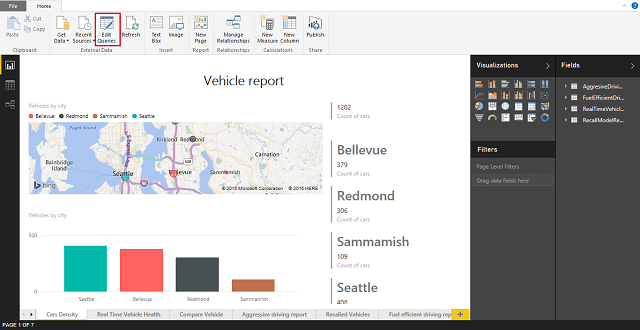

- Double click on the **Source**.

- Update Server connection string with the Azure SQL server that got provisioned as part of the deployment. Click the Azure SQL node on the diagram and view the server name of the properties pane.

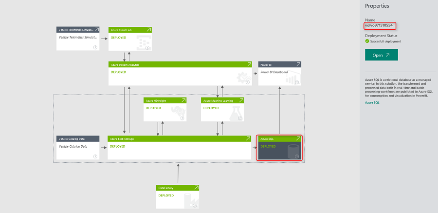

- Leave **Database** as *connectedcar*.

- Click on **OK**.
- You will see **Windows credential** tab selected by default, change it to **Database credentials** by clicking on **Database** tab at right.
- Provide the **Username** and **Password** of your Azure SQL Database that was specified during its deployment setup.

- Click on **Connect**
- Repeat the above steps, for each remaining 3 queries present at right pane, and update the data source connection details.
- Click on **Close and Load**. Power BI Desktop file datasets are connected to SQL Azure Database tables.
- **Close** Power BI Desktop file.

- Click **Save** button to save the changes. 
 
You have now configured all the reports corresponding to the batch processing path in the solution. 

## Upload to *powerbi.com*
 
1.	Navigate to the PowerBI web portal at http://powerbi.com and login.
2.	Click on Get Data  
3.	Upload the Power BI Desktop File.  
4.	To upload, click on **Get Data -> Files Get -> Local file**  
5.	Navigate to the **“VehicleTelemetryAnalytics – Desktop Report.pbix”**  
6.	Once the file is uploaded, you will be navigated back to your Power BI work space.  

A dataset, report and a blank dashboard will be created for you.  
 

Pin charts to the existing dashboard **Vehicle Telemetry Analytics Dashboard** in **Power BI**. Click on the blank dashboard created above and then navigate to the **Reports** section click on the newly uploaded report.  

 

**Note the report has six pages:**  
Page 1: Vehicle density  
Page 2: Real time vehicle health  
Page 3: Aggressively Driven Vehicles   
Page 4: Recalled vehicles  
Page 5: Fuel Efficiently Driven Vehicles  
Page 6: Contoso Logo  

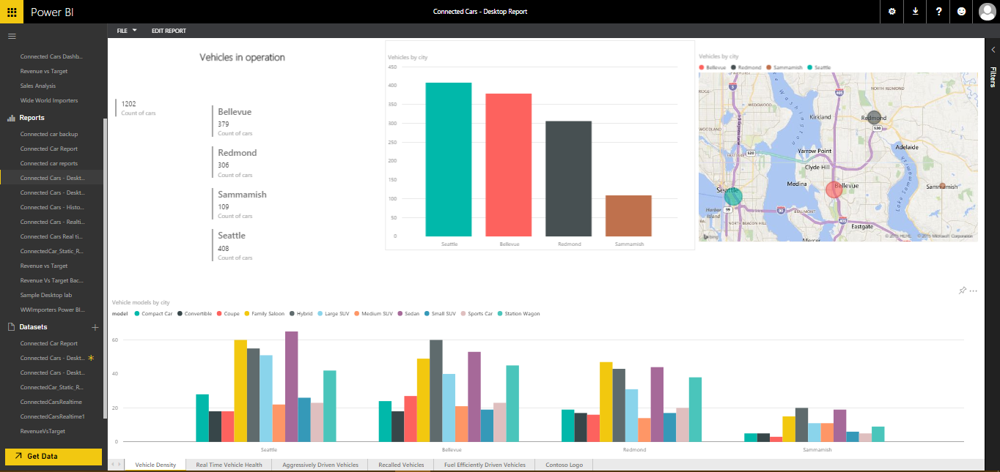
 

**From Page 3**, pin the following  
1.	Count of VIN  
	 

2.	Aggressively driven vehicles by model – Waterfall chart  
	

**From Page 5**, pin the following  
1.	Count of vin    
	  
2.	Fuel efficient vehicles by model : Clustered column chart  
	

**From Page 4**, pin the following  

1.	Count of vin  
	 

2.	Recalled vehicles by city, model : Treemap  
	  

**From Page 6**, pin the following  

1.	Contoso Motors logo  
	

**Organize the dashboard**  

1.	Navigate to the dashboard
2.	Hover over each chart and rename it based on the naming provided in the complete dashboard image below. Also move the charts around to look like the dashboard below.  
	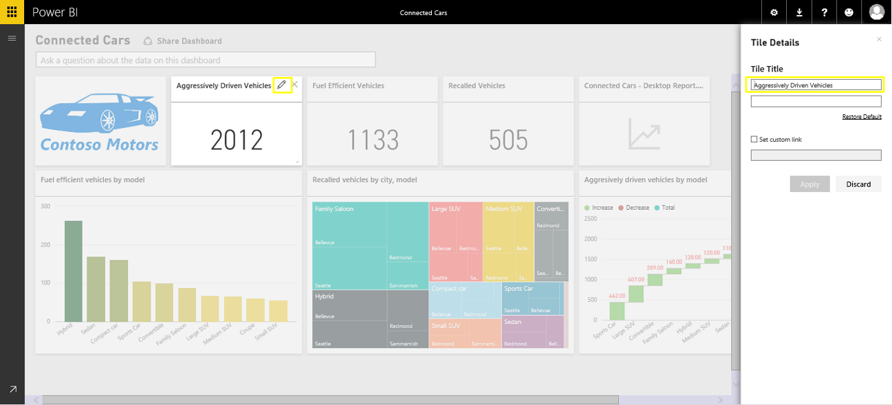  
 	
3. The final completed dashboard should look like the below if you have created all the reports as mentioned in this document. 

Congratulations!! You have successfully created the reports and the dashboard to gain real-time, predictive and batch insights on vehicle health and driving habits.  
