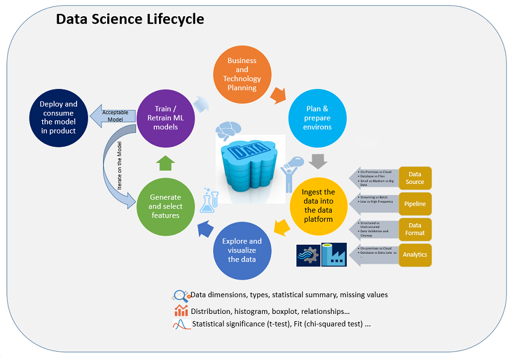

<properties 
	pageTitle="What is Team Data Science Process?  | Microsoft Azure" 
	description="The Team Data Science Process is a systematic method for building intelligent applications that leverage advanced analytics." 
	services="machine-learning" 
	documentationCenter="" 
	authors="bradsev"
	manager="paulettm" 
	editor="cgronlun" />

<tags 
	ms.service="machine-learning" 
	ms.workload="data-services" 
	ms.tgt_pltfrm="na" 
	ms.devlang="na" 
	ms.topic="article" 
	ms.date="06/17/2016" 
	ms.author="bradsev;gopitk" /> 

# What is the Team Data Science Process (TDSP)?

The Team Data Science Process (TDSP) provides a systematic approach to building intelligent applications that enables teams of data scientists to collaborate effectively over the full lifecycle of activities needed to turn these applications into products. 

Specifically, the TDSP currently provides data science teams with:

- **Methodology**: It outlines a sequence of steps that define the development lifecycle providing guidance on how to define the problem, analyze relevant data, build and evaluate predictive models, and then deploy those models in enterprise applications. 
- **Resources**: Tools and technologies such as the Data Science VM to simplify setting up environments for data science activities and practical guidance for on-boarding new technologies.

Here is the development lifecycle of the TDSP:

The process is **iterative**: the understanding of new and existing or refinements in the model evolves and requires reworking steps previously completed in the sequence. Existing organizational development and project planning processes are **easily adapted** to work with the TDSP-defined sequence of steps. 

The steps in the process are diagrammed and linked in the [TDSP learning path](https://azure.microsoft.com/documentation/learning-paths/data-science-process/) and described below.  

## Planning and preparation steps 

## P1. Business and technology planning

Start an analytics project by defining your business goals and problems. They are specified in terms of **business requirements**. A central objective of this step is to identify the key business variables (sales forecast or the probability of an order being fraudulent, for example) that the analysis needs to predict to satisfy these requirements. Additional planning is then usually essential to develop an understanding of the **data sources** needed to address the objectives of the project from an analytical perspective. It is not uncommon, for example, to find that existing systems need to collect and log additional kinds of data to address the problem and achieve the project goals. For guidance, see [Plan your environment for the Team Data Science Process](machine-learning-data-science-plan-your-environment.md) and [Scenarios for advanced analytics in Azure Machine Learning](machine-learning-data-science-plan-sample-scenarios.md).  

## P2. Plan and prepare infrastructure

An analytics environment for the Team Data Science Process involves several components: 

- **data workspaces** where the data is staged for analysis and modeling, 
- a **processing infrastructure** for pre-processing, exploring, and modeling the data
- a **runtime infrastructure** to operationalize the analytical models and run the intelligent client applications that consume the models.  

The analytics infrastructure that needs to be setup is often part of an environment that is separate from core operational systems. But it typically leverages data from multiple systems within the enterprise as well as from sources external to the company. The analytics infrastructure can be purely cloud-based, or an on-premises setup, or a hybrid of the two. For options, see [Set up data science environments for use in the Team Data Science Process](machine-learning-data-science-environment-setup.md).

## Analytics Steps:  

## 1. Ingest the data into the data platform 

The first step is to bring the relevant data from various sources, either from within or from outside the enterprise, into an analytic environments where the data can be processed. The **format** of the data at source may differ from the format required by the destination. So some data transformation may also have to be done by the ingestion tooling. For options, see [Load data into storage environments for analytics](machine-learning-data-science-ingest-data.md)

In addition to the initial ingestion of data, many  intelligent applications are required to refresh the data regularly as part of an ongoing learning process. This can be done by setting up a **data pipeline** or workflow. This forms part of the iterative part of the process that includes rebuilding and re-evaluating the analytical models used by the intelligent application deploying the solution. See, for example, [Move data from an on-premise SQL server to SQL Azure with Azure Data Factory](machine-learning-data-science-move-sql-azure-adf.md).

## 2. Explore and visualize the data 

The next step is to obtain a deeper understanding of the data by investigating its **summary statistics** , relationships, and by using techniques such **visualization**. This is also where issues of **data quality** and integrity, such as missing values, data type mismatches, and inconsistent data relationships, are handled. Pre-processing transforms are used to clean up the raw data before further analytics and modeling can take place. For a description, see [Tasks to prepare data for enhanced machine learning](machine-learning-data-science-prepare-data.md).

## 3. Generate and select features 

Data scientists, in collaboration with domain experts,  must identify the features that capture the salient properties of the data set and that can best be used to predict the key business variables identified during planning. These new features can be derived from existing data or may require additional data to be collected. This process is known as **feature engineering** and is one of the key steps in building an effective predictive analytics system. This step requires a creative combination of domain expertise and the insights obtained from the data exploration step. For guidance, see [Feature engineering in the Team Data Science Process](machine-learning-data-science-create-features.md).

## 4. Create and train ML models 

Data scientists build analytical models to predict the key variables identified by the business requirements defined in the planning step using data that has been cleaned and featurized. Machine learning systems support multiple **modeling algorithms** that are applicable to a wide variety of cases. For guidance, see [How to choose algorithms for Team Azure Machine Learning](machine-learning-algorithm-choice.md).

Data scientists must choose the most appropriate model for their prediction task and it is not uncommon that results from multiple models need to be combined to obtain the best results. The input data for modeling is usually divided randomly into three parts:

- a training data set, 
- a validation data set 
- a testing data set 

The models are built using the **training data set**. The optimal combination of models (with parameters tuned) is selected by running the models and measuring the prediction errors for the **validation data set**. Finally the **test data set** is used to evaluate the performance of the chosen model on independent data that was not used to train or validate the model.  For procedures, see [How to evaluate model performance in Azure Machine Learning](machine-learning-evaluate-model-performance.md).

## 5. Deploy and consume the models in the product

Once we have a set of models that perform well, they can be **operationalized** for other applications to consume. Depending on the business requirements, predictions are made either in **real time** or on a **batch** basis. To be operationalized, the models have to be exposed with an **open API interface** that is easily consumed from various applications such online website, spreadsheets, dashboards, or line of business and backend applications. See [Deploy an Azure Machine Learning web service](machine-learning-publish-a-machine-learning-web-service.md).

## Summary and next steps

The [Team Data Science Process](https://azure.microsoft.com/documentation/learning-paths/data-science-process/) is modeled as a sequence of iterated steps that **provide guidance** on the tasks needed to use advanced analytics to build  an intelligent applications. Each step also provides details on how to use various Microsoft technologies to complete the tasks described. 

While TDSP does not prescribe specific types of **documentation** artifacts, it is a best practice to document the results of the data exploration, modeling and evaluation, and to save the pertinent code so that the analysis can iterated when required. This also allows reuse of the analytics work when working on other applications involving similar data and prediction tasks.

Full end-to-end walkthroughs that demonstrate all the steps in the process for **specific scenarios** are also provided. They are listed with thumbnail descriptions in the [Team Data Science Process walkthroughs](data-science-process-walkthroughs.md) topic.