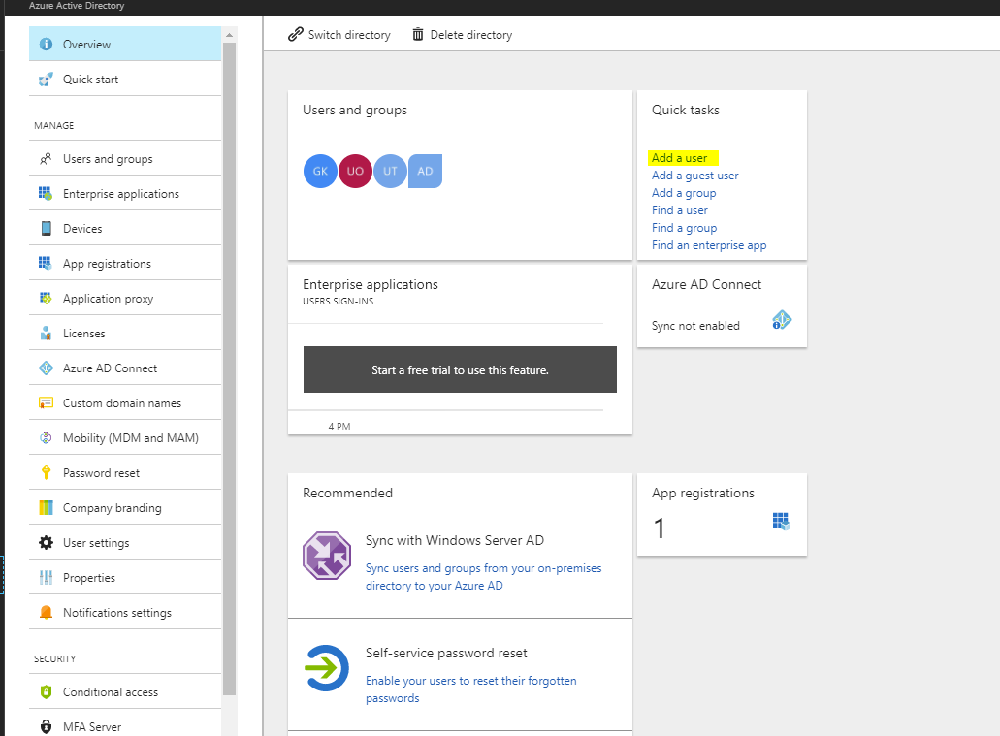
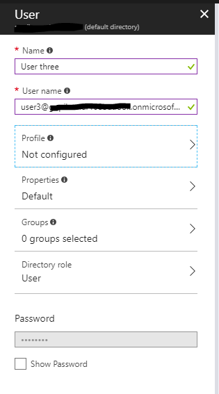
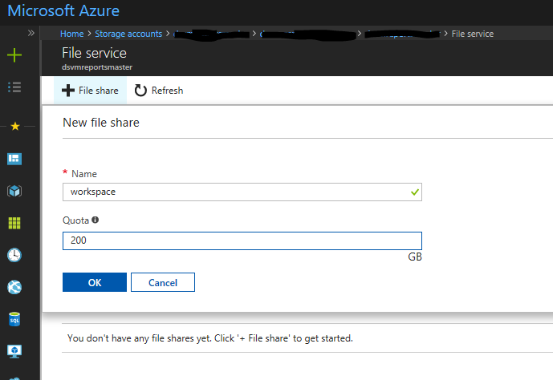

# Setup common identity on the Data Science VM

By default, on Azure VM including the Data Science VM (DSVM) you setup local user accounts and have users authenticate to the VM with the local account credentials. If you have multiple VMs that you need to access, this can quickly get cumbersome to manage credentials. Common user accounts and  management using a standards based identity provider allows you to use a single set of credentials to access multiple resources on Azure including multiple DSVMs. 

Active Directory (AD) is a popular identity provider and is supported both on Azure as a service as well as On-premises. You can leverage AD or Azure AD to authenticate users on both a standalone the Data Science VM (DSVM)  or a cluster of DSVM on a Azure VM Scale set. This is done by joining the DSVM instances to a AD domain. If you are already have a Active Directory to manage the identities you can use that. In case you do not have a AD, you can run a managed AD on Azure through a service called [Azure Active Directory Domain Services](https://docs.microsoft.com/azure/active-directory-domain-services/)(AADDS). 

The documentation for [Azure Active directory (AAD)](https://docs.microsoft.com/azure/active-directory/) provides detailed [instructions](https://docs.microsoft.com/azure/active-directory/choose-hybrid-identity-solution#synchronized-identity) to managed active directory including connecting the AAD to your On-premises directory if you have one. 

Rest of this article describes the steps to setup a fully managed AD domain service on Azure using AADDS and join your DSVMs to the managed AD domain to enable users to access a pool of DSVMs (and other Azure resources) using a common user account and credentials. 

##  Setup a fully managed Active Directory domain on Azure

AADDS makes it simple to manage your idenities by providing a fully managed service on Azure. On this Active directory domain, users and groups are managed.  The steps to setup you Azure hosted AD domain and user accounts in your directory are:

1. Add user(s) to Active directory on Portal by clicking on Azure Active Directory in the left menu.  



2.	Set user login, password and role




3.	Create Azure AD Domain Services

To create an Azure ADDS, follow instructions in the article "[Enable Azure Active Directory Domain Services using the Azure portal](https://docs.microsoft.com/azure/active-directory-domain-services/active-directory-ds-getting-started)" (Task 1 to Task 5). It is important that the existing user password in Active directory are updated so that the password in AADDS is synched. It is also important to add the DNS to AADDS as listed in Task#4 of the above article. 

4.	Create a DSVM Subnet 
5.	Create a Data Science VM instance in the DSVM subnet (not Domain services subnet)
6.	Follow [instructions](https://docs.microsoft.com/azure/active-directory-domain-services/active-directory-ds-join-ubuntu-linux-vm ) to add DSVM to AD. 

7.	Next mount a shared Azure Files to host your home or notebook directory. This is so that you can mount your workspace on any machine. (If you need tight file level permissions you will need a NFS running on one or more VMs)

    a. Create a Azure File Share
    

    
    b. Mount it on the Linux DSVM. On portal when you click on “Connect” button for the Azure Files in your storage account the exact command to run in bash on the Linux DSVM will be shown. The command will look like this:

```
sudo mount -t cifs //[STORAGEACCT].file.core.windows.net/workspace [Your mount point] -o vers=3.0,username=[STORAGEACCT],password=[Access Key or SAS],dir_mode=0777,file_mode=0777,sec=ntlmssp
```
8.	Let us say you mounted your Azure Files in /data/workspace. Now create directories for each of your users in the share. /data/workspace/user1, /data/workspace/user2 and so on. Create a ```notebooks``` directory in each user's workspace. 
9. Create symbolic links for the ```notebooks``` in ```$HOME/userx/notebooks/remote```.   

Now, you have the users in your active directory hosted in Azure and able to login to any DSVM (both SSH, Jupyterhub) that is joined to the AADDS  using the AD credentials. Since the user workspace is on shared Azure Files the user will have access to their notebooks and other work from any DSVM when using Jupyterhub. 

For auto scaling you can leverage the VM Scalesets to create a pool of VMs that are all joined to the domain in this fashion and with the shared disk mounted. Users can login to any available machine in the scale set and have access to shared disk where their notebooks are saved. 

# Next Steps

* [Securely store credentials to access cloud resources](dsvm-secure-access-keys.md)


