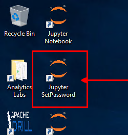
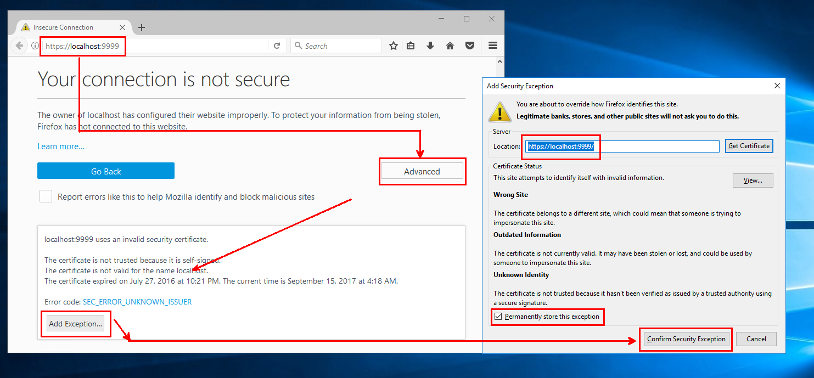
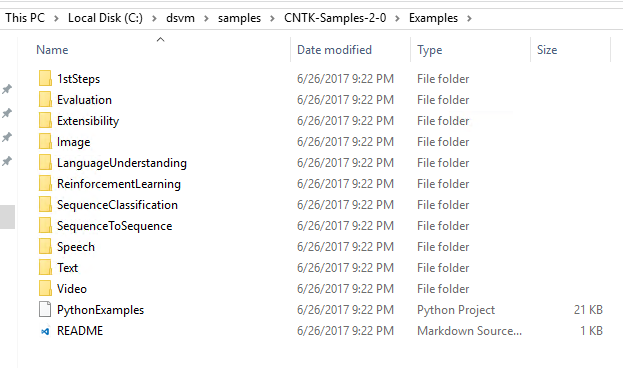
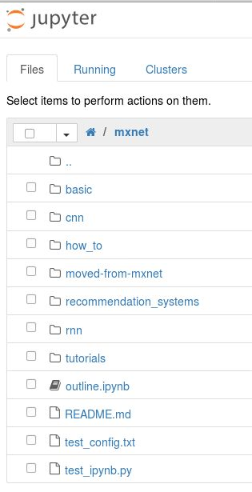

# Samples on the Data Science Virtual Machines (DSVM)

The DSVMs come with included fully worked-out samples in the form of Jupyter Notebooks and some that are not based on Jupyter. You can access Jupyter by clicking on the `Jupyter` icon on the desktop or application menu.  
>[AZURE.NOTE]
> Refer to [Access Jupyter](#access-jupyter) section to enable Jupyter Notebooks on your DSVM.

## Quick Reference of Samples
| Samples Category | Description | Locations |
| ------------- | ------------- | ------------- |
| **R** Language  | Samples in **R** explaining scenarios like connecting with Azure cloud data stores, Comparing Open Source R and Microsoft R & operationalizing Models on Microsoft R Server or SQL Server.   [Screenshot](#r-language) |  `~notebooks`     `~samples/MicrosoftR`     `~samples/RSqlDemo`     `~samples/SQLRServices`   |
| **Python** Language  | Samples in **Python** explaining scenarios like connecting with Azure cloud data stores and working with **Azure Machine Learning**.    [Screenshot](#python-language) |  `~notebooks`   |
| **Julia** Language  | Sample in **Julia** that detail Plotting in Julia, deep learning in Julia, calling C and Python from Julia etc.   [Screenshot](#julia-language) |  **Windows**:  `~notebooks/Julia_notebooks`  `~notebooks`   **Linux**:  `~notebooks/julia`   |
| **CNTK**   (Microsoft Cognitive Toolkit)  | Deep learning samples published by the Cognitive Toolkit team at Microsoft.    [Screenshot](#cntk) |  **Windows**:  `~notebooks/CNTK/Tutorials`  `~/samples/CNTK-Samples-2-0/Examples`   **Linux**:  `~notebooks/CNTK`   |
| **MXnet** Notebooks  | Deep Learning samples utilizing **MXnet** based neural networks. There are a variety of notebooks ranging from beginner to advanced scenarios.    [Screenshot](#mxnet) |  `~notebooks/mxnet`   |
| **Azure Machine Learning** AzureML  | Interacting with **Azure Machine Learning** Studio and creating web-service endpoints from locally trained models, for cloud-based scoring workflows.   [Screenshot](#azureml) |  `~notebooks/azureml`   |
| **caffe2** | Deep Learning samples utilizing **caffe2** based neural networks. There are several notebooks designed to familiarize users with caffe2 and how to use it effectively, including examples like image pre-processing, dataset creation, Regression, and using pre-trained models.   [Screenshot](#caffe2) |  `~notebooks/caffe2`   |
| **H2O**   | Python-based samples utilizing **H2O** for numerous real-world scenario problems.   [Screenshot](#h2o) |  `~notebooks/h2o`   |
| **SparkML** Language  | Sample utilizing features and capabilities of Spark's **MLlib** toolkit through **pySpark 2.0** on **Apache Spark 2.0**.    [Screenshot](#sparkml) |  `~notebooks/SparkML/pySpark`   |
| **MMLSpark** Language  | A variety of samples utilizing **MMLSpark - Microsoft Machine Learning for Apache Spark**, which is a framework that provides a number of deep learning and data science tools for **Apache Spark**.   [Screenshot](#mmlspark) |  `~notebooks/MMLSpark`   |
| **TensorFlow**  | Multiple different Neural Network Samples and techniques implemented using the **TensorFlow** framework.   [Screenshot](#tensorflow) |  `~notebooks/tensorflow`   |
| **XGBoost** | Standard Machine Learning samples in **XGBoost** for scenarios like classification, regression etc.   [Screenshot](#xgboost) |  `~samples/xgboost/demo`   |

 

## Access Jupyter 

Visit Jupyter Home by going to **`https://localhost:9999`** on Windows or **`https://localhost:8000`** on Ubuntu.

### Enabling Jupyter access from Browser

**Windows DSVM**

Run **`Jupyter SetPassword`** from the desktop shortcut and follow the prompt to set/reset your password for Jupyter and start the Jupyter process. 
  
You can access Jupyter Home once the Jupyter process has successfully started on your VM by visiting **`https://localhost:9999`** on your browser. See screenshot to add exception and enable Jupyter access over the browser
  
Sign in with the new password you had just set.
 
**Linux DSVM**

You can access Jupyter Home on your VM by visiting **`https://localhost:8000`** on your browser. See screenshot to add exception and enable Jupyter access over the browser.
  
Sign in with the same password as your login for the DSVM.
 

**Jupyter Home**
  

## R Language 
  

## Python Language
  

## Julia Language 
  

## CNTK 
  
  

## MXnet
  

## AzureML 
  

## caffe2 
  

## H2O 
  

## SparkML 
  

## TensorFlow 
  

## XGBoost 
  

